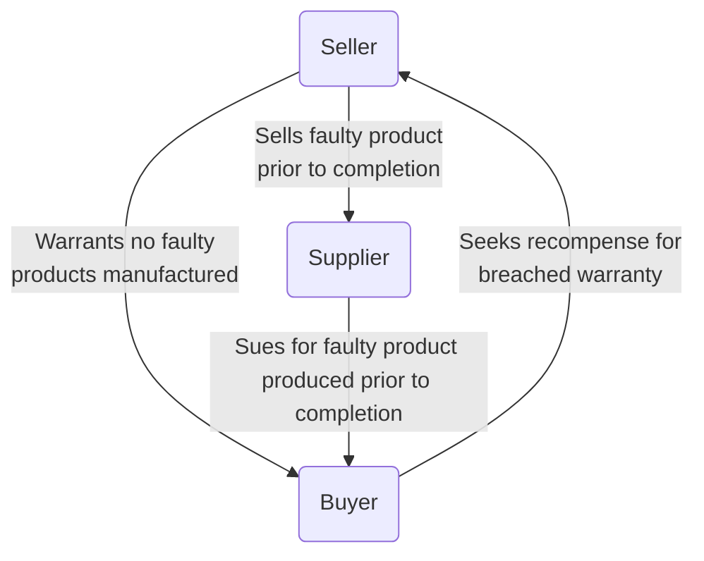

# MERMAID1

```mermaid
graph TD

id1(Seller)
id2(Buyer)
id3(Supplier)

id1 --> |Sells faulty product <br/>prior to completion| id3
id1 -->|Warrants no faulty <br/>products manufactured| id2
id3 -->|Sues for faulty product <br/>produced prior to completion| id2
id2 --> |Seeks recompense for <br/>breached warranty| id1

```
