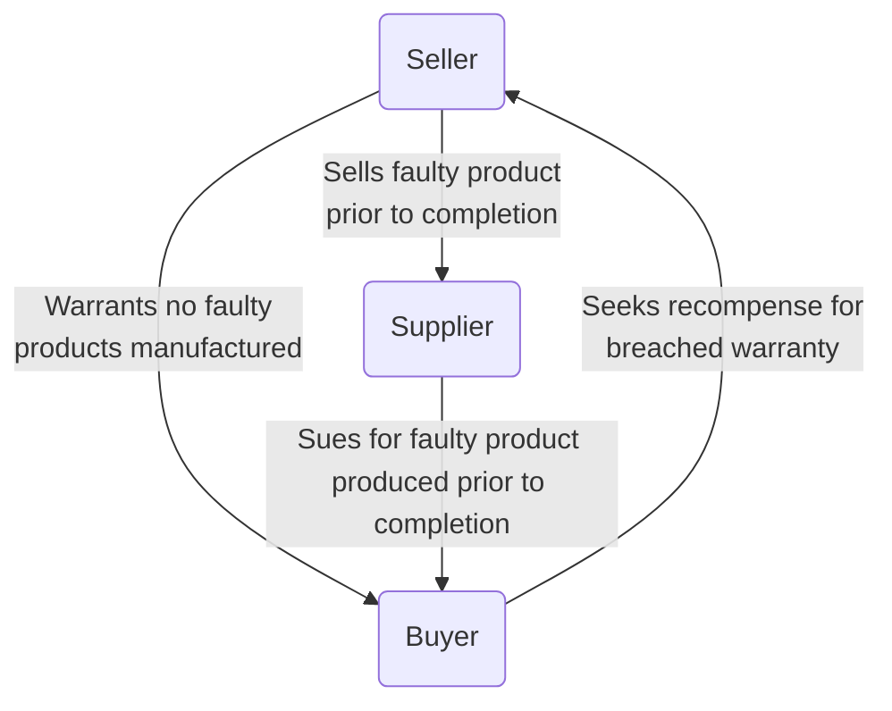

# Risk - Seller's Limitations

## Limiting Scope

The first draft of the sale and purchase agreement prepared by the buyer will often include extensive warranties and indemnities, with few specific limitations on the seller’s liability. In most cases, there is considerable scope for negotiating the agreement.

Where warranties are given by reference to the ‘knowledge, information or belief’ of the seller, the buyer will usually insist on the seller acknowledging that in giving the warranties it has made all due enquiries and taken all reasonable steps to ensure their accuracy.

## Limitations on Claims

The seller will also seek to restrict its liability in relation to the warranties and indemnities generally by including a set of standard limitation clauses in the agreement.

```ad-important
title: Share sale
Limitations on the seller’s liability for breach of warranty contained in a share sale agreement are not controlled by UCTA 1977 since Sch 1, para 1(e) precludes the application of its relevant provisions to any contract so far as it relates to the ‘creation or transfer of securities or of any right or interest in securities’.
```

But UCTA 1977 applies for asset sale agreements.

```ad-statute
title: s 3 UCTA 1977 - Liability arising in contract

(1) This section applies as between contracting parties where one of them deals on the other’s written standard terms of business.

(2) As against that party, the other cannot by reference to any contract term—
- (a) when himself in breach of contract, exclude or restrict any liability of his in respect of the breach; or
- (b) claim to be entitled—
	- (i) to render a contractual performance substantially different from that which was reasonably expected of him, or
	- (ii) in respect of the whole or any part of his contractual obligation, to render no performance at all,

except in so far as (in any of the cases mentioned above in this subsection) the contract term satisfies the requirement of **reasonableness**. 
```

- Section 3 UCTA 1977 applies only where one party deals on the other’s written standard terms of business
- The reasonableness test will be relevant in connection with any exclusion of liability for misrepresentation.
- Freely negotiated warranty limitations contained in an acquisition agreement are unlikely to be the subject of a successful challenge.

### Limits on Amount of Claims

#### Maximum Limits

The seller will negotiate for a maximum liability under the warranties and indemnities (commonly the price paid by the buyer for the target).

```ad-note
In some circumstances, damages claimed for warranty or indemnity breaches can exceed the purchase price (e.g., where a target company has been sold at an undervalue). But even here, a properly drafted maximum liability clause may protect a seller and limit its liability to the maximum liability it has contractually agreed with a buyer ([[116 Cardamon Ltd v MacAlister [2019] EWHC 1200 (Comm)]]).
```

#### Minimum Limits

The parties will often agree a minimum (aggregate) threshold for claims, typically 0.5-1% of the purchase price. The buyer should insist that once the threshold has been breached, it is entitled to recover the full value of the claim.

The seller may seek a *de minimis* limit on individual claims. But difficulties can arise, however, in respect of continuing breaches and claims which are similar in nature or arise from the same default.

### Time Limits

| Breach             | Limitation period                                                              |
| ------------------ | ------------------------------------------------------------------------------ |
| Breach of contract | 6 years from the date of breach (which for a warranty is the date of the SPA). |
| Breach of deed     | 12 years from the date of breach.                                                                                |

#### Tax Matters

It is common to link the period in which the buyer can make claims relating to tax matters to HMRC’s time limit for making an assessment to tax (four years; previously six years) from the end of the relevant tax year, except to recover tax lost through fraudulent or negligent conduct.

#### Non-tax Matters

A much shorter period can be negotiated, generally linked to the target company's audit (since the audit may “flush out” any breached of warranty). A period allowing for two full audits to be carried out and their results digested is commonly agreed. Consider a long-stop time limit on bringing claims, along with a shorter deadline for bringing claims without informing the party of the breach.

### Insurance

The seller will invariably seek to prevent the buyer from bringing a claim where the loss is covered by insurance taken out in relation to the target.

### Recovery From 3rd Parties

The buyer may also be required to give credit for any sums received from third parties in relation to the subject matter of the claim. Usually expressed to be wide enough to cover tax reductions.

### Understated Assets

The seller may want to include a provision that any claim will be reduced by the amount by which the seller can show that the net assets of the target were understated in the accounts drawn up before completion. Buyer beware of accepting this.

### Conduct of Claims

Suppose:



In this situation, the seller may argue that it should have the right to conduct the claim (if the buyer knows it can sue under a warranty, may defend the claim less vigorously). The buyer is under a duty to mitigate its loss, but a failure to mitigate is difficult to prove.

The buyer may have reservations about allowing the seller to have control in case it damages the reputation and goodwill of the target.

Often a compromise is reached, e.g., consent of the other party required before settling/ indemnity for legal costs.

#### Mitigation

Where one party has suffered loss resulting from the other party's breach of contract, the injured party should take 'reasonable steps' to minimise the effect of the breach ([[British Westinghouse Electric and Manufacturing Co v Underground Electric Rail Co [1912] AC 673]]).

There is no obligation for the claimant to mitigate their loss, but losses attributable to a failure to do so are not legally recoverable. So the innocent party cannot seek compensation by the party in default for the loss which is due to the failure to behave reasonably after the breach.

The question of which steps count as 'reasonable' is one of fact ([[Pilkington v Wood [1953] CH 770]]). It was held that there was no expectation that the claimant should embark on 'a complicated and difficult piece of litigation' in order to minimise the effects of the defendant's breach.

[[Payzu v Saunders [1919] 2 KB 581]]: reasonable steps to mitigate may in some circumstances, including accepting the performance offered by the defendant under a new contract even when performance amounts to a breach of the original contract.

If the defendant's offer of performance remains the best substitute performance (as it was in *Payzu*) then it would seem unreasonable not to go to that source.

[[Banco de Portugal v Waterlow & Sons [1932] AC 452]] establishes that when considering whether the claimant has taken reasonable steps to mitigate, the claimant's actions 'ought not to be weighed in nice scales at the instance of the party whose breach of contract has occasioned the difficulty'.

There is no duty to mitigate a claim for a payment of a debt. This includes a claim for liquidated damages. This is because the amount is payable as a contractual right rather than as damages.

### Notification of Claim

A seller may attempt to (or may be able to) restrict its liability by negotiating and demanding specific requirements that should be met following a breach of warranty or indemnity claim. In [[Teoco UK Ltd v Aircom Jersey 4 Ltd [2018] EWCA Civ 23,]], claims for warranty breaches were struck out for failing to comply with agreed notification requirements.

## Disclosure Letter

### Purpose

The incentive for the seller in making disclosures is that they avoid it being in breach of warranty in relation to those matters disclosed. The disclosure letter will be subject to careful scrutiny. Advisable to make full and early disclosure of potential issues.

### Format

In the UK, the disclosures will usually be in the form of a letter from the seller to the buyer. A bundle of documents (referred to as the disclosure bundle) will be attached to the letter, comprising all the documents referred to in the letter as providing information which qualifies the warranties.

The parties’ legal advisers will negotiate the disclosure letter or schedule and bundle until it is in an agreed final form ready for completion of the acquisition.

In the UK, on exchange of contracts, two copies of the agreed form of disclosure letter and bundle will be available; one to be given to the buyer and one to be retained by the seller. The letters and associated bundles will be initialled by the parties as evidence that they are identical.

### Deemed Disclosures

```ad-defn
title: General disclosures
The disclosure letter or schedule will state that a number of matters are deemed to have been disclosed to the buyer. These deemed disclosures are often referred to as ‘general disclosures’.
```

These relate to publicly available information and occasionally information made available to the buyer during due diligence. The effect of deemed or general disclosure is to pass to the buyer the risk that elements of the information will qualify the warranties. Usually include:

1. Information held at Companies House
2. Information held at the Land Registry, Land Charges Department and any matters apparent in deeds of properties.
3. Matters which would be disclosed by physical inspection of each property (buyer should not accept unless a survey has been commissioned).
4. Matters in the public domain.
5. Matters disclosed or referred to in audited target company accounts.
6. Matters included or referred to in the accountants’ report prepared on behalf of the buyer.
7. Matters disclosed or referred to in the replies to the preliminary enquiries and the documents enclosed within those replies.
8. Information and documentation passed to the buyer and its advisers in the pre-contract period.

### Specific Disclosure

Specific disclosures draw to the buyer’s attention specific information about the target which is inconsistent with one or more warranties given by the seller. Disclosures usually refer to specific warranty statements, but also include a catch-all that each disclosure is deemed to be in respect of all the warranties.

### Standard of Disclosure

It is in the interests of both parties for disclosures to be made fairly.

#### Adequate Disclosure

SPA will provide that the warranties are given subject to matters disclosed in the disclosure letter. The buyer will often insist on a warranty that all disclosures have been made “fully, clearly and accurately”.

In [[Levison v Farin [1978] 2 All ER 1149]], the buyers were generally aware of the rundown condition of the business, but this did not preclude them from successfully claiming for breach of a warranty which said ‘there will have been no material adverse change in the overall value of the net assets of the Company’. Held that

> ‘a clause in this form is primarily designed and intended to require a party who wishes by disclosure to avoid a breach of warranty to give specific notice for the purpose of the agreement, and protection by disclosure will not normally be achieved by merely making known the means of knowledge which may or do enable the other party to work out certain facts and conclusions’.

In [[Infiniteland Ltd v Artisan Contracting Ltd [2005] EWCA Civ 758]] it was held that the sufficiency of disclosure must be measured by reference to the agreed contractual provisions and to the context of the acquisition.

In [[MAN Nutzfahrzeuge AG v Freightliner Ltd [2005] EWHC 2347]] the judge considered (obiter) ‘the disclosure of all matters revealed by an inspection of specified documents’ would not extend so far as to include inferences which might be drawn from the documents inspected.

#### Buyer's Knowledge

The buyer will usually insist on limiting disclosure specifically to matters revealed in the disclosure letter and bundle.

There are limits to the extent to which this will be successful. In [[Eurocopy plc v Teesdale [1992] BCLC 1067]] the SPA included an agreement that the warranties were given subject to the disclosure letter but no other information. The buyer tried to sue the seller for failure to disclose certain material facts, which the seller claimed was in the actual knowledge of the buyer following due diligence. The court refused to strike out the defence on application by the buyer.

So it is always preferable for a buyer to acknowledge full disclosure of a breach and seek an indemnity or reduction in the purchase price before completion.

#### Actual/ constructive/ Imputed Knowledge

In [[Infiniteland Ltd v Artisan Contracting Ltd [2005] EWCA Civ 758]], the SPA contained a clause stating that the rights and remedies of the purchaser in respect of any breach of warranty would not be affected by any investigations made by it or on its behalf into the affairs, except to the extent that such investigations gave it actual knowledge of the relevant facts and circumstances.

- The Court confirmed that it would give effect to an express provision in the sale agreement prohibiting warranty claims of which the buyer had constructive knowledge.
- On a 2:1 majority, it was held that ‘actual’ and ‘imputed’ knowledge are different. The knowledge of the professional adviser was not the buyer’s knowledge, and the seller was therefore prevented from raising the buyer’s knowledge as a defence to the warranty claim.

```ad-action
The parties need to stipulate in the agreement what type of knowledge will or will not affect a buyer’s rights and remedies for a claim for breach of warranty.
```

#### Liability for Information From Third Parties

The impact of statements made by employees or agents of the seller or the target company during negotiations or the due diligence process must be considered. In [[MAN Nutzfahrzeuge AG v Freightliner Ltd [2007] EWCA Civ 910]], the seller was held to be vicariously liable for the fraudulent pre-contractual statements of its agent, who had been put forward as having authority to speak on its behalf.

### Deliberate Non-disclosure

Suppose the seller deliberately fails to disclose the existence of particular facts to complete the sale. The buyer is induced to enter the SPA by way of a deliberate concealment $\rightarrow$ fraud.  

In the context of a **share acquisition**, ss 89 and 90 of the Financial Services Act 2012 make it a criminal offence for a person knowingly or recklessly to make a statement, promise or forecast which is misleading, false or deceptive. It is also an offence under the section for a person with the requisite intent to conceal dishonestly any material facts. A person guilty of an offence is liable to a fine, or imprisonment for a maximum term of seven years for conviction on indictment, or to both.

## Insurance

Common to take out warranty and indemnity insurance (“W&I policy”). Premiums are typically between 0.80% and 1.50% of the insured limit of liability in the London market.

The insurers will not agree cover until they have analysed the scope of each warranty, the effect of the disclosures and the extent of the general limitations on the seller’s liability. Any policy is likely to contain a number of general exclusions.

In addition to the set premium, it should be remembered that insurance premium tax will be due – in the UK, this represents an additional 12% tax on the value of the premium.
