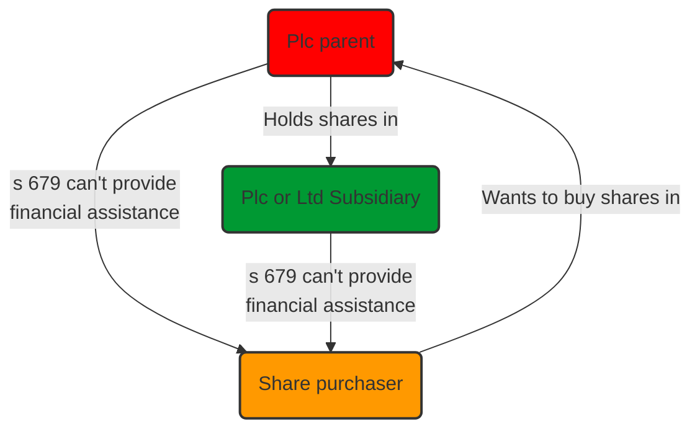
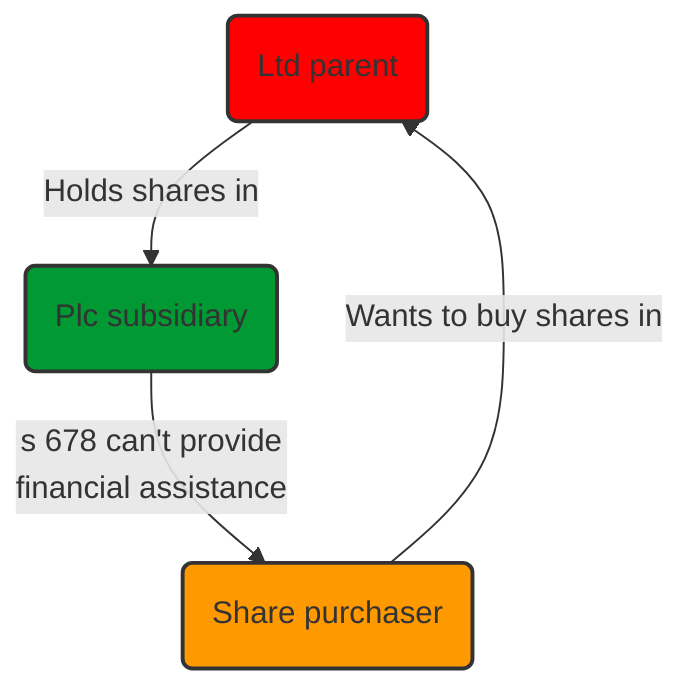

# Acquisition Types

## Introduction

Aims in an acquisition:

| Party  | Aims                                                         |
| ------ | ------------------------------------------------------------ |
| Buyer  | Acquiring exactly what it wants for the best possible price. |
| Seller | Minimising continuing obligations while aiming for highest realistic price.                                                              |

Most jurisdictions have at least two forms of corporate vehicle.

| Jurisdiction | Private companies | Public companies |
| ------------ | ----------------- | ---------------- |
| UK           | Limited           | plc              |
| Germany      | GmbH              | AG               |
| France       | SARL              | SA/ SCA                 |

There are additional rules for acquisitions involving public companies:

- In England, public company share acquisitions have to follow a formal offer process
	- All shareholders issued with an offer document setting out terms
	- Governed by City Code on Takeovers and Mergers.
	- Also applies if a scheme of arrangement is used to effect a merger.
- If a party is listed, Stock Exchange Listing Rules additionally apply.

> [!defn] Asset acquisition
> Involves the buyer acquiring the assets making up the business. Contract between the byer and the owner of the assets of the business. Could include tangible assets (land, machinery, stock) and intangible assets (IP, goodwill). 

> [!defn] Share acquisition
> Buyer acquires the shares in the company operating and owning the business. Contract between buyer and shareholder(s). No change in the ownership of the business - the business itself is still owned by the company. 

## Choice of Acquisition

- The owners of a company will often prefer to sell their shares
- Buyer will often prefer to acquire the assets of the business for the company.
- Practically, choice will not always be available.

### Seller's Perspective

| Aspect                        | Shares                                                                                                                                                                                                                                                                                                                                                                                                                                                                                                                                                           | Assets                                                                                                                                                                                                                                                                                                                                                                                                                                                                                                                                                                                                                                                      |
| ----------------------------- | ---------------------------------------------------------------------------------------------------------------------------------------------------------------------------------------------------------------------------------------------------------------------------------------------------------------------------------------------------------------------------------------------------------------------------------------------------------------------------------------------------------------------------------------------------------------- | ----------------------------------------------------------------------------------------------------------------------------------------------------------------------------------------------------------------------------------------------------------------------------------------------------------------------------------------------------------------------------------------------------------------------------------------------------------------------------------------------------------------------------------------------------------------------------------------------------------------------------------------------------------- |
| Clean break from business     | Following disposal of shares, seller loses connection with the company. Liabilities against the company continue to be enforceable against it. But note that the buyer will make detailed investigations and seek wide protections in the SPA.                                                                                                                                                                                                                                                                                                                   | Legal liability to 3rd parties for debts and obligations of the business remains with the seller company. Under English law, even where the buyer has contracted to assume responsibility for liabilities in the SPA, this will not affect 3rd parties, who can still take action against the seller unless expressly released from liability. The seller would then have a right of indemnity from the buyer, but this can be difficult to enforce.                                                                                                                                                                                                        |
| Warranties and due diligence  | Wider protections, generally more extensive investigation into the affairs of the target company.                                                                                                                                                                                                                                                                                                                                                                                                                                                                | No need for complex taxation warranties and indemnities; most contingent tax liabilities remain with the seller.                                                                                                                                                                                                                                                                                                                                                                                                                                                                                                                                            |
| Transfer of title             | In E&W, just need a stock transfer form to transfer title of shares. Check company's contracts in case any of them terminate on a change of control of the company/ 3rd party consent required.                                                                                                                                                                                                                                                                                                                                                                  | Each separate asset of the business must be transferred. This can be complicated, e.g., getting the consent of a landlord for the transfer of leasehold property. Some assets like stock and loose plant and machinery can be transferred by delivery.                                                                                                                                                                                                                                                                                                                                                                                                      |
| Financial services regulation | Purchase of shares classified as an investment and subject to financial services regulation. FSMA 2000 regulates investment activities, FCA oversees all financial and banking services. Under s 21 FSMA 2000, advising on or arranging the purchase or sale of shares comes under the definition of an investment activity. Breach of the restriction is an offence rendering the SPA unenforceable. Lawyers giving advice in relation to a proposed sale of shares must ensure FSMA requirements are satisfied/ transaction falls within a RAO 2001 exception. | FSMA 2000 provisions do not apply. But may need to act in a FSMA compliant way in case it changes to a share purchase.                                                                                                                                                                                                                                                                                                                                                                                                                                                                                                                                      |
| Employees                     | No change of employer: the target company is the employer. Seller no longer has a direct interest, other than any warranties given to the buyer.                                                                                                                                                                                                                                                                                                                                                                                                                 | TUPE 2006 applies: the transfer does not operate to terminate contracts of employment. Rights and obligations in respect of an employee working in an economic entity are transferred automatically to the buyer, who takes on responsibility for these employees.                                                                                                                                                                                                                                                                                                                                                                                          |
| Taxation                      | Tax consequences of a sale of shares by individuals: CGT charges, subject to exemptions/ reliefs. Where a company is owned by another, a sale of shares resulting in the selling company receiving consideration directly. Any capital gain realised likely to be exempt of corporation tax, if the seller is disposing of a substantial shareholding.                                                                                                                                                                                                           | Two-tier taxation: receiving the purchase price and taking a further step (e.g., declaring dividend, liquidating company) are both separate chargeable points. Corporation tax payable on the sale of assets. Further charge when the proceeds of tsale of the assets are distributed to the shareholders. Taxation depends on whether the shareholder is an individual or a company. Individual & winding up: disposal of shares for CGT purposes. Individual and dividend: income tax charge on the shareholders. Corporate shareholder: unlikely to be taxed. Distribution on winding up will likely be covered by the substantial shareholder exemption; distribution by dividend covered by group relief on intra-company dividends. |

### Reinvesting Proceeds

#### Assets

Roll-over relief from CGT/ corporation tax under s 152 Taxation of Chargeable Gains Act 1992 (TCGA 1992) available on the disposal of qualifying assets used in the trade where the disposal proceeds are applied in the acquisition of replacement qualifying assets. See [[Capital Gains Tax]].

#### Shares: Individual Sellers

An individual shareholder who reinvests a chargeable gain from the disposal of shares in subscribing for shares which qualify for the Enterprise Investment Scheme (EIS) will be able to claim a deferral relief.

#### Shares: Corporate Sellers

Capital gains arising on the disposal by companies of substantial shareholdings in trading companies are exempt from tax.

### Buyer's Perspective

Additional considerations to those listed above:

| Aspect                           | Shares                                                                                                                                                                                                                                                                                                                                                                                                                 | Assets                                                                                                                                                                                                                                                                                                                                                                                       |
| -------------------------------- | ---------------------------------------------------------------------------------------------------------------------------------------------------------------------------------------------------------------------------------------------------------------------------------------------------------------------------------------------------------------------------------------------------------------------- | -------------------------------------------------------------------------------------------------------------------------------------------------------------------------------------------------------------------------------------------------------------------------------------------------------------------------------------------------------------------------------------------- |
| Trade continuity                 | Company assets and outstanding contracts remain legally unaffected by the change in ownership. But buyer has no guarantee that 3rd parties will continue to deal with the company (who are not contractually obliged to do so). Some contracts contain clauses which permit a party to terminate a contract where control of the company changes hands. US state laws: sometimes consents are needed from 3rd parties. | Benefit of existing contracts not automatically transferred to the buyer on a sale of the assets. Must be transferred to the buyer through assignment/ novation. If a formal route is taken, 3rd party may try to renegotiate terms. Where assets include leasehold property, it will be necessary to obtain the consent of the landlord to the assignment of the lease. Consider insurance. |
| Choice of assets and liabilities | All the underlying assets of the company are indirectly acquired by the buyer, whether wanted or not. All liabilities of the company remain with it and indirectly become the responsibility of the buyer                                                                                                                                                                                                              | Provides greater flexibility. Buyer can select the liability for which it agrees to take responsibility in the SPA (except obligations in relation to employees and environmental matters).                                                                                                                                                                                                  |
| Integration                      | Stand-alone operational company                                                                                                                                                                                                                                                                                                                                                                                        | May be more readily absorbed into existing operations.                                                                                                                                                                                                                                                                                                                                       |
| Securing financing               | If the acquisition proceeds as a share acquisition and the target is a public company, a charge over the target company's assets are prohibited as financial assistance by a company for the purchase of its own shares.                                                                                                                                                                                               | Can offer the acquired assets as security for a loan.                                                                                                                                                                                                                                                                                                                                                                                              |

#### S 678

#### S 679

### Taxation

#### Base Costs for CGT

On an asset acquisition, chargeable assets have a higher base cost for CGT purposes on their subsequent disposal. When the buyer later disposes of the assets in future, it will be charged to capital tax based on any increase in value since the date of acquisition.

With a share acquisition, although shares are acquired at market value, the base cost of the assets is the cost at which they were originally acquired by the company. So corporation tax will be charged based on the increase in value of the asset since originally acquired by the company. This is a deferred tax liability (buyer should seek a discount on the shares).

#### Capital Allowances

Purchase of plant and machinery allows the buyer to obtain income deduction in the form of writing down allowances on the purchase price. Seller's point of view: disadvantage if actual price paid exceeds the tax written down value. Seller will then be subject to a balancing charge. But potentially a balancing allowance if the price paid is less than the written down value.

#### Apportionment of the Purchase Consideration

Necessary to apportion the total consideration between the various assets acquired. This is “flexible” to accrue tax advantages. Buyer should push for weight in favour of:

- Qualifying plant and machinery
- Trading stock forming a deduction against income profits for the buyer
- Capital items qualifying for capital tax roll-over relief on replacement of business assets.

#### Acquiring Tax Position of Company

Share acquisition: tax identity of the company continues. So tax liabilities may arise in relation to activities occurring in the company before the sale. Buyer generally seeks indemnity against such costs, in the “Tax Deed of Covenant”, a schedule to the SPA.

Share acquisition can enable a buyer to take advantage of tax credits within the company. s 45 Corporation Tax Act 2010 (CTA 2010) permits trading losses to be carried forward and set against trading profits from the same trade in the future. If a buyer is convinced it can turn around the fortunes of the company, the accumulated losses can be viewed as an “asset”.

Carry forward of losses not possible on an asset acquisition.

#### VAT

VAT charge may arise on the disposal of business assets alone, though not on sufficient assets to enable the business to continue as a going concern. Generally not chargeable on a share sale.

#### Stamp Duty

On the acquisition of shares, buyer pays stamp duty at 0.5% (rounded up to nearest £5) on the purchase price.

On the acquisition of shares, the buyer pays stamp duty on dutiable assets only (land, shares).
