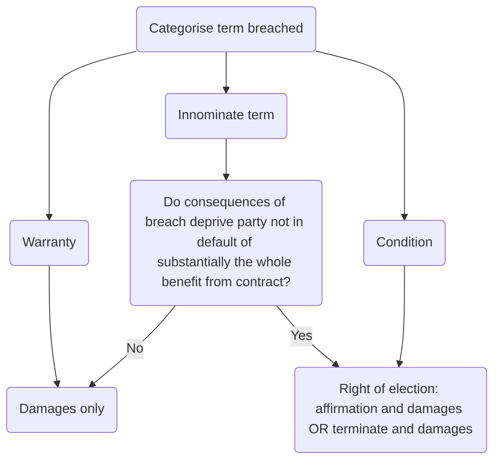

# Events of Default

Dictate the circumstances in which a bank can terminate its loan early or take other action. Usually very heavily negotiated.

## Purpose

If a provision of an agreement is breached, the injured party may seek remedy for breach of contract. The remedy available will depend on the time of term breached:

1. **Conditions**. Terms which are fundamental to a contract. Breach of a condition may allow the injured party to terminate the contract and claim damages, or to affirm the contract and claim damages.
2. **Warranties**. Warranties are terms which are not considered fundamental to the contract. Breach of a warranty will not allow the injured party to terminate the contract, but merely to claim damages for any loss arising from the breach.
3. **Intermediate (or innominate) terms**. Intermediate terms which are capable of being breached either in a trivial, or in a fundamental way. The remedy available on the breach of an intermediate term will be either damages, or damages and termination, depending on the effect of the breach on the contract.

If a party makes a false representation to induce the other party into contract, the remedies for misrepresentation may be available.

Events of default provide the bank with a contractual right suspend/ cancel a commitment, put the loan on demand or immediately demand repayment (acceleration). Means the bank does not have to rely on statutory/ common law remedies.

## Common Events of Default

### Late Payment

- Most important event of default.
- Banks are highly sensitive about **punctual payment** by the borrower.
- A bank will require default **interest** to be paid on the overdue amount.
- General requirement to **indemnify** the bank against any costs associated with the default.
- Missed payment probably signals cash flow problems in the business.
- Default for late payment will be **non-negotiable**. Will cover late payment as well as interest and repayments of principal.
- Bank may allow the borrower a short **grace period** to rectify any accidental late payment/ late payment due to technical issues.
- Bank will ensure that any default interest and indemnity provisions run **from the date from which payment is overdue**, not from the end of any grace period.

### Breach of Representation

- Default for an incorrect/ misleading written representation often **drafted widely**.
- Bank may concede that the requirement should be **material**/ have material adverse effect.

### Breach of Undertaking

- Expressed as an explicit event of default
- May be a **grace period/ materiality** qualification.

### Breach of Financial Covenants

- Some equity sponsors manage to negotiate “**equity cure**” rights to avoid a default on breach of a financial covenant.
- Another concession is a **“Mulligan” provision**. Works to either
	- Prevent the bank calling an event of default unless the borrower breaches a financial covenant on **two consecutive testing dates** (true Mulligan); or
	- Allow the bank to call a default on the first breach of a financial covenant, but to **lose that right** if it fails to call a default **before** the borrower meets the financial covenant on the **subsequent test date** (not a true Mulligan).

### Cross-default

- Key event of default, heavily negotiated.
- If a borrower **defaults on another loan or contract**, the other party may force terms on the borrower $\rightarrow$ prejudices the lending bank.
- A cross-default clause operates by **automatically defaulting** the borrower under the loan in the event that it defaults under certain other types of agreement.
- Ensures the bank can protect its position and possibly accelerate the loan.
- Effectively gives a bank the benefit of the default provisions in other agreements to which the borrower is a party.
- Usually limited by
	- being confined to defaults which occur under other documents providing ‘**financial indebtedness**’; and
	- including a ***de minimus* threshold**.  
- The borrower may also negotiate:
	- That the cross-default will operate only if the other default will have a **material** effect on its ability to perform its obligations under the facility agreement.
	- That the cross-default will **trigger at a specific point** in the initial default (e.g. failure to pay amount due, creditor demands early repayment, creditor exercises a right to demand early repayment – "**cross-acceleration**").
		- Cross-acceleration is the most desirable for the borrower.
		- But the bank will be concerned that the borrower will favour the party with the benefit of default to persuade them not to accelerate.
	- Carve out for defaults which the borrower is **disputing in good faith**. Strongly resisted by most banks.
- The bank may want cross-default provision to extend to **other companies in the group**.
	- Borrower can try to limit this to **material or principal subsidiaries**.

The bank has an **evidential problem** in finding out when a borrower has defaulted under another agreement. The borrower breaching a representation will then be useless (just means they've breached twice rather than once). Furthermore, a bank is subject to an implied duty of confidentiality with regard to a customer’s affairs (see [[Tournier v National Provincial and Union Bank of England [1924] 1 KB 461]]). Bank will refer to its own knowledge and monitoring.

### Change of Business

It will therefore usually be an event of default if the borrower makes any **material change to its business**, ceases to carry on any material part of its business, or disposes of a material part of its business.

### Change of Control

Change of control usually triggers **mandatory prepayments**, rather than an event of default.

### Insolvency

- The insolvency of a borrower will, without question, be an **event of default**.
- Any **negotiation** of this clause will simply relate to the **timing** of default.
- The bank will want **time to take action** (e.g., enforce security) at the first sign of a problem.
- Some clauses may make reference to the **two insolvency tests** in s 123 of the IA 1986.
	- Section 123(1) deems a company unable to pay its debts if it has not paid a debt **three weeks** after service of a **statutory demand** or court order (if the debt is over £750).
	- Section 123(2) deems a company unable to pay its debts if the value of its **assets is less than its liabilities**.
		- [[BNY Corporate Trustee Services Ltd v Eurosail-UK-2007-3BL Plc & Others [2011] EWCA Civ 227]]: s 123(2) ‘applies to a company whose assets and liabilities (including contingent and future liabilities) are such that it had reached a point of no return’.
- Usually also triggers relating to **insolvency proceedings**.
	- Typically, this will include any corporate action, legal proceedings or other procedure or step.
	- e.g., moratorium, appointment of liquidator, enforcement of any security over the borrower's assets.
- Borrower will want the event of default to trigger as late as possible, e.g., by negotiating a remedy period, a carve out for disputed debts, or a default limited to actual appointment of administrator/ receiver or similar.

### Proceedings

- Event of default if the borrower becomes involved in any **material litigation, arbitration or similar** proceedings.
- Borrower will try to negotiate a *de minimus* limit or proceedings which will/ might have a material adverse effect on the borrower's ability to perform obligations.

### Unlawful Performance

- Event of default if it becomes **unlawful** for a borrower to continue to perform its obligations under a facility agreement.
- Event of default if the borrower should lose **any consents/ authorisations** necessary to perform obligations under the loan.
- Borrower will want **materiality** and may ask for **mandatory pre-payment** for materiality.

### General Default

- Event of default if the borrower fails to comply with “other obligations”.
- Invariably drafted with a relatively long ‘**cure period**’ of perhaps 30 days.
- **Sweep up provision** for any minor defaults.

### Qualified Accounts

- Event of default which is triggered if the **borrower’s accounts are qualified** by the auditors.
- Common in leveraged transactions.
- Borrower will want to limit any default to a qualification which has a **material adverse effect** on its ability to perform its obligations under the loan facility.

### Repudiation

**Actual or attempted repudiation** by the borrower is an event of default. Rarely negotiated.

### Material Adverse Change

- Colloquially, “MAC”.
- Acts as a **sweep up provision** allowing the bank to call a default if there is a material adverse change in the borrower's position or circumstances which might prevent it from complying with any provisions in the facility agreement.
- Many borrowers will try to exclude this provision, and it is always heavily negotiated.
- Strong clause: Any event or circumstance occurs which the **Majority Lenders** believe might have a **material adverse effect** on the ability of the Borrower to perform or comply with its obligations under this Agreement.
- Borrower may negotiate:
	- Threshold for Majority Lenders (commonly $\frac{2}{3}$)
	- Insertion of "reasonably".
	- Definition of material adverse effect.
- Most common use for the MAC is to threaten default and persuade a borrower to start a dialogue with the bank.
- In [[BNP Paribas v Yukos Oil Company [2005] EWHC 1321 (Ch)]], the **court upheld the validity** of accelerating a loan based on a MAC event of default.

## Interaction with Other Clauses

Events of default should not overlap with any representations or undertakings. If there are overlaps, check they do not contradict.

## Action on Default

A bank may:

1. **Cancel** any undrawn commitments
2. Put all or part of the **facility on demand**, and take over the selection of interest periods.
3. **Demand immediate repayment** of part or all outstanding capital and interest, as well as any cash collateral.
4. Enforce any **security**.
5. Do **nothing**.

A bank will want these remedies available ‘on or at any time after an Event of Default has occurred and until it is waived …’; a borrower will want to add ‘… **or remedied**’. Banks commonly allow this. Implications:

1. If the borrower can **unilaterally remedy** an event of default, it will have **little incentive to disclose** when it occurs.
2. What constitutes a **remedy** of certain types of default is **not always clear**. Might say “remedied to the satisfaction of the bank”.

In a syndicated loan, the **agent** will often be given **discretion** as to what action to take on an event of default, with an overriding obligation to act in accordance with the instructions of the majority banks.

- Enables a **fast** decision.
- But agent takes potential **liability** for wrong decisions.

If the loan is terminated and outstanding amounts are immediately repayable, default interest applies until the amounts are settled in full.

## Grace Periods, Defaults and Potential Defaults

Some events of default include a **specified period** during which the borrower is permitted to **remedy** the event or apply for a **waiver**. During the grace period, the borrower is prevented from borrowing new money (“draw stop”).

> [!defn]
> An event of default with an in-built grace period is sometimes referred to as a ‘potential event of default’.

> [!note] Variation
> LMA facilities define “default” to mean
> 
> > an Event of Default or any event or circumstance specified in Clause [ ] (Events of Default) which would (with the expiry of a grace period, the giving of notice, the making of any determination under the Finance Documents or any combination of any of the foregoing) be an Event of Default.
> 
> The equivalent of a ‘potential event of default’ is then described as ‘a Default other than an Event of Default’.

Borrowers must undertake to tell the banks as soon as they are aware of a ‘potential event of default’, but

- Borrowers under a revolving credit facility (RCF) will argue that the draw stop within a grace period should not prevent them rolling over a maturing RCF loan.
- Borrowers should not agree to give a repeating representation that there are no ‘potential events of default’ (or equivalent).

## Bank's Perspective

**Demanding early repayment** will be considered a last resort, but a useful **negotiating tool**. The bank may demand increased fees/ margin, tighter financial covenants or other terms.

A bank will not accept arguments that the borrower should not be defaulted on the basis of events beyond its control. The rationale is **risk management**, not fairness.

## Borrower's Perspective

Borrower must be very cautious when agreeing to the events of default. In reality, though, a bank is unlikely to withdraw a loan without considerable provocation.
