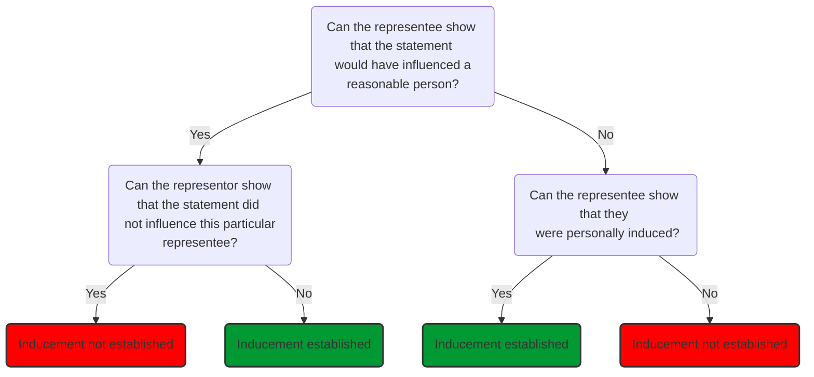

# MERMAID1

```mermaid

graph TD

id1(Can the representee show that the statement <br/> would have influenced a reasonable person?)
id2.1(Can the representor show that the statement did <br/> not influence this particular representee?)
id2.2(Can the representee show that they <br/> were personally induced?)
id1 --> |Yes| id2.1
id1 --> |No| id2.2

id2.1 --> |Yes| id3.1(Inducement not established)
id2.1 --> |No| id3.2(Inducement established)

id2.2 --> |Yes| id4.1(Inducement established)
id2.2 --> |No| id4.2(Inducement not established)

classDef red fill:#ff0000,stroke:#333,stroke-width:2px;
classDef green fill:#009933,stroke:#333,stroke-width:2px;
classDef yellow fill:#ff9900,stroke:#333,stroke-width:2px;

class id3.2,id4.1 green
class id4.2,id3.1 red
%%%%class id3.1 yellow

```
