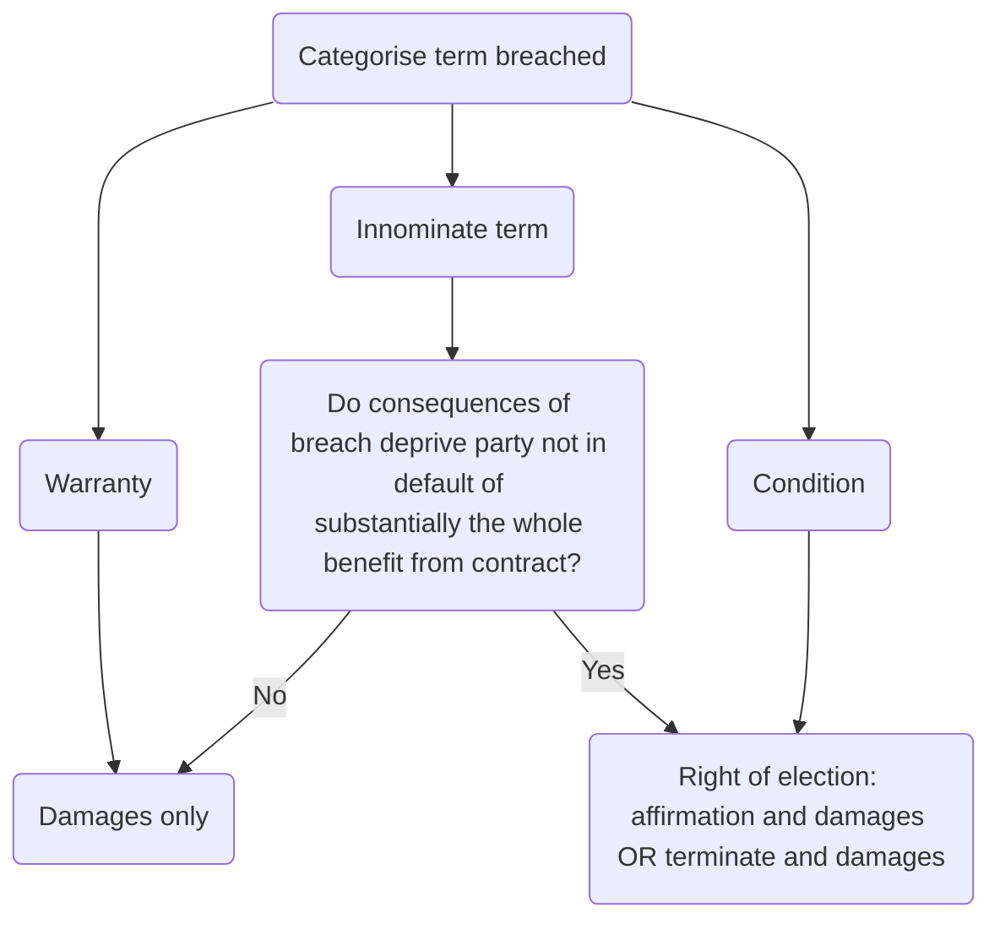

# MERMAID2

```mermaid
graph TD

id1(Categorise term breached)
id2.1(Warranty)
id2.2(Innominate term)
id2.3(Condition)

id1 --> id2.1 & id2.2 & id2.3

id3(Do consequences of breach deprive party not in default of <br/>substantially the whole benefit from contract?)

id2.2 --> id3

id4.1(Damages only)
id4.2(Right of election: affirmation and damages <br/>OR terminate and damages)

id2.1 --> id4.1
id2.3 --> id4.2
id3 --> |No| id4.1
id3 -->|Yes| id4.2

```
