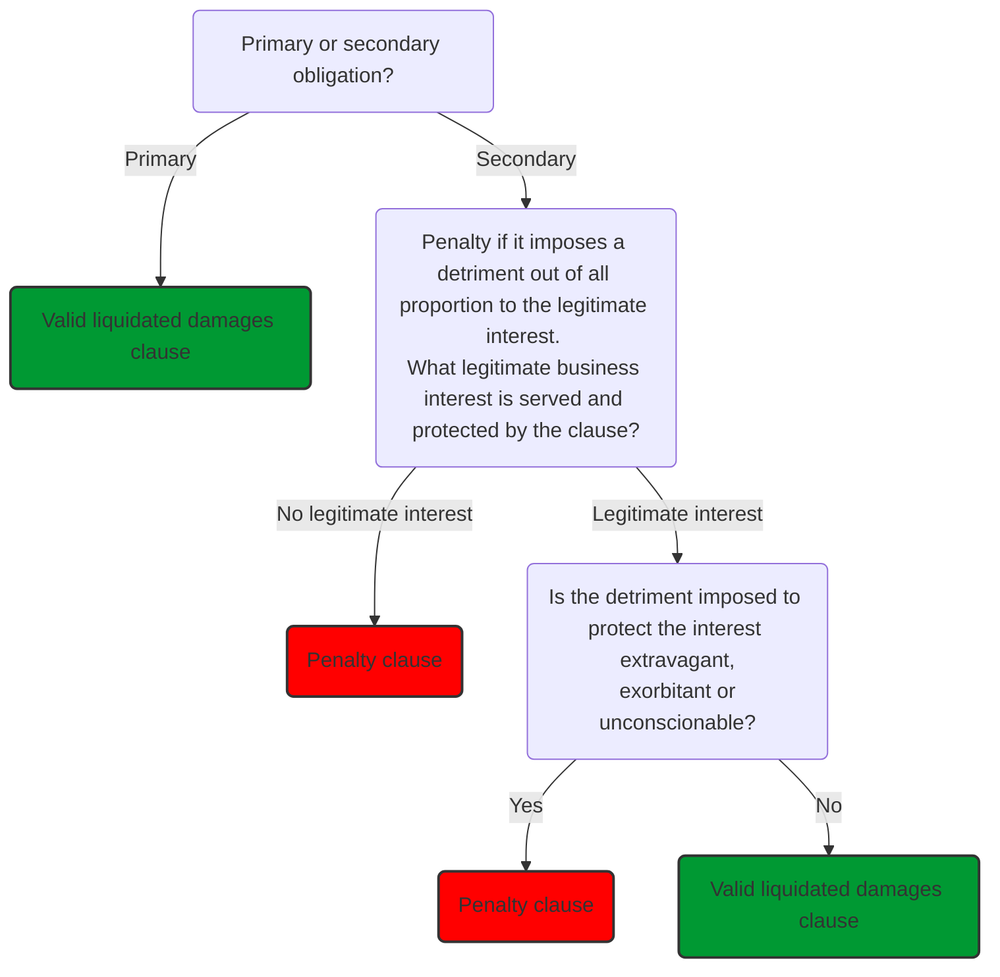

# MERMAID3

```mermaid
graph TD
id1(Primary or secondary obligation?)
id2.1(Valid liquidated damages clause)
id2.2(Penalty if it imposes a detriment out of all proportion to the legitimate interest. <br/>What legitimate business interest is served and protected by the clause?)
id3.1(Penalty clause)
id3.2(Is the detriment imposed to protect the interest extravagant,<br/> exorbitant or unconscionable?)
id4.1(Penalty clause)
id4.2(Valid liquidated damages clause)

id1 --> |Primary| id2.1
id1 --> |Secondary| id2.2
id2.2 --> |No legitimate interest| id3.1
id2.2 --> |Legitimate interest| id3.2

id3.2 --> |Yes| id4.1
id3.2 --> |No| id4.2

classDef red fill:#ff0000,stroke:#333,stroke-width:2px;
classDef green fill:#009933,stroke:#333,stroke-width:2px;
classDef yellow fill:#ff9900,stroke:#333,stroke-width:2px;

class id3.1,id4.1 red
class id2.1,id4.2 green
```
