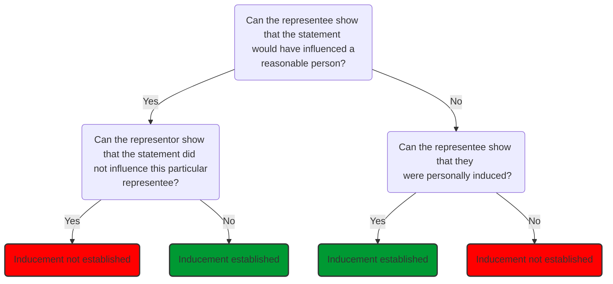

# Representations

## Facility Agreement

Through the due diligence process, the borrower will provide facts, records, forecasts, business plans, documents of title etc. Most important pieces of information are recorded in the facility agreement as representations. Reasons:

1. To elicit information
2. To provide a drawstop if they are untrue
3. To allow the bank to call a default if they are untrue.

### Legal Representations

Relate to the validity of the borrower, any guarantor and the loan documentation. All 6 are usually repeated.

- Status
	- Borrower required to state it is duly incorporated under the laws of the original jurisdiction and the representation repeated to ensure the jurisdiction has not changed.
	- Borrower represents that it has the power to own its assets and carry on its business.
- Binding obligations
	- Borrower confirms that obligations it undertakes in the facility agreement and associated documents are legal, valid, binding, and enforceable. Common to qualify this representation by general principles limiting the borrower's obligations.  
- Non-conflict
	- Borrower must state that entering into the facility agreement will not conflict with any laws or regulations, their constitutional documents, or any other agreement or instrument to which they are a party.
		- Practically, the bank does not want the borrower to immediately default on another contract.
		- Legally, if entering the loan causes the borrower to breach an existing contract, the other party to that contract might sue the bank in tort for ‘procuring a breach of contractual relations’ (or ‘interference with contractual relations’).
		- So the bank should ensure this does not just protect material breaches.
- Power and authority
	- Borrower represents that it has the power and authority to enter into the loan and perform its obligations. Breach will lead to default, which allows the bank to refuse advances or demand repayment.
- Validity and admissibility in evidence
	- Borrower represents that it has done everything required to ensure the facility agreement is admissible in evidence in its jurisdiction of incorporation.
- Governing law and enforcement.
	- Representation that the law governing the facility agreement and any judgment obtained will be recognised and enforced in the borrower's jurisdiction of incorporation.

### Commercial Representations

- Deduction of tax
	- Borrower represents that it is not required to deduct tax from payments made to banks define as “Qualifying Lenders” (those exempt from withholding tax). Not repeated: ongoing tax issues dealt with separately.
- No filing or stamp duties
	- Stamp duty is imposed on the transfer of ‘stock’, ‘marketable securities’ and ‘interests in partnership’, with rates ranging from 0.5% to 1.5% of the consideration or market value of the property being transferred (known as *ad valorem* stamp duty).
	- Failure to pay stamp duty within 30 days of execution will usually mean that the document is not admissible in evidence or accepted for registration purposes.
	- Not usually payable on a loan facility, but represented to protect against possible foreign duties.
- No event of default
	- Borrower represents that there is no **event of default** continuing, or which might reasonably be expected to occur as a result of utilising the facility.
	- Borrower represents that there is no **event of default** under any other of its agreements which would have a material adverse effect.
		- Negotiation will focus on narrowing the definition of material adverse effect.
		- Repeated representation.
- No misleading information
	- Borrower represents that it has not supplied information to the bank which is misleading.
		- Information provided for the information memorandum true and accurate
		- Financial projections prepared by the company's directors based on recent information and contain reasonable assumptions
		- All other information provided to banks was true, complete, and accurate.
	- Borrower will want the representation to apply only to written information provided.
	- Borrower will want representation qualified to information that was “true and accurate in all material respects”.
	- Not necessary to repeat.
- Accounting principles
	- Borrower represents that the original financial statements it provided to the bank were prepared in accordance with the relevant GAAP, consistently applied, and give a ‘true and fair view’.
	- Borrower undertakes to deliver future accounts on the same basis, with a proviso to deal with any change in policies.
	- Borrower represents that there has been no material adverse change in its business or financial condition since a set of financial statements.
		- Usually not repeated if the facility has a material adverse change event of default.
		- If repeated, does it refer to a material adverse change from the original financial statements or the latest financial statements? Negotiate.
- Ranking
	- Borrower represents that any claims the bank may have under the loan documentation will rank at least *pari passu* (equally) with any other unsecured creditors, other than as a result of any preference through insolvency regulations.
	- Under English law, this is the default legal position. Protects banks against a change in the law and protects against foreign jurisdiction practices.
- Litigation
	- Borrower represents that it faces no current or threatened litigation – though this is likely to be qualified by materiality/ de minimis/ excluding frivolous and vexatious claims or to refer to the “reasonably likely outcome”.
	- Litigation representations likely to include claims against the borrower group's directors (derivative claims).
- Winding-up proceedings
	- Borrower represents that no insolvency proceedings in any form have been started or are threatened against the borrower.
	- Borrower should press for de minimis provision and wording to exclude debts which it disputes in good faith.
	- Usually repeated
- Encumbrances
	- Borrower represents that there are no encumbrances other than those disclosed before execution.
		- Even though the bank will have done a company search on the borrower and examined its register of mortgages and charges.
	- Bank represents that it has valid title in its own name to all property over which security is granted.
	- Not usually repeated
- Environmental
	- If the borrower breaches environmental laws, its lender may also incur direct liability (‘lender liability’) if it is found to have ‘knowingly permitted’ contamination or if it takes possession of contaminated land.
	- Borrower represents that it is in compliance with all environmental laws and has obtained and complies with all environmental licences necessary for its business.
	- Often subject to materiality and not typically repeated (environmental undertaking used instead).
- Catch all
	- Banks may try to include such a clause; borrower typically resists.

### Disclosure Letter

- The bank's solicitor will draft the representations as widely as possible.
- Borrower forced to disclose instances in which the representation is not true.
	- These could be included as a specific exception.
	- Neater to keep the representation “clean” and use a separate document to deal with anything which would otherwise be a breach – the disclosure letter. List of agreed specific items which the bank has agreed to waive.
- Disclosures should be worded to modify all representations.

### Repetition of Representations

Representations may be “evergreen” - deemed repeated every day throughout the life of the loan. More common for representations to be repeated immediately prior to each utilisation and on the first day of each interest period.

To prevent the borrower arguing that the representations were merely initial pre-conditions of lending:

- Loan document may specifically state that the representations are to survive the execution and first utilisation.
- A certificate by the borrower to be periodically provided confirming that the representations are still correct.

This also helps prove reliance on a future misrepresentation claim. Reliance will be harder to show from a deemed representation.

## Bank's Perspective

Some representations are best cast in general terms due to caveat emptor. Representations are about risk allocation, allowing the bank to take action. So don't give in to blanket qualifications for most terms.

## Borrower's Perspective

Borrower will want to negotiate wide margins of error.

> [!warning]
> - A borrower should not repeat a representation that there is no "potential event of default", since breach would turn a potential into a full default. 
> - The disclosure letter is effective only on the first instance. If a representation is repeated, the disclosure letter is no longer effective.  

The bank will strongly resist wording that representations are qualified with “to the best of our knowledge and belief”, since this defeats the point.

Borrowers may want to negotiate a materiality qualification, should ensure that the qualification is certain enough to actually be used (e.g., a *de minimus* amount of money). This clause can also be used to restrict the companies in the borrower's group to which a representation applies (e.g., material subsidiaries).

## Contract Law

A representation is a statement of fact, made to induce the party to whom it is addressed to enter into a contract. The statement may be oral or written, and if it is drafted into the contract, it also becomes a term of that contract. If the statement is untrue, it constitutes misrepresentation.

Term | Definition
---|---
Representation | A statement asserting the truth of a given state of facts
Representor | The party who allegedly made the representation
Representee | The party who allegedly received the representation
[[Actionable representation]] | An unambiguous false statement of fact made to the claimant and which induces the claimant to enter into the contract with the statement maker

### Misrepresentation Sequence

1. Identify potential misrepresentation (common sense)
2. Identify if the potential misrepresentation is an [[Actionable representation]]
3. Categorise into one of the [[Misrepresentation categories]]
4. Consider which of the [[Misrepresentation remedies]] to apply
5. Consider if any [[Misrepresentation alternative claims]] apply

Category | Legal basis | Test | Rescission? | Indemnity? | Damages
---|---|---|---|---|---
Fraudulent | Tort of deceit | Representee to prove that representor made the statement knowing it was untrue/ without believing it to be true/ reckless as to the truth | Yes | Unlikely to be needed | Yes, generous [[Tort Law/Remoteness]] rules, no reduction for contributory negligence
Negligent | s 2(1) MA 1967 | Representor fails to show reasonable grounds to believe true/ not believing true up until contract made | Yes | Unlikely to be needed | As for fraud, but potential reduction for contributory negligence. Can also be given in lieu of rescission.
Innocent | s 2(1) MA 1967 | Representor has shown reasonable grounds to believe, and actual belief up until contract made | Yes | Yes, as part of rescission | Can be given in lieu of rescission.

### Actionable Representation

Examining each component in more detail:

### Unambiguous

The representation must be clear and will only form the basis of a claim in misrepresentation if it unambiguously has the meaning put forward by the representee.

Representor will not be liable if the representee has placed its own unreasonable construction on the representation ([[McInerny v Lloyd's Bank Ltd [1974] 1 Lloyd's Rep 246]]).

### False

The statement must be false; it will not be false if it is substantially correct

> “[A] representation may be true without being entirely correct, provided it is substantially correct and the difference between what is represented and what is actually correct would not have been likely to induce a reasonable person in the position of the claimants to enter into the contracts”  
> [[Rix J, Avon Insurance Plc v Swire Fraser Ltd [2000] 1 All ER (Comm) 573]].

### Statement of Fact

> 'A representation is not an undertaking to do, or not to do, something. It is a statement asserting a given state of affairs'  
> [[Kleinwort Benson Ltd v Malaysia Mining Corp [1989] 1 WLR 379]]

Includes | Does not include
---|---
Statements of fact | Statements of opinion
Some conduct | Statements of intention
Statements of law | Silence

#### Facts Vs Puff

Representations distinguished from mere 'puff' ([[Dimmock v Hallett (1866) LR 2 Ch App 21]]).

#### Conduct

Statements usually made by words, but can also be made by conduct ([[Gordon v Selico (1986) 278 EG 53]] concealment of dry rot).

#### Statement of Law

Traditional rule was that a statement of law could not give rise to an actionable misrepresentation. But the distinction between statements of fact and law has been abolished. It was held that a false statement as to the existence of an Act of Parliament is a misrepresentation of fact ([[West London Commercial Bank v Kitson (1884) LR 13 QBD 360]]).

#### Statement of Opinion

##### General Rule

A statement of opinion is not a statement of fact, so cannot usually form the basis of a claim in misrepresentation (e.g., [[Bisset v Wilkinson [1927] AC 1977]]).

##### Exceptions

When someone expresses an opinion, they impliedly state they know the facts justifying that opinion. When the same facts are known to each party, the implicit statement is unlikely to have much impact on the representee. But if the representor has greater knowledge than the representee, the implied statement that there are facts justifying the opinion can significantly mislead the representee ([[Smith v Land and House Property Corporation (1885) LR 28 Ch D 7 (CA)]]).

Where the representor is in a position of superior knowledge or experience, a statement of opinion can be held to involve a statement of fact that there are reasonable grounds for their opinion. So if there are no reasonable grounds for this opinion (i.e., the opinion is one which someone with the knowledge of the representor could not reasonably have held) then a false statement has been made ([[Esso v Mardon [1976] QB 801]]).

There is also an implied statement in an expression of opinion that the representor believes the opinion that they express. If this is not the case, such a representation will be a misrepresentation.

#### Statement of Future Intention

Representation is a statement of fact, so can have no reference to future events or promises.

>“There is a clear difference between a representation of fact and a representation that something will be done in the future. A representation that something will be done in the future cannot be true or false at the moment it is made; and although you may call it a representation, if anything it is a contract or promise”  
>[[Beattie v Ebury (1872) LR 7 Ch App 777]], per Mellish LJ.

Consequently, it is not a misrepresentation if the representor makes a promise regarding a future intention, but is prevented from doing so or if circumstances alter so that they change their mind about that intention ([[Wales v Wadham [1977] 1 WLR 199]]).

However, if the representor states they intend to do something, they are making a limited statement of fact: stating they do have that intention. So if, at that time, they know they cannot do what they state, or do not intend to do it, they are misrepresenting their existing intention ([[Edgington v Fitzmaurice (1885) 29 Ch D 459]]).

Bowen LJ:

>“The state of a man's mind is as much a fact as the state of his digestion…”

#### Silence

Silence will generally not give rise to an action for misrepresentation. No general duty to disclose facts which, if known, might affect the other party's decision to enter the contract ([[Keates v The Earl of Cadogan (1851) 10 CB 591]]).

But there are some exceptions to the rule in Keates:

##### Half-truths

It is a misrepresentation to make statements which are technically true but misleading ([[Nottingham Patent Brick & Tile Co v Butler (1866)]]). e.g., to describe property which is the subject of negotiations for sale as 'fully let' without disclosing that, although the property is indeed fully let at that time, the tenants have given notice to quit, is a misrepresentation ([[Dimmock v Hallett (1866) LR 2 Ch App 21]]).

##### Continuing Representation

If, at the beginning of negotiations, a statement is made which is true but which prior to entering into the contract becomes false, the representor is under an obligation to correct the representation. If they fail to do so and allow the other party to enter into the contract still believing that the representation is true, then they will be liable for misrepresentation ([[With v O'Flanagan [1936] Ch 575]]). This is the principle of 'continuing representations'.

##### Contracts Uberrimae Fidei (utmost Good faith)

There is a duty to disclose material facts in some types of contracts in which one party is in a particularly strong position to know the material facts which form the basis of the contract. Most common is contract of insurance: at common law, disclosure of all material facts must be made to the insurer. Also, often this obligation to disclose information exists between parties which are in a fiduciary relationship (e.g., between a company and its directors, between a trustee and beneficiaries of a trust).

### Addressed to the Claimant

The misrepresentation must be addressed by the representor to the claimant.

### Induces the Claimant to Enter into the Contract with Statement Maker

Requirement not satisfied in [[JEB Fasteners v Mark Bloom [1983] 1 All ER 583]], where the Court of Appeal held that the defendants' representation did not play a 'real and substantial' part in inducing the claimants to act.

Court asks:

> Was the representation material?

Objective test for this: did the statement relate to an issue that would have influenced a reasonable person ([[Pan Atlantic Co Ltd v Pine Top Insurance Co Ltd [1995] 1 AC 501]])?

- If a statement is found to be material, then inducement will generally be inferred as a matter of fact ([[Smith v Chadwick (1884) 9 App Cas 187]]). Then burden shift to the defendant to rebut the inference that the claimant was induced. This is done by proving that the claimant was not subjectively induced.
- If a statement is not found to be material, then inducement of the claimant cannot be inferred as a matter of fact. The claimant must prove that they were subjectively induced. If they do this successfully, it will be held that they have been induced by the misrepresentation ([[Museprime Properties Ltd v Adhill Properties Ltd (1990) 61 P. & C.R. 111]]).

Since the representation must have induced the representee to enter the contract, there is no actionable misrepresentation where:

- the statement was not actually communicated to the representee;
- the statement did not affect the representee's decision to enter the contract
- the statement was known to be untrue by the representee.

The misrepresentation need not be the only reason the claimant entered the contract ([[Edgington v Fitzmaurice (1885) 29 Ch D 459]]).

A representor may seek to argue that the representee was not induced where the representee chooses to test the validity of the representor's statement by making its own investigations ([[Attwood v Small (1838) 6 CL & F 232]]).

The key point in Attwood is not that separate enquiries were made or could have been made — the crucial point is that the separate enquiries showed that the vendor's statements were not relied upon ([[Redgrave v Hurd (1881) 20 Ch D 1]]). This case also established that there is no general duty to check the misrepresentor's statement.

If a representee does not check, where the court considers it reasonable for them to have done so, or carries out a negligent investigation, this would open up the possibility of a defence of [[Contributory negligence]] against the representee. This cannot be pleaded where the misrepresentation is fraudulent. The more commercial the representee is, the more likely it is that the court will consider it reasonable for the representee to have investigated (by analogy to [[Smith v Eric Bush [1990] 1 AC 831]]).

### Categories of Misrepresentation

Once the elements of an actionable misrepresentation have been established, the remedies available depend on the category of the misrepresentation in question.

Under [Misrepresentation Act 1967](https://www.legislation.gov.uk/ukpga/1967/7), the categories of misrepresentation available are:

Category | Legal basis | Test
---|---|---
Fraudulent | Tort of deceit | Representee to prove that representor made the statement knowing it was untrue/ without believing it to be true/ reckless as to the truth
Negligent | s 2(1) MA 1967 | Representor fails to show reasonable grounds to believe true/ not believing true up until contract made
Innocent | s 2(1) MA 1967 | Representor has shown reasonable grounds to believe, and actual belief up until contract made

#### Fraudulent Misrepresentation

Defined by Lord Herschell in [[Derry v Peek (1889) 14 App Cas 337]]:

>"First, in order to sustain an action of deceit, there must be proof of fraud, and nothing short of that will suffice. Secondly, fraud is proved when it is shown that a false representation has been made (a) knowingly, or (b) without belief in its truth, or (c) recklessly, careless whether it be true or false. Although I treated the second and third as distinct cases, I think the third is but an instance of the second, for one who makes a statement under such circumstances can have no real belief in the truth of what he states…Thirdly, if fraud be proved, the motive of the person guilty of it is immaterial. It matters not that there was no intention to cheat or injure the person to whom the statement was made."

'Recklessness' was defined in [[Thomas Witter Ltd v TBP Industries Ltd [1996] 2 All ER 573]], where it was established that to find fraud, the level of recklessness required was 'flagrant disregard for the truth'.

##### Change in Circumstances

It can be difficult categorising a misrepresentation based on change of circumstances. Lord Wright MR in [[With v O'Flanagan [1936] Ch 575]]:

>“…the Court is more reluctant to use the word “fraud” and would not generally use the word “fraud” in that connection because the failure to disclose, though wrong and a breach of duty, may be due to inadvertence or a failure to realise that the duty rests upon the party who has made the representation not to leave the other party under an error when the representation has become falsified by a change of circumstances”

So the Court would need to be satisfied that failure to disclose was deliberate/dishonest.

##### Burden of Proof

The burden of proof on the claimant to prove fraudulent representation is a difficult burden to discharge: allegations of fraud taken very seriously.

#### Negligent Misrepresentation

Section 2(1) of the MA 1967 provides:

>“Where a person has entered into a contract after a misrepresentation has been made to him by another party thereto and as a result thereof he has suffered loss, then, if the person making the misrepresentation would be liable to damages in respect thereof had the misrepresentation been made fraudulently, that person shall be so liable notwithstanding that the misrepresentation was not made fraudulently, unless he proves that he had reasonable grounds to believe and did believe up to the time the contract was made that the facts represented were true.”

So defendant liable for negligent misrepresentation unless they can prove they had reasonable grounds to believe, and did believe up until the time of the contract, that the statement was true.

Where a representor is found liable for a negligent misrepresentation, they will be treated to all intents and purposes as if he had made a fraudulent misrepresentation ([[Royscot Trust Ltd v Rogerson [1991] 2 QB 297]] but widely criticised). This has ramifications for damages.

See also [[Howard Marine and Dredging Co. Ltd. v A. Ogden & Sons (Excavations) Ltd. [1978] 2 WLR 515]].

Important to note that the statutory right to damages for negligent misrepresentation reverses the normal burden of proof by requiring the representor (defendant) to prove that they had reasonable grounds to believe their statement, and did believe their statement.

Note that it is difficult for a defendant to get their misrepresentation downgraded from negligent to innocent, because the courts want to discourage people from making statements without checking/ thinking about their validity.

#### Innocent Misrepresentation

An innocent misrepresentation is one which is not made fraudulently or negligently. It is a statement made where the representor:

- Proves they had reasonable grounds for belief in the truth of their statement
- Proves that they believed up to the time of contract that what they were saying is true.

It is defined in s 2(1)[Misrepresentation Act 1967](https://www.legislation.gov.uk/ukpga/1967/7).

### Remedies for Misrepresentation

#### Rescission

Misrepresentation renders the contract voidable. So the contract is still valid and subsisting until the representee decides to rescind it. Available for any type of representation.

General rule: in order to rescind, the representee must communicate the intention to do so to the representor. Or may initiate proceedings for the rescission of the contract.

This is an equitable remedy, so given or withheld at the discretion of the court. Generally only awarded where parties can be restored to their original position. Reasons why potentially not awarded:

- Affirmation
	- Representee declaring intention to affirm, or doing some act from which such intention may reasonably be inferred.
- Lapse of time
	- Delay defeats equity
	- Lapse of time without attempt to effect rescission not itself affirmation, but could be treated as evidence for such an intention
- Restitution impossible
	- *restitutio in integrum* no longer possible ([[Clarke v Dickson (1858) EB & E 148]])
- Third party rights accrue
	- The contract remains valid up until the time notice is given of the intention to rescind. So at any time prior to rescission, a person acquiring goods under such a contract is able to pass good title to those goods to an innocent third party, who purchases the goods without notice of the misrepresentation.
	- This would prevent restitution

#### Indemnity

As part of the equitable process of rescission, an indemnity may be awarded to cover expenses for obligations assumed as a direct result of the contract. The obligations must have been created by the contract.

Generally, where an action for misrepresentation will give a right to damages, an indemnity will not be awarded. No damages are available for an innocent misrepresentation, so here an action of indemnity is more likely to be awarded. Note the distinction between an indemnity and the common law right to damages ([[Whittington v Seale‑Hayne (1900) 82 LT 49]]).

#### Damages

Damages are potentially the greatest where the misrepresentation is fraudulent. But damages for an action for negligent misrepresentation will under s 2(1) MA 1967 often match those available for fraudulent misrepresentation. Damages in lieu of rescission may be available under s 2(2) MA 1967.

Innocent misrepresentation does not afford any damages per se, but damages in lieu of rescission may be available under s 2(2) MA 1967.

Negligent misrepresentation and fraudulent misrepresentation both entitle the innocent party to damages, under the Misrepresentation Act 1967, s 2(1) and the tort of deceit respectively. In both cases, however, any damages will be on a tortious basis and, therefore, a bank would get no compensation for loss of bargain or profit (see [[Smith New Court Securities Ltd v Scrimgeour Vickers (Asset Management) Ltd [1997] AC 254, HL]]).

#### Damages for Fraudulent Misrepresentation

Fraudulent misrepresentation is part of the tort of deceit, so damages will be calculated on a tortious basis. The measure of damages is that which is necessary to place the innocent injured party in the position they would have been in had the misrepresentation not been made.

Held in [[Doyle v Olby (Ironmongers) Ltd [1969] 2 QB 158]] that claimant can recover

>“…all the damage directly flowing from the tortious act of fraudulent inducement which was not rendered too remote by the plaintiff's own conduct, whether or not the defendant could have foreseen the loss.”

Requirements have since been added:

- That the claimant must mitigate as soon as the fraud is discovered
- That any damages awarded to the claimant will be reduced by the value of any benefit the claimant has acquired as a result of the contract

[[Contributory negligence]] is **not** available as a defence to a claim for fraudulent misrepresentation ([[Standard Chartered Bank v Pakistan National Shipping Corporation (No.2) [2003] 1 AC 959]]).

#### Damages for Negligent Misrepresentation

##### S 2(1) Damages

 s 2(1) CA 1967:

> “Where a person has entered into a contract after a misrepresentation has been made to him by another party thereto and as a result thereof he has suffered loss, then, if the person making the misrepresentation would be liable to damages in respect thereof had the misrepresentation been made fraudulently, that person shall be so liable notwithstanding that the misrepresentation was not made fraudulently, unless he proves that he had reasonable grounds to believe and did believe up to the time the contract was made that the facts represented were true.”

In [[Royscot Trust Ltd v Rogerson [1991] 2 QB 297]] the court confirmed that the effect of this statute is that the correct measure of damages for negligent misrepresentation must be based on the tort of deceit (not the tort of negligence). This implies that the claimant is entitled to recover all losses, even if those losses are unforeseeable. Note that this draws no distinction between the honest and careless representor, and the fraudulent representor (which is criticised). But for negligent misrepresentation, damages may be reduced for [[Contributory negligence]].

##### S 2(2) Damages

 s 2(2) CA 1967:

 > “Where a person has entered into a contract after a misrepresentation has been made to him otherwise than fraudulently, and he would be entitled by reason of the misrepresentation, to rescind the contract, then, if it is claimed, in any proceedings arising out of the contract, that the contract ought to be or has been rescinded, the court or arbitrator may declare the contract subsisting and award damages in lieu of rescission, if of the opinion that it would be equitable to do so, having regard to the nature of the misrepresentation and the loss that would be caused by it if the contract were upheld, as well as to the loss that rescission would cause to the other party.”

Remedy of damages in lieu of rescission only available at the discretion of the court, and only available for negligent and innocent misrepresentation.

The court must consider various factors ([[UCB Corporate Services v Thomason [2005] 1 All ER (Comm) 601]]):

- The nature and seriousness of the misrepresentation
- The loss that would be caused if the contract were upheld
- The loss that rescission would cause the other party

##### Distinction

Note that s 2(2) damages are a separate award of damages to those awarded under s 2(1)

Damages awarded | Rationale
---|---
s 2(1) damages | Intended to compensate the claimant for the loss directly flowing from the negligent misrepresentation.
s 2(2) damages | Intended to compensate the representee where the court has decided, at its discretion, not to award rescission.

Where damages in lieu of rescission are awarded, the damages awarded under s 2(1) will be reduced to reflect those awarded under s 2(2) (as explained by s 2(3))

#### Damages for Innocent Misrepresentation

Where an innocent misrepresentation has been made, the representee is only entitled to the remedy of rescission and, if applicable, an indemnity to cover the cost of the legal obligations arising from the contract entered into. There is no automatic right to damages for an innocent misrepresentation. But, as with negligent misrepresentation, the court has the discretion under s 2(2) to award damages in lieu of rescission. Note [[Contributory negligence]] cannot be claimed for innocent misrepresentation.

#### Misrepresentation and Exemption Clauses

If a contract contains [[Exemption Clauses]] purporting to protect a party from liability for misrepresenting, or purporting to exclude or restrict any remedy available to the other party, the clause will be of no effect except in so far as it satisfies the requirement of reasonableness (s 3 MA 1967 as substituted by s 8 [[Unfair Contract Terms Act 1977]]). The requirement of reasonableness comes from [s 11(1) of the Unfair Contract Terms Act 1977](https://www.legislation.gov.uk/ukpga/1977/50/section/11).

#### Non-reliance Clauses

It is doubtful whether an 'entire agreement' clause would be sufficient to exclude liability for any misrepresentation. A possible boilerplate clause excluding this liability could be

> The parties agree and confirm that neither party has made any representations to the other in relation to this contract or its subject matter, and neither has any party relied on any representation from the other in entering into this contract.

The court will not allow liability for fraudulent misrepresentation to be avoided in this way.

### Hedley Byrne V Heller

There is a claim for negligent misstatement in the law of tort, based on the judgment in [[Hedley Byrne v Heller [1964] AC 465]]. This depends on there being a relationship between two parties that gives rise to a duty of care. The rule in Hedley Byrne v Heller is, however, eclipsed by the Misrepresentation Act 1967 in a situation of inducement to contract, because the onus of proof in the latter is more favourable to a claimant.

### Facility Agreement

The most important remedies for misleading and inaccurate information are built into the facility agreement, typically as events of default. The general law on misrepresentations is therefore only relevant in the unlikely event that a material representation was not caught by the facility agreement, or the facility agreement was unenforceable.

> [!tip]
> The ultimate remedy appropriate for breach of representation in a Facilities Agreement is the immediate repayment of the Loan, together with interest and any other amounts outstanding under the Agreement. Damages aren't really relevant. 
