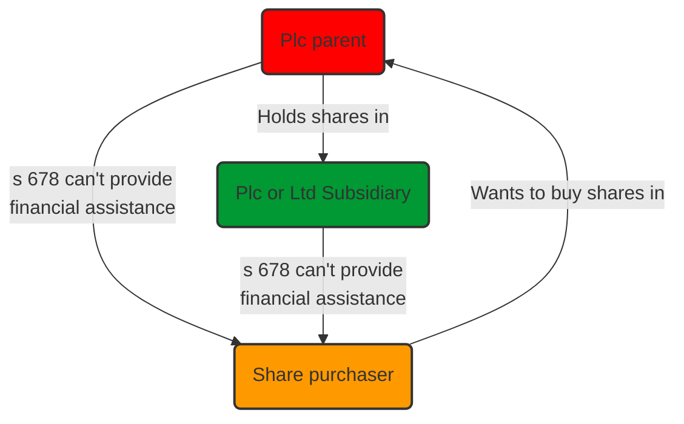

# MERMAID1

```mermaid
graph TD

id1(Plc parent)
id2(Plc or Ltd Subsidiary)
id3(Share purchaser)
id1 --> |Holds shares in| id2
id1 -->|s 678 can't provide<br/> financial assistance| id3
id2 -->|s 678 can't provide<br/> financial assistance| id3
id3 --> |Wants to buy shares in| id1

classDef red fill:#ff0000,stroke:#333,stroke-width:2px;
classDef green fill:#009933,stroke:#333,stroke-width:2px;
classDef yellow fill:#ff9900,stroke:#333,stroke-width:2px;

class id1 red
class id2 green
class id3 yellow

```
