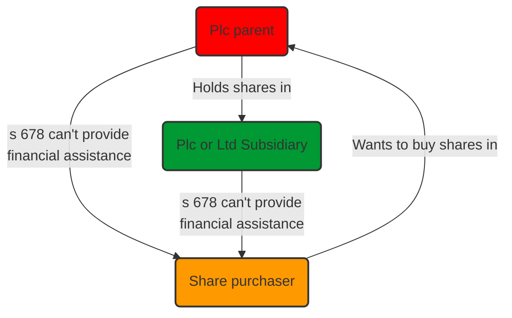
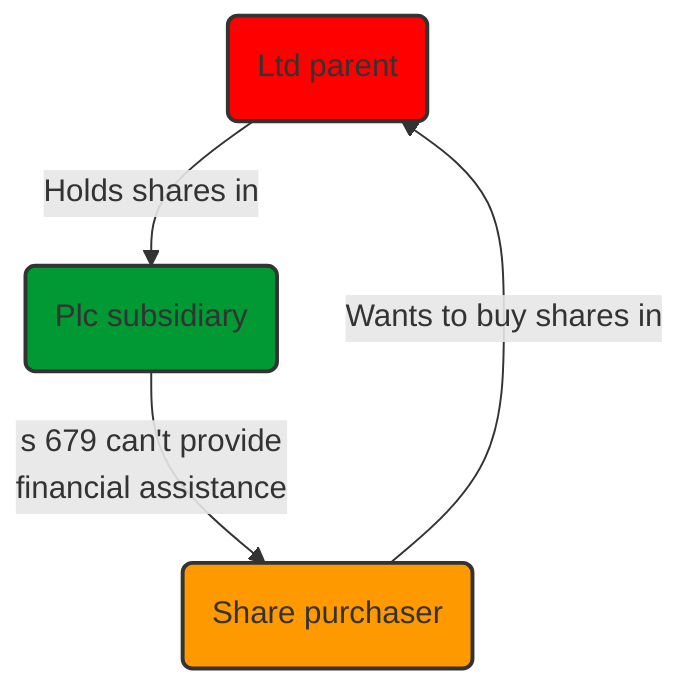

# Taking Security

3 steps to creating a valid security interest:

1. Creation – agreement to create a particular security interest between debtor and creditor.
2. Attachment – ensuring the security interest binds on specific assets
3. Perfection – ensuring validity against third parties and priority.

Perfection and priority are here examined.

## Registration

The safest way to secure an asset is to take possession of it (take a “pledge”). But most loan security is non-possessory. To stop a secured asset being sold on/ re-secured, there is a statutory requirement for the registration of non-possessory security interests.

### CA Regime

The requirement for companies to register certain security interests at Companies House is long-standing. The primary aim is a mechanism to give third parties notice of the security and thereby make it valid against their claims.

The registration regime changed on 06/04/13. It used to be compulsory to register most charges, now it is voluntary. But if the charge is not registered in time, there are consequences (e.g., may become void).

#### What to Register

The registration requirement applies to ‘charges’ created by companies and LLPs. The term ‘charge’ is defined to include mortgages (s 859A(7)) and security assignments. By implication, registration is not required for pledges or liens for which actual or constructive possession of the secured asset by the security holder operates as notice to third parties.

Guarantees don't need registering, mortgages and fixed/ floating charges usually do. For other stuff (loans, pledges), solicitors will usually register out of an abundance of caution.

All charges (remember this includes mortgages) may be registered, with the following three (minor) exceptions (s 859A(6)):

1. a charge in favour of a landlord on a cash deposit given as security in connection with the lease of land;
2. a charge created by a member of Lloyd’s to secure its obligations in connection with its underwriting business;
3. a charge excluded by any other Act.

```ad-statute
title: s 859A CA 2006 - Charges created by a company

(1) Subject to subsection (6), this section applies where a company creates a charge.

(2) The registrar must register the charge if, before the end of the period allowed for delivery, the company or any person interested in the charge delivers to the registrar for registration a section 859D statement of particulars.

(3) Where the charge is created or evidenced by an instrument, the registrar is required to register it only if a certified copy of the instrument is delivered to the registrar with the statement of particulars.

(4) “The period allowed for delivery” is 21 days beginning with the day after the date of creation of the charge (see section 859E), unless an order allowing an extended period is made under section 859F(3).

(5) Where an order is made under section 859F(3) a copy of the order must be delivered to the registrar with the statement of particulars.

(6) This section does not apply to—
- (a) a charge in favour of a landlord on a cash deposit given as a security in connection with the lease of land;
- (b) a charge created by a member of Lloyd's (within the meaning of the Lloyd's Act 1982 F2) to secure its obligations in connection with its underwriting business at Lloyd's;
- (c) a charge excluded from the application of this section by or under any other Act.

(7) In this Part—

“cash” includes foreign currency,

“charge” includes—
- (a) a mortgage;
- (b) a standard security, assignation in security, and any other right in security constituted under the law of Scotland, including any heritable security, but not including a pledge, and

“company” means a UK-registered company.
```

```ad-warning
Charges over shares are, strictly speaking, exempt from registration under the Companies Act 2006 because of the effect of the Financial Collateral Arrangements (No. 2) Regulations 2003 (as amended). However, in practice, security over shares is usually registered, even when registration is not strictly required, because often the share security document covers more than just the shares, thereby giving rise to the concern that payments on the shares (e.g. dividends) may be book debts and, therefore, the security may be registrable.
```

#### Who Registers

Either the company or “any person interested in the charge” (s 859A(2)). This includes the charge-holder as well as the legal advisors to the company or charge-holder. In practice, the charge-holder register the charge.

#### Requirements

```ad-action
Once agreement has been entered into, the company/ any person interested in the charge should deliver (s 859A(2)):

1. A s 859D statement of particulars to Companies House (s 859A(2))
	- This will usually be Form MR01 for a company (or MR08 where there is no charge instrument) or the equivalent forms LLMR01 and LLMR08 for a limited liability partnership.
2. A certified copy of the instrument creating the charge (s 859A(3))
3. The requisite fee
```

s 859G allows certain details to be obscured in the certified copy of the charge instrument (known as ‘redaction’), such as

- Personal information relating to an individual
- Bank account number of a person/ individual
- Signature.

The paragraph certifying it as a true copy of the original should state ‘save for material redacted pursuant to s 859G’.

#### Time Limit for Registration

The registration documents must be delivered **before the end of 21 days beginning with the day after the date of creation of the charge** (s 859A(4)).

If there is a defect with the submission, it must be corrected within the 21-day time limit for submission. whilst there is provision at s 859F for the company (or a person interested) to apply to court for an extension to the 21-day period, there is no guarantee it will be granted.

#### Late/ Inaccurate Delivery

Under [s 859F CA 2006](https://www.legislation.gov.uk/ukpga/2006/46/section/859F), the court has the power to extend the period for registration where the grounds of s 859F(2) are met:

>(a) that the failure to deliver those documents-  
>(i) was accidental or due to inadvertence or to some other sufficient cause, or  
>(ii) is not of a nature to prejudice the position of creditors or shareholders of the company, or  
>(b) that on other grounds it is just and equitable to grant relief.

The court will allow the register to be rectified provided this does not prejudice any other charges created between the date of creation of the unregistered charge and the date of eventual registration ([[Barclays Bank plc v Stuart Landon Ltd [2001] 2 BCLC 316]]).

If an application is successful, the charge will have priority only from the date of actual registration, so may lose priority due to the delay if other charges have been registered in the meantime.

The court has also refused to allow a charge to be registered late, where the time elapsed is too long ([[Victoria Housing Estates Ltd v Ashpurton Estates Ltd [1982]]]).

The court has power:

- Under s 859M to allow rectification of a statement/ notice delivered to the Registrar for inaccurate details.
- Under s 859N if the charging document was defective/ wrong document was sent, can be replaced.

#### Effect of Valid Registration

A validly registered charge is valid against a liquidator, administrator and any creditor of the company that created the charge. But it will not prevent the terms of a charge being challenged, challenge as a preference, transaction at an undervalue or similar.

The form MR01 also has a ‘tick box’ for noting whether the terms of the charge include a negative pledge. The intention is to put anyone who searches the register on notice of the negative pledge.

#### Effect of Invalid Registration

Failure to register a charge within the 21-day period means (s 859H):

1. Security is void against a liquidator, administrator and any creditor
2. The amount secured by the void security becomes immediately payable.

The charge remains valid against the company creating it unless and until that company goes into liquidation or administration. However, the money secured by the charge becomes payable immediately (CA 2006, s 859H(4)).

#### Documents

The company must keep the following documents available at its registered office (s 859P) or SAIL (s 859Q(2)):

1. a copy of every instrument creating a charge capable of registration under the CA 2006;
2. a copy of every instrument that amends or varies a charge capable of registration under the CA 2006;
3. a copy of any documents containing particulars required for registration if those particulars are not in the charge instrument;
4. a copy of any translation required as part of the registration (see CA 2006, s 1105).

The documents may be certified copies (other than the translation) and be available without charge to a creditor or shareholder, and to any other person on payment of a prescribed fee.

#### Security Release

Some security documents may purport to allow a bank to retain the security for a period even after repayment as ‘insurance’ against the repayment being clawed back under the IA 1986, or may deem the debt and security to continue after repayment if the security agent considers clawback a possibility. The efficacy of such provision is questionable.

When the loan is repaid by the company to the lender, a person with an interest in the registration of the charge (such as a director of the company) may, but is not obliged to, complete, sign and send **Form MR04** to the Registrar of Companies at Companies House. This is usually done to ensure the company's file is up-to-date.

Security might also be released to allow for disposal of a particular asset. Release is usually achieved by a deed of release drawn up by the borrower’s solicitor. If the lender decides to release the company’s property from the charge or allows the company to sell the asset covered by the charge, a person with an interest in the registration of the charge (such as a director of the company) must complete, sign and send **Form MR05** to the Registrar of Companies at Companies House.

#### Property Already Subject to Charge

The current regime allows a company (or person interested) to register a charge which already exists on property it acquires (assuming the charge would have been capable of registration if the company had created it). There is no time limit, and non-registration is not an offence.

#### Overseas Companies

Registration of charges applies to all charges created by UK companies/ LLPs, even if the secured assets are overseas.

### Asset-specific Registration Requirements

| Asset    | Registration                                                           |
| -------- | ---------------------------------------------------------------------- |
| Land     | Registered land registered at the District Land Registry.              |
| Ships    | Registered at ship's port of registration (Merchant Shipping Act 1894) |
| Aircraft | Aircraft Mortgage Register                                             |
| IP       | Various statutory provisions.                                                                        |

### Security Created by Individuals

The Bills of Sale Acts 1878 and 1882 impose registration requirements on security created by individuals.

```ad-note
The Acts require most written, non-possessory charges given by an individual or a partnership over tangible property to be registered in prescribed form at the Supreme Court as a bill of sale.
```

IA 1986, s 344 requires most forms of assignment of a trader’s book debts to be registered as a bill of sale if they are to be valid against a trustee in bankruptcy.

## Priority of Security

### Priority Between Charges and Mortgages

- Fixed charges and mortgages rank in order of creation (if properly registered).
- At common law, a legal mortgage takes priority over an existing equitable security interest only if the legal interest was taken bona fide, for value and without notice of the prior equitable security.
- Registration gives notice to anyone who has, or ought to have, searched the register, which will usually protect a prior registered equitable security.

### Fixed and Floating Charges

- Fixed charge will rank in priority to a floating charge
- Note the floating charge could contain a negative pledge $\rightarrow$ then if the later fixed charge holder has actual/ constructive notice of the prohibition through registration, the floating charge would rank first.
- Priority between floating charges governed by their time of creation.
- The date of the charge from which priority can be calculated is the date of creation, not the date of registration
	- A search made on the day of registering a charge might not show a charge created within 21 days which could take priority.

### Security Over Land

- Under the registered land system, the bank proposing to take a legal security must complete a “priority search” at the Land Registry.
- This shows any existing encumbrances over the registered land, as well as actual/ proposed dealings with land.
- If no other encumbrances/ dealings/ priority searches are revealed, the bank has 30 working days within which to register the new legal mortgage and take priority.
- Registration then ensures priority even over an earlier dated unregistered legal mortgage without the benefit of a priority search.

### *Dearle V Hall*

[[Dearle v Hall (1828) 3 Russ 1]] establishes a rule of priority applicable to all assignments or charges of equitable interests and any interest in debts.

```ad-action
To ensure priority, notice of the charge or assignment must be given to the third party which owes the obligation.
```

The same rule applies to charges. The rule will not apply, however, where a subsequent assignee (or chargee) knows of the earlier assignment when taking its assignment. Thus, registration of the security at the Companies Registry will usually defeat the rule.

## Contractual Subordination

### Contractual Priority Arrangements

Possible for creditors to decide between themselves the order in which they will benefit from claims against a defaulting debtor. Priority arrangements frequently used in large financings with layers of debt.

Document creating rights known as an “intercreditor agreement”/ “subordination agreement”/ “deed of priorities”.

### Typical Arrangement

Participants restricted so that:

- Participating lenders divided into an agreed order of priority (tranches) for repayment of their credit.
	- Senior creditors
	- Mezzanine
	- Loan notes
	- High yield.
- No participating bank may enforce security or otherwise proceed against the borrower without the agreement of senior banks/ majority consent
- When security is enforced:
	- Subordinated creditors contractually agree not to claim against the borrower until the senior creditors are repaid (“contingent debt subordination”).
	- Subordinated creditors agree to hold any money they receive on trust for senior creditors (known as a ‘turnover trust’).
		- More robust than contingent debt subordination.
- The pooled money will then be distributed in accordance with the agreement.

```ad-question
title: Does a turnover trust create a proprietory interest over the debt which requires registration as a charge under CA 2006?
[[SSSL Realisations Limited [2004] EWHC (Ch) 1760]] held that the turnover trust in that case did not create a charge: it did create a proprietory right, but since it was limited to the debt owed there was no charge over the ‘junior’ creditor’s property.

Some practitioners register anyway just to be sure. 
```

There is also **structural subordination**: ordinary shareholders automatically subordinated to debt-holding creditors because debts must be repaid before capital can be realised.

Subordination between shareholders through preference shares.

### When is Contractual Subordination Used

- $\uparrow$ risk $\implies$ $\uparrow$ margin. All banks want a diversified spread of risk.
- Contractual subordination might also be used where an unsecured bank requires any debts to a borrower’s directors or parent company to be subordinated to its own.
- Existing bank may agree to subordination to a new bank to secure new funding to help the business.

## Tacking

```ad-defn
Tacking is the ability to secure new advances under existing security.
```

Depends on the asset:

### Registered Land

LRA 2002, s 49.: a mortgage/ charge holder can tack if:

1. it has not received notice of the subsequent security; or
2. the new advance is under an obligation already on the register when the subsequent charge was created; or
3. the maximum amount of the first charge was agreed and on the register when the subsequent charge was created.

### Personalty

Mortgaged/charged personalty is subject to the provisions of LPA 1925, s 94. Any actual or constructive notice of a subsequent mortgage/charge will end a prior mortgagee’s/ chargee’s right to tack unless:

- an arrangement has been made to that effect with the subsequent mortgagees; or
- where the mortgage imposes an obligation on the first mortgagee to make further advances.

## Ruling Off Accounts

When a borrower makes a payment to a bank, the borrower may instruct the bank as to which account it should be appropriated or which loan should be repaid.

In the absence of any specific agreement, the rule in [[Clayton’s Case (1816) 1 Mer 529]] (Devaynes v Noble (1816) 1 Mer 572) applies. Money paid to the bank will discharge the borrower’s debt in the chronological order in which the debt was incurred. But this might disadvantage the bank:

1. May repay a secured loan rather than an unsecured loan, leaving the bank in a more precarious position than if the unsecured loan was repaid first
2. New security may be more vulnerable to be set aside than older “hardened” security.
3. In certain circumstances, new advances would rank behind a second loan to another lender. So a repaid and redrawn RCF may lose priority to a new loan.

- To avoid (1) and (2), the bank may insist on choosing where payments are appropriated (if not received in full).
- (3) dealt with by allowing a bank to “rule off” an account if it learns the borrower has taken a second secured loan.
	- Original secured loan is preserved ("ruled-off") and not treated as repaid by any amounts received from the borrower.
	- Security should be specified as securing all amounts due from time to time from the borrower to the bank.
	- Insert negative pledge clauses.

### Clayton & Guarantees

Subject to contrary agreement, once a guaranteed liability has been fixed in value, any payment by the borrower to the bank will be deemed to reduce the guaranteed debt.

```ad-action
Can be avoided by specifying the guarantee to be ‘continuing’, or alternatively an ‘all monies guarantee’.
```

## Fixed or Floating

Floating charge advantages (for the bank):

- Allows a borrower to deal freely with the charged assets in the ordinary course of business
- May allow the bank to appoint an administrative receiver
	- After changes made by the EA 2002, this is relevant only to ‘specialised’ financial structures.
- The holder of a ‘qualifying floating charge’ (as defined by IA 1986, Sch B1, para 14) can appoint an administrator using an out-of-court procedure.

```ad-defn
title: “Lightweight”/ “Phantom” floating charge
Charge taken primarily for the purpose of allowing the bank to appoint an administrative receiver.
```

Floating charge disadvantages:

- On insolvency, a floating charge ranks behind any fixed security/ preferential creditors.
- Floating charge may be vulnerable to later fixed charges, even if containing a registered negative pledge.
- Can be set aside under wide circumstances
- Some of the proceeds available allocated to the prescribed part fund
- Ranks behind liquidator's expenses
- Borrower free to deal with assets until crystallisation.

See also [[Common Securities]].

## Hardening Periods

```ad-defn
title: Hardening period
A period during which the security is vulnerable to provision in IA 1986 for setting aside certain transactions. 
```

Possible grounds for setting aside security:

- Transaction at an undervalue (s 238 IA 1986)
- Preferences (s 239 IA 1986)
- Floating charges (s 245 IA 1986)

See [[Business Law and Practice/Insolvency/Voidable Transactions]].

## Capacity

Before lending, check the capacity of the borrower to provide security.

The powers and limitations on trustees will be found in the trust deed.

```ad-statute
title: s 16 TA 1925 - Power to raise money by sale, mortgage, &c.

(1) Where trustees are authorised by the instrument, if any, creating the trust or by law to pay or apply capital money subject to the trust for any purpose or in any manner, they shall have and shall be deemed always to have had power to raise the money required by sale, conversion, calling in, or mortgage of all or any part of the trust property for the time being in possession.

(2) This section applies notwithstanding anything to the contrary contained in the instrument, if any, creating the trust, but does not apply to trustees of property held for charitable purposes, or to trustees of a settlement for the purposes of the Settled Land Act, 1925, not being also the statutory owners.
```

So trustees are granted the power to grant security provided that borrowing is authorised and for the purpose of the trust, regardless of what the trust deed says.

## Corporate Benefit

A bank often requires additional security from a borrower's parent, subsidiary, or sister company. The company providing the guarantee/ indemnity/ security must prove it derives sufficient “corporate benefit” from granting the security. Consider s 172 duty to promote the success of the company.

A subsidiary securing its parent (e.g., an ‘up-stream’ guarantee) could argue that the support from its parent (e.g., financial, marketing, product development) provides sufficient corporate benefit. This argument is more tenuous if the company is a small fish in a large group pond, but can be strengthened by a down-stream support letter.

If a company believes there is insufficient corporate benefit to provide security, there is authority to suggest that it may still be given, provided that:

1. the company’s shareholders unanimously direct the security to be given; and
2. the company is not insolvent either at the time of giving the security, or immediately following the giving of the security.

## Financial Assistance

### Definition

Refers to a company providing financial assistance for the purchase of its own shares. This includes financial assistance given by way of a gift, loan, guarantee, security or indemnity ([s 677 CA 2006](https://www.legislation.gov.uk/ukpga/2006/46/section/677)).

Financial assistance was defined in [[British and Commonwealth Holding PLC v Barclays Bank plc [1996] 1 WLR 1]] as

> “The section requires that there should be assistance or help for the purpose of acquiring the shares and that that assistance should be financial”.

Financial assistance was originally made unlawful to counter a practice whereby individuals were able to purchase cash rich companies by arranging for the target company to advance the cash to finance the acquisition. In effect, the company paid for its own acquisition.

### Prohibitions

CA 2006 **removed** the prohibition in relation to private companies, so now prohibition of financial assistance **only** applies in general to public companies.

- Both public companies and their private limited subsidiaries are prohibited from providing financial assistance for the purchase of shares in the public company ([s 678 CA 2006](https://www.legislation.gov.uk/ukpga/2006/46/section/678)).
- Public companies are also prohibited from providing financial assistance for the purchase of shares in their private limited **holding** companies ([s 679 CA 2006](https://www.legislation.gov.uk/ukpga/2006/46/section/679)).

The consequences of unlawful financial assistance are that the transaction will be held void and the company, and any officer in default, will be liable to a fine/ up to two years in prison.

```ad-important
The rules on financial assistance are relevant in the context of share purchases and do not apply where the buyer is acquiring the target company's assets.
```

#### Purpose

Financial assistance will only be prohibited by *[section 678](https://uk.westlaw.com/5-505-7258?originationContext=document&transitionType=PLDocumentLink&contextData=(sc.Default)&ppcid=52c063520c5f48d8a198d13504dc80c1)* or *[679](https://uk.westlaw.com/6-506-2056?originationContext=document&transitionType=PLDocumentLink&contextData=(sc.Default)&ppcid=52c063520c5f48d8a198d13504dc80c1)* if it is given “for the purpose of” the acquisition of shares or to reduce or discharge previous liability in relation to an acquisition. The company must have **intended** to facilitate the acquisition by giving the assistance.

#### Time

The prohibition on financial assistance in *[section 678](https://uk.westlaw.com/5-505-7258?originationContext=document&transitionType=PLDocumentLink&contextData=(sc.Default)&ppcid=52c063520c5f48d8a198d13504dc80c1)* and *[section 679](https://uk.westlaw.com/6-506-2056?originationContext=document&transitionType=PLDocumentLink&contextData=(sc.Default)&ppcid=52c063520c5f48d8a198d13504dc80c1)* is not limited in time.

#### Re-registration

Public companies may be able to re-register as private to give financial assistance for the acquisition of their own shares. Where a public company has re-registered as a private company after the shares have been acquired and it is a private company at the time the post-acquisition assistance is given, the *[section 678](https://uk.westlaw.com/5-505-7258?originationContext=document&transitionType=PLDocumentLink&contextData=(sc.Default)&ppcid=52c063520c5f48d8a198d13504dc80c1)* prohibition will not apply.

### Exceptions

There are some exceptions, but these are narrowly construed.

#### Unconditional Exceptions

[s 681 CA 2006](https://www.legislation.gov.uk/ukpga/2006/46/section/681) contains a wide list of unconditional exceptions, mainly relating to financial assistance being offered for procedures which are authorised in other sections (e.g., redemption of shares, reduction of capital).

#### Conditional Exceptions

[s 682 CA 2006](https://www.legislation.gov.uk/ukpga/2006/46/section/682) lists a number of “conditional” exceptions, which apply only if the company has net assets and either:

1. Those assets are not reduced by the giving of financial assistance, or
2. To the extent that those assets are reduced, the assistance is provided out of distributable profits.

#### Principal Purpose and Incidental Part of a Larger Purpose

One example of a conditional exception is financial assistance by a company for the purposes of an employee share scheme, provided this is made in good faith in the interests of the company or its holding company (s 682(2)(b)).

There are exceptions set out in s 678(2) and (3) and s 679 (2) and (3) which are designed to ensure that the prohibition in s 678(1) and s 679 (1) does not prohibit genuine commercial transactions that are in the interests of the company.

These provide that financial assistance is not prohibited:

- If the principal purpose of the assistance is not to give it for the purpose of an acquisition of shares, or where the assistance is incidental to some other larger purpose of the company; and
- In either case, where the financial assistance is given in good faith in the interests of the company.
	- To satisfy the good faith test, the officers procuring the company to give the financial assistance must act in the genuine belief that the assistance is being given in the company's interests.

These exceptions can be difficult to rely on ([[Brady v Brady [1989] AC 755]]) since they are extremely narrowly construed by the courts.

```ad-statute
title: s 678 - Assistance for acquisition of shares in public company

(1) Where a person is acquiring or proposing to acquire shares in a public company, it is not lawful for that company, or a company that is a subsidiary of that company, to give financial assistance directly or indirectly for the purpose of the acquisition **before or at the same time** as the acquisition takes place.

(2) Subsection (1) does not prohibit a company from giving financial assistance for the acquisition of shares in it or its holding company if—
- (a) the company's principal purpose in giving the assistance is not to give it for the purpose of any such acquisition, or
- (b) the giving of the assistance for that purpose is only an incidental part of some larger purpose of the company,

and the assistance is given in good faith in the interests of the company.

(3) Where—
- (a) a person has acquired shares in a company, and
- (b) a liability **has been incurred** (by that or another person) for the purpose of the acquisition,

it is not lawful for that company, or a company that is a subsidiary of that company, to give financial assistance directly or indirectly for the purpose of **reducing or discharging the liability** if, **at the time the assistance is given**, the company in which the shares were acquired is a public company.

(4) Subsection (3) does not prohibit a company from giving financial assistance if—
- (a) the company's principal purpose in giving the assistance is not to reduce or discharge any liability incurred by a person for the purpose of the acquisition of shares in the company or its holding company, or
- (b) the reduction or discharge of any such liability is only an incidental part of some larger purpose of the company,

and the assistance is given in good faith in the interests of the company.

(5) This section has effect subject to sections 681 and 682 (unconditional and conditional exceptions to prohibition).
```

```ad-statute
title: s 679 - Assistance by public company for acquisition of shares in its private holding company

(1) Where a person is acquiring or proposing to acquire shares in a private company, it is not lawful for a public company that is a subsidiary of that company to give financial assistance directly or indirectly for the purpose of the acquisition **before or at the same time** as the acquisition takes place.

(2) Subsection (1) does not prohibit a company from giving financial assistance for the acquisition of shares in its holding company if—
- (a) the company's principal purpose in giving the assistance is not to give it for the purpose of any such acquisition, or
- (b) the giving of the assistance for that purpose is only an incidental part of some larger purpose of the company,

and the assistance is given in good faith in the interests of the company.

(3) Where—
- (a) a person has acquired shares in a private company, and
- (b) a liability **has been incurred** (by that or another person) for the purpose of the acquisition,

it is not lawful for a public company that is a subsidiary of that company to give financial assistance directly or indirectly for the purpose of **reducing or discharging the liability**.

(4) Subsection (3) does not prohibit a company from giving financial assistance if—
- (a) the company's principal purpose in giving the assistance is not to reduce or discharge any liability incurred by a person for the purpose of the acquisition of shares in its holding company, or
- (b) the reduction or discharge of any such liability is only an incidental part of some larger purpose of the company,

and the assistance is given in good faith in the interests of the company.

(5) This section has effect subject to sections 681 and 682 (unconditional and conditional exceptions to prohibition).

```

### Types

*[section 677(1)](https://uk.westlaw.com/8-505-7474?originationContext=document&transitionType=PLDocumentLink&contextData=(sc.Default)&ppcid=52c063520c5f48d8a198d13504dc80c1)* sets out a number of different heads of financial assistance:

- Financial assistance given by way of gift.
	- If there is some consideration, however inadequate, moving to the company, it will not be a gift. The transaction might still be caught by *[section 677(1)(d)](https://uk.westlaw.com/8-505-7474?originationContext=document&transitionType=PLDocumentLink&contextData=(sc.Default)&ppcid=52c063520c5f48d8a198d13504dc80c1)* (material reduction in net assets).
- Financial assistance given by way of guarantee, security or indemnity (other than an indemnity in respect of the indemnifier's own neglect or default), or by way of release or waiver.
- Financial assistance given by way of loan or any other agreement under which any of the obligations of the person giving the assistance are to be fulfilled at a time when in accordance with the agreement any obligation of another party to the agreement remains unfulfilled.
- Any other financial assistance given by a company where the net assets of the company are reduced to a material extent by the giving of the financial assistance or the company has no net assets.
	- Assets and liabilities here should be given their actual values and not their book values.
	- For “material extent”, it is commonly accepted that less than 1% would fall outside the prohibition but 1% and over would amount to a material reduction.
		- This is the only *de minimis* rule in s 677.

### Flowcharts

#### S 678



#### S 679



### Share Purchases

There are several situations which may raise financial assistance problems in the context of a share purchase (if transactions carried out for the purpose of assisting the acquisition of shares in the target – which is a public company/ private holding company of a public company giving financial assistance):

1. The target public company grants security over its assets in respect of a loan taken out by the buyer of shares.
2. The target public company repays its existing indebtedness under a loan agreement to its private holding company (the seller) at the time of the sale of the company.
	1. If the loan from the seller is repayable on demand, then this repayment will not be financial assistance.
	2. Else, acceleration of payment could amount to financial assistance.
3. Target public company sells assets to the buyer at the time of the sale of the company.
	1. If the company sells the assets at less than their market value (for example, at book value), this could be financial assistance insofar as there is a material reduction in the company's net assets (section 677(1)(d)(i)).
	2. If the target company leaves any of the consideration on the sale outstanding, this may amount to financial assistance by way of a loan “or any other agreement under which any of the obligations of the person giving the assistance are to be fulfilled at a time when in accordance with the agreement any obligation of another party to the agreement remains unfulfilled” (section 677(1)(c)(i)).
4. Using loan finance, the buyer acquires the target public company (which has a wholly owned subsidiary). The subsidiary is subsequently transferred to the buyer and the subsidiary grants security for the loan.
	1. The subsidiary of the target company is not giving financial assistance here if it is no longer a subsidiary of the target company.
	2. But the transfer of the subsidiary could constitute financial assistance if it was not made at market value.
5. Using loan finance, the buyer acquires shares in the target public company. The target subsequently acquires (or incorporates) a subsidiary which grants security for the loan.
	1. Although the subsidiary was not a subsidiary at the time of the acquisition, it is one at the time of the assistance (the security) is given and this will be caught by *[section 678(3)](https://uk.westlaw.com/5-505-7258?originationContext=document&transitionType=PLDocumentLink&contextData=(sc.Default)&ppcid=fc9f4d9e83af4b4c8d47bf5847a3205c)*.
6. A company borrows money, all or some of which it uses to subscribe for shares in a public company subsidiary. That subsidiary uses the money to acquire the majority of shares in the target public company. The subsidiary and target give guarantees and security for the bank borrowing.
	1. The guarantees and security granted by the target will constitute financial assistance for the acquisition of its shares.
	2. It will also constitute financial assistance for the acquisition of shares in its parent company (namely the subscription of shares in the subsidiary).
7. Using loan finance, the buyer acquires shares in the target public company. Subsequently, the buyer refinances this borrowing (that is, it borrows from a new lender and repays the original lender). This new borrowing is secured by the target company.
	1. The grant of security by the target company will constitute financial assistance within *[section 678(3)](https://uk.westlaw.com/5-505-7258?originationContext=document&transitionType=PLDocumentLink&contextData=(sc.Default)&ppcid=fc9f4d9e83af4b4c8d47bf5847a3205c)* because its purpose is to assist in the discharge of a liability.
	2. However, if this new financing is subsequently itself refinanced (a second-round refinancing) security granted by the target company for that new lending will not be caught because that new lending is not discharging acquisition debt (but to discharge borrowings which themselves discharged acquisition debt).
8. Using loan finance, the buyer acquires shares in the target public company. Subsequently, the target company makes (otherwise lawful) dividend payments and loans to the buyer which the buyer uses to service or repay the loan.
	1. So far as the dividends are concerned, these fall within the unconditional exception in *[section 681(2)(a)](https://uk.westlaw.com/8-506-2055?originationContext=document&transitionType=PLDocumentLink&contextData=(sc.Default)&ppcid=fc9f4d9e83af4b4c8d47bf5847a3205c)*.
	2. However, the loans will be prohibited by *[section 678(3)](https://uk.westlaw.com/5-505-7258?originationContext=document&transitionType=PLDocumentLink&contextData=(sc.Default)&ppcid=fc9f4d9e83af4b4c8d47bf5847a3205c)* and *[section 677(1)(c)](https://uk.westlaw.com/8-505-7474?originationContext=document&transitionType=PLDocumentLink&contextData=(sc.Default)&ppcid=fc9f4d9e83af4b4c8d47bf5847a3205c)*.

### Break Fees

Where the company whose shares are potentially being acquired pays the break fee (or agrees to do so) the break fee could amount to unlawful financial assistance. Draft such provisions carefully.

### Sanctions

#### Effect of Transaction

The transaction itself is illegal and unenforceable, as is any security or guarantee given in contravention of the prohibition. If a provision for illegal financial assistance is contained in a share purchase agreement, then it may be possible to sever the offending term.

#### Directors' Liability

If the provision of financial assistance is not in accordance with the directors' duty to act in the way they consider, in good faith, would be most likely to promote the success of the company for the benefit of its members as a whole (*[section 172](https://uk.westlaw.com/5-505-5377?originationContext=document&transitionType=PLDocumentLink&contextData=(sc.Default)&ppcid=fc9f4d9e83af4b4c8d47bf5847a3205c)*), and the breach has not been approved or ratified by an appropriate shareholder resolution the directors will be in breach of their duty and may have to account for any losses suffered by the company.

A director may also be liable for disqualification as a result of a company's involvement in a prohibited transaction (*[section 1](https://uk.westlaw.com/5-506-8501?originationContext=document&transitionType=PLDocumentLink&contextData=(sc.Default)&ppcid=fc9f4d9e83af4b4c8d47bf5847a3205c), [Company Directors Disqualification Act 1986](https://uk.westlaw.com/4-505-7796?originationContext=document&transitionType=PLDocumentLink&contextData=(sc.Default)&ppcid=fc9f4d9e83af4b4c8d47bf5847a3205c)*).

```ad-note
Misfeasance can include illegal financial assistance (s 212)
```

#### Recipient Liability

If a person receives money from a company as a result of illegal financial assistance and knew or ought to have known of the circumstances rendering the assistance illegal, then a constructive trust may arise in favour of the company (*[Belmont Finance Corp Ltd v Williams Furniture Ltd (No 2) [1980] 1 All ER 393](https://uk.westlaw.com/D-016-7350?originationContext=document&transitionType=PLDocumentLink&contextData=(sc.Default)&ppcid=fc9f4d9e83af4b4c8d47bf5847a3205c)*). The third party may be required to account for any money or property received in breach of *[section 678](https://uk.westlaw.com/5-505-7258?originationContext=document&transitionType=PLDocumentLink&contextData=(sc.Default)&ppcid=fc9f4d9e83af4b4c8d47bf5847a3205c)* or *[679](https://uk.westlaw.com/6-506-2056?originationContext=document&transitionType=PLDocumentLink&contextData=(sc.Default)&ppcid=fc9f4d9e83af4b4c8d47bf5847a3205c)* as a constructive trustee.

#### Restrictions on Relevant Shares

A person who has been given illegal financial assistance by a public company to acquire that company's shares and who holds those shares as a trustee for the company must not exercise any voting rights attached to the shares (*[section 662(1)(e)](https://uk.westlaw.com/5-506-0543?originationContext=document&transitionType=PLDocumentLink&contextData=(sc.Default)&ppcid=fc9f4d9e83af4b4c8d47bf5847a3205c)*).

#### Criminal Sanctions

The only sanction set out in the *[CA 2006](https://uk.westlaw.com/3-503-8567?originationContext=document&transitionType=PLDocumentLink&contextData=(sc.Default)&ppcid=fc9f4d9e83af4b4c8d47bf5847a3205c)* provides that contravention of *[section 678(1) or (3)](https://uk.westlaw.com/5-505-7258?originationContext=document&transitionType=PLDocumentLink&contextData=(sc.Default)&ppcid=fc9f4d9e83af4b4c8d47bf5847a3205c)* or *[section 679(1) or (3)](https://uk.westlaw.com/6-506-2056?originationContext=document&transitionType=PLDocumentLink&contextData=(sc.Default)&ppcid=fc9f4d9e83af4b4c8d47bf5847a3205c)* renders the company liable to a fine and every officer in default liable to a fine or up to two years' imprisonment or both (*[section 680](https://uk.westlaw.com/4-506-2057?originationContext=document&transitionType=PLDocumentLink&contextData=(sc.Default)&ppcid=fc9f4d9e83af4b4c8d47bf5847a3205c)*).

“Officers” include directors, managers and secretaries and any person who is to be treated as an officer of the company for the purposes of the provision in question (*[section 1121(2)](https://uk.westlaw.com/2-506-8531?originationContext=document&transitionType=PLDocumentLink&contextData=(sc.Default)&ppcid=fc9f4d9e83af4b4c8d47bf5847a3205c)*). Officers who may be liable are those who authorise or permit, participate in, or fail to take all reasonable steps to prevent the contravention (*section 1121(3)*).

## Applicable Law

### Security Interests

The legal system which governs a security interest will dictate how the security will be perfected (eg, notice, registration, etc) and how it may be enforced.

| Type of asset             | Legal system                                                                                                                                                                                                                                                      |
| ------------------------- | ----------------------------------------------------------------------------------------------------------------------------------------------------------------------------------------------------------------------------------------------------------------- |
| Immovable assets          | Security governed by the legal system of the place where the assets are physically situated (known as the ‘*lex situs*’).                                                                                                                                         |
| Tangible movable assets   | Generally, the *lex situs* of the asset when the security is created will determine the validity of its creation and perfection. Generally, the *lex situs* of the asset when the security is created will determine the validity of its creation and perfection. |
| Intangible movable assets | Security over intangible assets (eg, debts) is usually subject to the governing law of the contract creating the asset, but the law of the place of performance of the asset (eg, where the debt is to be paid) is also relevant.                                                                                                                                                                                                                                                                  |

### Insolvency

From 31 May 2002, the EU Insolvency Regulation (EUIR) came into force in all EU Member States except Denmark. The EUIR provides rules that dictate which system of insolvency law applies in a ‘cross-border’ insolvency situation.

- Under the EUIR, the main insolvency proceedings will be opened in the jurisdiction of the entity’s Centre of Main Interest (COMI).
- There is a rebuttable presumption that the COMI is in the jurisdiction of an entity’s registered office (Article 3(1)), although factors such as location of employees, head office, board meetings and where the company does most of its business can influence the COMI.
- 2 main circumstances in which assets may be subject to insolvency proceedings in jurisdictions other than the COMI.
	1. Assets outside the COMI which are subject to ‘rights in rem’ are basically unaffected by the COMI proceedings.
	2. Supplemental proceedings may be brought in a jurisdiction where a company has an ‘establishment’.
- The EUIR applies to companies, partnerships and individuals with their COMI in an EU Member State (other than Denmark), but not to most regulated entities (eg, banks, insurance companies) which have separate regimes.
- The UK now has a slightly different regime but the EUIR largely operates unchanged.

## UNCITRAL Model Law

Cross-Border Insolvency Regulations 2006 implements the main provisions of the ‘Model Law’ on Cross-Border Insolvency devised by UNCITRAL (the United Nations Commission on International Trade Law). EUIR takes precedence where there is a clash.

## To Consider

When advising on security issues, also consider:

- Prior security
	- Check for negative pledges
	- May need a subordination agreement.
- Notification requirements
	- May need to notify third parties like licensing authorities and landlords.
- Overseas registration.
	- Security interests over overseas properties may need registering in the jurisdiction in which situated.
- Parallel debt structures
	- Security for a syndicated loan will be held by a security trustee (usually one of the lenders): legal title to the security is held on trust and the syndicate banks are the beneficiaries.
	- This allows syndicate members to change without danger of the security being treated as renewed (losing priority/ hardening periods).
	- Trusts aren't a thing in civil law jurisdictions, so a "parallel debt" structure may be used instead.
		- A security agent holds the security on behalf of the syndicate.
		- But most jurisdictions only allow a party to hold security to the extent it is owed a debt.
		- Parallel debt structure creates a debt owed to the security agent in the same amount as the debt owed to the bank syndicate.
		- Normally, if the borrower repays the syndicate, any amount it repays is deemed to reduce the syndicate debt by the same ("in parallel").
		- On a default, however, the security agent becomes entitled to demand repayment of the debt owed to it and enforce the security if necessary. For every amount the security agent recovers, the syndicated debt will be deemed to reduce by the same.
		- Not as good as a trust; the syndicate takes a risk on the security agent becoming insolvent.
