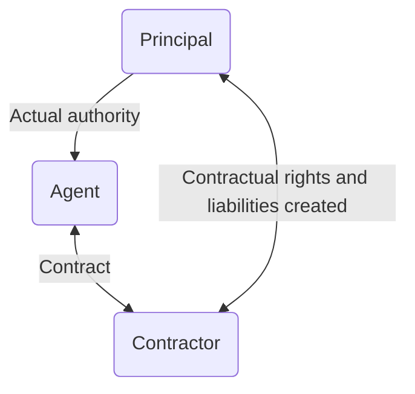
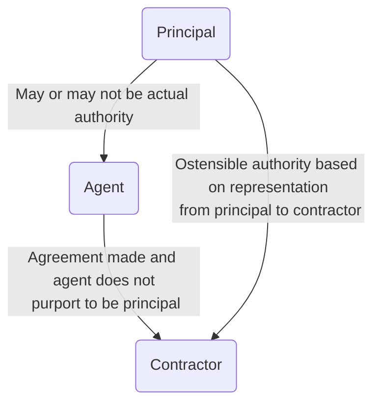

# Freeman and Lockyer v Buckhurst Park Properties (Mangal) Ltd [1964] 2 QB 480

#key-case

Kapoor (K) and Hoon (H) had formed Buckhurst Ltd to buy and resell a large estate. There were four directors, including K and H, and the articles of the company required all four directors to constitute a quorum. Although not appointed as the managing director, K acted as such and engaged the claimants, a firm of architects and surveyors, to apply for planning permission to develop the estate. Buckhurst Ltd later refused to pay the claimants' fees, arguing that K had no authority to engage them. The Court of Appeal upheld the claim on the basis of ostensible authority. Although K had no actual authority, the board had held K out as the managing director, allowing him to act in this way, and therefore K had ostensible authority to bind the company.

## Facts

Shiv Kumar Kapoor - K. (property developer) and Nimarjit Singh Hoon (H.) formed defendant company to puchase and resell Buckhurst Park Estate. K. personally agreed to pay running expenses and be reimbursed from proceeds of sale.

K., H., and a nominee of each appointed company directors. Articles of association gave power to appoint managing director, but none appointed. K. told plaintiff, firm of architects, to apply for planning permission to develop estate. Plaintiff claimed their fees from defendant company.

County court judge: although K. never appointed managing director, had acted as such to knowledge of board of directors of the defendant company. So held for plaintiffs.

Court of Appeal: K. had no actual authority to employ plaintiffs but had ostensible authority as had acted throughout as managing partner, with knowledge of board.

Crucially, K.'s act of engaging plaintiffs within the ordinary ambit of authority of a managing director. So plaintiffs did not have to inquire whether he was properly appointed.

Willmer L.J.:

No quorum at the relevant board meetings, so this might prevent the court from holding that Kapoor had actual authority. But many factors showing he had ostensible authority, including that he acted as owner of the property without serious objection from the company. Plaintiffs can rely on Kapoor's ostensible authority even though they have not read the articles of association - this is not ordinary business practice (even though it is ordinary banking practice).

Hoon was out of the country almost all the time, relied on his nominee Hubbard to protect his interests. Property then conveyed to the company. Had been agreed that prior to sale, running expenses of maintaining property to be paid by Kapoor personally.

Doctrine of ostensible authority in relation to a limited company necessarily gives rise to difficult legal problems. Company can only act through its officers, and powers of officers limited by articles of association.

Older cases: in none were the plaintiffs in a position to allege that the person with whom they contracted was acting within the scope of such authority as one in his position would be expected to possess. And in none of the cases did the plaintiffs have any knowledge of the articles of association.

If articles merely empower the directors to delegate to an officer authority to do the act, and the officer purports to do the act, then

1. If act is one which would ordinarily be beyond the powers of such an officer, the plaintiff cannot assume that the directors have delegated to the officer power to do the act (and if they have not done so, plaintiff cannot recover)
2. If act is one which is ordinarily within the powers of such an officer, then company cannot dispute the officer's authority to do the act, whether or not directors have actually invested him with that authority.

So here plaintiffs do not have to rely on articles of association of defendant company in order to establish their claim.

PEARSON L.J.

Expressions "ostensible authority" and "holding out" somewhat vague: basis is an estoppel by representation. Agent professes to act on behalf of company, so impledly represents and warrants that he has authority from company to do so. Here consider only representation - which company is responsible for. So company is estopped frm denying truth of representation.

"Actual" authority is a legal relationship between principal and agent created by consensual agreement to which they alone are parties. Scope: apply ordinary principles of construction of contracts. To this agreement, contractor is a stranger - **may be totally ignorant of the existece of any authority on the part of agent**. But if the agent does enter into contract pursuant to actual authority, creates contractual rights and liabilities between principal and contractor.

(see weird bit about undisclosed principals)

"Apparent" or "ostensible" authority is a legal relationship between principal and contractor created by a representation, made by principal to contractor, intended to be and in fact acted upon by the contractor, that the agent has authority to enter on behalf of the principal into a contract of a kind within the scope of the "apparent" authority, so as to render the princiapl liable to perform any obligations imposed upon him by such contract.

To such a relationship created, the agent is a stranger. Need not be (though generally is) aware of the existence of the repesentation, but must not purport to make the agreement as principal himself. Representation, when acted upon by contractor entering into contract, operates as an estoppel preventing principal from asserting he is not bound by the contract. Irrelevant whether agent has actual authority to enter the contract.

In ordinary business dealings, contractor can hardly ever rely on actual authority of agent. Relies on representation of principal (apparent authority) or representation of agent (warranty of authority).

Link to ultra vires:

1. No representation can operate to estop the corporation from denying the authority of the agent to do on behalf of the corporation an act which the corporation is not permitted by its constitution to do itself.
2. Since conferring of actual authority upon an agent is itself an act of the corporation, capacity to do which is regulated by constitution, corporation cannot be estopped from denying it has conferred upon a particular authority to do acts which by its constitution, it is incapable of delegating to that agent.

Note the [[constructive notice]] is a negative doctrine forming part of estoppel.

Where the agent upon whose "apparent" authority the contractor relies has no "actual" authority from the corporation to enter into a particular kind of contract with the contractor on behalf of the corporation, the contractor cannot rely upon the agent's own representation as to his actual authority. (look at the diagram and this makes sense).

## Conditions

So in summary, four conditions must be fulfilled to entitle a contractor to enforce against a company a contract entered into on behalf of the company by an agent who had no actual authority to do so:

1. Representation that the agent had authority to enter on behalf of the company into a contract of the kind sought to be enforced was made by contractor
2. Such representation made by a person or persons who had "actual" authority to manage the business of the company either generally or in respect of those matters to which contract relates
3. Contractor was induced by such representation to enter the contract (relied upon it)
4. Under memorandum or articles of association, company was not deprived of capacity to enter into a contract of the kind sought to be enforced, or to delegate authority to enter into a contract of that kind to the agent

Applying to Kapoor:

1. Board knew Kapoor had been acting as managing director in employing agents etc. Permitted him to do so, which represented that he had the authority to enter into contracts of a kind which MD responsible for finding purchaser would in the normal course by authorised to enter into on behalf of company
2. Articles of association conferred full management powers to board.
3. Plaintiffs induced to believe Kapoor was authorised to enter into contracts on behalf of company
4. Articles of association did not deprive company of capacity to delegate authority to Kapoor to enter into contracts of that kind on behalf of company
