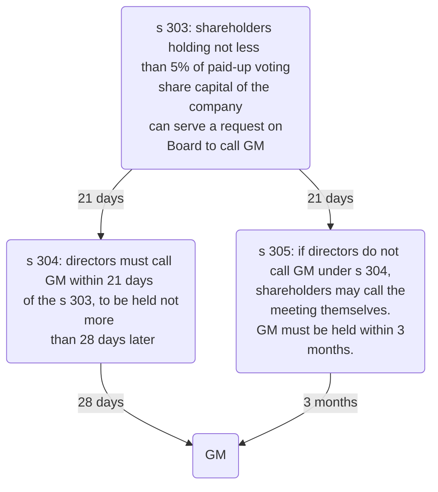

```toc
min_depth: 1
```

# Decision-making

There are certain decisions which shareholders are required to take:

| Section | Decision | Resolution required |
| ------------------------- | --------------------------------------------------------------- | ------------------- |
| s 190(1) | Approving a substantial property transaction (SPT) | Ordinary |
| s 188(2) | Approving director's service contract for fixed term $>2$ years | Ordinary |
| s 217(1) | Approving compensation to director for loss of office | Ordinary |
| s 551(1) | Authorising directors to allot [[Shares]] | Ordinary |
| s 694(2) | Approving contract for share buyback | Ordinary |
| s 239(2) | Ratifying director's breach of duty | Ordinary |
| s 366(1) | Authorising political donations | Ordinary |
| s 168(1) | Removing a director against their will | Ordinary |
| s 510(2) | Removing company auditor | Ordinary |
| s 21(1) | Amending the company's [[Articles of Association]] | Special |
| ss 569(1), 570(1), 571(1) | Disapplying shareholders' pre-emption rights | Special |
| s 716(1) | Approving payment for share buyback out of capital | Special |
| s 97(1)(a) | Deciding to register company as public | Special |
| s 77(1) | Changing company name (provided no other procedure in articles) | Special |
| MA 4(1) | Direct the board of directors how to act | Special |
| s 84(1)(b) IA 1986 | [[Liquidation#Members' Voluntary Liquidation]] | Special |

Some take effect immediately, others merely give permission for the transaction to proceed. So some decisions require shareholders, others require directors, others require both. A private company with $>1$ shareholders can take shareholder decisions in two ways:

1. By passing a resolution at a shareholders' meeting
2. Shareholders' written resolution.

# Directors' Decision-making

Directors generally take decisions collectively as a board (except where delegated). The board can take decisions at a board meeting or by written resolution.

## Sole Director

- A company can have just one director (s 154).
- MA 7(2) of the model articles for private companies allows a sole director to take decisions however the director wishes.
- A sole director must still keep a written record of decisions taken (minutes) for 10 years (s 248(2)).
- A sole director does not have to make a declaration of interest. Where a company which should have more than one director currently only has a sole director, the director must make any necessary declarations of interests in writing (s 186).

## Board Meeting

### Calling Meeting

> [!statute] MA 9(1)
> (1) Any director may call a directors’ meeting by giving notice of the meeting to the directors or by authorising the company secretary (if any) to give such notice.
> 
> (2) Notice of any directors’ meeting must indicate—
> - (a) its proposed date and time;
> - (b) where it is to take place; and
> - (c) if it is anticipated that directors participating in the meeting will not be in the same place, how it is proposed that they should communicate with each other during the meeting.
> 
> (3) Notice of a directors’ meeting must be given to each director, but need not be in writing.
> 
> (4) Notice of a directors’ meeting need not be given to directors who waive their entitlement to notice of that meeting, by giving notice to that effect to the company not more than 7 days after the date on which the meeting is held. Where such notice is given after the meeting has been held, that does not affect the validity of the meeting, or of any business conducted at it.

### Notice

Reasonable notice of a board meeting is necessary ([[(Re Homer District Consolidated Gold Mines, ex parte Smith (1888) 39 Ch D 546]]), and this is whatever notice it is usual for the directors to give ([Brown v La Trinidad (1887) 37 Ch. D. 1](app://obsidian.md/Brown%20v%20La%20Trinidad%20(1887)%2037%20Ch.%20D.%201)). Therefore, if all the directors are in the same building, the meeting could be called almost immediately, if such notice is customary for the directors.

There is no need to specify the business of the meeting ([[La Compagnie de Mayville v Whitley [1896] 1 Ch 788 (CA)]]).

If notice is not given to a director, they can demand another meeting be held within a reasonable time ([[Brown v La Trinidad (1887) 37 Ch. D. 1]]).

### Quorum

> [!defn] Quorum
> The minimum number of directors who are required by the company’s articles to be present for valid decisions to be taken at that meeting.

> [!statute] [Art 11 MA](https://www.gov.uk/government/publications/model-articles-for-private-companies-limited-by-shares/model-articles-for-private-companies-limited-by-shares#quorum)
> (1) At a directors’ meeting, unless a quorum is participating, no proposal is to be voted on, except a proposal to call another meeting.
> 
> (2) The quorum for directors’ meetings may be fixed from time to time by a decision of the directors, but it must never be less than two, and unless otherwise fixed it is two.
> 
> (3) If the total number of directors for the time being is less than the quorum required, the directors must not take any decision other than a decision—
> - (a) to appoint further directors, or
> - (b) to call a general meeting so as to enable the shareholders to appoint further directors.

- Special articles can be adopted to change quorum rules.
- There is no provision to allow for the appointment of alternates.
- Not all directors necessarily count in the quorum, e.g., if a particular director has a personal interest in a transaction.

> [!defn] Quorate
> A meeting at which the quorum is present.

#### Director Interest & Quorum

> [!statute] MA 14
> (1) If a proposed decision of the directors is concerned with an actual or proposed transaction or arrangement with the company in which a director is interested, that director is not to be counted as participating in the decision-making process for quorum or voting purposes.
> 
> (2) But if paragraph (3) applies, a director who is interested in an actual or proposed transaction or arrangement with the company is to be counted as participating in the decision-making process for quorum and voting purposes.
> 
> (3) This paragraph applies when—
> - (a) the company by ordinary resolution disapplies the provision of the articles which would otherwise prevent a director from being counted as participating in the decision-making process;
> - (b) the director’s interest cannot reasonably be regarded as likely to give rise to a conflict of interest; or
> - (c) the director’s conflict of interest arises from a permitted cause.
> 
> (4) For the purposes of this article, the following are permitted causes—
> - (a) a guarantee given, or to be given, by or to a director in respect of an obligation incurred by or on behalf of the company or any of its subsidiaries;
> - (b) subscription, or an agreement to subscribe, for shares or other securities of the company or any of its subsidiaries, or to underwrite, sub-underwrite, or guarantee subscription for any such shares or securities; and
> - (c) arrangements pursuant to which benefits are made available to employees and directors or former employees and directors of the company or any of its subsidiaries which do not provide special benefits for directors or former directors.

#### Voting

MA 7(1): each director has one vote at a board meeting, and all resolutions maybe passed by majority vote. If there is an equal number of votes for and against a resolution there is deadlock and the negative view will prevail, which means that the resolution is defeated unless the chairperson has a casting vote.

MA 10: voting can be flexible and take place by electronic means.

#### Chairperson

- If there is any dispute over the ability of a particular director to vote/ count in the quorum on any issue, the chairperson must decide and their decision is final.
- If there is deadlock, the chairperson (if appointed under Art 12 MA) has the casting vote (Art 13 MA).
	- MA also goes further and grant this casting vote to a director who chairs the meeting without formally being appointed as chairperson.
	- MA 13(2) does exclude the casting vote, though, if the chairperson is prevented from voting or counting in the quorum under art 14.
	- Often excluded in the articles.

#### Administration

- Minutes must be recorded for every board meeting and kept for 10 years, otherwise an offence is committed by every officer of the company in default (CA 2006, s 248).
- Minutes do not record verbatim what was said
- s 1135(1) of the CA 2006 requires minutes to be kept in hard-copy or electronic form
- MA 15: require minutes to be in written form.
- The minutes are open to inspection by the directors ([[Conway v Petronius Clothing Co [1978] 1 WLR 72]]), but usually not by the shareholders ([[R v Mariquita and New Grenada Mining Company (1859) 1 El & El 289]]).

#### Evidence of Propriety

If the minutes of the meeting are signed by the chairperson, they are evidence of the proceedings at that meeting (CA 2006, s 249(1)).

Unless the contrary is proved, where minutes are prepared in accordance with s 248, the meeting is deemed duly held, all proceedings are deemed to have taken place and all appointments are deemed validly made (s 249(1)).

## Directors' Written Resolutions

NON-EXAMINABLE: Allows directors to take decisions without having to call and hold a board meeting. Permitted under MA 8(2).

> [!statute] MA 8(2)
> (1) A decision of the directors is taken in accordance with this article when all eligible directors indicate to each other by any means that they share a common view on a matter.
> 
> (2) Such a decision may take the form of a resolution in writing, copies of which have been signed by each eligible director or to which each eligible director has otherwise indicated agreement in writing.
> 
> (3) References in this article to eligible directors are to directors who would have been entitled to vote on the matter had it been proposed as a resolution at a directors’ meeting.
> 
> (4) A decision may not be taken in accordance with this article if the eligible directors would not have formed a quorum at such a meeting.

Notes:

- Only require all eligible directors to vote; so excludes e.g., those with a personal interest in a proposed transaction.
- Allows for flexibility: copies of resolutions to do not need to be signed and decision of each of the directors does not need to be simultaneous.
- MA 8 goes further and allows decisions by any means, including those which are not written. But it is always sensible to have a written record.

### Keeping a Record

- No requirement to keep copies of written resolutions under CA – s 248 CA 2006 only applies to a board meeting.
- MA 15 requires a written record of any written resolution to be kept for 10 years.

# General Meetings

## Who Can Call

### Board of Directors

General Meetings are usually called by the board of directors ([s 302 CA 2006](https://www.legislation.gov.uk/ukpga/2006/46/section/302)) by passing a board resolution at a Board Meeting ([[Brown v La Trinidad (1887) 37 Ch. D. 1]]). This is usually passed by a simple majority vote of directors, or can be passed by a signed directors' written resolution.

> [!note]
> On a board resolution just to call a GM, MA stipulates that MA 14 restrictions on quorum and voting do not apply, since the board meeting decision is seen as purely procedural.

The Board must give 14 clear days' notice of a General Meeting ([s 307(1) CA 2006](https://www.legislation.gov.uk/ukpga/2006/46/section/307) & [s 360 CA 2006](https://www.legislation.gov.uk/ukpga/2006/46/section/360)). The exception is where the **short notice procedure** is used (s 307(4)-(6)): if $\geq 90\%$ of shareholders with voting rights agree, the general meeting can take place on short notice, e.g., immediately after the board meeting (note this requisite percentage can be changed between 90-95% in the Articles).

The notice for a general meeting must be timely ([s 307 CA 2006](https://www.legislation.gov.uk/ukpga/2006/46/section/307)) and appropriate ([s 311 CA 2006](https://www.legislation.gov.uk/ukpga/2006/46/section/311)). The validity of resolutions passed at a general meeting depends on proper notice being given.

### Shareholders

Shareholders can themselves call a General Meeting s 303-305. If the Board refuses to call a General Meeting, the shareholders have reserve power to do so themselves.

[s 303(1) CA 2006](https://www.legislation.gov.uk/ukpga/2006/46/section/303): shareholders together holding $\geq 5\%$ of paid-up voting share capital of the company can serve a request on the company (**'s 303 request'**). Must state the general nature of the business which shareholders wish to be dealt with at the General Meeting.

Under [s 304(1) CA 2006](https://www.legislation.gov.uk/ukpga/2006/46/section/304): when directors receive s 303 request, must call for the General Meeting within 21 days from the date of request, to be held on a date not more than 28 days after the **date of notice** convening General Meeting.

If directors fail to **call** a General Meeting, all the shareholders who submitted the s 303 request, or any of them representing $>50\%$ of the voting rights of those that submitted the request, can themselves call a General Meeting (pursuant to[s 305 CA 2006](https://www.legislation.gov.uk/ukpga/2006/46/section/305)).

If they call it themselves, a General Meeting must be held within **3 months** of the date that directors receive the initial request.

[s 305(6) CA 2006](https://www.legislation.gov.uk/ukpga/2006/46/section/305): if shareholders are forced to call the General Meeting themselves, can recover reasonable expenses for doing so from the company. Then the company can recoup monies from directors who should have called the meeting in the first place.



### Who to Notify

Notice must be given (s 310 CA 2006):

- To all shareholders
- To every director
- To the personal representative of a deceased member
- To the trustee in bankruptcy of a bankrupt member.

Companies articles may make alternative provision (s 310(4)), e.g., common to exclude giving notice to shareholders living overseas. Must also give notice to auditors (s 502(2)(a)).

### How to Notify

Can be hard-copy (handed to shareholders, or posted to address appearing on register–s 1143), electronically (Sch 5 part 3), via a website (sch 5 part 4), or some combination (s 308).

### Content of Notice

Must include:

- Time, date and place of meeting (s 311(1))
- General nature of business - subject to articles to the contrary (s 311(2))
- Statement of rights to appoint a proxy (s 325(1))
- Full text of any special resolution to be proposed (s 283(6)(a)).  
    - This cannot be subsequently amended at the GM ([[In the matter of Uniq PLC [2011] EWHC 749 (Ch))]]).  
    - But can be corrected by an accompanying circular.

No similar requirement to include the full next of an ordinary resolution, though this is common practice. Ordinary resolutions can be amended at the GM, provided the change is not so radical as to make notice of the meeting ineffective ([[Betts v MacNaghten [1910] 1 Ch 430]]).

If shareholders exercise their s 314(1) rights to have a statement circulated before the GM, this must be circulated with notice of the GM (s 315(1)).

### Length of Notice

> [!statute] s 307 - Notice required of a GM
> 
> (1) A general meeting of a private company (other than an adjourned meeting) must be called by notice of at least 14 days.
> 
> (2) A general meeting of a public company (other than an adjourned meeting) must be called by notice of—
> - (a) in the case of an annual general meeting, at least 21 days, and
> - (b) in any other case, at least 14 days.
> 
> (3) The company's articles may require a longer period of notice than that specified in subsection (1) or (2).
> 
> (4) A general meeting may be called by shorter notice than that otherwise required if shorter notice is agreed by the members.
> 
> (5) The shorter notice must be agreed to by a majority in number of the members having a right to attend and vote at the meeting, being a majority who—
> - (a) together hold not less than the requisite percentage in nominal value of the shares giving a right to attend and vote at the meeting (excluding any shares in the company held as treasury shares), or
> - (b) in the case of a company not having a share capital, together represent not less than the requisite percentage of the total voting rights at that meeting of all the members.
> 
> (6) The requisite percentage is—
> - (a) in the case of a private company, 90% or such higher percentage (not exceeding 95%) as may be specified in the company's articles;
> - (b) in the case of a public company, 95%.
> 
> (7) Subsections (5) and (6) do not apply to an annual general meeting of a public company (see instead section 337(2)).

- 14 clear days' notice (ss 307(1) & 360).
- Notice period usually includes weekends and bank holidays.
- Where a company has unamended Table A articles, those articles may extend this notice period (s 307(3)).
- The minimum notice period applicable to the GMs for public companies and traded companies is more complex.

#### Deemed Delivery

> [!attention]
> 
> In addition to the minimum 14 clear days’ notice period, it is usually necessary under s 1147 of the CA 2006 to add a further 48 hours before the GM can be held, unless the company’s articles state otherwise. This is because s 1147 provides that a document (including a notice of a GM) is deemed to have been received by the intended recipient 48 hours after it was sent by post or electronically.

### Short Notice

It is possible for the shareholders of a company to agree to hold a GM on short notice (CA 2006, s 307(4)), provided that:

1. a majority in number of the shareholders must agree to holding the meeting on short notice (CA 2006, s 307(5)); and
2. those shareholders must hold at least 90% of the voting shares in the private company (s 307(5)(a) and (6)(a)). This 90% threshold may be increased by the articles to 95% (s 307(6)(a)), which applies to many companies formed before the CA 2006 came into force.

There are circumstances for which short notice cannot be used, e.g., s 168 removal of a director.

### Invalid Notice

- Notice must be given in the proper form to all those entitled to it: if not done, then any resolutions purportedly passed at the meeting may be invalid (s 301(a)).
- A deliberate decision not to send a notice to a shareholder can also amount to a s 171(b) breach by a director for exercising their powers for an improper purpose.

But:

> [!statute] s 313 - Accidental failure to give notice of resolution or meeting
> 
> (1) Where a company gives notice of—
> - (a) a general meeting, or
> - (b) a resolution intended to be moved at a general meeting,
> 
> any accidental failure to give notice to one or more persons shall be disregarded for the purpose of determining whether notice of the meeting or resolution (as the case may be) is duly given.
> 
> (2) Except in relation to notice given under—
> - (a) section 304 (notice of meetings required by members),
> - (b) section 305 (notice of meetings called by members), or
> - (c) section 339 (notice of resolutions at AGMs proposed by members),
> 
> subsection (1) has effect subject to any provision of the company's articles

## Quorum

- Subject to the company's articles, the quorum for a General Meeting is two shareholders ([s 318(2) CA 2006](https://www.legislation.gov.uk/ukpga/2006/46/section/318))
- For single member companies, of course, the quorum is one (s 318(1)).
- No business other than the appointment of the chairman of the meeting can be transacted at a general meeting if the persons attending do not constitute a quorum ([MA 38](https://www.gov.uk/government/publications/model-articles-for-private-companies-limited-by-shares/model-articles-for-private-companies-limited-by-shares#quorumgen)).
- The quorum of a company with more than one shareholder cannot normally be reduced to one, because generally one person cannot constitute a ‘meeting’ ([[Sharp v Dawes (1876) 2 QBD 26 (CA)]]).
- In exceptional circumstances, the court may reduce the quorum to one under s 306 (e.g., where a shareholder refuses to attend a GM so that no decisions can be taken ([[Re El Sombrero Ltd [1958] Ch 900]])).
- GMs must be quorate throughout the meeting.

### Conflicts

- Generally, there is no restriction on shareholders who have a conflict of interest voting in a GM as, unlike directors, they are not fiduciaries ([[Pender v Lushington (1877) 6 ChD 70]]).
- Exceptions: shareholders with a conflict cannot vote on:
	- An ordinary resolution to ratify a director’s breach of duty (if that director is also a shareholder) (s239).
	- A special resolution to approve a buy-back out of share capital (that shareholder’s vote is ignored) (s695 and s717)

Note that this can be amended by the Articles; Table A makes the threshold 95%.

### Proxies

- Proxies can usually count as part of the quorum.
- But there must be at least two people physically present in the room for there to be a ‘meeting’ ([[Re Sanitary Carbon Co [1870] WN 233]]), so can't have a single shareholder + proxy.

### Permitted Attendees

The following can attend, though cannot vote unless they are also shareholders:

- Directors (MA 40(1))
- Auditors (s 502(2))
- Anybody granted permission by the chairman (MA 40(2)).

## Chairperson

- The Chairman at a GM does **not** get a casting vote – an ordinary resolution can only be passed with a “simple majority” i.e., more than 50% (s282).
- Role is to preside over meetings and keep order.
- The Chairman will usually be the same person who is the chairman at board meetings (MA 39 provides that unless a Chairman is specifically appointed, the Chairman of Board meetings will automatically be the Chairman at GMs.

## Voting

### Methods of Voting

Two methods for passing both ordinary resolutions (s 282) and special resolutions (s 283):

1. Show of hands – each shareholder gets one vote (s 284(2))
2. Poll vote – each shareholder gets one vote **per share** (s 284(3)).

Under [MA 42](https://www.gov.uk/government/publications/model-articles-for-private-companies-limited-by-shares/model-articles-for-private-companies-limited-by-shares#votinggen) a resolution put to the vote of a General Meeting must be decided on a show of hands unless a poll is demanded in accordance with the Articles. [MA 44](https://www.gov.uk/government/publications/model-articles-for-private-companies-limited-by-shares/model-articles-for-private-companies-limited-by-shares#pollvotes) deals with the right to demand a poll vote as follows:

> [!statute] MA 44 - Poll votes
> (1) A poll on a resolution may be demanded—
> - (a) in advance of the general meeting where it is to be put to the vote, or
> - (b) at a general meeting, either before a show of hands on that resolution or immediately after the result of a show of hands on that resolution is declared.
> 
> (2) A poll may be demanded by—
> - (a) the chairman of the meeting;
> - (b) the directors;
> - (c) two or more persons having the right to vote on the resolution; or
> - (d) a person or persons representing **not less than one tenth of the total voting rights** of all the shareholders having the right to vote on the resolution.
> 
> (3) A demand for a poll may be withdrawn if—
> - (a) the poll has not yet been taken, and
> - (b) the chairman of the meeting consents to the withdrawal.
> 
> (4) Polls must be taken immediately and in such manner as the chairman of the meeting directs.

If the vote is a poll vote, it is taken in writing with one vote per share, usually immediately ([[R v Chillington Iron Co (1825) 29 ChD 159]]); but votes cast in advance of the meeting may also be included in a poll vote, subject to the articles of the company (s 322A).

### Excluding

This right cannot be excluded: [s 321(1) CA 2006](https://www.legislation.gov.uk/ukpga/2006/46/section/321) states that a provision of a company's articles is void in so far as it would have the effect of excluding the right to demand a poll at a general meeting on any question other than

- the election of the chairman of meeting;
- the adjournment of the meeting

### Proxies

> [!statute] s 324 - Rights to appoint proxies
> 
> (1) A member of a company is entitled to appoint another person as his proxy to exercise all or any of his rights to attend and to speak and vote at a meeting of the company.
> 
> (2) In the case of a company having a share capital, a member may appoint more than one proxy in relation to a meeting, provided that each proxy is appointed to exercise the rights attached to a different share or shares held by him, or (as the case may be) to a different £10, or multiple of £10, of stock held by him.

- Corporate shareholders must appoint a representative to attend GMs ([s 323 CA 2006](https://www.legislation.gov.uk/ukpga/2006/46/section/323)).
- The proxy must vote in accordance with the wishes of the shareholder who appointed the proxy (s 322A).
- If a member wants to send a proxy to a meeting rather than attend personally, they must formally appoint a person as their proxy by depositing notice in writing at the registered office (MA 45).
- Every notice of a GM must inform the shareholders clearly of their right to appoint proxies under s 324 of the CA 2006 and under any wider rights in the articles (s 325).
- If it is intended to terminate a proxy’s authority, the company must have received notice of that intention before the start of the relevant GM (CA 2006, s 330).
- If the articles specify more than 48 hours’ notice then that provision is void under s 330(6).

## Annual General Meeting

Under CA 2006, private limited companies do **not** have to hold an AGM, though public companies still do ([s 336 CA 2006](https://www.legislation.gov.uk/ukpga/2006/46/section/336)).

AGM must be called by directors ([s 302 CA 2006](https://www.legislation.gov.uk/ukpga/2006/46/section/302)) on 21 clear days'[^1] notice (s 307(2), s 360(2)) within 6 months' of the financial year-end. See also [[Company procedure]].

[^1]: “Clear days” means the day the notice was given and the day of the meeting are discounted from calculation (s 360)

At the AGM, directors present an annual report. Shareholders with voting rights vote on current issues, such as appointments to the company's board of directors, executive compensation, dividend payments and the selection of auditors.

### AGM

- No requirement for private companies to hold an AGM.
- But CA 2006 does not prevent a company from requiring an AGM in its articles.
- CA 1985 stipulated there must be AGM
- s 336(1) CA 2006 requires a public company to hold an AGM every year, in the 6 months after its accounting reference date.

### GM

- MA companies only hold GMs, not AGMs
- Pre-CA 2006, GMs were known as Extraordinary General Meetings (EGMs); the term is still used.

## Resolutions

3 types of resolutions:

1. Ordinary resolution
	1. Passed by a simple majority ($>49\%$ of votes cast are in favour) – [s 282(1) CA 2006](https://www.legislation.gov.uk/ukpga/2006/46/section/282).
2. Special resolution
	1. Requires a majority of $\geq 75 \%$ ([s 283(1) CA 2006](https://www.legislation.gov.uk/ukpga/2006/46/section/283)).
3. Extraordinary resolution
	1. Not mentioned in CA 2006, but it was a form of decision provided by in CA 1985. The majority required is the same as for a special resolution.

If CA 2006 does not specify type of resolution to be used, ordinary resolution required, unless Articles say higher majority ([s 281(3) CA 2006](https://www.legislation.gov.uk/ukpga/2006/46/section/281)). Special resolutions required for decisions like amending the articles ([s 21 CA 2006](https://www.legislation.gov.uk/ukpga/2006/46/section/21)).

Votes at General Meetings counted out of all shareholders present and voting.

### Amendments

Where CA 2006 or the articles specify that an ordinary resolution may be used, it is open to the shareholders to change the articles to require a special resolution to be used instead (s 282(5)). The two exceptions to this are removal of a director against their will (s 168) and the removal of the company’s auditors (s 510).

### Deadlock

Pre-CA 2006 companies may allow a chairperson a casting vote in breaking a deadlocked ordinary resolution. In exercising the power in this case, the chairperson should cast their vote as a fiduciary rather than as an individual; in other words, for what is best for the company rather than for their personal position. Under CA 2006 this is no longer permitted.

### Interests

#### Shareholders May Vote in Their Own Interests

General principle: shareholders may vote in their own interests. Shareholders are under no fiduciary duty to help the company and can vote as they wish, regardless of whether the vote will be in the best interests of the company ([[Pender v Lushington (1877) 6 ChD 70]]).

Shareholders who are also directors can ignore [[Fiduciary duties]] when voting in their capacity as shareholders ([North-West Transportation Co Ltd v Beatty (1887) 12 App Cas 589]).

But shareholders must act in bona fides way ([[Clemens v Clemens Bros [1976] 2 All ER 268]]). The principle applies to shareholders who are also directors, when voting in their capacity as shareholders ([[Northern Counties Securities Ltd v Jackson & Steeple Ltd [1974] 1 WLR 1133]]).

Shareholders may vote as they wish to remove a director, provided due process has been followed ([[Citco Banking Corporation NV v Pusser's Ltd [2007] UKPC 13]]).

In exceptional circumstances, the courts have made orders to restrain a shareholder from exercising their vote in a way that was **irrational** ([[Standard Chartered Bank Ltd v Walker [1992] 1 WLR 561]]).

#### Restrictions

There are times when the votes of a particular shareholder are ignored:

- Votes by a director/ connected person on an ordinary resolution to ratify a directors' breach of duty (s 239(4))
- Votes on shares to be bought back, when shareholders voting by ordinary resolution on a share buyback (s 695) or by special resolution on a buyback out of capital (s 717).

### Amending Articles

When shareholders are voting on a decision to amend the articles, the court will look at whether reasonable shareholders could have considered that the amendment was for the benefit of the company.

Shareholders must vote to amend the articles in good faith ([[Allen v Gold Reefs of West Africa [1900] 1 Ch 656]]) and not undermine substantive rights of minority shareholders. If they do this, the court may hold the amendment invalid.

[[Sidebottom v Kershaw, Leese & Co Ltd [1920] 1 Ch 154 (Court of Appeal)]]: alteration held valid in the alteration of the company.

[[Citco Banking Corporation NV v Pusser's Ltd [2007] UKPC 13]]: creation of new class of shares held reasonable.

## Unanimous Agreement

[[Re Duomatic Ltd [1969] 2 Ch 365]] established the principle that informal resolutions agreed by all the shareholders outside a formal meeting will be valid and binding.

Must have unqualified agreement of **all** the shareholders, whether this is express or implied, verbal or by conduct ([[Schofield v Schofield [2011] EWCA Civ 103]]).

However, this does not allow shareholders to take decisions which would be unlawful under the CA 2006, and it may not be valid for certain resolutions, such as those required to reduce a company’s capital ([[Re Barry Artist [1985] 1 WLR 1305]]), or to dismiss a director or the company’s auditors.

# Shareholders' Written Resolutions

Usually quicker and cheaper than calling a general meeting.

## When

| Company types         | Using shareholders' written resolutions |
| --------------------- | --------------------------------------- |
| [[Business Law and Practice/Company Law/Business models/Public companies]]  | Never (s 281(2))                        |
| [[Private companies]] | Always, except for dismissal of director or company auditor (s 288(2)), to allow the party to speak at a GM to defend themselves.                                         |

## Procedure

Legislation | Rule
---|---
[s 281 CA 2006](https://www.legislation.gov.uk/ukpga/2006/46/section/281) | Only [[Private companies]] can pass shareholders resolution by way of written resolution
[s 282 CA 2006](https://www.legislation.gov.uk/ukpga/2006/46/section/282) | Written ordinary resolution can be passed by simple majority of total voting rights
[s 283 CA 2006](https://www.legislation.gov.uk/ukpga/2006/46/section/283) | Written special resolution can be passed by majority of members with $\geq 75\%$ of total voting rights
[s 284 CA 2006](https://www.legislation.gov.uk/ukpga/2006/46/section/284) | Where company has a share capital, every member has one vote in respect to each share held, during a written resolution
[s 288 CA 2006](https://www.legislation.gov.uk/ukpga/2006/46/section/288) | Resolutions to remove director or auditor from office can't be done by written resolution

- Normally, **board's responsibility** to initiate (s 291(1))
- s 292: shareholders can also require circulation of written resolution:

> [!statute] s 292 - Members' power to require circulation of written resolution
> (1) The members of a private company may require the company to circulate a resolution that may properly be moved and is proposed to be moved as a written resolution.
> 
> (2) Any resolution may properly be moved as a written resolution unless—
> - (a) it would, if passed, be ineffective (whether by reason of inconsistency with any enactment or the company's constitution or otherwise),
> - (b) it is defamatory of any person, or
> - (c) it is frivolous or vexatious.
> 
> (3) Where the members require a company to circulate a resolution they may require the company to circulate with it a statement of not more than 1,000 words on the subject matter of the resolution.
> 
> (4) A company is required to circulate the resolution and any accompanying statement once it has received requests that it do so from members representing not less than the requisite percentage of the total voting rights of all members entitled to vote on the resolution.
> 
> (5) The “requisite percentage” is 5% or such lower percentage as is specified for this purpose in the company's articles.
> 
> (6) A request—
> (a) may be in hard copy form or in electronic form,
> (b) must identify the resolution and any accompanying statement, and
> (c) must be authenticated by the person or persons making it.

## Circulation

- A written resolution proposed by the directors or the requisitioning shareholders must be circulated to all ‘eligible members’ (ss 291(2) and 293(1) respectively) and to the auditors (s 502(1)).
- Circulation can be hard copy, electronic or by website, though bear in mind requirements relating to electronic communication with shareholders (ss 298 & 299).

> [!defn] Eligible member
> A shareholder who would have been entitled to vote on the ‘circulation date’ of the written resolution (s 289(1)). 

> [!defn] Circulation date
> The date on which a resolution is first sent to an eligible member (s 290).

## Agreement

A shareholder agrees to a written resolution when the company receives an authenticated document from the member, identifying the resolution and indicating agreement (s 296(1)). Note, this is pretty flexible.

### Majority

| Ordinary resolution                                                 | Special resolution |
| ------------------------------------------------------------------- | ------------------ |
| $>50\%$ of the total voting rights of all eligible members. | $\geq 75\%$ total voting rights of all eligible members.                   |

Total voting rights are calculated on the basis of one vote per share, subject to anything to the contrary in the articles.

### Deadline

A proposed written resolution must be passed before the end of **28 days** beginning on the circulation date or the period specified in the articles if different, otherwise it will lapse (s 297(1)) and any agreement signified by an eligible member after this date is ineffective (s 297(2)).

## Single Member Companies

Can take decisions:

- By GM resolution (s 301)
- By passing a written resolution
- By taking an informal decision.

Important to keep proof of details of decisions which could have been taken at a GM (s 357).

## Post-decision Requirements

### Filing

Usually need to file a form, shareholder resolution or related document after taking a decision.

#### Resolutions

- ss 29 & 30: all copies of special resolutions/ written resolutions/ decisions taken by unanimous consent must be sent to Registrar of Companies.
	- Must be done within 15 days (s 30(1)),
	- else an offence is committed (s 30(2)).
- Certain other resolutions must be sent to Companies House
- s 355(1) of the CA 2006, a company must keep records of all resolutions passed otherwise than at a GM (e.g., written resolutions)
	- These records must be kept for a minimum of 10 years (s 355(2)) at the company’s registered office or SAIL (s 358(1))
	- otherwise an offence is committed by every officer in default (s 355(3)).

#### Forms

There are various forms.

#### Documents

For example, if a special resolution to amend the company’s articles is passed by the shareholders under s 21, a copy of the amended articles must be filed at Companies House not later than 15 days after the special resolution is passed (s 26(1)), along with the special resolution.

In other cases, certain documents must be kept and made available for inspection by shareholders and sometimes others, including

- a director’s service contract (or written memorandum of its terms) under s 228 for at least one year after the end of the contract (ss 228(3) and 229(1)).
- A contract to buy back the company’s shares must be kept for at least 10 years and made available for inspection (s 702).
- A company must also keep available for inspection a copy of any charge over the company’s property (s 877).

#### Registers

Main registers:

- Register of members
- PSC register
- Register of directors
- Register of directors' residential addresses
- Register of secretaries.

Under s 128B, private companies may elect not to keep their own registers of members, PSCs, directors, directors’ residential addresses and secretaries. They can instead ensure that the necessary information is filed and kept up-to-date on the central register for the company held at Companies House in electronic form.

#### Minutes

Minutes must be kept for all proceedings of GMs (CA 2006, s 355(1)(b)) for at least 10 years (s 355(2)) at the company’s registered office or SAIL (s 358(1)), otherwise an offence is committed by every officer of the company in default.

The minutes are open to inspection free of charge by the shareholders (s 358(3)), who may request a copy subject to payment of a fee (s 358(4)).

If the minutes of the meeting are signed by the chairperson they are evidence of the proceedings at that meeting (s 356(4)). Unless the contrary is proved, where minutes are prepared the GM is deemed duly held, all proceedings are deemed to have taken place and all appointments are deemed validly made (s 356(5)).

#### SAIL

Ordinarily records will be kept at the company’s registered office. Under the Companies (Company Records) Regulations 2008 (SI 2008/3006, made under s 1136 CA 2006) the company may choose to keep these records at a so-called ‘single alternative inspection location’ (SAIL).

## Joint Decision-making

For many decisions you need a board meeting sandwich. There is a choice of whether to:

1. Leave the first meeting adjourned and then reconvene it
2. Hold board meetings.

![[BM-GM-decision-flow.png]]

## Electronic Communication

Individual shareholders need to give their consent to be contacted by the company by e-mail or other electronic means rather than by post (CA 2006, Sch 5, Part 3, para 6).

The shareholders may pass a resolution authorising the use of a company website for communication, or the articles may so provide. If either is the case, the individual shareholders are required to opt out of using the website rather than to opt in (CA 2006, Sch 5, Part 4, para 10).
