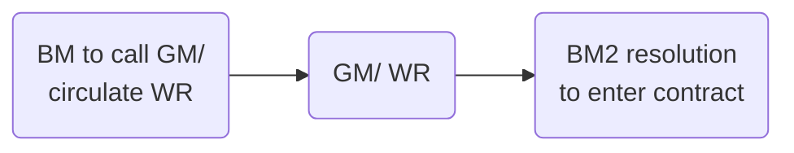

```toc
min_depth: 1
```

# Debt Financing

Since private companies are unable to offer shares to the public ([s 755 CA 2006](https://www.legislation.gov.uk/ukpga/2006/46/section/755)), many instead raise finance through debt finance.

Most companies have unrestricted power to borrow, but a company's articles must be checked for restrictions.

Debt finance can broadly be categorised as either:

- Loan facilities
- Debt securities

> [!note]
> Debt finance is primarily governed by contract law, rather than CA 2006. This means it can be more flexible than equity finance. 

## Authority

### Company Authority

- A company formed under the CA 2006 has unrestricted objects unless specifically restricted by the company’s articles of association (s 31(1)).
- MA do not place any restriction on borrowing.
- A company will therefore have an implied power to borrow money, unless expressly excluded by placing a restriction in the company’s articles ([[General Auction Estate and Monetary Co v Smith [1891] 3 Ch 432]]).

If there are any restrictions, amend the articles by special resolution.

A private company is able to borrow money from the moment its certificate of incorporation is issued. A private company which converts into a public company must, under s 761, first obtain its trading certificate.

### Directors' Authority

Directors must have authority to borrow money on behalf of the company. Stems from general authority (MA 3/ Table A art 70), but check any bespoke articles.

## Loan Facilities

> A loan facility is an agreement between a borrower and a lender which gives the borrower the right to borrow money on the terms set out in the agreement.

These include:

Loan facility | Description
---|---
Overdraft | On-demand facility, meaning the bank can call for all the money owed to it at any point in time and demand it is paid immediately. This is therefore unsuitable as a long-term borrowing facility.
Term loan | Loan of money for a fixed period of time, repayable on a certain date. Early repayment cannot be demanded unless the borrower breaches the agreement, and the lender will receive interest.
Revolving credit facility | Borrower has flexibility to borrow and repay. The borrower has flexibility to choose when it borrows and repays against a maximum aggregate amount of capital provided by the lender.

In each case, the agreement between the borrowing company and the lender is governed by contract law as clarified by the common law.

### Overdraft

- A form of temporary loan used to cover everyday business expenses when there is no other source of money available.
- If an overdraft has not been agreed in advance, the bank is not bound to meet any withdrawal not covered by funds in the account.
	- A company attempting to withdraw money in excess of the funds in its account may be regarded as making an **offer**, which the bank **accepts** by meeting the drawing = **contract**!
- “Uncommitted facility”, i.e., payable on demand.
	- ‘On demand’ means that the borrower is given enough time to effect the mechanics of payment, but not enough time to go and raise the money ([[Bank of Baroda v Panessar [1986] 3 All ER 751]]).
- Usually a fee is paid, and compound interest is charged on the overdrawn amount.
	- This practice will be implied in overdraft contracts unless the parties have agreed otherwise ([[Kitchen v HSBC Bank plc [2000] 1 All ER (Comm) 787]]).
- Can be relatively expensive, since borrowing is unsecured.

If security is taken over an existing overdraft account, the parties should be advised that money paid into an overdraft account (a credit) is treated as discharging the debt incurred first unless the parties have agreed otherwise – the rule in [[Clayton’s Case (1816) 1 Mer 529]] (i.e., first in, first out). Under IA ss 239 & 245, security may be held to be invalid if it is in respect of monies advanced to the borrower before the security was put in place.

### Term Loans

A company borrows a fixed amount of money for a specified period, at the end of which it must be repaid. Interest payable at regular intervals.

Term loans may be secured or unsecured (although they are usually secured), and they may be bilateral or syndicated.

The contract for a term loan may be called a ‘loan agreement’, or a ‘credit agreement’ or a ‘facility agreement’. The terms are used interchangeably.

A term loan may allow the borrowing company to draw down (i.e., take out) the loan all in one go, or to take it in instalments at, or by, agreed dates. The loan will usually be available to the borrower only for a short period (or periods if  
instalments are agreed) of time, known as the ‘availability period’, and it will not be available thereafter even if the company has not borrowed the full amount.

### Revolving Credit Facility

They are useful for companies whose income is not evenly distributed throughout the year. Interest is also payable at regular intervals.

Revolving credit facilities may be secured or unsecured (although they are usually secured), and they can be bilateral or syndicated. The contract for a revolving credit facility is usually called a ‘facility agreement’.

## Contractual Terms

### Payment to Borrower

Initial clauses of facility agreement will set out:

- Amount of loan
- Currency
- Type of loan
- Available periods.

Both a term loan and a revolving credit facility are ‘committed’ facilities.

> [!defn] Committed facility
> Once the loan agreement has been signed, the bank must provide the company with the loan monies when it requests them. A ‘commitment’ fee will be payable by the company.

In the unlikely event that the lender refused to lend in breach of the facility agreement, the company would be entitled to damages. If the company was able to obtain the same loan elsewhere then the damages would be nominal.

They may be regarded as damages for loss of expectation, to compensate the borrower for not being in the position that they should have been in ([[Robinson v Harman (1848) 1 Exch 850]]). Reasonableness is also considered in assessing damages.

### Repayment

The agreed payment schedule for the loan might provide for various repayment options:

| Repayment type    | Details                                                   |
| ----------------- | --------------------------------------------------------- |
| Bullet payment    | Repayment of the whole loan at the end of the term        |
| Amortisation      | Repayment in equal instalments over the term of the loan. |
| Balloon repayment | Repayment in unequal instalments, with the final instalment being the largest.                                                           |

Repayments for a revolving credit facility will be repaid at the end of each interest period, but can be reborrowed.

### Pre-payment

In a term loan, the company may in addition be granted an option in the facility agreement to repay earlier than the agreed repayment schedule. This is known as ‘pre-payment of the loan’.

It is usual to require that any prepayments are applied in reverse order to their maturity (the last scheduled repayment first).

### Interest Rates

A matter of agreement between the parties. There is no statutory control of the interest rate applicable to companies.

A floating rate commonly provides for the interest rate to be altered at specified intervals (e.g., every 3 months).

The interest rate consists of:

1. Mandatory costs to regulatory bodies
2. Interest rate at which banks borrow from one another (e.g., LIBOR)
3. Margin, which is the lender's profit.

#### Penalty Rate

> [!defn] Default interest
> An increased interest rate if scheduled payments are missed. 

Contract law allows the courts to strike down a provision which constitutes a penalty clause, as opposed to a clause for liquidated damages.

Default interest may not constitute a penalty, if the rate is such as only to compensate the lender for its additional funding costs and the increased credit risk of lending to a defaulting borrower ([[Jeancharm Ltd (t/a Beaver International) v Barnet Football Club Ltd [2003] EWCA Civ 58]]).

> [!action]
> Default interest clauses in a facility agreement must therefore be drafted very carefully, in accordance with current jurisprudence.

### Express Covenants

Commonly included covenants:

| Covenant                                    | Details                                                                                                 |
| ------------------------------------------- | ------------------------------------------------------------------------------------------------------- |
| Limitation of dividends                     | Dividends/ distributions must not exceed a specified percentage of net profits                          |
| Minimum capital requirements                | The company must ensure that current assets exceed current liabilities by a certain amount/ percentage. |
| No disposal of assets or change of business | Without lender's consent                                                                                |
| No further security over assets             | Without lender's consent. Called a 'negative pledge' clause                                             |
| Information on company's business           | Provide lender with annual accounts, interim financial statements etc.                                  |
| Limitation on future debt finance           | Company obliged to seek equity finance for new ventures.                                                                                                         |

These must be drafted carefully, to avoid the lender being found liable as a shadow director of the borrowing company. One way round this problem is for the lender in such a situation to make continuation of the loan conditional on certain steps being taken by the company. The company then has the choice of taking a new loan on those conditions, or looking elsewhere.

### Implied Covenants

Terms may be implied, e.g., bank's right to charge compound interest, implied by trade usage. The court’s power to imply terms is limited. A contractual term would be implied only if it were necessary to give efficacy to the contract ([[Thames Cruises Ltd v George Wheeler Launches Ltd [2003] EWHC 3093]]).

### Default

The facility agreement will contain ‘events of default’. If the company breaches any of these terms, the lender may terminate the agreement if it so wishes.

> [!example] Events of default
> - Failure to pay any sum due
> - Commencement of insolvency procedure
> - Breach of obligations under facility agreement 
> - Cross-default (defaulting on a loan to another lender). 

## Debt Securities

> IOU: In return for finance provided by an investor, the company issues a security acknowledging the investor's rights. At the maturity date of the security, the company pays the value of the security back to the holder.

The classic example is a bond: the issuer promises to pay the value of the bond to the holder of that bond at maturity. Interest is also paid, usually bi-annually. Bonds are traded on the capital market(s). The holder of the bond at maturity will receive the value of the bond back from the issuer.

Private companies can only issue bonds to targeted investors, and not to the public indiscriminately (s 755 CA 2006 again).

| Debt Security    | Details                                                                                                                     |
| ---------------- | --------------------------------------------------------------------------------------------------------------------------- |
| Commercial paper | Short-term debt securities which must be repaid ("matured") within 12 months of issue. Alternative to short-term borrowing. |
| Bonds            | Maturity of over a year. Usually admitted to LSE.                                                                           |
| EMTN programme   | Euro Medium-Term Note programme. More structured than offering individual bonds.                                            |

## Other Sources

There are other sources of debt finance.

| Source of debt finance | Details                                                                             |
| ---------------------- | ----------------------------------------------------------------------------------- |
| Trade credit           | Where a company arranges to pay suppliers a number of days after invoices received. |
| Debt factoring         | Where a company sells its trade debts to a collection agency. The agency pays the company a proportion of debts assigned. The agency now owns the debts, and seeks to get as much back as possible from the debtors.                                                                                    |

## Debentures

Two meanings of debenture:

1. Under [s 738 CA 2006](https://www.legislation.gov.uk/ukpga/2006/46/section/738) debenture covers any form of debt security issued by a company, including debenture stock, bonds and any other securities of a company, whether or not constituting a charge on the assets of the company.
2. Also refers to the name of the particular documents which creates a security (usually used in this sense by lawyers). This is a separate document from the loan agreement, setting out the details of the security (as opposed to the terms of the loan)

## Secured Debt

A key method of protection is for a lender to take security over the assets of the borrowing company.

Unsecured debts are governed by the equality (*pari passu*) principle, which means that the unsecured debts are all reduced pro rata if there are insufficient funds to pay all the company’s debts. Security allows the lender to avoid this principle. For this reason, most borrowing by a company will involve the company giving security over its assets.

## Debt Vs Equity

### Return on Investment

#### Equity

- Dividends
	- Only paid when the company is sufficiently profitable.
	- Directors usually have cmoplete discretion, even when the company is profitable.
- Capital growth

#### Debt

- Interest

### Getting Money Back

#### Equity

- Solvent companies may be wound up, and in this case shareholders will receive back the full amount of their investment and potentially a fraction of the surplus capital.
- On the sale of shares. Private companies not permitted to offer shares to a public.
- If company buys back its own shares
- On a successful unfair prejudice claim, if the other shareholders buy out the claimant.

#### Debt

- As agreed between the parties in the loan agreement or in the terms of the bond
- Usually either in one bullet repayment on maturity or amortising through instalments
- On the sale of the debt: bonds usually tradeable by the investor before maturity. Loans can in some circumstances by sold by the lender.

A shareholder has no guaranteed income from their investment, whereas a lender does. Shareholder's capital is not repaid unless the company is wound up. But a lender will agree with the company a date for repayment of the capital sum loaned.

If a shareholder wishes to sell their shares in order to realise their capital investment in the company, the transfer of their shares is governed by the articles, and in a private company these usually restrict the shareholder’s choice (e.g., MA 26(5)).

### Priority on Winding up

#### Equity

Shareholders paid back after everyone else. In practice, highly unlikely to receive full value of their investment if the company is insolvent when winding up.

Arrangements may be made between shareholders as to priority between themselves (preference shareholders > ordinary shareholders).

#### Debt

- Creditors paid before shareholders
- Creditors can improve priority by taking security for the debt: secured creditors have priority over unsecured creditors. Fixed charge creditors take priority over floating creditors.
- Creditors may contractually agree to give priority to some lenders and subordinate others.

### Control

#### Equity

- Shareholders may have voting rights
- Existence and extent will depend on the rights granted upon the issue of shares
- Think about powers if you own >50% to do

#### Debt

- Lenders require the borrower to give undertakings: promises to do, or not do, certain things in the running of business (such as disposing of assets without the lender's consent)
- Security may also give the lender control over the assets which are subject to the security (e.g., like with a fixed charge)

### Tax Treatment

The payment of a dividend is not a deductible expense for the company. Payment of debenture interest, as it is incurred for the purposes of the trade, is a normal  
trading expense of the company, and so is deductible by it in computing trading profit before its corporation tax is assessed.

### Other Factors

#### Equity

- New shareholders must be found in order for a share issue to succeed

#### Debt

- Banks may not be willing to lend on attractive terms, or if the company is too highly geared. Gearing is the ratio of debt to equity.
- Existing loan agreements would need to be checked for undertakings which would prevent the borrower from borrowing more/ granting security
- Interest is a deductible expense for tax purposes, which makes debt more attractive.
- Involvement of investor
	- Shareholder has a degree of influence over how the company is run.
- Repayment of capital
	- Loan capital must be repaid at some date in the future, possibly on demand
- Cost
	- Cost of debt finance is the interest rate charged by the lender to the borrowing company.
	- Cost of equity finance are the likely returns to the new shareholder, including dividends, capital appreciation and share buybacks. These returns are the cost to existing shareholders.
- Existing restrictions
	- May be restrictions in the articles/ existing facilities agreements against the taking out of new loans or debt.

# Equity Financing

## Maintenance of Share Capital

Key principle of company law. Capital must generally be maintained, as it is the fund to which the **creditors** look for payment of debts owed to them. In other words, paid-up share capital must not be returned to its shareholders, and their liability in respect of capital not paid up on shares must not be reduced.

The doctrine of capital maintenance states that the company must maintain and not reduce its share capital except in certain very limited circumstances. The share capital therefore is a permanent fund available to creditors.

The doctrine was developed from [[Trevor v Whitworth (1887) 12 App Cases 409]], with the goal of protecting creditors. Creditor perspective: the share capital of a company gives an indication of its creditworthiness. Unsecured creditors will seek to claim payment from the company's capital as well as its unsecured assets if the company is wound up.

Capital can still be lost as a result of poor business decisions or market conditions, but this is a legitimate risk to both shareholders and creditors.

Many companies, large and small, have very limited share capital: so the doctrine doesn't really protect creditors much in this case.

> [!important] Doctrine of capital maintenance ([s 658 CA 2006](https://www.legislation.gov.uk/ukpga/2006/46/section/658))
> 
>  1. A limited company must not acquire its own shares, whether by purchase, subscription or otherwise, except in accordance with the provisions of this Part.
>  2. If a company purports to act in contravention of this section—
> (a) an offence is committed by (i) the company, and (ii) every officer of the company who is in default, and
> (b) the purported acquisition is void.
> 

[s 659 CA 2006](https://www.legislation.gov.uk/ukpga/2006/46/section/659) provides a set of limited exceptions.

### Impact of Doctrine

The doctrine has an impact on a number of transactions:

- The granting of dividends/ distributions
- Reduction of share capital
- Purchase and redemption of own shares

The doctrine of capital maintenance limits the funds from which the company may pay dividends to its shareholders, since the payment of a dividend will reduce the company's assets available to **creditors**.

Consequences:

- Company must not generally purchase its own shares (s 658 CA 2006)
- Public company may not generally give [[Financial assistance]] to anyone for the purposes of buying company shares
- Dividends may not be paid out of capital
- In the case of a serious loss of capital, a GM must be called to discuss the problem
- A subsidiary may not be a member of its own holding company.
- Any allotment/ transfer of shares in a holding company to its subsidiary is void.

A company cannot generally reduce share capital by exchanging shareholders' shares for valuable consideration.

Exceptions:

- Reduce share capital with consent of court (ss 641-648)
- Share buyback (s 690 A 2006) or redemption (ss 684-689)
- Court order to buy out a minority in an unfair prejudice claim (s 994) or in the conversion of a public to private company.
- Return capital to shareholders in a winding up.

## Issuing Shares

In return for issuing shares, the company will receive cash used for the company business.

The board may be required to obtain resolution from the shareholders before they resolve to allot the shares:

- s 549: directors' need for authority to allot shares
- ss 561 & 565: statutory pre-emption rights.

Shares are allotted to someone (i.e., allocated) when that person has the unconditional right for their name to be entered onto the company’s register of members (CA 2006, s 558). They may then be said to have been issued by the company when the name of the shareholder has actually been entered on the company’s register of members.

### Share Capital

> [!defn]
> The amount of money whcih a company raises by issuing shares.

#### Pre-CA 2006

Companies were required to have an 'authorised share capital'; a ceiling on the number of shares they could allot.

If such a provision exists (e.g., for a pre-CA 2006 company), the articles may need to be amended. But the amendment is by ordinary resolution.

#### CA 2006

A company is simply required to make a statement of capital and initial shareholdings when the company was incorporated on Form IN01. A new statement of capital must be submitted whenever more shares are issued.

Shareholder approval will not be required for a private company with only one class of shares, under the simplified procedure (ss 549-551).

If a CA 2006 company has included a restriction on the number of shares it can issue (super rare), it would have to amend articles by special resolution to change this.

### Directors' Power to Issue Shares

#### Private Company with One Class of Share

Directors of a private company automatically have authority to allot its shares, provided the company has only one class of shares and there is nothing to the contrary in the articles (s 550). If a pre-1 October 2009 company wishes to make use of the power given  
under s 550, it has to pass an ordinary resolution of the shareholders in order to do so.

#### Other Companies

The directors can issue shares in the company only if they have authority to do so. This authority must be given specifically, either in the articles (by a special article), or by ordinary resolution of the shareholders at a GM or by written resolution (CA 2006, ss 549–551).

> [!important]
> If an ordinary resolution is needed, it must be filed with the Registrar of Companies (s 551(9)). 

The authority must state:

- Number of shares directors are authorised to allot
- Time limit on authority (generally $\leq 5$ years - s 551(3))

Authority may be revoked by ordinary resolution at any time

- This is even if the authority was originally given by the articles (which would require a special resolution to amend).
- Would require filing with Registrar of Companies (s 551(9))

Under s 555 of the CA 2006, a return of allotments must be filed with Companies House within one month, as must a modified statement of capital (s 555(3)). Both of these are contained on Form SH01.

### Statutory Pre-emption Rights

Shareholders have rights of first refusal when the company issues new shares in most circumstances ([s 561 CA 2006](https://www.legislation.gov.uk/ukpga/2006/46/section/561)). This only applies where the shares to be issued are [[Equity securities]]. So it does not apply to preference shares that have capped participating rights as to both dividends and capital.

#### Exceptions and Exclusions

The right to pre-emption does not apply where the new shares to be issued are:

- Bonus shares;
- Shares issued under an employee share scheme
- Shares issued for non-cash consideration ([s 564 CA 2006](https://www.legislation.gov.uk/ukpga/2006/46/section/564)).

A company may exclude the right of pre-emption by specific provision in the articles ([s 567-568 CA 2006](https://www.legislation.gov.uk/ukpga/2006/46/section/567)). However, this is not common.

More commonly, the pre-emption rights are disapplied by a special resolution of the shareholders:

- Directors of a private limited company with only one class of shares may be given power by the articles or by a special resolution, to allot equity securities of that class as if s 561 (existing shareholders' right of pre-emption) did not apply, or applied with such modifications as the directors may determine ([s 569 CA 2006](https://www.legislation.gov.uk/ukpga/2006/46/section/569)).
- Pre-emption rights may also be disapplied by special resolution under [s 570 CA 2006](https://www.legislation.gov.uk/ukpga/2006/46/section/570) where the directors of the company are acting under a general authority ([s 551 CA 2006](https://www.legislation.gov.uk/ukpga/2006/46/section/551)) to issue shares. In this situation, pre-emption rights are disapplied for all shares issued in accordance with this general authority.
- [s 571 CA 2006](https://www.legislation.gov.uk/ukpga/2006/46/section/571): shareholders may pass a special resolution to disapply pre-emption rights in relation to a particular share allotment only.

#### Pre-emption Rights on Transfer of Shares

In general, there are no rights of pre-emption for existing shareholders where shareholders transfer shares.

But a private company may provide for pre-emption rights on transfer of shares in either the articles or a shareholder agreement. This is common in small private companies.

But if the private company has a corporate shareholder, the transfer of shares by this corporate shareholder will not trigger pre-emption rights provisions ([[Re Coroin [2011] EWHC 3466]]).

> [!statute] s 561 CA 2006
> (1) A company must not allot equity securities to a person on any terms unless—
> - (a) it has made an offer to each person who holds ordinary shares in the company to allot to him on the same or more favourable terms a proportion of those securities that is as nearly as practicable equal to the proportion in nominal value held by him of the ordinary share capital of the company, and
> - (b) the period during which any such offer may be accepted has expired or the company has received notice of the acceptance or refusal of every offer so made.
> 
> (2) Securities that a company has offered to allot to a holder of ordinary shares may be allotted to him, or anyone in whose favour he has renounced his right to their allotment, without contravening subsection (1)(b).
> 
> (4) Shares held by the company as treasury shares are disregarded for the purposes of this section, so that—
> - (a) the company is not treated as a person who holds ordinary shares, and
> - (b) the shares are not treated as forming part of the ordinary share capital of the company.
> 
> (5) This section is subject to—
> - (a) sections 564 to (exceptions to pre-emption right),
> - (b) sections 567 and 568 (exclusion of rights of pre-emption),
> - (c) sections 569 to 573 (disapplication of pre-emption rights), and
> - (d) section 576 (saving for certain older pre-emption procedures).

The number that each current shareholder is offered is dependent upon the percentage of the shares they currently hold.

The offer to the existing shareholders must remain open for at least 14 days, and only if the present shareholders decline to take up the shares can they be offered elsewhere.

Where shares are issued wholly or partly for non-cash consideration (say, a piece of land),  
s 561 of the CA 2006 has no application (s 565).

### Private Company

Under s 569 of the CA 2006, a private company with only one class of shares may disapply the statutory pre-emption rights by a special resolution of the shareholders, or by a provision in the articles (not included in MA). The advantage to this section is that the disapplication may be indefinite.

Other methods of disapplication:

| Statute | Details of method                                                                                                                                      |
| ------- | ------------------------------------------------------------------------------------------------------------------------------------------------------ |
| s 567   | Include a special article generally/ in relation to particular allotments.                                                                             |
| s 568   | Pre-emption provisions in articles will override the statutory provisions in s 561 (though notice requirements still apply unless expressly excluded). |
| s 570   | Special resolution of shareholders/ provision in articles where directors are authorised generally to allot shares under s 551.                       |
| s 571   | Special resolution of the shareholders, to disapply for a specified allotment. Directors must also send out a written resolution of reasons for the proposal, consideration which the company will receive, and justification.                                                                                                                                                        |

### Public Company

Under s 568 of the CA 2006, pre-emption provisions in the articles will override the statutory provisions in s 561 of the CA 2006.

A public company may also disapply the statutory pre-emption rights under s 561 by a special resolution of the shareholders, or by a provision in the articles.

A public company may alternatively disapply the statutory pre-emption rights under s 561 by a special resolution of the shareholders (s 571) for a specified allotment of shares.

### Procedure

Two separate procedures or allotting shares in the company.

#### 1. Shareholder Approval Needed

- Call a board meeting
- Directors check:
	- Any restrictions in the articles
	- Whether they have authority to allot shares
	- Whether pre-emption rights apply
- If articles need to be amended to remove a restriction, follow BM-GM-BM procedure. Short notice procedure may be used if consented to.
- At BM2, directors resolve to issue shares to those who have made written application for them. The offer to buy must come from prospective shareholders (private companies can't offer shares to the public).
- Admin
	- Seal share certificates if there is a seal.
	- Enter shareholder names into register of members.
	- Instruct secretary to enter the name of new shareholders on the register of members.
	- Send Form SH01 to Registrar of Companies

#### Shareholder Approval Not Needed

- Board meeting called
- Directors check:
	- Whether they have authority to allot the shares
	- Whether they are obliged to offer shares to current shareholders.
- If no to both, the directors will only need to pass a board resolution to allot the shares.
- Admin as above.

#### Payment for Shares

Payment as consideration for shares must be in cash – non-cash consideration requires board approval.

#### Partly-paid Shares

Directors may agree to issue shares partly paid, meaning the full price of the shares need not be paid immediately.

#### Issue at a Premium

The nominal value of each share is the par value. If shares are sold at a premium, the excess amount of consideration paid above the nominal value of the shares must be recorded in a separate share premium account (CA 2006, s 610).

Section 610 specifies the permitted uses for the share premium account. For example, paying up bonus shares will still be permitted.

#### Issue at a Discount

FORBIDDEN. Shares may not be issued for less than their nominal value (CA 2006, s 580).

> [!statute] s 580
> (1) A company's shares must not be allotted at a discount.
> 
> (2) If shares are allotted in contravention of this section, the allottee is liable to pay the company an amount equal to the amount of the discount, with interest at the appropriate rate.

#### Re-denomination of Share Capital

Under ss 622–628 of the CA 2006, a company is able to redenominate its shares into a different currency by passing an ordinary resolution.

The company's share capital may be reduced by $\leq 10\%$ by special resolution. The amount of the reduction is transferred to a ‘redenomination reserve’, to be used for paying bonus shares.

![[allotment-shares.png]]

## Classes of Shares

[s 630 CA 2006](https://www.legislation.gov.uk/ukpga/2006/46/section/629):

> Shares are of one class if the rights attached to them are in all respects uniform.

[MA 22](https://www.gov.uk/government/publications/model-articles-for-private-companies-limited-by-shares/model-articles-for-private-companies-limited-by-shares#differentclasses) gives companies the power to issue different classes of share.

==The label attached to a share is not determinative.== The rights attached to a class of shares are determined in the company's articles.

### Classes

Common types:

- Ordinary shares
- Redeemable shares
- Preference shares
- Non-voting shares
- Employees' shares
- Cumulative shares
- Convertible shares
- Deferred shares

#### Ordinary Shares

These are the default position and most common. Carry a right to vote in general meetings, a right to receive a dividend if one is declared by the directors, and a right to receive a share of the capital when a company is wound up.

Defined in [s 560(1) CA 2006](https://www.legislation.gov.uk/ukpga/2006/46/section/560) as

> shares other than shares that as respects dividends and capital carry a right to participate only up to a specified amount in a distribution.

The negative definition illustrates that ordinary shares are the default position and are shares that have an unlimited right to participate in dividends and surplus capital when a company is wound up.

#### Preference Shares

Shares usually entitled to have dividends paid at a predetermined rate, in priority to any dividend paid on ordinary shares.

Dividends can only be paid where the company has distributable profits and a dividend is declared.

Preference shares often have a right to priority over the ordinary shareholders when capital is returned to the members in a winding up. Rights of preference shareholders may be **cumulative** (arrears of preference dividends not declared in earlier years must be paid before ordinary shareholders are paid) or **non-cumulative** (only current year's dividend payable).

May be **participating**, meaning shareholders can also participate in a dividend or capital on a winding up alongside ordinary shareholders. This means they receive both their fixed preferential dividend or a fraction of capital, plus a fraction of the general dividend/ capital in accordance with their shareholding.

#### Deferred Shares

Shares normally only have a right to a dividend and/or return of capital after the claims of the preference shareholders and ordinary shareholders. Usually issued to the founders of a company, not very common.

#### Redeemable Shares

Temporary shares, which may be bought back by the company at a future date. Governed by Chapter 3 [s 684-689 CA 2006](https://www.legislation.gov.uk/ukpga/2006/46/section/684).

#### Non-voting Shares

Issued where company seeks to restrict control of the company

#### Convertible Shares

May be converted to a different type of share in the issuing company, according to a pre-arranged formula set out in the articles.

#### Employees' Shares

Employees' share schemes can have tax advantages. Usually ordinary shares with extra restrictions (e.g., on transfer).

> [!example]
> 
> **PGDL Limited** has **participating preference shares** in issue which carry a right to receive a fixed preferential dividend of 5% of the par value of the shares per annum. The shares have a par value of £1 each.
> 
> Assuming that a dividend has been declared, the preference shareholders would be entitled to receive a dividend of 5p per share per annum before the ordinary shareholders receive any dividend. They would then also be entitled to a fraction of the remaining general dividend alongside the ordinary shareholders.
> 
> **SQE Limited** has **non-participating preference shares** in issue which carry a right to receive a fixed preferential dividend of 5% of the total subscription price per share per annum. The shares have a par value of £1 each but were subscribed for at a price of £2 per share.
> 
> Assuming that a dividend has been declared, the preference shareholders would be entitled to receive a dividend of 10p per share per annum before the ordinary shareholders receive any dividend. They would not be entitled to any further dividend.

### Variation of Class Rights

Baseline presumption: all shares have equal rights, unless there is an express provision in the articles to the contrary ([[Birch v Cropper (1889) 14 App Cas 525]])

[s 630 CA 2006](https://www.legislation.gov.uk/ukpga/2006/46/section/630): class rights can only be varied

1. In accordance with the relevant provisions in the company's articles,
2. Or if there is no provision in the articles:
	- Where 75% in value of the shares of the affected class consent in writing,
	- Or a special resolution is passed at a separate meeting of the holders of the affected class of shares.

Companies can **entrench** class rights in their articles ([s 22 CA 2006](https://www.legislation.gov.uk/ukpga/2006/46/section/22)), and in this case the protection cannot be circumvented by changing the rights attached to shares under s 630.

Shareholders voting at a class meeting to vary rights must vote with the dominant purpose of benefitting the class as a whole, or the variation may be invalid ([[British America Nickel Corpn Ltd v O’Brien [1927] AC 369 (PC)]]).

#### Exercise of Rights

Statutory provisions under s 630 apply only if the shareholders have “class rights” which are to be varied. Variations affecting the exercise of the rights, rather than the rights themselves, are not subject to s 630.

Issuing more shares of a particular class doesn't count as 'varying' the class rights, even through it may dilute the amount of dividend previously paid. The attitude is that the substantive legal rights of the class have not been altered, only the way in which these rights have been exercised.

Key case | Ratio
--- | ---
[[White v Bristol Aeroplane Co [1953] Ch 65 (Court of Appeal)]] | Issuing more shares is not varying class rights
[[House of Fraser plc v ACGE Investments Ltd [1987] AC 387]] | Cancelling a class of preference shares was not varying class rights, since this was consistent with the terms of issue of the shares.
[[Greenhalgh v Arderne Cinemas Ltd [1946] 1 All ER 512 (Court of Appeal)]] | Changing the rights of one class does not affect the class rights of another class.

#### Right to Object

[s 633 CA 2006](https://www.legislation.gov.uk/ukpga/2006/46/section/663): dissenting members of a class of shares have a right to challenge a variation.

The conditions for this are:

1. Only shareholders holding $\geq 15\%$ of the issued shares of that class may challenge a variation, and
2. The variation must be challenged in court within 21 days of the date on which consent was given, or the resolution was passed, to vary the class rights.

Common law now indicates that a vote on a resolution to vary class rights must be exercised for a purpose/ dominant purpose of benefitting the class as a whole ([[British America Nickel Corpn Ltd v O’Brien [1927] AC 369]]) so this may be grounds for a challenge.

Two different classes of ordinary shares may carry different voting and dividend rights. In any one company, the rights attaching to a share are dependent on the articles of that  
company.

The different classes of shares and the rights attaching to them must be included on the  
statement of capital which is lodged at Companies House when the company is formed (as part of Form IN01) and whenever the number of issued shares changes.

### Ordinary Shares

These carry the primary voting rights of the company, the right to a dividend if declared, and rights to participate in a surplus in a winding up.

If no differences between shares are expressed, it is assumed that all shares have the same rights.

A company may, at its option, attach special rights to different shares, for example as regards dividends, return of capital or voting (or less often the right to appoint a director).

Ordinary shares without voting rights are often called “A” ordinary shares.

### Preference Shares

A preference share is any share having priority over the ordinary shares. The priority might be in relation to capital or dividends, or (usually) both. There are no other implied differences between the two.

The preferential dividend may be cumulative, or it may be payable only out of the profits of  
each year. The dividend will usually be fixed (expressed as a fixed percentage of the par value of the share).

Do not usually carry a vote.

#### Advantages

- Entitled to first profits of the company at a fixed rate
- Dividend usually paid quarterly
- Usually redeemable (so the investor may exchange the shares for cash at some point in the future).

#### Types

4 types of preference shares:

1. Cumulative
	- Preference shareholder must be paid missing dividends as well as the current dividend, if a dividend is missed
	- Ranks before payment of dividends to ordinary shareholders.
2. Non-cumulative
3. Participating
	- Get to “double dip” - further right to participate in profits/ assets, in addition to the fixed preference rights.
4. Convertible.
	- May be exchanged for ordinary shares at a specified price and after a specified date.

### Non-voting Shares

Uncommon in private companies.

### Redeemable Shares

> [!statute] s 684 - Power of limited company to issue redeemable shares
> 
> (1) A limited company having a share capital may issue shares that are to be redeemed or are liable to be redeemed at the option of the company or the shareholder (“redeemable shares”), subject to the following provisions.
> 
> (2) The articles of a private limited company may exclude or restrict the issue of redeemable shares.
> 
> (3) A public limited company may only issue redeemable shares if it is authorised to do so by its articles.
> 
> (4) No redeemable shares may be issued at a time when there are no issued shares of the company that are not redeemable.

#### Articles

There is nothing allowing issue of redeemable shares in MA, so a special article would need to be inserted. The articles must also provide for the terms and manner of redemption.

The directors of a private company can decide the conditions of redemption if they are authorised by an **ordinary resolution** of the members or by the articles (CA 2006, s 685(1)). Generally, redeemable shares have to be redeemed from distributable profits, but private companies may redeem out of capital if so permitted by their articles (CA 2006, s 687), upon the passing of a special resolution and the directors making a declaration of solvency.

#### Redemption

**Redeemed** shares are treated as being cancelled. A notice must be sent to the Registrar of Companies within one month of the shares being redeemed, along with an amended statement of capital (CA 2006, ss 688 and 689)–both included in **Form SH02**.

## Offering Shares to the Public

Private companies are in general prohibited from offering their shares to the investing public at large (FSMA 2000, s 75(3)).

Offering shares to the public in contravention of the prohibition against doing so is not a criminal offence, but the court may order re-registration of the private company as a public company, or may make a remedial order which could include repurchase of the shares by the company (CA 2006, ss 757–759).

## Dividends

A dividend is a “distribution” under the definition in [s 829(1) CA 2006](https://www.legislation.gov.uk/ukpga/2006/46/section/829), which states that “distribution” means every description of distribution of a company's assets to its members, whether in cash or otherwise, subject to the exceptions set out in s 829(2).

[s 830(1) CA 2006](https://www.legislation.gov.uk/ukpga/2006/46/section/830): a company may pay dividends only out of “**distributable profits**”. These are defined (s 830(2)) as the company's

> “accumulated, realised profits, so far as not previously utilised by distribution or capitalisation, less its accumulated, realised losses, so far as not previously written off in a reduction or reorganisation of capital duly made.”

### Relevant Accounts

[s 836 CA 2006](https://www.legislation.gov.uk/ukpga/2006/46/section/836) sets out the 'relevant accounts' for the purposes of ascertaining whether a company has sufficient distributable profits for the payment of dividends.

Most recent annual accounts must usually be referred to. In some circumstances, specially prepared interim accounts may be appropriate, e.g., when a company has realised a substantial profit since the annual accounts were prepared.

For a new company without annual accounts, initial accounts may be prepared to justify paying a dividend.

### Types of Dividend

Type of dividend | Description
---|---
Dividend | Involves the distribution of profits by way of cash to shareholders.
Scrip dividend | Where a company gives the existing shareholders further shares in the company, rather than cash.
Dividend in specie | Involves the company giving shareholders value by way of assets.

When recommending a dividend, the directors must have regard to all their duties, particularly the duty to promote the success of the company ([[s 172 CA 2006]]).

### Final Dividends

MA 30(2): the directors decide whether it is appropriate to pay a dividend to shareholders. The shareholders in a GM will actually declare the dividend under MA 30(1). The shareholders cannot  
vote to pay themselves more than the directors have recommended, although they could decide that a smaller amount was more appropriate.

Articles may provide that final dividends can be paid without any shareholder involvement.

### Interim Dividend

- Usually of a lesser amount than the final dividend
- Recommended by the **directors alone**

### Disguised Distributions

The courts have found that there has been a “disguised” return of capital to shareholders, breaching the capital maintenance principle, in some less obvious cases.

- [[Re Halt Garage (1964) Ltd [1982] 3 All ER 1016, ChD]]: directors salary
- [[Aveling Barford Ltd v Perion Ltd [1989] BCLC 626]]: intra-group transfers

### Unlawful Distributions

When an unlawful distribution is made, both the directors who authorised the distribution and the shareholders receiving it may be liable.

> [!warning]
> If a dividend is paid when there are insufficient profits available for the purpose, the directors who authorised the payment are jointly and severally liable to the company for the full amount.

- Directors who knew or ought to have known that the payment amounted to a breach are liable to personally repay the dividends ([[Bairstow v Queens Moat Houses plc [2001] EWCA Civ 712]]).
- [s 847 CA 2006](https://www.legislation.gov.uk/ukpga/2006/46/section/847) provides that where a distribution is made in contravention of the requirements of the Act, and if at the time of distribution the member knows or has reasonable grounds for believing the distribution to have been unlawful, they are liable to repay it to the company ([[It's a Wrap (UK) Ltd v Gula [2006] EWCA Civ 544]]).

### Steps Board Must Take

Before issuing a dividend, the board must consider:

1. Directors' duties: if making the distribution is in accordance with duties [[s 171 CA 2006]] and [[s 172 CA 2006]].
2. Restrictions on distributions: consider whether proposed transaction is either a dividend or disguised distribution ([[Aveling Barford Ltd v Perion Ltd [1989] BCLC 626]]).
3. Are there any distributable profits? Check relevant accounts
4. Amount of distribution: does the distributable profit cover the whole amount of distribution.

## Sources of Finance

- Shareholders and directors
	- Debt and equity finance
	- Finance from family and friends
- Banks
	- Overdraft, term loans, revolving credit facilities
- Venture capital
	- Can be equity/ debt/ both
	- VC may require management changes, including a seat at the board for its representatives.

## Filing

![[filing-requirements.png]]

## Share Buybacks

Shareholders selling shares in a private limited company have two options:

1. Find a third-party to buy them
2. Ask the company to buy the shares back from the shareholder.
	- The shares would immediately become worthless to the company, since 706(b)(i) CA 2006 provides that the bought-back shares are usually treated as cancelled.
	- directors should consider carefully whether the proposed buy-back of shares makes commercial sense for the company

### Commercial Considerations

Reasons for buying back shares:

- A director refuses to resign unless someone buys their shares. The other directors allow the company to buy the director's shares, considering a buyback a worthwhile price to pay in return for the person cutting ties with the company.
- In a family-run business, where a family member wants to extract their investment from the business. The board should carefully consider s 172 duties.

Buybacks are common in publicly traded companies to:

1. Return surplus cash to shareholders,
2. Reduce the number of shares in issue to increase the earnings per share
3. Increase the value of existing shares.

### Legal Considerations

The profits of a company belong to the company (separate legal personality). The usual way for a shareholder to ultimately receive the company's accumulated profits is:

1. During the company's lifetime when it pays a dividend
2. During the winding up of the company while it is still solvent.

A buyback out of existing share capital may also increase the company's changes of becoming insolvent. The principle of maintenance of share capital is designed to safeguard against this.

> [!note]
> There is a different procedure for share buybacks on a stock market, not considered here. 

### Buyback Out of Profit/ Fresh Issue of Shares

A company may buy back its own shares from its shareholders out of distributable profits or the proceeds of a fresh issue of shares (CA 2006, s 692(2)), provided:

1. The articles of the company must not forbid this (s 690(1));
2. the shares must be fully paid (s 691(1)); and
3. when the shares are bought by the company, it must pay for them at the time of purchase.

#### Voting

A company buying back shareholder shares enters a contract with the shareholder. This must be approved by ordinary resolution (s 694(2) CA 2006):

- If the ordinary resolution at the GM would not have passed without the votes relating to shares being bought back, the ordinary resolution will be ineffective (CA 2006, s 695(3)).
- Alternatively, a shareholder having their shares bought back is excluded from participating in a written resolution (CA 2006, s 695(2)).

#### Inspection

A copy of the contract/ summary of it must be available for inspection for $\geq 15$ days before the GM and at the GM (or be sent with the proposed written resolution, or before it is circulated) (CA 2006, s 696(2)).



#### Administration

- Pay for shares
- Send to Companies House within 28 days (ss 707 & 708)
	- Form SH03 (return of purchase of own shares)
	- Form SH06 (Notice of Cancellation of Shares)
	- Details of shares bought back
- Inspection
	- Copy of the contract/ summary of it must be available for inspection for 10 years after share purchase at the company's registered office/ SAIL.

#### Effects

1. Issued share capital of the company is decreased
2. Voting control between shareholders may have been altered
3. A capital redemption reserve will need to be created
4. Share premium account is reduced, if a premium paid on buyback/ redemption financed out of a fresh issue of shares.

![[buyback-not-from-capital.png]]

### Buyback Out of Capital

> [!danger]
> A public company is not allowed to buy back out of capital.

Some of the company's existing share capital may be used to fund the buyback, subject to anything in the articles to the contrary (s 709) provided that additional conditions are satisfied (s 713).

#### Requirements

1. Shares must be fully paid (s 691(1))
2. Company must pay for the shares at the time of purchase (s 691(2))
3. Directors must make a statement of solvency, stating that the company is solvent and will remain so for the next 12 months (s 714) after the buyback.
	1. If the company is wound up within one year of their statement and proves to be insolvent, both the seller of the shares and the directors of the company may be required to contribute to the financial losses of the company (IA 1986, s 76).
	2. Criminal sanctions for making such a statement without reasonable grounds (CA 2006, s 715).
	3. Must be made $\geq 1$ week before GM (s 716(2)).

> [!defn] Permissible capital payment
> The amount which of capital which may be used for share buybacks. This is limited (ss 710-712). 

#### Procedure

- Auditors must produce a report for directors that PCP is in order, and they do not know or anything that would make the statement unreasonable (s 714(6)).
- BM1
- Buy-back contract must be approved by **ordinary resolution** (s 694(2)) – GM or WR
- A **special resolution** (GM/ WR) must be passed by the shareholders to approve the payment out of capital (CA 2006, s 716(1)).

| Procedure | Restriction                                                                                                                                               | Statute            |
| --------- | --------------------------------------------------------------------------------------------------------------------------------------------------------- | ------------------ |
| GM        | If the ordinary and special resolutions would not have passed without the votes relating to shares being bought back, the resolutions will be ineffective | ss 695(3) & 717(3) |
| WR        | Shareholders having their shares bought back are excluded from participating in the WR                                                                    | ss 695(2) & 717(2) |

- Copy of contract/ summary must be available for inspection $\geq 15$ days before GM & at GM (or circulated with/ before WR) (s 696(2)).
- Auditors' report and directors' statement must be made available at the GM only, or sent with the proposed written resolution, or before it was circulated. (s 718(2)).
- Notice placed in London Gazette, and also in either a national newspaper/ in a written notice to every creditor (s 719) within a week of the resolutions being passed,
	- Allows for dissenting shareholders/ any creditor to make an application to court under s 721 to cancel the buy-back out of capital.
- On/ before the day on which the first of the notices is published, a copy of the auditors' report and directors' statement must be filed at Companies House (s 719(4)).
- Report and statement made available at the registered office for 5 weeks after the special resolution (s 720(1))
- BM2 to enter into the contract to buy-back shares.
- Buyback must be made $5 \leq T \leq 7$ weeks after the date of the special resolution to approve the buy-back out of capital (s 723(1)).

#### Administration

- Pay for the shares
- Send a copy of the special resolution to Companies House within **15 days** (ss 29 & 30)
- Send Form SH03 (Return of Purchase of Own Shares) and Form SH06 (Notice of Cancellation of Shares) with details of shares bought back within **28 days** (ss 707 & 708).
- Copy of contract/ summary available for inspection for **10 years** after the purchase at registered office/ SAIL.
- Register of members altered
- Any share certificates dealt with.

![[buyback-capital-1.png]]  
![[buyback-capital-2.png]]

### Buyback of a Small Amount

> [!statute] s 692(1ZA)
> If authorised to do so by its articles, a private limited company may purchase its own shares out of capital otherwise than in accordance with Chapter 5, up to an aggregate purchase price in a financial year of the lower of—
> - (a) £15,000, or
> - (b) the nominal value of 5% of its fully paid share capital as at the beginning of the financial year.

Recall that “nominal value” excludes any premium on the shares. There are no special procedures to follow for such buybacks; just need an ordinary resolution to approve the buy-back contract.

### Employees' Share Scheme

> [!statute] s 720A(1) - Reduced requirements for payment out of capital for purchase of own shares for the purposes of or pursuant to an employees' share scheme
> Section 713(1) does not apply to the purchase out of capital by a private company of its own shares for the purposes of or pursuant to an employees' share scheme when approved by special resolution supported by a solvency statement.

### Reduction of Capital

ss 641-644 allow a private limited company to re-classify some of its existing share capital as distributable profits (which could then be used to buy-back shares out of profit).

#### Conditions and Procedure

- Articles must not prohibit the reduction of share capital (s 641(6))
- Directors must make a solvency statement (s 642(1)) stating that the company is solvent and will remain solvent even with the reduction of capital for the next 12 months (s 643(1)).
	- Criminal sanctions for making such a statement without having reasonable grounds (s 643(4))
	- Liability for breach of s 172 & 174
	- Must be made $\leq 15$ days before GM (s 642(1)(a)) and available to the shareholders at the GM (s 642(3)) or sent with the proposed WR, or before it is circulated (s 642(2)).
- Shareholders approve reduction of capital by passing a special resolution (GM/ WR) (s 641(1)(a)).

#### Administration

BM2:

- Pay for shares
- Sign statement of compliance that the 15-day time period was met (s 644(5))
- Send copy of special resolution to Companies House within 15 days (ss 29 & 30)
- Send Form SH19 and the solvency statement within 15 days (s 644(1))
- Register of members/ PSC register altered
- Share certificates dealt with.

> [!important]
> Reduction of share capital will take place on registration of these documents (s 644(4) and 641(5)). 

### Shares Bought Back

For a buyback under distributable profits only, the shares can either be (s 724):

- Cancelled
	- Will no longer exist and reduce the company's issued share capital
- Held in treasury
	- Kept in reserve
	- Can be resold at a later date to other shareholders.

For a buyback out of capital, buyback of a small or buyback financed by the fresh issue of shares, shares must be cancelled (s 706(b)).

## Transfer of Shares

### Procedure

- Transferor completes and signs a stock transfer form, which is given to the transferee (ss 770-772).
- Stamp duty
	- If the shares are being sold for more than £1,000, the buyer must pay stamp duty (currently charged at 0.5% rounded up to the nearest £5) on the stock transfer form.
	- If the shares are a gift, no stamp duty is payable.
- Transferee sends share certificate and stock transfer form to the company.
- The company should send the new shareholder a new share certificate in their name within **2 months**, and should also ensure that their name is entered on the register of members within the same time period (s 771).
- Form CS01: notification of the change in composition in membership of the company.

> [!action]
> 1. Give share certificate and transfer form to transferee.
> 2. Buyer pays stamp duty (no stamp duty on a gift).
> 3. Apply to company for registration.
> 4. Board consider whether to refuse registration (if the articles give them this power).
> 5. Board resolve to issue and seal new share certificate (if company has seal).
> 6. Update register of members.

### Restrictions on Transfer

- Under MA 26, directors have an absolute discretion in this matter and may refuse to place a name on the register of members.
	- Court will not interfere with the discretion unless transferees can show that the directors did not act in good faith.
	- If the discretion is exercised correctly, directors hold the shares on trust for the transferee.
	- Directors must supply the buyer with notice within 2 months
	- Give reasons (s 771(1)(b))
	- Provide such further information as the transferee reasonably requests (s 771(2)).
- Articles may impose further restrictions
- Consider pre-emption rights.
- Unless they are given power under the articles, the directors cannot refuse to place a new shareholder’s name on the register of members.
	- If they wrongly refuse to do so, a decision may be challenged by an application to the court for an order for rectification of the register (s 125).
	- 10 year limitation period for claims (s 128)
- If directors are given some discretion in this matter, they must make a decision within a reasonable time (and within 2 months).

## Transmission of Shares

> [!defn] Transmission
> Automatic process by which shares passing to a shareholder's PRs upon death, or to their trustee in bankruptcy upon bankruptcy. 

The PRs or trustee are entitled to any dividend declared, but cannot exercise the votes attached to the shares (MA 27).

PRs must produce a grant of representation to establish their right to deal with the shares as PRs. Can either:

1. Elect to be registered as shareholders themselves
	- Subject to the articles: directors may exercise their discretion to refuse to place the name of a PR on the register
	- If PRs become registered shareholders, they can transfer the shares in the normal way.
2. Transfer the shares directly to the ultimate beneficiary or to a third party in their representative capacity.

Similar for a trustee in bankruptcy, who must produce the court order for their appointment to establish their right to deal with the shares.

## Serious Loss of Capital

> [!statute] s 656 - Public companies: duty of directors to call meeting on serious loss of capital
> (1) Where the net assets of a public company are half or less of its called-up share capital, the directors must call a general meeting of the company to consider whether any, and if so what, steps should be taken to deal with the situation.
> 
> (2) They must do so not later than 28 days from the earliest day on which that fact is known to a director of the company.
> 
> (3) The meeting must be convened for a date not later than 56 days from that day.

# Taking Security

```toc
```

## Why Grant Security

> [!defn] Security
> Temporary ownership, possession, or other proprietary interest in an asset to ensure that a debt is repaid (i.e., collateral for a debt).

The main benefit of taking security is to protect the creditor in the event that the borrower enters into a formal insolvency procedure. It is possible to improve the priority of a debt by taking security for it. Enforcing the security can be a simpler way of obtaining repayment than suing the borrower.

Can benefit the company: the lender will usually allow the company to borrow money at a rate lower than would otherwise be the case.

## Initial Considerations

### Law

- Creation of security by a company is predominantly a matter of contract law.
- CA 2006 governs debentures and administration process of registering securities.
- See also IA 1986 and LPA 1925.

### Terminology

- CA 2006 uses 'charge' as an umbrella term
- LA 1925 uses 'mortgage' as the umbrella term
- IA 1986 uses 'security'.

### Company

- MA does not place any restriction on granting security
- So a company has an implied power to grant security for any borrowing
- Check the objects of pre-CA 2006 companies.
- Directors need necessary authority
	- MA 3/ Table A art 70.

### Lender

- Check there are no restrictions on the company granting security and the directors have the authority to act.
- Check for any existing charges at Companies House.
- s 859I: Registrar of Companies must include a certified copy of the instrument creating the charge in the register.
- If a charge over land is to be taken, check Land Registry for title and pre-existing charges.
- If a charge over IP rights is to be taken, check Intellectual Property Office.

## Types of Security

### Mortgages

Highest form of security.

The security provider retains possession of the asset, but transfers ownership to the creditor. Subject to the security provider's right to require the creditor to transfer the asset back to it when the debt is repaid. Right is known is the '[[equity of redemption]]'. The equity of redemption is held in reserve and only exercised if the borrowed money is not repaid.

A type of mortgage (known as “charge by way of legal mortgage” or “charge by deed expressed to be by way of legal mortgage”–s 87 LPA 1925) is usually taken over land. Ownership will remain vested in the security provider in this case.

### Charges

A form of security which does not transfer legal ownership from the chargor (company) to the chargee (lender).

Rather than transferring ownership, this involves the creation of an equitable proprietary interest in the asset, in favour of the creditor.

As well as the equitable proprietary interest, the charging document will give the lender certain contractual rights over the asset. These often include the right to appoint a receiver/ administrator to take possession of the house and sell it, if the debt is not paid back. Two types of charge: fixed and floating charges.

Type of charge | Description
---|---
Fixed charge | Prevents the borrower from dealing with the assets subject to the charge. This is the strongest form of security.
Floating charge | 'Floats' over a class of assets. It does not prevent the borrower from dealing with these assets, unless and until the floating charge 'crystallises'. This usually happens when the borrower defaults on the loan repayments.

The label applied to a charge is not always determinative, necessary to look at the terms of the charge itself ([[Agnew v IRC [2001] 2 BCLC 188, PC]]).

### Fixed Charge

Where a fixed charge is granted, the lender will control the borrower's use of the charged asset.

- The company cannot deal with the assets subject to the charge without the consent of the lender.
- A separate fixed charge must be created over each asset.
- The charge holder will require the company to keep the asset in good condition.
- If the charge becomes enforceable, the lender has the ability to appoint a receiver, and exercise a power of sale over the asset.

The creditor will usually prefer this, but it is not always appropriate. For instance, a fixed charge will not be applicable for stock/ raw materials which the borrower will need to use daily in the course of business. More likely to be taken over assets like plant and machinery.

The prevention of the chargor from freely disposing of the asset is crucial to the creation of a fixed charge ([[Ashborder BV v Green Gas Power Ltd [2004] ]]).

### Floating Charges

Most companies are unable to grant fixed charges for the majority of their assets.

With a floating charge, whatever assets in a particular class that a borrower owns at any point in time are subject to the floating charge.

> [!defn]
> In [[Re Yorkshire Woolcombers Association [1904] AC 355]], a floating charge was defined as
> 
> - A class of assets, present and future; and
> - Which in the ordinary course of the company's business changes from time to time; and
> - It is contemplated that until the holders of the charge take steps to enforce it, the company may carry on business in the ordinary way as far as concerns the assets charged.

Possible to create more than one floating charge over the same group of assets. The asset are usually identified generically (e.g., “stock”).

#### Crystallisation

When a floating charge crystallises, it ceases to float over all the assets in a class and instead fixes onto the assets in the class charged at the time of crystallisation. The lender then has control of these assets, and the borrower is unable to deal with them, as if the assets were subject to a fixed charge.

However, the assets subject to crystallisation of the floating charge are **not** treated as fixed charge assets for distribution purposes on a winding up.

If the company receives more assets of the same class after crystallisation, these are automatically subject to the crystallisation charge ([[NW Robbie and Co v Whitney Warehouse Co Ltd [1963] 1 WLR 1324, CA]]).

The triggering events for crystallisation are set out in contract.

Crystallisation occurs:

1. In common law, on a winding up, appointment of a receiver or cessation of business
2. Specified event—as defined in the loan agreement. This usually occurs where a borrower defaults on the loan repayments or interest payments, or where another lender enforces their security.

- Advantages
	- Allows the company to deal with the secured assets on a day-to-day basis.
	- Allows the company to maximise the amount they are able to borrow.
	- Charge may be granted over the whole of the company's business.
- Disadvantages
	- A fixed charge will generally take priority over a floating charge over the same assets.
	- Company could sell existing stock and not purchase new stock to replace it, if there is just a floating charge over stock.
	- Preferential creditors also take priority over the holder of a floating charge (e.g., employees, pension payments ([[Bloom and others v Pensions Regulator (Nortel, Re) [2010] EWHC 3010 (Ch)]]), ring-fenced amount for the unsecured creditors).
	- Under s 245 IA 1986, in certain circumstances a floating charge is automatically void and a liquidator/ administrator can set it aside (basically if created at the 'relevant time' where it was obvious the company would fail).
		- In Re Comet Group Limited, the judge described its purpose as “to prevent a company that is on its last legs from creating a floating charge to secure past debts or to secure moneys which do not go to swell its assets and become available for creditors”.

### Book Debts

Book debt is an unpaid invoice, i.e., a sum owed to the company in respect of goods or services supplied by it.

Book debts are a fluctuating asset, and may be a significant asset of the company.

In early cases, the courts took the approach that a charge granted over book debts was a fixed charge, but this approach has now been overruled.

Case | Authority
---|---
[[Siebe Gorman and Co Ltd v Barclays Bank Ltd [1979] 2 Lloyd's Rep 142]] | The court held that a charge over book debts was a fixed charge because of the degree of control of the bank which could stop the company making withdrawals, even when the account was in credit. Since overruled.
[[Re Brightlife Ltd [1987] Ch 200 ChD]] | The court in this case clarified that a company's bank balance is not a book debt and therefore cannot be subject to a fixed charge.
[[Re Keenan Bros Ltd [1986] BCLC 242]] | A fixed charge was created by the means of a requirement that the funds collected by the company were to be paid into a blocked account. The prior written consent of the bank was required before any funds were allowed to be withdrawn from this account. Here the court said that the charge was a fixed charge due to the fact that the account was blocked.
[[Re Brumark Investments Ltd [2001] ]] | The company's freedom to collect and use the proceeds of the book debts as it wished without requiring the lender's consent was inconsistent with the nature of a fixed charge. This was a Privy Council case, which means that it is persuasive but not binding.

Eventually, the position was resolved in [[National Westminster Bank plc v Spectrum Plus Limited and others [2005] UKHL 41]]. It is now very difficult to demonstrate the requisite level of control over book debts for a fixed charge. It would require at least a blocked account.

> [!important] Charge over book debts
> 
> From the case of [[National Westminster Bank plc v Spectrum Plus Limited and others [2005] UKHL 41]] it is only possible to have a fixed charge over book debts if they are paid into a blocked account which gives the lender the degree of control required.
> 
> **Book debts can only be secured by a fixed charge where the charge holder has control over both the debts and the proceedds once they were paid.**

The court will look at the substance of an arrangement, not the title.

### Guarantee

Guarantees are not securities strictly, since they do not give rise to assets. But their commercial effect is similar to security.

A guarantee for a loan means an agreement that the guarantor will pay the borrower's debt if the borrower fails to do so.

Common for a director-shareholder to be compelled to give such a personal guarantee to secure a bank loan.

### Pledge

Where an asset is physically delivered to serve as security until the debtor has paid their debt. There is a right to sell the asset to settle the debt owed, upon the giving of reasonable notice.

### Lien

The right to physical possession of the debtor's goods until the debt is paid. But no right to sell these assets to settle the debt owed.

### Retention of Title

Buyer only gets title to goods upon paying the full price.

## Charging Document

| Term                           | Details                                               |
| ------------------------------ | ----------------------------------------------------- |
| Security                       | Fixed/ floating                                       |
| Representations and warranties | Contractual statements made by the borrowing company. |
| Covenants                      | Contractual promises made by the borrowing company.   |
| Enforcement and powers         | Circumstances in which security becomes enforceable, lender's powers (including power to sell assets to recover debt due), power to appoint an administrator (if [[Qualifying Floating Charge]] holder).                                                       |

## Issuing Debenture Procedure

- Usually directors decide whether to borrow money (MA 3)
- But might be voting/ quorum problems if directors asked to personally guarantee a loan.
- So may be necessary to call GM to suspend prohibitions in articles by OR, or change articles by SR.
- 2 directors/ director and a witness usually sign. Then affix company seal, if there is one.

## Registration

The registration regime changed on 06/04/13. It used to be compulsory to register most charges, now it is voluntary. But if the charge is not registered in time, there are consequences (e.g., may become void).

Guarantees don't need registering, mortgages and fixed/ floating charges usually do. For other stuff (loans, pledges), solicitors will usually register out of an abundance of caution.

### Procedure

Once agreement has been entered into, the company/ any person interested in the charge should deliver (s 859A(2)):

1. A s 859D statement of particulars to Companies House (s 859A(2))
	1. This will usually be Form MR01
2. A certified copy of the instrument creating the charge (s 859A(3))

Also:

- [s 859A(4) CA 2006](https://www.legislation.gov.uk/ukpga/2006/46/section/859A) states that the charge must be registered within **21 days** beginning with **the day after the date of creation** of the charge. Any person interested in the charge may complete the registration formalities (usually done by the lender).
- If the charge is not registered within the 21-day period, under [s 859H(3) CA 2006](https://www.legislation.gov.uk/ukpga/2006/46/section/859H), the charge is void as against a liquidator, administrator, or creditor of the company and the debt becomes immediately payable. This means that the holder of the charge is reduced to an unsecured creditor. It is therefore crucial to register the security on time so that it is enforceable in priority to other creditors.
- Certified copies of all charges must be kept at the company’s registered office ([s 859P CA 2006](https://www.legislation.gov.uk/ukpga/2006/46/section/859P)) or SAIL (s 859Q).
	- Failure to do this is a criminal offence, but does not affect the charge in any way.

After documents have been delivered, the Registrar of Companies must register the charge (s 859A(2)). 12-digit reference code allocated. A copy of the charge will be put on the register (s 859I(3)). This is conclusive evidence that the charge has been properly registered (s 859I(6)).

### Other Registers

- If a fixed charge is taken over land, must be registered both at Companies House and at the Land Registry.
- Separate registers for charges over specialist assets.

### Failure to Register

> [!warning]
> Failure to register the charge renders the charge void against a liquidator or an administrator of the company, and also against the company’s other creditors (CA 2006, s 859H(3)).

So another creditor registering a charge over the same asset later will take priority. A liquidator/ administrator can ignore the charge completely when dividing up resources.

The security remains valid against the company itself, although the money secured by the charge becomes payable immediately (CA 2006, s 859H(4)).

### Late/ Inaccurate Delivery

Under [s 859F CA 2006](https://www.legislation.gov.uk/ukpga/2006/46/section/859F), the court has the power to extend the period for registration where the grounds of s 859F(2) are met:

>(a) that the failure to deliver those documents-  
>(i) was accidental or due to inadvertence or to some other sufficient cause, or  
>(ii) is not of a nature to prejudice the position of creditors or shareholders of the company, or  
>(b) that on other grounds it is just and equitable to grant relief.

The court will allow the register to be rectified provided this does not prejudice any other charges created between the date of creation of the unregistered charge and the date of eventual registration ([[Barclays Bank plc v Stuart Landon Ltd [2001] 2 BCLC 316]]).

If an application is successful, the charge will have priority only from the date of actual registration, so may lose priority due to the delay if other charges have been registered in the meantime.

The court has also refused to allow a charge to be registered late, where the time elapsed is too long ([[Victoria Housing Estates Ltd v Ashpurton Estates Ltd [1982]]]).

The court has power:

- Under s 859M to allow rectification of a statement/ notice delivered to the Registrar for inaccurate details.
- Under s 859N if the charging document was defective/ wrong document was sent, can be replaced.

### Redemption of Loan

When the loan secured by a registered charge is repaid by the company to the lender, a person with an interest in the registration of the charge (such as a director of the company) may, but is not obliged to, complete, sign and send **Form MR04** to the Registrar of Companies at Companies House. This is usually done to ensure the company's file is up-to-date.

### Release of charge/ Sale of Property

If, instead of the loan being paid off, the lender decides to release the company’s property from the charge or allows the company to sell the asset covered by the charge, a person with an interest in the registration of the charge (such as a director of the company) must complete, sign and send **Form MR05** to the Registrar of Companies at Companies House.

## Priority of Charges

Provided the charges are all registered properly under s 859A of the CA 2006:

- A fixed charge or mortgage will take priority over a floating charge over the same asset, even if the floating charge was created before the fixed charge or mortgage.
- If there is more than one fixed charge and mortgage over the same asset, they have priority in order of their date of creation (and not their date of registration).
- If there is more than one floating charge over the same asset, they have priority in order of their date of creation (and not their date of registration).

See [[Statutory order of priority on winding up]].

### Subordination

It is possible for creditors to enter into an agreement between themselves to alter the order of priority of the charges, in a "deed of priority".

### Negative Pledge

It is usual to create a 'negative pledge' clause, prohibiting the company from creating later charges with priority to a floating charge, without the floating charge holder's permission. If a subsequent lender takes a charge over the same asset and has actual knowledge of the negative pledge clause, then the subsequent lender will be subordinate to the original charge holder ([[English and Scottish Mercantile Investment Company Ltd v Brunton [1892] 2 QB 700]]).

The existence of a negative pledge clause is identified by completing a section of Form MR01 sent to Companies House, and the clause itself will be included in the certified copy of the charging document which is delivered to the Registrar.

> [!action]
> The agreement for the subsequent charge should contain a covenant (contractual promise) by the company to the effect that there are no earlier charges which are subject to a negative pledge clause. If this is not true, the company will be in breach of that agreement and it may be terminated immediately.
