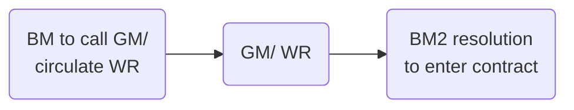

# Equity Financing

## Maintenance of Share Capital

Key principle of company law. Capital must generally be maintained, as it is the fund to which the **creditors** look for payment of debts owed to them. In other words, paid-up share capital must not be returned to its shareholders, and their liability in respect of capital not paid up on shares must not be reduced.

The doctrine of capital maintenance states that the company must maintain and not reduce its share capital except in certain very limited circumstances. The share capital therefore is a permanent fund available to creditors.

The doctrine was developed from [[Trevor v Whitworth (1887) 12 App Cases 409]], with the goal of protecting creditors. Creditor perspective: the share capital of a company gives an indication of its creditworthiness. Unsecured creditors will seek to claim payment from the company's capital as well as its unsecured assets if the company is wound up.

Capital can still be lost as a result of poor business decisions or market conditions, but this is a legitimate risk to both shareholders and creditors.

Many companies, large and small, have very limited share capital: so the doctrine doesn't really protect creditors much in this case.

```ad-important
title: Doctrine of capital maintenance ([s 658 CA 2006](https://www.legislation.gov.uk/ukpga/2006/46/section/658))

 1. A limited company must not acquire its own shares, whether by purchase, subscription or otherwise, except in accordance with the provisions of this Part.
 2. If a company purports to act in contravention of this section—
(a) an offence is committed by (i) the company, and (ii) every officer of the company who is in default, and
(b) the purported acquisition is void.

```

[s 659 CA 2006](https://www.legislation.gov.uk/ukpga/2006/46/section/659) provides a set of limited exceptions.

### Impact of Doctrine

The doctrine has an impact on a number of transactions:

- The granting of dividends/ distributions
- Reduction of share capital
- Purchase and redemption of own shares

The doctrine of capital maintenance limits the funds from which the company may pay dividends to its shareholders, since the payment of a dividend will reduce the company's assets available to **creditors**.

Consequences:

- Company must not generally purchase its own shares (s 658 CA 2006)
- Public company may not generally give [[Financial assistance]] to anyone for the purposes of buying company shares
- Dividends may not be paid out of capital
- In the case of a serious loss of capital, a GM must be called to discuss the problem
- A subsidiary may not be a member of its own holding company.
- Any allotment/ transfer of shares in a holding company to its subsidiary is void.

A company cannot generally reduce share capital by exchanging shareholders' shares for valuable consideration.

Exceptions:

- Reduce share capital with consent of court (ss 641-648)
- Share buyback (s 690 A 2006) or redemption (ss 684-689)
- Court order to buy out a minority in an unfair prejudice claim (s 994) or in the conversion of a public to private company.
- Return capital to shareholders in a winding up.

## Issuing Shares

In return for issuing shares, the company will receive cash used for the company business.

The board may be required to obtain resolution from the shareholders before they resolve to allot the shares:

- s 549: directors' need for authority to allot shares
- ss 561 & 565: statutory pre-emption rights.

Shares are allotted to someone (i.e., allocated) when that person has the unconditional right for their name to be entered onto the company’s register of members (CA 2006, s 558). They may then be said to have been issued by the company when the name of the shareholder has actually been entered on the company’s register of members.

### Share Capital

```ad-defn
The amount of money whcih a company raises by issuing shares.
```

#### Pre-CA 2006

Companies were required to have an 'authorised share capital'; a ceiling on the number of shares they could allot.

If such a provision exists (e.g., for a pre-CA 2006 company), the articles may need to be amended. But the amendment is by ordinary resolution.

#### CA 2006

A company is simply required to make a statement of capital and initial shareholdings when the company was incorporated on Form IN01. A new statement of capital must be submitted whenever more shares are issued.

Shareholder approval will not be required for a private company with only one class of shares, under the simplified procedure (ss 549-551).

If a CA 2006 company has included a restriction on the number of shares it can issue (super rare), it would have to amend articles by special resolution to change this.

### Directors' Power to Issue Shares

#### Private Company with One Class of Share

Directors of a private company automatically have authority to allot its shares, provided the company has only one class of shares and there is nothing to the contrary in the articles (s 550). If a pre-1 October 2009 company wishes to make use of the power given  
under s 550, it has to pass an ordinary resolution of the shareholders in order to do so.

#### Other Companies

The directors can issue shares in the company only if they have authority to do so. This authority must be given specifically, either in the articles (by a special article), or by ordinary resolution of the shareholders at a GM or by written resolution (CA 2006, ss 549–551).

```ad-important
If an ordinary resolution is needed, it must be filed with the Registrar of Companies (s 551(9)). 
```

The authority must state:

- Number of shares directors are authorised to allot
- Time limit on authority (generally $\leq 5$ years - s 551(3))

Authority may be revoked by ordinary resolution at any time

- This is even if the authority was originally given by the articles (which would require a special resolution to amend).
- Would require filing with Registrar of Companies (s 551(9))

Under s 555 of the CA 2006, a return of allotments must be filed with Companies House within one month, as must a modified statement of capital (s 555(3)). Both of these are contained on Form SH01.

### Statutory Pre-emption Rights

Shareholders have rights of first refusal when the company issues new shares in most circumstances ([s 561 CA 2006](https://www.legislation.gov.uk/ukpga/2006/46/section/561)). This only applies where the shares to be issued are [[Equity securities]]. So it does not apply to preference shares that have capped participating rights as to both dividends and capital.

#### Exceptions and Exclusions

The right to pre-emption does not apply where the new shares to be issued are:

- Bonus shares;
- Shares issued under an employee share scheme
- Shares issued for non-cash consideration ([s 564 CA 2006](https://www.legislation.gov.uk/ukpga/2006/46/section/564)).

A company may exclude the right of pre-emption by specific provision in the articles ([s 567-568 CA 2006](https://www.legislation.gov.uk/ukpga/2006/46/section/567)). However, this is not common.

More commonly, the pre-emption rights are disapplied by a special resolution of the shareholders:

- Directors of a private limited company with only one class of shares may be given power by the articles or by a special resolution, to allot equity securities of that class as if s 561 (existing shareholders' right of pre-emption) did not apply, or applied with such modifications as the directors may determine ([s 569 CA 2006](https://www.legislation.gov.uk/ukpga/2006/46/section/569)).
- Pre-emption rights may also be disapplied by special resolution under [s 570 CA 2006](https://www.legislation.gov.uk/ukpga/2006/46/section/570) where the directors of the company are acting under a general authority ([s 551 CA 2006](https://www.legislation.gov.uk/ukpga/2006/46/section/551)) to issue shares. In this situation, pre-emption rights are disapplied for all shares issued in accordance with this general authority.
- [s 571 CA 2006](https://www.legislation.gov.uk/ukpga/2006/46/section/571): shareholders may pass a special resolution to disapply pre-emption rights in relation to a particular share allotment only.

### Pre-emption Rights on Transfer of Shares

In general, there are no rights of pre-emption for existing shareholders where shareholders transfer shares.

But a private company may provide for pre-emption rights on transfer of shares in either the articles or a shareholder agreement. This is common in small private companies.

But if the private company has a corporate shareholder, the transfer of shares by this corporate shareholder will not trigger pre-emption rights provisions ([[Re Coroin [2011] EWHC 3466]]).

```ad-statute
title: s 561 CA 2006
(1) A company must not allot equity securities to a person on any terms unless—
- (a) it has made an offer to each person who holds ordinary shares in the company to allot to him on the same or more favourable terms a proportion of those securities that is as nearly as practicable equal to the proportion in nominal value held by him of the ordinary share capital of the company, and
- (b) the period during which any such offer may be accepted has expired or the company has received notice of the acceptance or refusal of every offer so made.

(2) Securities that a company has offered to allot to a holder of ordinary shares may be allotted to him, or anyone in whose favour he has renounced his right to their allotment, without contravening subsection (1)(b).

(4) Shares held by the company as treasury shares are disregarded for the purposes of this section, so that—
- (a) the company is not treated as a person who holds ordinary shares, and
- (b) the shares are not treated as forming part of the ordinary share capital of the company.

(5) This section is subject to—
- (a) sections 564 to (exceptions to pre-emption right),
- (b) sections 567 and 568 (exclusion of rights of pre-emption),
- (c) sections 569 to 573 (disapplication of pre-emption rights), and
- (d) section 576 (saving for certain older pre-emption procedures).
```

The number that each current shareholder is offered is dependent upon the percentage of the shares they currently hold.

The offer to the existing shareholders must remain open for at least 14 days, and only if the present shareholders decline to take up the shares can they be offered elsewhere.

Where shares are issued wholly or partly for non-cash consideration (say, a piece of land),  
s 561 of the CA 2006 has no application (s 565).

### Private Company

Under s 569 of the CA 2006, a private company with only one class of shares may disapply the statutory pre-emption rights by a special resolution of the shareholders, or by a provision in the articles (not included in MA). The advantage to this section is that the disapplication may be indefinite.

Other methods of disapplication:

| Statute | Details of method                                                                                                                                      |
| ------- | ------------------------------------------------------------------------------------------------------------------------------------------------------ |
| s 567   | Include a special article generally/ in relation to particular allotments.                                                                             |
| s 568   | Pre-emption provisions in articles will override the statutory provisions in s 561 (though notice requirements still apply unless expressly excluded). |
| s 570   | Special resolution of shareholders/ provision in articles where directors are authorised generally to allot shares under s 551.                       |
| s 571   | Special resolution of the shareholders, to disapply for a specified allotment. Directors must also send out a written resolution of reasons for the proposal, consideration which the company will receive, and justification.                                                                                                                                                        |

### Public Company

Under s 568 of the CA 2006, pre-emption provisions in the articles will override the statutory provisions in s 561 of the CA 2006.

A public company may also disapply the statutory pre-emption rights under s 561 by a special resolution of the shareholders, or by a provision in the articles.

A public company may alternatively disapply the statutory pre-emption rights under s 561 by a special resolution of the shareholders (s 571) for a specified allotment of shares.

### Procedure

Two separate procedures or allotting shares in the company.

#### 1. Shareholder Approval Needed

- Call a board meeting
- Directors check:
	- Any restrictions in the articles
	- Whether they have authority to allot shares
	- Whether pre-emption rights apply
- If articles need to be amended to remove a restriction, follow BM-GM-BM procedure. Short notice procedure may be used if consented to.
- At BM2, directors resolve to issue shares to those who have made written application for them. The offer to buy must come from prospective shareholders (private companies can't offer shares to the public).
- Admin
	- Seal share certificates if there is a seal.
	- Enter shareholder names into register of members.
	- Instruct secretary to enter the name of new shareholders on the register of members.
	- Send Form SH01 to Registrar of Companies

#### Shareholder Approval Not Needed

- Board meeting called
- Directors check:
	- Whether they have authority to allot the shares
	- Whether they are obliged to offer shares to current shareholders.
- If no to both, the directors will only need to pass a board resolution to allot the shares.
- Admin as above.

#### Payment for Shares

Payment as consideration for shares must be in cash – non-cash consideration requires board approval.

#### Partly-paid Shares

Directors may agree to issue shares partly paid, meaning the full price of the shares need not be paid immediately.

#### Issue at a Premium

The nominal value of each share is the par value. If shares are sold at a premium, the excess amount of consideration paid above the nominal value of the shares must be recorded in a separate share premium account (CA 2006, s 610).

Section 610 specifies the permitted uses for the share premium account. For example, paying up bonus shares will still be permitted.

#### Issue at a Discount

FORBIDDEN. Shares may not be issued for less than their nominal value (CA 2006, s 580).

```ad-statute
title: s 580
(1) A company's shares must not be allotted at a discount.

(2) If shares are allotted in contravention of this section, the allottee is liable to pay the company an amount equal to the amount of the discount, with interest at the appropriate rate.
```

#### Re-denomination of Share Capital

Under ss 622–628 of the CA 2006, a company is able to redenominate its shares into a different currency by passing an ordinary resolution.

The company's share capital may be reduced by $\leq 10\%$ by special resolution. The amount of the reduction is transferred to a ‘redenomination reserve’, to be used for paying bonus shares.

![[allotment-shares.png]]

## Classes of Shares

[s 630 CA 2006](https://www.legislation.gov.uk/ukpga/2006/46/section/629):

> Shares are of one class if the rights attached to them are in all respects uniform.

[MA 22](https://www.gov.uk/government/publications/model-articles-for-private-companies-limited-by-shares/model-articles-for-private-companies-limited-by-shares#differentclasses) gives companies the power to issue different classes of share.

==The label attached to a share is not determinative.== The rights attached to a class of shares are determined in the company's articles.

### Classes

Common types:

- Ordinary shares
- Redeemable shares
- Preference shares
- Non-voting shares
- Employees' shares
- Cumulative shares
- Convertible shares
- Deferred shares

#### Ordinary Shares

These are the default position and most common. Carry a right to vote in general meetings, a right to receive a dividend if one is declared by the directors, and a right to receive a share of the capital when a company is wound up.

Defined in [s 560(1) CA 2006](https://www.legislation.gov.uk/ukpga/2006/46/section/560) as

> shares other than shares that as respects dividends and capital carry a right to participate only up to a specified amount in a distribution.

The negative definition illustrates that ordinary shares are the default position and are shares that have an unlimited right to participate in dividends and surplus capital when a company is wound up.

#### Preference Shares

Shares usually entitled to have dividends paid at a predetermined rate, in priority to any dividend paid on ordinary shares.

Dividends can only be paid where the company has distributable profits and a dividend is declared.

Preference shares often have a right to priority over the ordinary shareholders when capital is returned to the members in a winding up. Rights of preference shareholders may be **cumulative** (arrears of preference dividends not declared in earlier years must be paid before ordinary shareholders are paid) or **non-cumulative** (only current year's dividend payable).

May be **participating**, meaning shareholders can also participate in a dividend or capital on a winding up alongside ordinary shareholders. This means they receive both their fixed preferential dividend or a fraction of capital, plus a fraction of the general dividend/ capital in accordance with their shareholding.

#### Deferred Shares

Shares normally only have a right to a dividend and/or return of capital after the claims of the preference shareholders and ordinary shareholders. Usually issued to the founders of a company, not very common.

#### Redeemable Shares

Temporary shares, which may be bought back by the company at a future date. Governed by Chapter 3 [s 684-689 CA 2006](https://www.legislation.gov.uk/ukpga/2006/46/section/684).

#### Non-voting Shares

Issued where company seeks to restrict control of the company

#### Convertible Shares

May be converted to a different type of share in the issuing company, according to a pre-arranged formula set out in the articles.

#### Employees' Shares

Employees' share schemes can have tax advantages. Usually ordinary shares with extra restrictions (e.g., on transfer).

```ad-example

**PGDL Limited** has **participating preference shares** in issue which carry a right to receive a fixed preferential dividend of 5% of the par value of the shares per annum. The shares have a par value of £1 each.

Assuming that a dividend has been declared, the preference shareholders would be entitled to receive a dividend of 5p per share per annum before the ordinary shareholders receive any dividend. They would then also be entitled to a fraction of the remaining general dividend alongside the ordinary shareholders.

**SQE Limited** has **non-participating preference shares** in issue which carry a right to receive a fixed preferential dividend of 5% of the total subscription price per share per annum. The shares have a par value of £1 each but were subscribed for at a price of £2 per share.

Assuming that a dividend has been declared, the preference shareholders would be entitled to receive a dividend of 10p per share per annum before the ordinary shareholders receive any dividend. They would not be entitled to any further dividend.
```

### Variation of Class Rights

Baseline presumption: all shares have equal rights, unless there is an express provision in the articles to the contrary ([[Birch v Cropper (1889) 14 App Cas 525]])

[s 630 CA 2006](https://www.legislation.gov.uk/ukpga/2006/46/section/630): class rights can only be varied

1. In accordance with the relevant provisions in the company's articles,
2. Or if there is no provision in the articles:
	- Where 75% in value of the shares of the affected class consent in writing,
	- Or a special resolution is passed at a separate meeting of the holders of the affected class of shares.

Companies can **entrench** class rights in their articles ([s 22 CA 2006](https://www.legislation.gov.uk/ukpga/2006/46/section/22)), and in this case the protection cannot be circumvented by changing the rights attached to shares under s 630.

Shareholders voting at a class meeting to vary rights must vote with the dominant purpose of benefitting the class as a whole, or the variation may be invalid ([[British America Nickel Corpn Ltd v O’Brien [1927] AC 369 (PC)]]).

#### Exercise of Rights

Statutory provisions under s 630 apply only if the shareholders have “class rights” which are to be varied. Variations affecting the exercise of the rights, rather than the rights themselves, are not subject to s 630.

Issuing more shares of a particular class doesn't count as 'varying' the class rights, even through it may dilute the amount of dividend previously paid. The attitude is that the substantive legal rights of the class have not been altered, only the way in which these rights have been exercised.

Key case | Ratio
--- | ---
[[White v Bristol Aeroplane Co [1953] Ch 65 (Court of Appeal)]] | Issuing more shares is not varying class rights
[[House of Fraser plc v ACGE Investments Ltd [1987] AC 387]] | Cancelling a class of preference shares was not varying class rights, since this was consistent with the terms of issue of the shares.
[[Greenhalgh v Arderne Cinemas Ltd [1946] 1 All ER 512 (Court of Appeal)]] | Changing the rights of one class does not affect the class rights of another class.

#### Right to Object

[s 633 CA 2006](https://www.legislation.gov.uk/ukpga/2006/46/section/663): dissenting members of a class of shares have a right to challenge a variation.

The conditions for this are:

1. Only shareholders holding $\geq 15\%$ of the issued shares of that class may challenge a variation, and
2. The variation must be challenged in court within 21 days of the date on which consent was given, or the resolution was passed, to vary the class rights.

Common law now indicates that a vote on a resolution to vary class rights must be exercised for a purpose/ dominant purpose of benefitting the class as a whole ([[British America Nickel Corpn Ltd v O’Brien [1927] AC 369]]) so this may be grounds for a challenge.

Two different classes of ordinary shares may carry different voting and dividend rights. In any one company, the rights attaching to a share are dependent on the articles of that  
company.

The different classes of shares and the rights attaching to them must be included on the  
statement of capital which is lodged at Companies House when the company is formed (as part of Form IN01) and whenever the number of issued shares changes.

### Ordinary Shares

These carry the primary voting rights of the company, the right to a dividend if declared, and rights to participate in a surplus in a winding up.

If no differences between shares are expressed, it is assumed that all shares have the same rights.

A company may, at its option, attach special rights to different shares, for example as regards dividends, return of capital or voting (or less often the right to appoint a director).

Ordinary shares without voting rights are often called “A” ordinary shares.

### Preference Shares

A preference share is any share having priority over the ordinary shares. The priority might be in relation to capital or dividends, or (usually) both. There are no other implied differences between the two.

The preferential dividend may be cumulative, or it may be payable only out of the profits of  
each year. The dividend will usually be fixed (expressed as a fixed percentage of the par value of the share).

Do not usually carry a vote.

#### Advantages

- Entitled to first profits of the company at a fixed rate
- Dividend usually paid quarterly
- Usually redeemable (so the investor may exchange the shares for cash at some point in the future).

#### Types

4 types of preference shares:

1. Cumulative
	- Preference shareholder must be paid missing dividends as well as the current dividend, if a dividend is missed
	- Ranks before payment of dividends to ordinary shareholders.
2. Non-cumulative
3. Participating
	- Get to “double dip” - further right to participate in profits/ assets, in addition to the fixed preference rights.
4. Convertible.
	- May be exchanged for ordinary shares at a specified price and after a specified date.

### Non-voting Shares

Uncommon in private companies.

### Redeemable Shares

```ad-statute
title: s 684 - Power of limited company to issue redeemable shares

(1) A limited company having a share capital may issue shares that are to be redeemed or are liable to be redeemed at the option of the company or the shareholder (“redeemable shares”), subject to the following provisions.

(2) The articles of a private limited company may exclude or restrict the issue of redeemable shares.

(3) A public limited company may only issue redeemable shares if it is authorised to do so by its articles.

(4) No redeemable shares may be issued at a time when there are no issued shares of the company that are not redeemable.
```

#### Articles

There is nothing allowing issue of redeemable shares in MA, so a special article would need to be inserted. The articles must also provide for the terms and manner of redemption.

The directors of a private company can decide the conditions of redemption if they are authorised by an **ordinary resolution** of the members or by the articles (CA 2006, s 685(1)). Generally, redeemable shares have to be redeemed from distributable profits, but private companies may redeem out of capital if so permitted by their articles (CA 2006, s 687), upon the passing of a special resolution and the directors making a declaration of solvency.

#### Redemption

**Redeemed** shares are treated as being cancelled. A notice must be sent to the Registrar of Companies within one month of the shares being redeemed, along with an amended statement of capital (CA 2006, ss 688 and 689)–both included in **Form SH02**.

## Offering Shares to the Public

Private companies are in general prohibited from offering their shares to the investing public at large (FSMA 2000, s 75(3)).

Offering shares to the public in contravention of the prohibition against doing so is not a criminal offence, but the court may order re-registration of the private company as a public company, or may make a remedial order which could include repurchase of the shares by the company (CA 2006, ss 757–759).

## Dividends

A dividend is a “distribution” under the definition in [s 829(1) CA 2006](https://www.legislation.gov.uk/ukpga/2006/46/section/829), which states that “distribution” means every description of distribution of a company's assets to its members, whether in cash or otherwise, subject to the exceptions set out in s 829(2).

[s 830(1) CA 2006](https://www.legislation.gov.uk/ukpga/2006/46/section/830): a company may pay dividends only out of “**distributable profits**”. These are defined (s 830(2)) as the company's

> “accumulated, realised profits, so far as not previously utilised by distribution or capitalisation, less its accumulated, realised losses, so far as not previously written off in a reduction or reorganisation of capital duly made.”

### Relevant Accounts

[s 836 CA 2006](https://www.legislation.gov.uk/ukpga/2006/46/section/836) sets out the 'relevant accounts' for the purposes of ascertaining whether a company has sufficient distributable profits for the payment of dividends.

Most recent annual accounts must usually be referred to. In some circumstances, specially prepared interim accounts may be appropriate, e.g., when a company has realised a substantial profit since the annual accounts were prepared.

For a new company without annual accounts, initial accounts may be prepared to justify paying a dividend.

### Types of Dividend

Type of dividend | Description
---|---
Dividend | Involves the distribution of profits by way of cash to shareholders.
Scrip dividend | Where a company gives the existing shareholders further shares in the company, rather than cash.
Dividend in specie | Involves the company giving shareholders value by way of assets.

When recommending a dividend, the directors must have regard to all their duties, particularly the duty to promote the success of the company ([[s 172 CA 2006]]).

### Final Dividends

MA 30(2): the directors decide whether it is appropriate to pay a dividend to shareholders. The shareholders in a GM will actually declare the dividend under MA 30(1). The shareholders cannot  
vote to pay themselves more than the directors have recommended, although they could decide that a smaller amount was more appropriate.

Articles may provide that final dividends can be paid without any shareholder involvement.

### Interim Dividend

- Usually of a lesser amount than the final dividend
- Recommended by the **directors alone**

### Disguised Distributions

The courts have found that there has been a “disguised” return of capital to shareholders, breaching the capital maintenance principle, in some less obvious cases.

- [[Re Halt Garage (1964) Ltd [1982] 3 All ER 1016, ChD]]: directors salary
- [[Aveling Barford Ltd v Perion Ltd [1989] BCLC 626]]: intra-group transfers

### Unlawful Distributions

When an unlawful distribution is made, both the directors who authorised the distribution and the shareholders receiving it may be liable.

```ad-warning
If a dividend is paid when there are insufficient profits available for the purpose, the directors who authorised the payment are jointly and severally liable to the company for the full amount.
```

- Directors who knew or ought to have known that the payment amounted to a breach are liable to personally repay the dividends ([[Bairstow v Queens Moat Houses plc [2001] EWCA Civ 712]]).
- [s 847 CA 2006](https://www.legislation.gov.uk/ukpga/2006/46/section/847) provides that where a distribution is made in contravention of the requirements of the Act, and if at the time of distribution the member knows or has reasonable grounds for believing the distribution to have been unlawful, they are liable to repay it to the company ([[It's a Wrap (UK) Ltd v Gula [2006] EWCA Civ 544]]).

### Steps Board Must Take

Before issuing a dividend, the board must consider:

1. Directors' duties: if making the distribution is in accordance with duties [[s 171 CA 2006]] and [[s 172 CA 2006]].
2. Restrictions on distributions: consider whether proposed transaction is either a dividend or disguised distribution ([[Aveling Barford Ltd v Perion Ltd [1989] BCLC 626]]).
3. Are there any distributable profits? Check relevant accounts
4. Amount of distribution: does the distributable profit cover the whole amount of distribution.

## Sources of Finance

- Shareholders and directors
	- Debt and equity finance
	- Finance from family and friends
- Banks
	- Overdraft, term loans, revolving credit facilities
- Venture capital
	- Can be equity/ debt/ both
	- VC may require management changes, including a seat at the board for its representatives.

## Filing

![[filing-requirements.png]]

## Share Buybacks

Shareholders selling shares in a private limited company have two options:

1. Find a third-party to buy them
2. Ask the company to buy the shares back from the shareholder.
	- The shares would immediately become worthless to the company, since 706(b)(i) CA 2006 provides that the bought-back shares are usually treated as cancelled.
	- directors should consider carefully whether the proposed buy-back of shares makes commercial sense for the company

### Commercial Considerations

Reasons for buying back shares:

- A director refuses to resign unless someone buys their shares. The other directors allow the company to buy the director's shares, considering a buyback a worthwhile price to pay in return for the person cutting ties with the company.
- In a family-run business, where a family member wants to extract their investment from the business. The board should carefully consider s 172 duties.

Buybacks are common in publicly traded companies to:

1. Return surplus cash to shareholders,
2. Reduce the number of shares in issue to increase the earnings per share
3. Increase the value of existing shares.

### Legal Considerations

The profits of a company belong to the company (separate legal personality). The usual way for a shareholder to ultimately receive the company's accumulated profits is:

1. During the company's lifetime when it pays a dividend
2. During the winding up of the company while it is still solvent.

A buyback out of existing share capital may also increase the company's changes of becoming insolvent. The principle of maintenance of share capital is designed to safeguard against this.

```ad-note
There is a different procedure for share buybacks on a stock market, not considered here. 
```

### Buyback Out of Profit/ Fresh Issue of Shares

A company may buy back its own shares from its shareholders out of distributable profits or the proceeds of a fresh issue of shares (CA 2006, s 692(2)), provided:

1. The articles of the company must not forbid this (s 690(1));
2. the shares must be fully paid (s 691(1)); and
3. when the shares are bought by the company, it must pay for them at the time of purchase.

#### Voting

A company buying back shareholder shares enters a contract with the shareholder. This must be approved by ordinary resolution (s 694(2) CA 2006):

- If the ordinary resolution at the GM would not have passed without the votes relating to shares being bought back, the ordinary resolution will be ineffective (CA 2006, s 695(3)).
- Alternatively, a shareholder having their shares bought back is excluded from participating in a written resolution (CA 2006, s 695(2)).

#### Inspection

A copy of the contract/ summary of it must be available for inspection for $\geq 15$ days before the GM and at the GM (or be sent with the proposed written resolution, or before it is circulated) (CA 2006, s 696(2)).



#### Administration

- Pay for shares
- Send to Companies House within 28 days (ss 707 & 708)
	- Form SH03 (return of purchase of own shares)
	- Form SH06 (Notice of Cancellation of Shares)
	- Details of shares bought back
- Inspection
	- Copy of the contract/ summary of it must be available for inspection for 10 years after share purchase at the company's registered office/ SAIL.

#### Effects

1. Issued share capital of the company is decreased
2. Voting control between shareholders may have been altered
3. A capital redemption reserve will need to be created
4. Share premium account is reduced, if a premium paid on buyback/ redemption financed out of a fresh issue of shares.

![[buyback-not-from-capital.png]]

### Buyback Out of Capital

```ad-danger
A public company is not allowed to buy back out of capital.
```

Some of the company's existing share capital may be used to fund the buyback, subject to anything in the articles to the contrary (s 709) provided that additional conditions are satisfied (s 713).

#### Requirements

1. Shares must be fully paid (s 691(1))
2. Company must pay for the shares at the time of purchase (s 691(2))
3. Directors must make a statement of solvency, stating that the company is solvent and will remain so for the next 12 months (s 714) after the buyback.
	1. If the company is wound up within one year of their statement and proves to be insolvent, both the seller of the shares and the directors of the company may be required to contribute to the financial losses of the company (IA 1986, s 76).
	2. Criminal sanctions for making such a statement without reasonable grounds (CA 2006, s 715).
	3. Must be made $\geq 1$ week before GM (s 716(2)).

```ad-defn
title: Permissible capital payment
The amount which of capital which may be used for share buybacks. This is limited (ss 710-712). 
```

#### Procedure

- Auditors must produce a report for directors that PCP is in order, and they do not know or anything that would make the statement unreasonable (s 714(6)).
- BM1
- Buy-back contract must be approved by **ordinary resolution** (s 694(2)) – GM or WR
- A **special resolution** (GM/ WR) must be passed by the shareholders to approve the payment out of capital (CA 2006, s 716(1)).

| Procedure | Restriction                                                                                                                                               | Statute            |
| --------- | --------------------------------------------------------------------------------------------------------------------------------------------------------- | ------------------ |
| GM        | If the ordinary and special resolutions would not have passed without the votes relating to shares being bought back, the resolutions will be ineffective | ss 695(3) & 717(3) |
| WR        | Shareholders having their shares bought back are excluded from participating in the WR                                                                    | ss 695(2) & 717(2) |

- Copy of contract/ summary must be available for inspection $\geq 15$ days before GM & at GM (or circulated with/ before WR) (s 696(2)).
- Auditors' report and directors' statement must be made available at the GM only, or sent with the proposed written resolution, or before it was circulated. (s 718(2)).
- Notice placed in London Gazette, and also in either a national newspaper/ in a written notice to every creditor (s 719) within a week of the resolutions being passed,
	- Allows for dissenting shareholders/ any creditor to make an application to court under s 721 to cancel the buy-back out of capital.
- On/ before the day on which the first of the notices is published, a copy of the auditors' report and directors' statement must be filed at Companies House (s 719(4)).
- Report and statement made available at the registered office for 5 weeks after the special resolution (s 720(1))
- BM2 to enter into the contract to buy-back shares.
- Buyback must be made $5 \leq T \leq 7$ weeks after the date of the special resolution to approve the buy-back out of capital (s 723(1)).

#### Administration

- Pay for the shares
- Send a copy of the special resolution to Companies House within **15 days** (ss 29 & 30)
- Send Form SH03 (Return of Purchase of Own Shares) and Form SH06 (Notice of Cancellation of Shares) with details of shares bought back within **28 days** (ss 707 & 708).
- Copy of contract/ summary available for inspection for **10 years** after the purchase at registered office/ SAIL.
- Register of members altered
- Any share certificates dealt with.

![[buyback-capital-1.png]]  
![[buyback-capital-2.png]]

### Buyback of a Small Amount

```ad-statute
title: s 692(1ZA)
If authorised to do so by its articles, a private limited company may purchase its own shares out of capital otherwise than in accordance with Chapter 5, up to an aggregate purchase price in a financial year of the lower of—
- (a) £15,000, or
- (b) the nominal value of 5% of its fully paid share capital as at the beginning of the financial year.
```

Recall that “nominal value” excludes any premium on the shares. There are no special procedures to follow for such buybacks; just need an ordinary resolution to approve the buy-back contract.

### Employees' Share Scheme

```ad-statute
title: s 720A(1) - Reduced requirements for payment out of capital for purchase of own shares for the purposes of or pursuant to an employees' share scheme
Section 713(1) does not apply to the purchase out of capital by a private company of its own shares for the purposes of or pursuant to an employees' share scheme when approved by special resolution supported by a solvency statement.
```

### Reduction of Capital

ss 641-644 allow a private limited company to re-classify some of its existing share capital as distributable profits (which could then be used to buy-back shares out of profit).

#### Conditions and Procedure

- Articles must not prohibit the reduction of share capital (s 641(6))
- Directors must make a solvency statement (s 642(1)) stating that the company is solvent and will remain solvent even with the reduction of capital for the next 12 months (s 643(1)).
	- Criminal sanctions for making such a statement without having reasonable grounds (s 643(4))
	- Liability for breach of s 172 & 174
	- Must be made $\leq 15$ days before GM (s 642(1)(a)) and available to the shareholders at the GM (s 642(3)) or sent with the proposed WR, or before it is circulated (s 642(2)).
- Shareholders approve reduction of capital by passing a special resolution (GM/ WR) (s 641(1)(a)).

#### Administration

BM2:

- Pay for shares
- Sign statement of compliance that the 15-day time period was met (s 644(5))
- Send copy of special resolution to Companies House within 15 days (ss 29 & 30)
- Send Form SH19 and the solvency statement within 15 days (s 644(1))
- Register of members/ PSC register altered
- Share certificates dealt with.

```ad-important
Reduction of share capital will take place on registration of these documents (s 644(4) and 641(5)). 
```

### Shares Bought Back

For a buyback under distributable profits only, the shares can either be (s 724):

- Cancelled
	- Will no longer exist and reduce the company's issued share capital
- Held in treasury
	- Kept in reserve
	- Can be resold at a later date to other shareholders.

For a buyback out of capital, buyback of a small or buyback financed by the fresh issue of shares, shares must be cancelled (s 706(b)).

## Transfer of Shares

### Procedure

- Transferor completes and signs a stock transfer form, which is given to the transferee (ss 770-772).
- Stamp duty
	- If the shares are being sold for more than £1,000, the buyer must pay stamp duty (currently charged at 0.5% rounded up to the nearest £5) on the stock transfer form.
	- If the shares are a gift, no stamp duty is payable.
- Transferee sends share certificate and stock transfer form to the company.
- The company should send the new shareholder a new share certificate in their name within **2 months**, and should also ensure that their name is entered on the register of members within the same time period (s 771).
- Form CS01: notification of the change in composition in membership of the company.

```ad-action
1. Give share certificate and transfer form to transferee.
2. Buyer pays stamp duty (no stamp duty on a gift).
3. Apply to company for registration.
4. Board consider whether to refuse registration (if the articles give them this power).
5. Board resolve to issue and seal new share certificate (if company has seal).
6. Update register of members.
```

### Restrictions on Transfer

- Under MA 26, directors have an absolute discretion in this matter and may refuse to place a name on the register of members.
	- Court will not interfere with the discretion unless transferees can show that the directors did not act in good faith.
	- If the discretion is exercised correctly, directors hold the shares on trust for the transferee.
	- Directors must supply the buyer with notice within 2 months
	- Give reasons (s 771(1)(b))
	- Provide such further information as the transferee reasonably requests (s 771(2)).
- Articles may impose further restrictions
- Consider pre-emption rights.
- Unless they are given power under the articles, the directors cannot refuse to place a new shareholder’s name on the register of members.
	- If they wrongly refuse to do so, a decision may be challenged by an application to the court for an order for rectification of the register (s 125).
	- 10 year limitation period for claims (s 128)
- If directors are given some discretion in this matter, they must make a decision within a reasonable time (and within 2 months).

## Transmission of Shares

```ad-defn
title: Transmission
Automatic process by which shares passing to a shareholder's PRs upon death, or to their trustee in bankruptcy upon bankruptcy. 
```

The PRs or trustee are entitled to any dividend declared, but cannot exercise the votes attached to the shares (MA 27).

PRs must produce a grant of representation to establish their right to deal with the shares as PRs. Can either:

1. Elect to be registered as shareholders themselves
	- Subject to the articles: directors may exercise their discretion to refuse to place the name of a PR on the register
	- If PRs become registered shareholders, they can transfer the shares in the normal way.
2. Transfer the shares directly to the ultimate beneficiary or to a third party in their representative capacity.

Similar for a trustee in bankruptcy, who must produce the court order for their appointment to establish their right to deal with the shares.

## Serious Loss of Capital

```ad-statute
title: s 656 - Public companies: duty of directors to call meeting on serious loss of capital
(1) Where the net assets of a public company are half or less of its called-up share capital, the directors must call a general meeting of the company to consider whether any, and if so what, steps should be taken to deal with the situation.

(2) They must do so not later than 28 days from the earliest day on which that fact is known to a director of the company.

(3) The meeting must be convened for a date not later than 56 days from that day.
```
