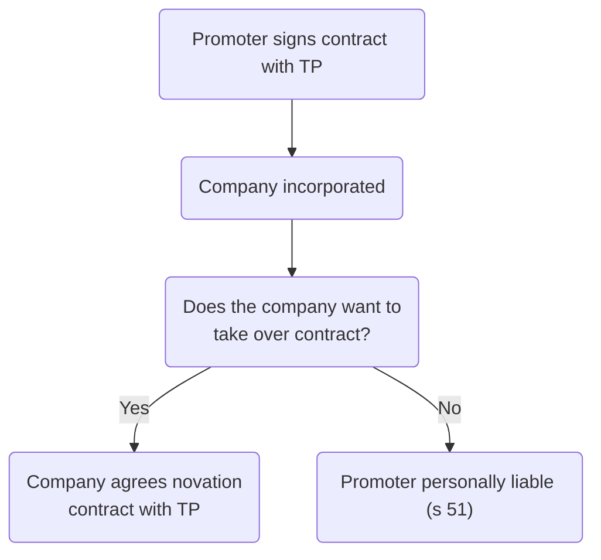
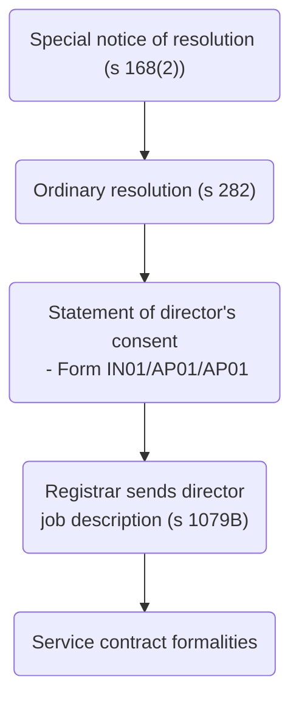
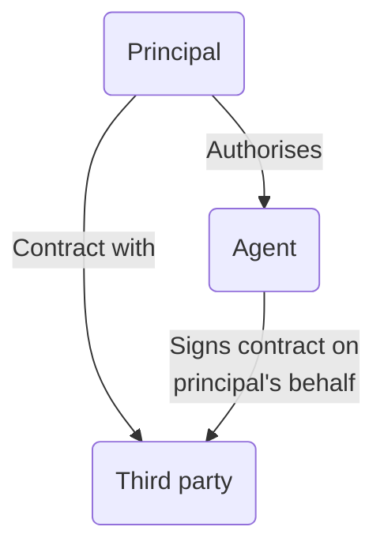
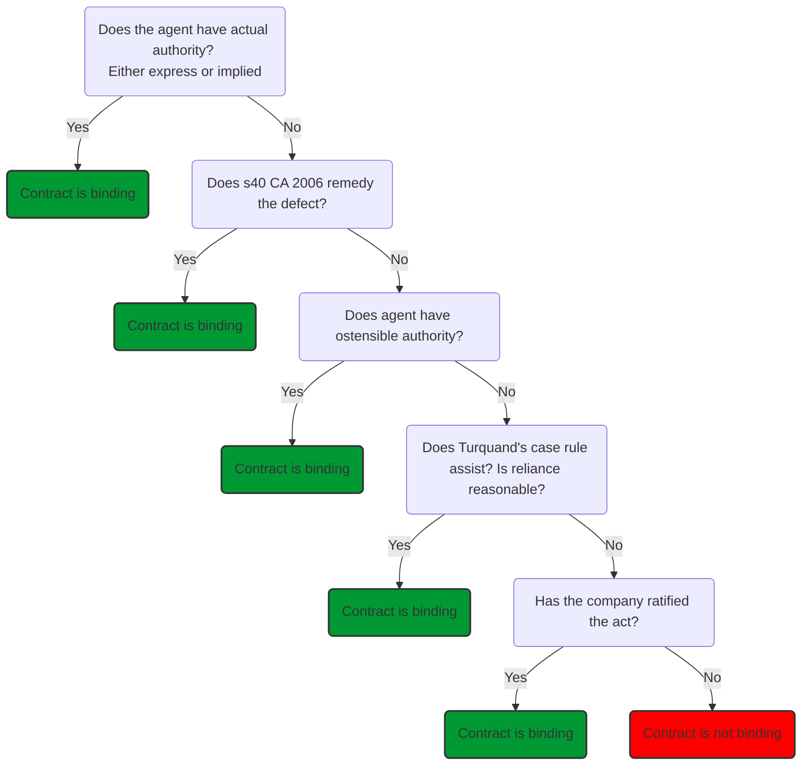

# Fundamentals-merm

```mermaid
graph TD

id1(Promoter signs contract with TP) --> id2(Company incorporated)
id2 --> id3("Does the company want to <br/>take over contract?")
id3 --> |Yes| id4.1(Company agrees novation <br/> contract with TP)
id3 --> |No| id4.2("Promoter personally liable (s 51)")
```

```mermaid
graph TD
id1("Special notice of resolution (s 168(2))") --> id2("Ordinary resolution (s 282)")
id2 --> id3("Statement of director's consent<br/> - Form IN01/AP01/AP01")
id3 --> id4("Registrar sends director <br/>job description (s 1079B)")
id4 --> id5(Service contract formalities)
```

```mermaid
graph TD

id1(Principal) --> |Authorises| id2(Agent)
id1 --> |Contract with| id3(Third party)
id2 --> |Signs contract on <br/> principal's behalf| id3

```

```mermaid
graph TD


id2.2(Does the agent have actual authority? <br/>Either express or implied)

id3.1(Contract is binding)
id3.2(Does s40 CA 2006 remedy the defect?)

id2.2 -->|Yes| id3.1
id2.2 -->|No| id3.2

id4.1(Contract is binding)
id4.2(Does agent have ostensible authority?)

id3.2 -->|Yes| id4.1
id3.2 -->|No| id4.2

id5.1(Contract is binding)
id5.2(Does Turquand's case rule assist? Is reliance reasonable?)

id4.2 -->|Yes| id5.1
id4.2 -->|No| id5.2

id6.1(Contract is binding)
id6.2(Has the company ratified the act?)

id5.2 -->|Yes| id6.1
id5.2 -->|No| id6.2

id7.1(Contract is binding)
id7.2(Contract is not binding)

id6.2 -->|Yes| id7.1
id6.2 -->|No| id7.2

classDef red fill:#ff0000,stroke:#333,stroke-width:2px;
classDef green fill:#009933,stroke:#333,stroke-width:2px;
classDef yellow fill:#ff9900,stroke:#333,stroke-width:2px;

class id7.2 red
class id3.1,id4.1,id5.1,id6.1,id7.1 green
%%%%class id1.1 yellow

```
