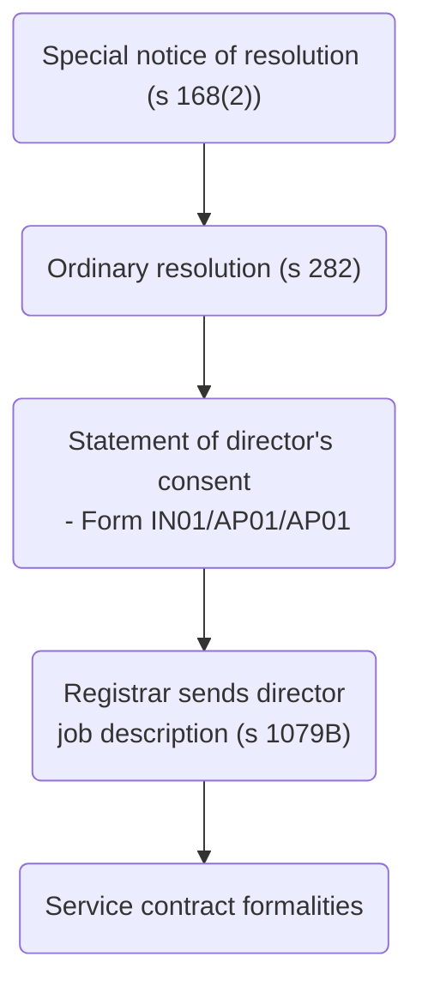
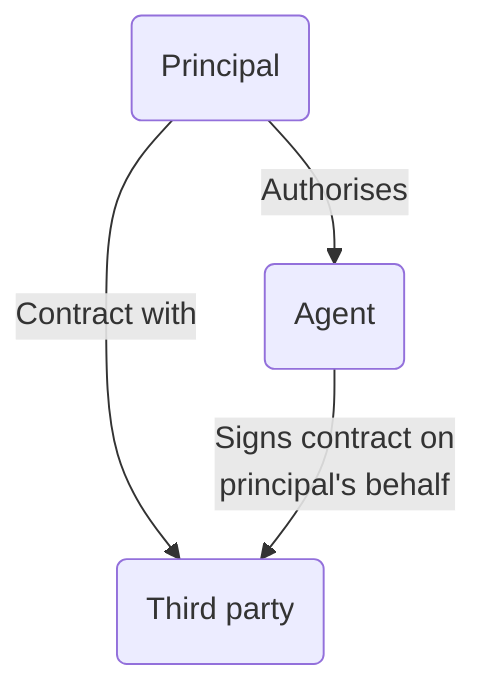
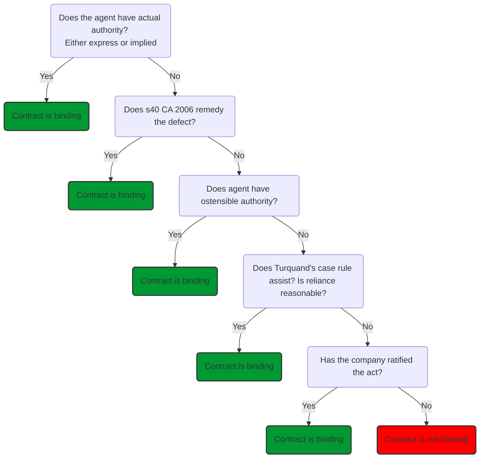

# Officers of the Company

Includes company secretary, directors, managers and auditors.

## Company Secretary

```ad-statute
title: s 270(1)
A private company is not required to have a secretary.
```

The company secretary is an officer of the company (s 1121).

### Functions

- Generally centres around administration of the company (writing board minutes, keeping registers up-to-date, sending returns to Registrar of Companies).
- Has apparent authority on behalf of the company to make contracts connected with the administrative side of the company's business, though not trading contracts.

### Appointment

| Time appointed | Procedure |
| ----------------------------- | ---------------------------------------------------------------------------------------------------------------------------------------------------- |
| When company first registered | Named on the statement of proposed officers on Form IN01. Secretary automatically takes office when certificate of incorporation issued (s 16(6)(b)) |
| Subsequently | Directors pass board resolution. Company must notify Registrar of Companies within 14 days of appointment of secretary on Form AP03 (human secretary) or Form AP04 (Corporate secretary). Then update the register of secretaries if applicable (s 275(2)). |

#### Register of Secretaries

```ad-statute
title: s 275 - Duty to keep register of secretaries

(1) A company must keep a register of its secretaries.

(2) The register must contain the required particulars (see sections 277 to 279) of the person who is, or persons who are, the secretary or joint secretaries of the company.

(3) The register must be kept available for inspection—
- (a) at the company's registered office, or
- (b) at a place specified in regulations under section 1136.

(4) The company must give notice to the registrar—
- (a) of the place at which the register is kept available for inspection, and
- (b) of any change in that place,

unless it has at all times been kept at the company's registered office.

(5) The register must be open to the inspection—
- (a) of any member of the company without charge, and
- (b) of any other person on payment of such fee as may be prescribed.

(6) If default is made in complying with subsection (1), (2) or (3), or if default is made for 14 days in complying with subsection (4), or if an inspection required under subsection (5) is refused, an offence is committed by—
- (a) the company, and
- (b) every officer of the company who is in default.

For this purpose a shadow director is treated as an officer of the company. 
```

Private companies can elect not to keep their own register, but to hold everything centrally with Companies House instead (s 279A).

#### Corporate Secretaries

For corporate secretaries, the following must be entered into the register:

1. Corporate name and company's registered/ principal office
2. Register and registration number (EEA company)
3. Legal form and governing company + registration details (non-EEA).

#### Terms of Contract

Directors have the power to decide contractual terms on which secretary holds office and remuneration.

#### Removal

- Directors have power to remove at any times
- May depend on employment contract and give rise to statutory employment law claims.
- s 276(1)(a): notice Registrar of Companies within 14 days on Form TM02.

#### Change in Details

- s 276(1)(b): notice Registrar of Companies within 14 days on Form CH03 (human) or CH04 (corporate).

#### Public Companies

Must have a secretary (s 271), who is qualified as specified in s 273 (3 years experience in the last 5/ has professional qualification etc.)

## Directors

See [[Directors]].

Every private company must have at least one director (s 154(1)), and every public

company must have at least two (s 154(2)).

```ad-statute
title: s 250 - "Director"
In the Companies Acts, “director” includes any person occupying the position of director, by whatever name called. 
```

### Executive Director

Appointed to an executive office (finance, managing, …). Both an officer and employee of their company – has a service contract under which the director agrees to work for the company in return for a salary and benefits.

#### Chief-executive

The board of directors has the power to delegate their powers. They usually do this by appointing a Chief Executive or Managing Director.

CEO will be formally appointed as a director with specific powers granted by company articles (e.g., art 5 MA).

#### Non-executive Director (NED)

An officer of the company, but not an employee of the company. The role involves independent guidance and advice to the board, and protecting the interests of shareholders.

In a private company, there are often no NEDs. More relevant to [[Business Law and Practice/Company Law/Business models/Public companies]] – certain number mandatory for joining Main Market.

NED can still be liable to the company, for example, for breach of their director’s duties ([[Equitable Life v Bowley [2003] EWHC 2263]]).

#### Chairperson

- Powers determined by the company's articles.
- Private company with MA: no special powers other than their casting vote in the event of an equal vote for and against a board resolution (art 13).
- For a public company, the chairperson is the figurehead.

#### Shadow Director

```ad-defn
title: Shadow director
A person in accordance with whose directions or instructions the directors of the company are accustomed to act.
```

| Case | Ratio |
| ------------------------------------------------------------------------------------------------------------------------------------------------------------------------------------------------------------------------------------------ | ------------------------------------------------------------------------- |
| A shadow director was anyone, other than a professional adviser, who exercises real influence in the corporate affairs of a company but who does not necessarily give directions or instructions on every matter decided by the directors. | [[Secretary of State for Trade and Industry v Deverell [2000] 2 WLR 907]] |
| A person becomes a shadow director only when the directors act on the instructions given. The mere act of giving instructions is not enough. | [[Ultraframe (UK) Ltd v Fielding [2005] EWHC 1638]] |
| It is not necessary that all of the directors acted in accordance with the shadow director’s directions but that a majority of them did | [[In the matter of Coroin Ltd, Ch D, 5 March 2012]] |

Shadow directors are subject to the same directors' duties as far as capable of applying (s 170(5)).

The rule aims to stop people avoiding the onerous duties imposed on directors by not being formally appointed, even though they are running the company on a daily basis. But a person is not deemed a shadow director by reason only that the directors act on advice given by them in a professional capacity (s 251(2) CA 2006).

#### De Facto Director

Someone who assumes to act as a director but has in fact not been validly appointed, and therefore is not a de jure director.

Case law has held that such a person may fall within the definition of a ‘director’ under s 250(1) and under the IA 1986 (e.g., [[Re Hydrodam (Corby) Ltd [1994] 2 BCLC 180]]).

```ad-test
title: De facto director relevant factors
1. Whether they have assumed responsibility to act as a director.
2. Whether or not they acted as a director must be determined objectively. It does not matter whether the individual thought they were acting as a director.
3. Whether the company considered the individual to be a director and held them out as such, and whether third parties considered that they were a director
4. Look at the acts in their context and determine their cumulative effect.
5. The fact that a person is consulted about directorial decisions, or is asked for approval, does not in general make them a director because they are not making the decision.
```

An individual director of a corporate director of another company is not a de facto director of that other company, and could therefore not be held personally liable for the unlawful payment of a dividend ([[Holland v The Commissioners for HMRC [2010] UKSC 51]]) – corporate veil.

#### Alternate Director

Companies may provide in their Articles for the appointment of alternate directors (not a provision in MA). An alternate director attends board meetings and acts in place of the director, if the actual director is incapacitated/ away. Usually approved by resolution of board of directors.

Usually, another director can be appointed as an alternate director.

#### Corporate Director

It is possible to have a corporate director of a company [[(Holland v The Commissioners for HMRC [2010] UKSC 51]]). But subject to:

```ad-statute
title: s 155 - Companies required to have at least one director who is a natural person
(1) A company must have at least one director who is a natural person.

(2) This requirement is met if the office of director is held by a natural person as a corporation sole or otherwise by virtue of an office.
```

##### Upcoming Changes

BUT the law is set to change in this area. The Small Business, Enterprise and Employment Act 2015, which received Royal Assent in March 2015, has inserted a new s 156A into the Companies Act 2006. This provision requires every director to be a human and prohibits corporate directors. A new CA 2006, s 156B allows the Secretary of State for BEIS to make regulations setting out exceptions to this ban on corporate directors.

#### Appointment of Directors

Directors appointed in accordance with the process set out in the articles.

##### Statutory Restrictions

1. Director must be at least 16 when they take office (s 157)
2. A director disqualified under the CDDA 1986 will commit a criminal offence under s 13 CDDA if they act as a director of a company during the period of the disqualification.
3. An undischarged bankrupt cannot act as a director of a company (CDDA 1986, s 11)
4. s 1184: SoS for BEIS has power to prevent someone from being a director of a UK company if they are subject to restrictions under foreign law.

##### Restrictions in Articles

Articles may provide for the ineligibility of a director.

```ad-example
title: Art 18(d) MA
A person ceases to be a director as soon as a registered medical practitioner who is treating that person gives a written opinion to the company stating that that person has become physically or mentally incapable of acting as a director and may remain so for more than three months.
```

##### Procedure for Appointment

CA 2006 does not stipulate a procedure for appointing directors, so this is generally governed by the Articles of the company. MA deals with this as follows:

```ad-statute
title: MA 17
(1) Any person who is willing to act as a director, and is permitted by law to do so, may be appointed to be a director—
- (a) by ordinary resolution, or
- (b) by a decision of the directors.
```

Decision of directors is usually used since this is easier. But ALWAYS check the Articles for any modifications.

###### Ordinary Resolution

```ad-action
1. Special notice of the resolution to appoint a new director must be given by the proposing shareholders, as required by s 168(2).
2. Ordinary resolution
3. Send to registrar a statement by the company that the person has consented to act in that capacity (s 167(2)(b)).
	- For the first director or directors of the company, this is set out on Form IN01 (see 3.8.1 above). 
	- For directors appointed after incorporation, the company must sign the statement on Form AP01 (individual) or on Form AP02 (corporate)
4. As soon as reasonably practicable after the notification of appointment of a new director has been made, the Registrar of Companies must send information on the roles and duties of a director to that director (s 1079B)
5. Also if the director is an employee, need to satisfy service contract formalities. 
```



#### Number of Directors

The MA 11 assumes that there are two directors, as this is the minimum number required for valid board meetings to be held (known as the ‘quorum’). If a company with model articles has just a sole director, then that director can still validly take decisions because of MA 7(2).

## Nature of Office

There is a multi-layered legal relationship between directors and their company (it's complicated!)

| Relationship | Details |
| ------------ | ---------------------------------------------------------------------------------------------------------------------------------------------------------------- |
| Agency | Company is principal, directors are agents, given actual and apparent authority to bind the company. |
| Fiduciary | Not trustees, but in a trustee-like position and owe special duties to the company. So directors must show utmost good faith in their dealings with the company. |
| Employment | Usually only executive directors, who have a service contract and are paid a salary. Governed by employment law and contract of employment. |

## Directors' Powers

### General

 Broad general authority, e.g.,

```ad-statute
title: MA 3 - Directors' General Authority
Subject to the articles, the directors are responsible for the management of the company’s business, for which purpose they may exercise all the powers of the company.
```

#### Joint

Directors generally act jointly. Can take decisions by a majority at a board meeting (MA 7) or unanimously without a meeting being held (MA 8).

#### Shareholder Input

There are certain decisions for which shareholders hold a veto, e.g., substantial property transaction between company and director, payment of dividends under MA.

Shareholders have a reserve power:

```ad-statute
title: MA 4
(1) The shareholders may, by special resolution, direct the directors to take, or refrain from taking, specified action.

(2) No such special resolution invalidates anything which the directors have done before the passing of the resolution.
```

#### Delegation of Power

MA 5 gives extremely broad powers to delegate: can even delegate the power to delegate. Managing director/ CEO may be given all the powers of the board, but these may be varied/ withdrawn at any time.

## Directors' Authority

The ability of a director to bind a company in a contractual relationship with a third party is based on the director’s position as **agent** of the company.



- Directors will bind the company if they act with either **actual** or **apparent** authority.
- If they exceed this authority, they will not bind the company.
	- They will be personally liable for breach of warranty of authority to any third party with whom they were dealing.
	- They will also be personally liable on the contract to the third party, as they would have failed to tie the company into the contractual obligation.

### Actual Authority

```ad-defn
Actual authority is where the principal (the company) gives the agent (the director) specific prior consent to the agent’s actions.
```

> An ‘actual’ authority is a legal relationship between principal and agent created by a consensual agreement to which they alone are the parties. … To this agreement the third party is a stranger; he may be totally ignorant of the existence of any authority on the part of the agent. Nevertheless, if the agent does enter into a contract pursuant to the ‘actual’ authority, it does create contractual rights and liabilities between the principal and the third party.  
> [[Freeman and Lockyer v Buckhurst Park Properties (Mangal) Ltd [1964] 2 QB 480]]

May be express or implied.

#### Implied Actual Authority

1. From appointment to a specific role in a company
	- It is only the relationship between the principal and the agent which is relevant to determining whether implied actual authority exists
	- e.g., appointment of a managing director carries with it the powers of that person to do all such acts necessary to manage the company, including those not expressly stated in their contract ([[Smith v Butler [2012] EWCA Civ 314]])
2. From a course of dealing  
	e.g., where director or agent continually enters into specific transactions and board of directors acquiesces or agrees to this ([[Hely-Hutchinson v Brayhead Ltd [1968] 1 QB 549]])

### Apparent Authority

```ad-defn
Apparent authority is where the agent (the director) acts without the principal’s (the company) prior consent but still binds the principal (the company) in the contract with the third party. **The principal (the company) is estopped from denying the agent’s (the director) authority.**
```

> An ‘apparent’ authority, on the other hand, is a legal relationship between the principal and the third party created by a representation, made by the principal to the third party, intended to be and in fact acted on by the third party, that the agent has authority … To the relationship so created, the agent is a stranger.  
> [[Freeman and Lockyer v Buckhurst Park Properties (Mangal) Ltd [1964] 2 QB 480]]

Apparent authority cannot arise by the agent's own actions, only by those of the company. Without the estoppel, the agent would not bind themselves, but would bind themselves alone to the third party.

**Ostensible or apparent authority arises where there has been some holding out or representation on which a third party has relied that the agent acting on the company's behalf had authority to enter into the contract in question.**

```ad-example
If a company appoints A as a finance director, from the perspective of a third party, A almost certainly has apparent authority to enter into a contract for a purchase order, deriving from his position as finance director.
```

The agent has no actual authority but can still bind the principal. Three cases:

#### Statutory Deemed Authority (s 40 CA 2006)

- The purpose is to protect third parties where there are restrictions on the power of the company's agents to bind the company set out in the company's constitution
- So the company cannot claim not to be bound by acts of its directors by asserting these are unconstitutional – even when the company's articles require specific shareholder or board approval for a particular act

> Power of directors to bind the company  
(1) In favour of a person dealing with a company in good faith, the power of the directors to bind the company, or authorise others to do so, is deemed to be free of any limitation under the company's constitution.  
(2) For this purpose -  
(a) a person “deals with” a company if he is a party to any transaction or other act to which the company is a party,  
(b) a person dealing with a company -  
(i) is not bound to enquire as to any limitation on the powers of directors to bind the company or authorise others to do so,  
(ii) is presumed to have acted in good faith unless the contrary is proved, and  
(iii) is not to be regarded as acting in bad faith by reason only of his knowing that an act is beyond the powers of the directors under the company's constitution.  
(3) The references above to limitations on the directors' powers under the company's constitution include limitations deriving -  
(a) from a resolution of the company or of any class of shareholders, or  
(b) from any agreement between the members of the company or of any class of shareholders.

Note, this protects third parties, not directors. Director can be sued by company for losses/ disqualified.

#### Deemed Authority at Common Law – Ostensible Authority

Determined by looking at the relationship between the principal and third party. Refers to the authority of an agent as it appears to the third party.

Upheld in [[Freeman and Lockyer v Buckhurst Park Properties (Mangal) Ltd [1964] 2 QB 480]].

An agent is said to have apparent or ostensible authority if:

1. The principal has made a representation (by words or conduct) to the third party to the effect that the agent has the authority to act for him, although the agent does not in fact have such authority.
2. The third party has in fact relied on such representation to deal with the agent.
3. The third party has altered his position resulting from such reliance, for example, assuming obligations under a contract with the agent.

#### Deemed Authority at Common Law – 'indoor Management' Rule

A rule of less significance due to s40 CA 2006 but still applies where the third party has not dealt directly with the board or a question of whether the agent was authorised by the board applies. Derived from [[Royal British Bank v Turquand (1856) 6 E & B 327]]: outsiders are entitled to assume that a company's internal procedures have been complied with.

But this does not apply where the third party has actual notice of the irregularity or is not acting in good faith ([[Rolled Steel Ltd v British Steel Corpn [1986] Ch 246]]) or when the third party is an insider entering a contract with the company ([[Morris v Kanssen [1946] AC 459]]).

Given s 40 CA 2006: the rules in Turquand's case now apply

- where there are potential questions over the execution of documents, the passing of authorising resolutions and the regularity of appointments, where nothing has occurred which would be contrary to company's constitution
- where director appointed Managing Director, but relevant formalities of that appointment not complied with

### Ratification

Company is able to ratify acts beyond the actual authority of its agents. Involves passing a resolution to approve the act and agreeing that the company will be bound to it.

e.g., [[New Falmouth Resorts Ltd v International Hotels Jamaica Ltd [2013] UKPC 11]]

### Summary



LPC purposes:

1. The courts will allow apparent authority arguments where a plausible representative of the company had apparent authority to third parties, in the absence of information from the company to correct this impression.
2. But an improper agreement entered into with a single director/ representative where it was implausible that the representative had authority to carry out the transaction will be unenforceable against the company ([[Criterion Properties v Stratford UK Properties LLC [2004] UKHL 28,]]).

## Directors' Annual Responsibilities

### Company Accounts

- A company must keep adequate accounting records under s 386(1) of the CA 2006, otherwise it commits an offence.
- It is the directors’ responsibility to ensure that full accounts are produced for each financial year (CA 2006, s 394).
- These accounts must give a ‘true and fair view of the state of affairs of the company as at the end of the financial year’ (CA 2006, s 396(2)).
- The directors must not approve the accounts unless they are satisfied that they give a true and fair view of the assets, liabilities, financial position, and profit and loss of the company (CA 2006, s 393(1)).

#### Directors' Report

- By s 415, every company must prepare a directors’ report for each financial year to accompany the accounts.
- s 417 requires the directors’ report to include a business review including details on development, performance, risks, and position of the company.
	- This does not apply to ‘small’ companies.

#### Filing

Under s 441, companies must also file the accounts and directors’ report for each financial year at Companies House.

However, so-called ‘micro-entities’, ‘small’ and ‘medium-sized’ companies may file an abbreviated version of the year-end accounts (Small Companies (Micro-Entities’ Accounts) Regulations 2013 (SI 2013/3008), CA 2006, s 444 and s 445 respectively).

The time limit for filing accounts is nine months from the end of the accounting reference period for a private company (CA 2006, s 442(2)).

#### Company Sizes

To satisfy the definition, the company must fulfil any two of the provisions in a given row.

| Company | Annual turnover | Balance sheet total | Number of employees |
| ------------------------- | --------------- | ------------------- | ------------------- |
| Micro-entity (s 384A) | $\leq £632k$ | $\leq £316k$ | $\leq 10$ |
| Small company (s 382(3)) | $\leq £10.2m$ | $\leq £5.1m$ | $\leq 50$ |
| Medium company (s 465(3)) | $\leq £36m$ | $\leq £18m$ | $\leq 250$ |

#### Confirmation Statement

- Every company must submit a confirmation statement to the Registrar of Companies once in every 12-month period.
- The directors are responsible for doing this within 14 days after the company’s ‘confirmation date’ (the date to which the confirmation statement is made up) (s 853A(1) and (3)).
- A company’s first confirmation date is the anniversary of the date of its incorporation. Subsequently, it is the anniversary of the previous confirmation date (s 853A(5)).
- A failure to submit the confirmation statement on time is a criminal offence.

#### Dividends

The directors in managing the company have the power to recommend payment of a dividend (a share of profits) to the company’s shareholders if there are sufficient distributable profits available.

# Service Contracts and Removal

## Directors' Service Contracts

An executive director is an employee of the company, so should be given a written employment contract — a service contract. No automatic entitlement for directors to be paid for services.

- Company must keep copy of directors' service contracts/ memoranda of the terms ([s 228 CA 2006](https://www.legislation.gov.uk/ukpga/2006/46/section/228)).
- Shareholders have right to inspect copies of directors' service contracts/ memoranda ([s 229 CA 2006](https://www.legislation.gov.uk/ukpga/2006/46/section/229)), must be provided within 7 days of request.

### Long Term Service Contracts

- [Art 19 MA](https://www.gov.uk/government/publications/model-articles-for-private-companies-limited-by-shares/model-articles-for-private-companies-limited-by-shares#remuneration) means that terms of an individual director's service contract are for the board to determine. Only requires approval of resolution of board of directors, though shareholder approval required ([s 188 CA 2006](https://www.legislation.gov.uk/ukpga/2006/46/section/188)) to enter long-term service contracts (where service contract has guaranteed term which is or may be > 2 years).
- If shareholder approval not given, term incorporated into service agreement **void** under s 189(a) CA 2006. Additionally, under s 189(b) CA 2006, the service contract will be deemed to contain a term entitling company to terminate the contract at any time, by giving reasonable notice.

### Awarded by Board

The board has authority to enter service contracts with directors (e.g., MA 3 & 19).

```ad-question
title: Does the director need to declare a conflict of interest when their service contract is discussed?
No, a formal declaration to the board of a personal interest will not be necessary due to s 177(6).
```

- The director will often be prevented under the articles from voting and counting in the quorum for that board meeting for reasons of fairness.
- But this can create problems if there are only two directors, and the quorum for board meetings is two.
- Potential solution: change articles by special resolution (s 21(1)).
- More robust solution: pass an ordinary resolution at GM to temporarily relax the rules on directors voting and counting in the quorum.
	- Permitted under MA 14(3).

### Guaranteed-term Contracts

Very advantageous for directors, but financially risky for the company. So shareholders are protected by CA 2006: allowed to veto certain guaranteed-term contracts between the company (negotiated by the board) and the individual directors.

#### Procedure

- Proposed service contract with a guaranteed term $>2$ years: ordinary resolution needed (s 188).
- If GM called to pass such a resolution, a memorandum setting out the proposed service contract in question must be available for inspection by members at GM and for 15 days prior to GM at the registered office.
- If a written resolution of the shareholders is to be used, the memorandum of the proposed service contracts must be sent out to members with the written resolution itself (s 188(5)).

### If Not Approved

If shareholder approval not given, term incorporated into service agreement **void** under s 189(a) CA 2006. Additionally, under s 189(b) CA 2006, the service contract will be deemed to contain a term entitling company to terminate the contract at any time, by giving reasonable notice.

### Personal Services

A service contract is defined in s 227(1) to include a contract under which the director undertakes to perform services personally for the company. Under s 227(2), this may be within or outside the scope of the ordinary duties of a director.

### Inspection

- s 228: copies of all directors’ service contracts (or a written memorandum if the contract is not in writing) must be kept at the registered office - for at least 1 year after termination of contract, or its single alternative inspection location (SAIL) under s 1136.
- Must be open for inspection by the company’s shareholders (s 229).
- This applies to all directors’ service contracts.

## Notification Requirements

### Register of Directors

```ad-statute
title: s 162 - Register of directors

(1) Every company must keep a register of its directors.

(2) The register must contain the required particulars (see sections 163, 164 and 166) of each person who is a director of the company.

(3) The register must be kept available for inspection—
- (a) at the company's registered office, or
- (b) at a place specified in regulations under section 1136.

(4) The company must give notice to the registrar—
- (a) of the place at which the register is kept available for inspection, and
- (b) of any change in that place,

unless it has at all times been kept at the company's registered office.

(5) The register must be open to the inspection—
- (a) of any member of the company without charge, and
- (b) of any other person on payment of such fee as may be prescribed.

(6) If default is made in complying with subsection (1), (2) or (3) or if default is made for 14 days in complying with subsection (4), or if an inspection required under subsection (5) is refused, an offence is committed by—
- (a) the company, and
- (b) every officer of the company who is in default.

For this purpose a shadow director is treated as an officer of the company. 
```

There are different particulars to be entered depending on whether the director is a human or corporate director – see ss 163 & 164.

### Register of Directors' Residential Addresses

- Every company must also keep a register of (human) directors’ residential addresses (s 165(1)).
- s 167A: private companies can elect not to keep it themselves, and just keep up-to-date information at Companies House.
- The register of directors’ residential addresses obviously not open to inspection.
- Failure to keep a register of directors’ residential addresses is a criminal offence committed by  
the company and every officer in default (CA 2006, s 165(4)).

### Companies House

| Event to file | Form (human) | Form (corporate) | Time limit |
| ------------------------------------ | ------------ | ---------------- | ------------------------- |
| First director(s) of company | IN01 | IN01 | Upon company registration |
| Subsequently appointment of director | AP01 | AP02 | 14 days after appointment |
| Change to particulars of director | CH01 | CH02 | 14 days after change |
| Director leaving office | TM01 | TM02 | 14 days after leaving |

### Stationery (!)

All company business letters must contain the names of either all the directors or none of the director (except as signatory/ in the text) – reg 26 Company, Limited Liability Partnership and Business (Names and Trading Disclosures) Regulations 2015 (SI 2015/17).

## Termination of Directorship

There are multiple ways in which a director can leave office and cease to be a director.

### Resignation

A director may resign at any time by giving notice to the company (MA 18(f)). If subject to an employment contract, the director must take account of any notice periods/ other procedures to avoid breach of contract liability.

### Removal by Board

The articles may give the board power to dismiss a director by majority vote. When doing so, directors must act bona fide in the best interests of the company.

### Removal by Shareholders Under CA 2006

- Directors can be removed by ordinary resolution (s 168(1)) and this power cannot be taken away by the service contract/ articles.
- Any shareholder wanting to propose a resolution to remove a director must give the company special notice (s 168(2)).
	- s 312(1): special notice means giving formal notice to the company at its registered office of their intention to propose the resolution at least 28 clear days before a GM.
	- If a replacement director is to be appointed, special notice of the appointment must also be given.
- A written resolution cannot be used (s 288(2)(a)).

#### Cooperative Board

A cooperative board can respond to the s 169 notice by calling a GM in the usual way (s 312(2)). Only 14 clear days' notice of the meeting is required from the company to the shareholders. The fact it is held within 28 clear days of the notice being served does not prevent the shareholder's special notice being valid. Shareholders are deemed to have given proper notice under s 312(4).

Where a GM has already been called and shareholders serve the s 168 notice to have the ordinary resolution considered at the GM, directors can agree to add the resolution to the meeting agenda, but only if they have time to give **$\geq 14$ clear days' notice** of the meeting by an advertisement in a newspaper/ other means allowed in the articles (s 312(3)).

#### Director's Rights

When s 168 special notice is received, the board must send a copy to the director concerned immediately. The director then has the right to make written representations to the company, which the company must circulate to shareholders (s 169(3)). Director may speak at the meeting (s 169(2)).

#### Bushell V Faith

Possible for company to insert a 'Bushell v Faith' clause into its articles: see [[Bushell v Faith [1970] AC 1099 (House of Lords)]]. These give weighted voting rights, allowing director/ shareholders to block such resolutions.

Might seem contrary to s 168 CA 2006. But such weighted voting clauses allowed because requirement for ordinary resolution not changed, just that way votes are amassed make it easier for director/ shareholder to survive. They represent an internal agreement amongst shareholders as to the weight their vote carries on a specific resolution.

```ad-action
Check whether it is possible to remove the Bushell v Faith clause by passing a special resolution under s 21 CA 2006 at a GM, or whether the director has weighted voting rights for this. 
```

Also check directors' service contract – can be expensive to get rid of the director.

#### Effect of Removal

- Director automatically loses any executive role, if the executive role is dependent on being a director.
- Retains any accrued employment rights, including those under the service contract.
- Service contract not rendered invalid by removal as a director.
	- Ex-director may be entitled to claim against the company for wrongful dismissal.
	- May also have a claim for unfair dismissal or redundancy
	- If termination as a director occurs in accordance with the terms of the service contract, unlikely to be unfair dismissal ([[Cobley v Forward Technology Industries plc [2003] EWCA Civ 646]])
	- Non-executive director does not usually have a claim for breach of employment rights
- Admin: update register of directors and register of directors' residential addresses.

### Removal by Shareholders Under Articles

Under Table A, art 73, directors must retire by rotation. $\frac{1}{3}$ of directors must retire from office and be subject to re-election each AGM. The requirement to retire by rotation is included in MA Public Companies.

### Protecting Against Dismissal

Possibilities include:

1. Bushell v Faith clause
2. Fixed-term service contract of long duration and without a break clause (subject to shareholder approval for fixed term contract $>2$ years).
	- Claims for wrongful dismissal and unfair dismissal can make it more expensive to remove a director.
3. Shareholders' agreement, where shareholders agree not to vote against specific directors on a motion to dismiss.
4. If the director makes a loan to the company, express it to be repayable if the director loses their position.
