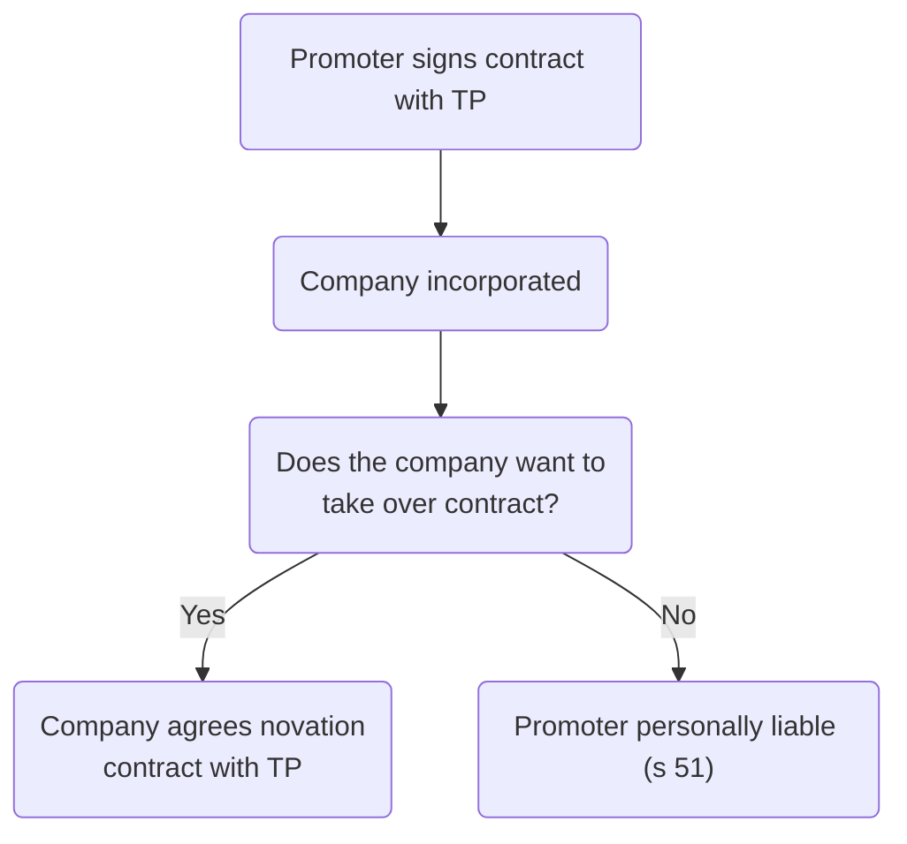

# Shareholders

- Shareholders are the owners of a company
- The term 'member' is more general and applies to company limited by guarantee too.

## Promoters

> [!defn] Promoter
> One who undertakes to form a company with reference to a given project and to set it going, and who takes the necessary steps to accomplish that purpose ([[Twycross v Grant (1877) 2 CPD 469]])

Note, this does not include professional advisers who help set up the company.

### Fiduciary Duty

> [!important]
> A promoter is placed in a **fiduciary relationship** with the company once it has formed. 

The primary fiduciary duty of the promoter is not to make a ‘secret profit’ when forming the company.

### Pre-incorporation Contracts

Prior to incorporation, the company does not exist, so it is impossible to act on behalf of the company (as agent). If the promoter does this, they are personally liable for any contract made, subject to any agreement to the contrary (s 51); the company does not have to take over the contract. If the company chooses to take the contract, a contract of novation with the third party required.

Possible solution: have the pre-incorporation contract contain a provision ending personal liability if the newly-formed company agrees to take over the contract on the same terms.

## Joining Company

To become a shareholder in a private company (s 112):

1. A person must agree to become a shareholder of the company
2. Their name must be entered in the register of members.

### Subscribers

Persons who signed the [[Memorandum]] of association as 'subscribers' automatically become the first shareholders of the company when the Registrar of Companies issues the certificate of incorporation (ss 112(1) & 16(5)).

> [!statute] s 112 - The members of a company
> (1) The subscribers of a company's memorandum are deemed to have agreed to become members of the company, and on its registration become members and must be entered as such in its register of members.
> (2) Every other person who agrees to become a member of a company, and whose name is entered in its register of members, is a member of the company.

> [!statute] s 16(5) - Effect of registration
> In the case of a company having a share capital, the subscribers to the memorandum become holders of the shares specified in the statement of capital and initial shareholdings.

### Buying Shares

The allottee (purchaser) agrees to become a shareholder by formally applying to the company to buy the new shares, and becomes a shareholder when their name is entered in the register of members (s 112(2)).

#### Transfer of Shares

1. The transferee (purchaser) agrees to become a shareholder by submitting the share transfer to the company, and becomes a shareholder when their name is entered in the register of members.
2. [[Directors]] must enter their name in the register of members, unless company [[Articles of Association]] give them discretion not to, in which case the shares remain legally owned by the seller.

A gift of shares is also known as a transfer of shares.

#### Inheriting Shares

May be bequeathed under a will or rules of intestacy (if there is no will). The shares will, upon death of the shareholder, automatically vest in the personal representatives of the deceased, in an operation of law known as **transmission of shares**.

If the personal representative is the beneficiary of the shares, they will become the shareholder. If not, they are a temporary shareholder, and the articles will usually provide for limited rights of ownership until the shares are transferred to the ultimate owner. The beneficiary must apply to register as a new shareholder.

#### Shareholder Insolvency

If a shareholder goes bankrupt, the bankrupt's property, including their shares, automatically vest in a trustee in bankruptcy. Also known as transmission of shares. The trustee will try to sell shares to raise money to pay off the bankrupt's debts – and they will usually have limited rights of ownership. New owner must register.

## Register of Members

> [!statute] s 113 - Register of members
> 
> (1) Every company must keep a register of its members.
> 
> (2) There must be entered in the register—
> - (a) the names and addresses of the members,
> - (b) the date on which each person was registered as a member, and
> - (c) the date at which any person ceased to be a member.
> 
> (3) In the case of a company having a share capital, there must be entered in the register, with the names and addresses of the members, a statement of—
> - (a) the shares held by each member, distinguishing each share—
> 	- (i) by its number (so long as the share has a number), and
> 	- (ii) where the company has more than one class of issued shares, by its class, and
> - (b) the amount paid or agreed to be considered as paid on the shares of each member.
> 
> (4) If the company has converted any of its shares into stock, and given notice of the conversion to the registrar, the register of members must show the amount and class of stock held by each member instead of the amount of shares and the particulars relating to shares specified above.
> 
> (5) In the case of joint holders of shares or stock in a company, the company's register of members must state the names of each joint holder.
> 
> In other respects joint holders are regarded for the purposes of this Chapter as a single member (so that the register must show a single address).
> 
> (6) In the case of a company that does not have a share capital but has more than one class of members, there must be entered in the register, with the names and addresses of the members, a statement of the class to which each member belongs.
> 
> (7) If a company makes default in complying with this section an offence is committed by—
> - (a) the company, and
> - (b) every officer of the company who is in default.
> 
> (8) A person guilty of an offence under this section is liable on summary conviction to a fine not exceeding level 3 on the standard scale and, for continued contravention, a daily default fine not exceeding one-tenth of level 3 on the standard scale.

Note that the system is very different for publicly traded companies, which have thousands of shares held in electronic form.

> [!question] Can [[Private companies]] elect not to keep their own register of members?
> - Yes - s 128D(2) CA 2006 - if they ensure necessary information is filed and kept up-to-date on the Companies House central register. 
> - All shareholders must agree for this election to be valid (s 128B(2)(a)), and the Registrar of Companies must be notified (CA 2006, ss 128B(3) and 128C(1)). 
> - During the time that this election not to have a register of members is in force, the company must notify the Registrar of Companies as soon as is reasonably practicable of any information that otherwise would have gone into the register of members (s 128E(2)). 
> - This election can be withdrawn and the register of members reactivated following the procedure in s 128J.

### Content and Form

- The register must be updated whenever necessary to reflect any changes in the membership of the company.
- Can be hard copy or electronic (s 1135)
- Criminal offence by the company and any officer in default, punishable by fine, if the register of members does not contain correct information (s 113(7) & (8)).

#### Single Shareholder

> [!statute] s 123 - Single member companies
> (1) If a limited company is formed under this Act with only one member there shall be entered in the company's register of members, with the name and address of the sole member, a statement that the company has only one member.
> 
> (2) If the number of members of a limited company falls to one, or if an unlimited company with only one member becomes a limited company on re-registration, there shall upon the occurrence of that event be entered in the company's register of members, with the name and address of the sole member—
> - (a) a statement that the company has only one member, and
> - (b) the date on which the company became a company having only one member.
> 
> (3) If the membership of a limited company increases from one to two or more members, there shall upon the occurrence of that event be entered in the company's register of members, with the name and address of the person who was formerly the sole member—
> - (a) a statement that the company has ceased to have only one member, and
> - (b) the date on which that event occurred.

#### Entering Information

##### Promptness

> [!statute] s 771(1)
> When a transfer of shares in or debentures of a company has been lodged with the company, the company must either—
> - (a) register the transfer, or
> - (b) give the transferee notice of refusal to register the transfer, together with its reasons for the refusal,
> 
> as soon as practicable and in any event within two months after the date on which the transfer is lodged with it. 

##### Prospective Shareholder Status

The prospective new shareholder’s status between the date on which they acquire the shares

and the date on which their name is entered on the register of members, is that they are

beneficially entitled to the shares but are not the registered legal owner of them.

The legal owner must vote at a meeting in accordance with the instructions of the prospective shareholder, and must account to the prospective shareholder for any dividends.

##### Court Power

The court has the power under s 125 to rectify the register of members for an unwanted omission or entry, or for default or unnecessary delay in removing a shareholder’s name when leaving the company.

It may at the same time order the company to pay damages to a wronged person and settle any disputes regarding ownership ([[Avenue Road Developments Ltd v Reggies Co Ltd [2012] EWHC 1625 (Ch)]]).

#### Inspection

Under s 114(1), where the company does not keep this information on the public register at Companies House, the register of members must be kept either at the company’s registered office, or at its ‘single alternative inspection location’ (SAIL) if specified under s 1136.

> [!statute] s 116 - Rights to inspect and require copies
> 
> (1) The register and the index of members' names must be open to the inspection—
> - (a) of any member of the company without charge, and
> - (b) of any other person on payment of such fee as may be prescribed.
> 
> (2) Any person may require a copy of a company's register of members, or of any part of it, on payment of such fee as may be prescribed.
> 
> (3) A person seeking to exercise either of the rights conferred by this section must make a request to the company to that effect.
> 
> (4) The request must contain the following information—
> - (a) in the case of an individual, his name and address;
> - (b) in the case of an organisation, the name and address of an individual responsible for making the request on behalf of the organisation;
> - (c) the purpose for which the information is to be used; and
> - (d) whether the information will be disclosed to any other person, and if so—
> 	- (i) where that person is an individual, his name and address,
> 	- (ii) where that person is an organisation, the name and address of an individual responsible for receiving the information on its behalf, and
> 	- (iii) the purpose for which the information is to be used by that person.

##### Responding to Request

The company has five working days under s 117(1) of the CA 2006, either to:

1. Comply with the request
	- Must make clear the latest date on which amendments were made to the register (if any) and that there were no further amendments to be made (CA 2006, s 120(1)).
2. Apply to the court to disallow the request (if it thinks the request is not for a ‘proper purpose’) and thus prevent inspection or copying of the register.
	- Onus is on the company to show that the request was made for an improper purpose ([[Burberry Group plc v Richard Charles Fox-Davies [2014] EWCA Civ 604]])

> [!note] Rationale
> To protect privacy of shareholders where company is involved in controversial work.

##### Non-compliance Consequences

The company and every officer in default (under s 118(1)) will commit an offence for failure,

without a s 117 court order, to allow inspection or copying of the register; and the person

making the request will commit an offence (under s 119(1)) if they knowingly or recklessly

make a statement which is materially misleading, false or deceptive.

## PSC Register

s 790M of the CA 2006 requires companies to keep a ‘PSC register’ (Persons of Significant Control). The register must be made available for public inspection. Note that this requirement applies only to private companies and public companies that are not publicly traded.

> [!defn]
> A person off significant control is an individual or ‘relevant legal entity’ (RLE) (s 790C(6)), who (s 790 & Sch 1A):
> 1. owns $>25\%$ of the shares in the company (this would include non-voting shares, such as preference shares); or
> 2. owns or controls $>25\%$ of the voting rights in the company (this would usually be ordinary shares); or
> 3. has the right to appoint or remove a majority of the board of directors of the company; or
> 4. has the right to exercise, or who actually exercises, significant influence or control over the company.

### Obligation on Company

Under ss 790D and 790E of the CA 2006, the company is placed under an obligation to investigate, obtain and update information relevant to the register. Additional obligations are placed on the individual or individuals concerned by ss 790G and 790H, to notify the company of their significant control.

### Information to Include

| Individual | Relevant legal entity |
| ----------------------------- | -------------------------------------- |
| Name | Corporate or firm name |
| DOB | Registered or principal office |
| Nationality | Legal form of identity |
| Country of usual residence | Law by which governed |
| Address for service documents | Register of companies in which entered |
| Residential address | Registration number (if relevant) |

### Levels of Significant Control

Under the Register of People with Significant Control Regulations 2016 (SI 2016/339), there are **three different levels** of significant control which need to be notified and which need to be included in the PSC register, with percentage share holding $S$:

1. $25\% < S \leq 50\%$
2. $50\% < S < 75\%$
3. $S > 75\%$

790E(5): the company must include this information on the PSC register within 14 days from the day after it becomes aware of a change or has reasonable cause to believe there has been a change.

### Administration

- Can elect not to keep own register and just file with Companies House (s 790X)
- The company must notify Companies House when someone becomes a PSC or is no longer a PSC by using forms PSC01 to PSC09
- Deadline for form 14 days after deadline for completing register.

## Shareholders' Rights

Aside from limited liability, shareholders also have contractual rights.

### S 33 Contract

- 'Membership only' rights enforceable by the shareholder.
- Contract also imposes the obligation on the shareholder to observe the terms of the constitution.
- The rights will as a minimum cover sharing in the profits of the company, sharing in any surplus on a profitable winding up of the company and any voting rights at shareholder meetings.

### Shareholders' Agreement

See [[Shareholders' Agreements]]. This is a private contract between shareholders, not involving the company.

It is not compulsory for the shareholders to enter the agreement (though you can enforce by making anyone selling shares have as a term of the contract that the new owner will join).

Note that a shareholders' agreement can also include non-shareholders as parties.

#### Benefits

Breach of contract remedies available if parties breach terms. Advantages of putting terms in a shareholders' agreement rather than articles:

- A shareholders’ agreement can deal with matters which are personal to the shareholders, rather than just relating to their rights as members.
- A shareholders' agreement can help protect minority shareholders
	- Unanimity needed for a change of contract.
	- Can change things which wouldn't be possible under Articles; e.g., get all the shareholders to agree to unanimity to change the Articles of the company.
- Confidentiality – shareholders' agreement does not need to be made publicly available.

#### Limitations

1. Nothing may be included that fetters the company’s powers to exercise its statutory duties.
2. The shareholders cannot agree to anything that would bind them as to how they might vote as directors, if they also held this position, as otherwise they might possibly breach their duties as directors.

#### Statutory Rights

| Right                             | Details                                                                                                                                                                                                                                                                                                                                                                                                                                                     |
| --------------------------------- | ----------------------------------------------------------------------------------------------------------------------------------------------------------------------------------------------------------------------------------------------------------------------------------------------------------------------------------------------------------------------------------------------------------------------------------------------------------- |
| Share certificate                 | A shareholder must receive from the company a share certificate within two months either of allotment (if new shares are being issued) under s 769(1) of the CA 2006, or of lodging the transfer with the company (if existing shares are being transferred from an existing shareholder) under s 776(1) of the Act. Share certificate prima facie evidence of ownership (s 768(1))                                                                         |
| Register of members               | New shareholder has a right to be entered in register within 2 months (subject to any director discretion to refuse)                                                                                                                                                                                                                                                                                                                                        |
| Company documentation             | Company must send constitutional documents/ current statement of capital to shareholder on request (s 32). Annual accounts & reports must be sent each year, no request required (s 423)                                                                                                                                                                                                                                                                    |
| Inspect company documents         | Minutes kept at registered office or SAIL, which shareholders are permitted to read (s 358(1)). Other registers and information also must be available on request.                                                                                                                                                                                                                                                                                          |
| Voting rights                     | Right to vote at shareholder general meetings, either in person or by proxy (s 324(1)). Votes either by show of hands or poll vote. Shareholders with 10% of voting rights can demand poll vote.                                                                                                                                                                                                                                                            |
| Notice of GMs                     | If proper notice of GM not given to all shareholders, GM not valid (ss 307-311). Notice must include sufficient information of what is to be proposed, including exact wording of special resolutions and sufficient info on ordinary resolutions.                                                                                                                                                                                                          |
| Written resolution                | Shareholders holding $\geq 5\%$ voting shares (or less if articles specify) have the right to circulate a written resolution and accompanying 1000-word statement (s 292(1)). Request must be authenticated (signed) and identify resolution (s 293). Private company shareholder can be asked to pay the expenses of circulation (s 294(1)).                                                                                                               |
| Written statement                 | s 314(1): shareholders have the right to circulate a written 1000-word statement, if they hold $\geq 5\%$ voting shares, or at least 100 shareholders who hold at least an average of £100 paid up share capital (s 314(2)). Request must be deposited at company's registered office $\geq 1$ week before GM (s 314(4)). Company must circulate statement to all shareholders (s 315(1)). Can request expenses of circulation from shareholder (s 316(2)). |
| Removal of director               | s 168(1): director can be removed by ordinary resolution.                                                                                                                                                                                                                                                                                                                                                                                                   |
| Removal of auditor                | s 510(1): auditor can be removed by ordinary resolution.                                                                                                                                                                                                                                                                                                                                                                                                    |
| Court proceedings                 | Shareholders have the right to go to court in relation to most important transactions, e.g., to cancel a resolution approving the buy-back of shares (s 721(1)).                                                                                                                                                                                                                                                                                            |
| Calling GM                        | Requisitioning: shareholders holding $\geq 5\%$ voting shares have the right to require directors to call GM (s 303(1)) by depositing written request to company's registered office. If the directors don't, shareholders can call the GM themselves/ apply the court (s 306).                                                                                                                                                                             |
| Court ordered GM                  | s 306: any shareholder may apply to court for an order that GM be held. Court can order terms for GM, e.g., changing the quorum ([[Smith v Butler [2011] EWHC 2301 (Ch)]])                                                                                                                                                                                                                                                                                  |
| Breach of constitution            | Shareholder may seek to restrain a breach of [[Business Law and Practice/Company Law/Directors' duties]] before the event, or take action after under s 40                                                                                                                                                                                                                                                                                                                                        |
| [[Unfair Prejudice]]              | s 994(1): shareholder can petition court for a remedy if she feels unfairly prejudiced. Conduct may be unfairly prejudicial to all of the members or to only some or one of them ([[Re a Company (No 004175 of 1986) [1987] BCLC 574]]). Conduct must be both unfair and prejudicial.                                                                                                                                                                       |
| [[Just and equitable winding up]] | s 122(1)(g) IA 1986: any shareholder may make an application to have the company wound up on the ground that it is just and equitable to do so, provided they  can prove a 'tangible interest'. Common examples: where management is in deadlock, where shareholders no longer have confidence in management, where company can no longer carry out objects, and in quasi-partnership where a partner is excluded from management.                          |

#### Unfair Prejudice

- Whether [[Unfair Prejudice]] has occurred is judged objectively from the perspective of an impartial outsider.
- The essential element of ‘unfairness’ is breach of the agreement between shareholders as to how the company is to be run ([[O’Neill v Phillips [1999] 1 WLR 1092]]).
- The shareholder must also prove that they have been affected in their capacity as a shareholder, although this has been given a very wide interpretation ([[Gamlestaden Fastigheter v Baltic Partners Limited [2008] 1 BCLC 468]]).
- It is not necessary to prove that the value of the shareholder’s shares has been adversely affected, although frequently this will happened

> [!example]
> 1. non-payment of dividends;
> 2. directors awarding themselves excessive remuneration;
> 3. directors exercising their powers for an improper purpose (eg to ‘freeze out’ a minority shareholder); and
> 4. exclusion from management in a small company (eg one formed on the understanding that all those involved will share the running of the business and the profits).

| Case                                                                                  | Ratio                                                                                                                                                                                                                         |
| ------------------------------------------------------------------------------------- | ----------------------------------------------------------------------------------------------------------------------------------------------------------------------------------------------------------------------------- |
| [[VB Football Assets v Blackpool Football Club Ltd and Others [2017] EWHC 2767 (Ch)]] | Improper payments out of the company, a failure to pay dividends and deliberate exclusion from company decisions were unfairly prejudicial to a minority shareholder whereas changes to the articles of association were not. |
| [[Re CF Booth Ltd (sub nom Booth v Booth) [2017] EWHC 457 (Ch)]]                      | Excessive director remuneration when no dividends paid unfairly prejudicial                                                                                                                                                   |
| [[Sharafi v Woven Rugs Ltd (in administration) [2010] EWHC 230 (Ch)]]                 | Director's impropriety prejudicial.                                                                                                                                                                                           |

##### Remedy

If the court finds that a shareholder has suffered unfair prejudice, it may make any order it thinks appropriate under s 996(1) of the CA 2006.

The normal way of dealing with internal company disputes in small private companies where unfairly prejudicial conduct had been proved is an order for  
a share purchase under s 996 ([[Grace v Biagioli [2005] EWCA Civ 1022]]).

##### Limitations

1. In [[O'Neill v Phillips [1999] 1 WLR 1092 HL]], the House of Lords made it clear that although the court’s powers under s 996 of the CA 2006 were wide, that provision did not give an automatic right to withdrawal from a company where trust and confidence had broken down.
2. Where the parties had agreed to binding arbitration to settle a matter of unfair prejudice, proceedings would not be allowed under s 994 of the CA 2006 ([[Fulham Football Club (1987) Ltd v Richards [2011] EWCA Civ 855]]).

## Shareholders' Role

Generally limited: directors control things day-to-day. The shareholders can change things indirectly by appointing/ removing directors and voting at GMs.

## Protection of Minority Shareholders

### Majority Rule

Generally, the principle of majority rule governs companies.

> [!question] What happens if directors breach their duties to the company?
> Rule in [[Foss v Harbottle [1843]]]:
> 1. Proper claimant rule: the company, rather than shareholder, must bring a claim for a wrong done to the company. 
> 2. Internal management rule: courts will not interfere with the internal management of a company acting within its powers. So when a wrong is alleged, it is for a majority of shareholders to decide whether to make a claim on behalf of the company or to ratify the wrong by ordinary resolution. 

### Statutory Protection

These are pretty watered down. But still have:

- Unfair prejudice protections
	- Stops e.g., a director sanctioning their own misdemeanours.
- If you have 5% voting rights, can circulate written resolution, requisition GM or circulate written statement.
- Petition court for winding up (rare)
- If 25% can stop special resolutions.

### Shareholders Agreement

Can protect minority shareholders.

### Ratification

The right of the majority to pass an ordinary resolution to ratify wrong-doing in the company cannot be exercised where the approval of that action would be illegal or requires a special resolution under the CA 2006.

### Amending Articles

The company’s articles must be ‘bona fide for the benefit of the company as a whole’, and that they may be challenged if they are made with the intention of discriminating against minority shareholders.

### Derivative Claims

See [[Derivative claims]]. There are circumstances in which a minority shareholder is permitted to bring a ‘derivative claim’ in the company’s name for a wrong committed against the company.

> [!warning]
> This is an exception to the rule in [[Foss v Harbottle [1843]]]. Can only be used where the minority shareholder wishes to make a claim in respect of a wrong committed against them, rather than against the property. 

A claim may be brought by any shareholder under s 260(3) of the CA 2006 for an actual or proposed act or omission involving negligence, default, breach of duty or breach of trust by a  
director. There is no need to demonstrate any actual loss suffered by the company, or indeed any benefit gained by the directors.

#### Stages

There are two stages:

1. Preliminary stage to decide whether the applicant is entitled to bring a claim
	1. s 261(1): claim dismissed if no prima facie case
	2. Then decide whether to hold a full hearing (s 261(4))
2. Hearing of the claim.

Aim is to weed out 'frivolous or vexatious' claims.

#### Relevant Factors

The court will consider:

1. whether or not the shareholder is acting in good faith in bringing the claim;
2. the importance a director (who is under a duty to promote the success of the company under s 172 of the CA 2006) would place on continuing the claim; and
3. whether authorisation or ratification of the wrong by the company would be likely.

The court must also have particular regard to any evidence put before it as to the views of shareholders who have no personal interest in the matter (CA 2006, s 263(4)).

#### Automatic Refusal

The court must refuse permission under s 263(2) if:

1. a person acting in accordance with the director’s duty under s 172 of the CA 2006 (duty to promote the success of the company) would not seek to continue the claim; or
2. the act or omission forming the basis of the claim has been authorised or ratified by the company. Under s 239 of the CA 2006, the ratification must be passed by the shareholders without the votes of the director concerned (assuming the director is a shareholder) or a person connected to them (e.g., their wife or civil partner).

#### Remedy

If this claim is successful, it will result in  
a remedy being awarded to the company and not the shareholder, as a derivative claim is being brought on behalf of the company.

## Types of Shareholder

- Single member company (possible under s 7)
- Holder of ordinary/ preference [[Shares]]
- Possible to hold a share jointly! s 113(5)
- Corporate shareholder
	- Required to appoint a human to act on its behalf at general meetings. Can be a proxy or corporate representative.
	- s 323(1): corporate representative appointed by a resolution of the board of directors
	- Representative then has the same powers as an individual shareholder (s 323(2)).
- Public company shareholder: more rights, more responsibilities.

## Shareholder Power

| Shareholding | What shareholders can do | Restrictions |
| :--- | :--- | :--- |
| 100% | pass all resolutions at will | legality |
| 75% | pass special resolution | weighted voting rights (if in articles) unfair prejudice petition (if wrongdoing) |
| over 50% | pass ordinary resolution | weighted voting rights (if in articles) unfair prejudice petition (if wrongdoing) |
| over 25% | block special resolution |  |
| 10% | demand poll vote |  |
| 5% | circulate a written resolution requisition a general meeting circulate a written statement |  |
