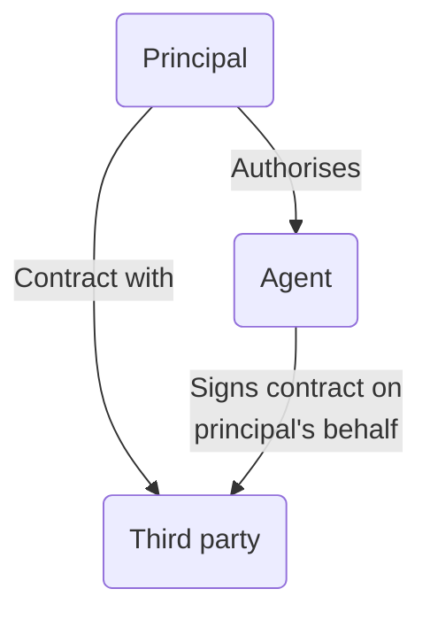
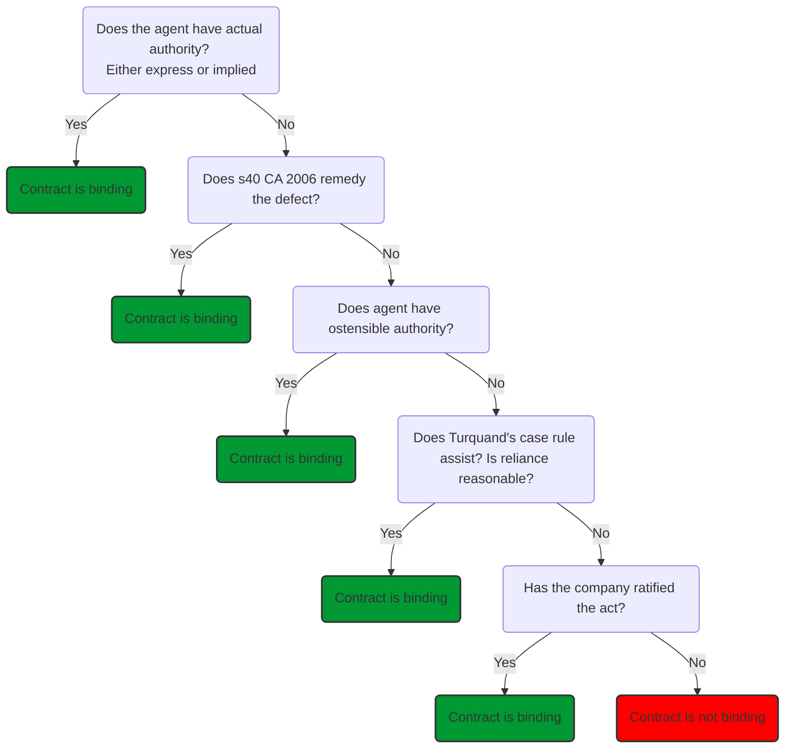

# Capacity and Authority

## Contractual Liability of a Company

When do the acts of directors or employees bind the company to obligations to third parties, and does the company have capacity to be bound?

Historically, the power of a company to enter into a transaction was limited by:

1. [Capacity](https://www.youtube.com/watch?v=d1x5GXMdK50)
2. Authority

## Capacity

Asks whether the act was within the power of the company. Historically, it was necessary to check the objects clause in the memorandum to ascertain what acts and/or business the company was empowered to participate in. Transactions outside the company's powers would be **void and unenforceable** ('*ultra vires*') against the company, even if shareholders attempted to ratify the act. Rationale: company was not incorporated with the requisite capacity ([[Ashbury v Riche 1875]]).

## Ultra Vires Doctrine

Doctrine referring to the situation where a body purports to act outside its power. Derives from public law: public bodies granted certain powers by Parliament, beyond which they cannot stray. Doctrine applied to registered companies to protect creditors and shareholders (e.g., [[Re German Date Coffee Co [1882] 20 Ch D 169]]).

### Problems

But doctrine was problematic:

- Objects clause initially not permitted to be altered. Could only be altered in very limited circumstances until 1991, when CA 1985 amendments came through
- Made diversification difficult
- Doctrine of constructive notice meant that anyone dealing with a company was deemed to have knowledge of the contents of its objects clause, so would be unable to argue they did not know the company lacked capacity to enter into transaction. Doctrine applied to all publicly available documents.

Effect was super long objects clauses from 60s to 90s. Very general and broad objects clauses accepted ([[Bell Houses Ltd v City Wall Properties Ltd [1966] 2 QB 656]]). Post 1991 registered companies specified in the memorandum that the company was a 'general commercial company', giving it power to carry on any trade or business and had power to do all such things as were incidental or conducive thereto. But issues of ultra vires still came before the courts: [[Re Introductions Ltd v National Provincial Bank [1970] Ch 199]].

There were recommendations for reform in the law to protect third parties. After the UK joined the European Community, in 1973 the First European Community Company Law Harmonisation Directive removed the doctrine of constructive notice where it concerned the memorandum and articles. It also contained a saving provision for ultra vires transactions where the transaction was dealt with by directors, and a third party was acting in good faith.

### Reform

CA 1985 introduced a reform that the memorandum could be altered by special resolution, letting companies change their objects clause (s 4), and allowed companies to have a general objects clause stating that the company was to carry on business as a 'general commercial company' (s 3A), allowing them to carry on any trade or business whatsoever.

CA 2006 brought further changes:

1. s 35 CA 1985 had removed the doctrine of constructive notice in relation to a company's memorandum and articles. This was enshrined in [s 39(1) CA 2006](https://www.legislation.gov.uk/ukpga/2006/46/section/39): 'The validity of an act done by a company shall not be called into question on the ground of lack of capacity by reason of anything in the company's constitution'
2. The requirement of an objects clause in the memorandum was completely removed. [s 31 CA 2006](https://www.legislation.gov.uk/ukpga/2006/46/section/31): the default position is now that all companies have unrestricted objects.

Many older companies still have an objects clause.

- These are treated as if they are a provision of the articles ([s 28(1) CA 2006](https://www.legislation.gov.uk/ukpga/2006/46/section/28)) and will continue to bind the company unless altered by special resolution.
- If the company adopts new articles, then this treats the objects clause as having been removed
- Any constitutional restrictions on a company's capacity have no bearing on [[Liability in tort and crime]].

## Agency and Authority

It needs to be questioned whether the individual who contracted on the company's behalf was authorised to do so. If not, then the transaction would be voidable at the instance of the company.

General agency law: an agent appointed by a principal to act on their behalf. An agent contracts on the principal's behalf and the contract will be entered into between the principal and the third party, not the agent. To validly represent the principal and bind them, the agent needs authority. May be actual (express or implied) or deemed (under statute or common law).



## Actual Authority

An actual authority of an agent is the authority that has been actually conferred on them by the principal.

Diplock LJ in [[Freeman and Lockyer v Buckhurst Park Properties (Mangal) Ltd [1964] 2 QB 480]]:

> An 'actual' authority is a legal relationship between principal and agent created by a consensual agreement to which they alone are parties. Its scope is to be ascertained by applying ordinary principles of construction of contracts.

### Directors' General Authority

[MA 3](https://www.gov.uk/government/publications/model-articles-for-private-companies-limited-by-shares/model-articles-for-private-companies-limited-by-shares#generalauthority): Subject to articles, directors are responsible for management of the company's business, for which purpose they may exercise all powers of the company.

[MA 5 & 6](https://www.gov.uk/government/publications/model-articles-for-private-companies-limited-by-shares/model-articles-for-private-companies-limited-by-shares#delegate): Directors also have authority to delegate their powers to others.

Actual authority can be express or implied.

### Implied Actual Authority

1. From appointment to a specific role in a company
	- It is only the relationship between the principal and the agent which is relevant to determining whether implied actual authority exists
	- e.g., appointment of a managing director carries with it the powers of that person to do all such acts necessary to manage the company, including those not expressly stated in their contract ([[Smith v Butler [2012] EWCA Civ 314]])
2. From a course of dealing  
	e.g., where director or agent continually enters into specific transactions and board of directors acquiesces or agrees to this ([[Hely-Hutchinson v Brayhead Ltd [1968] 1 QB 549]])

 It is the authority of an agent to do acts which are reasonably incidental to and necessary for the effective performance of his duties. The contents of implied authority depend on the facts of the case and is sometimes determined by the usages and customs of a trade, profession, or business.

## Deemed Authority

The agent has no actual authority but can still bind the principal. Three cases:

### Statutory Deemed Authority (s 40 CA 2006)

- The purpose is to protect third parties where there are restrictions on the power of the company's agents to bind the company set out in the company's constitution
- So the company cannot claim not to be bound by acts of its directors by asserting these are unconstitutional – even when the company's articles require specific shareholder or board approval for a particular act

```ad-statute
title: s 40 - Power of directors to bind the company

(1) In favour of a person dealing with a company in good faith, the power of the directors to bind the company, or authorise others to do so, is deemed to be free of any limitation under the company's constitution.

(2) For this purpose -
- (a) a person “deals with” a company if he is a party to any transaction or other act to which the company is a party,
- (b) a person dealing with a company -
	- (i) is not bound to enquire as to any limitation on the powers of directors to bind the company or authorise others to do so,
	- (ii) is presumed to have acted in good faith unless the contrary is proved, and
	- (iii) is not to be regarded as acting in bad faith by reason only of his knowing that an act is beyond the powers of the directors under the company's constitution.

(3) The references above to limitations on the directors' powers under the company's constitution include limitations deriving -
- (a) from a resolution of the company or of any class of shareholders, or
- (b) from any agreement between the members of the company or of any class of shareholders.
```

Note, this protects third parties, not directors. Director can be sued by company for losses/ disqualified.

### Deemed Authority at Common Law – Ostensible Authority

Determined by looking at the relationship between the principal and third party. Refers to the authority of an agent as it appears to the third party.

Upheld in [[Freeman and Lockyer v Buckhurst Park Properties (Mangal) Ltd [1964] 2 QB 480]].

An agent is said to have apparent or ostensible authority if:

1. The principal has made a representation (by words or conduct) to the third party to the effect that the agent has the authority to act for him, although the agent does not in fact have such authority.
2. The third party has in fact relied on such representation to deal with the agent.
3. The third party has altered his position resulting from such reliance, for example, assuming obligations under a contract with the agent.

### Deemed Authority at Common Law – 'indoor Management' Rule

A rule of less significance due to s40 CA 2006, but still applies where the third party has not dealt directly with the board or a question of whether the agent was authorised by the board applies. Derived from [[Royal British Bank v Turquand (1856) 6 E & B 327]]: outsiders are entitled to assume that a company's internal procedures have been complied with.

But this does not apply where the third party has actual notice of the irregularity or is not acting in good faith ([[Rolled Steel Ltd v British Steel Corpn [1986] Ch 246]]) or when the third party is an insider entering a contract with the company ([[Morris v Kanssen [1946] AC 459]]).

Given s 40 CA 2006: the rules in Turquand's case now apply

- where there are potential questions over the execution of documents, the passing of authorising resolutions and the regularity of appointments, where nothing has occurred which would be contrary to company's constitution
- where director appointed Managing Director, but relevant formalities of that appointment not complied with

## Ratification

Company is able to ratify acts beyond the actual authority of its agents. Involves passing a resolution to approve the act and agreeing that the company will be bound to it.

e.g., [[New Falmouth Resorts Ltd v International Hotels Jamaica Ltd [2013] UKPC 11]]

## Summary


