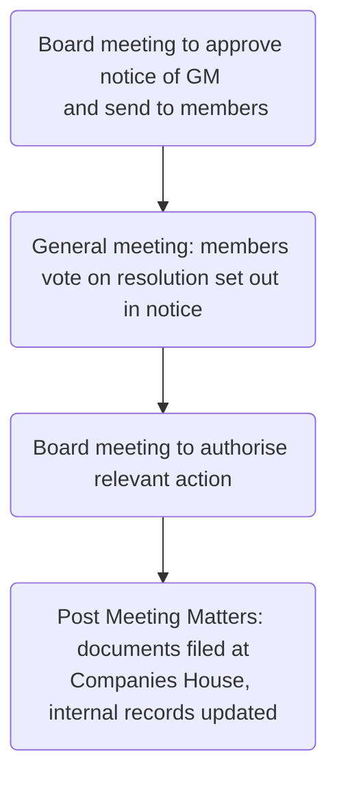

# Company procedure

## Organising Board Meeting

[MA 9](https://www.gov.uk/government/publications/model-articles-for-private-companies-limited-by-shares/model-articles-for-private-companies-limited-by-shares#pollvotes) gives directors flexible in regulating their meetings, providing that any director may call a board meeting or require the company secretary (if there is one) to do so at any time.

### Notice

Reasonable notice of a board meeting is necessary, and this is whatever notice it is usual for the directors to give ([[Brown v La Trinidad (1887) 37 Ch. D. 1]]). Therefore, if all the directors are in the same building, the meeting could be called almost immediately, if such notice is customary for the directors.

See [[Resolutions#Board resolutions]] for details on quorum and voting.

### Consulting Shareholders

The shareholders need to be consulted where

- the matter is **outside** the power of directors and must be approved by shareholder resolution
	- e.g., making amendments to a company's articles of association (s 21 CA 2006)
- the matter is **within** the powers of directors but **requires prior approval** of the shareholders to act ([s 197 CA 2006](https://www.legislation.gov.uk/ukpga/2006/46/section/197))
	- e.g., making a loan to a director

## Organising AGM

See [[General Meeting]].

[s 307 CA 2006](https://www.legislation.gov.uk/ukpga/2006/46/section/307) prescribes minimum notice periods for general meetings – for [[Private companies]], 14 clear days' notice[^1] required ([s 307(1) CA 2006](https://www.legislation.gov.uk/ukpga/2006/46/section/307)).

To convene the general meeting, the board must inform the shareholders of when and where it is taking place, giving notice to the shareholders. The form of the notice of the GM must be approved by the directors (to confirm that it complies with all statutory requirements) and they must authorise its circulation to the shareholders.

The quorum for a GM is generally two shareholders ([s 318(2) CA 2006](https://www.legislation.gov.uk/ukpga/2006/46/section/318)), or one for single member companies.

After the general meeting, a second board meeting necessary to implement changes voted upon.

[^1]: "Notice of a GM" has two distinct meanings; can mean either a document sent to shareholders, or the period of time between calling a GM and the GM

### Short Notice GMs

General meetings may be called on short notice if enough members agree. [s 307(5) CA 2006](https://www.legislation.gov.uk/ukpga/2006/46/section/307) says for a private company, a general meeting may be called on short notice if agreed to by a majority who hold voting shares with a nominal value of $\geq 90\%$ of the total stock. Can be increased by up to 95% by Articles.  

## Written Resolutions Procedure

Legislation | Rule
---|---
Art 8(2) MA | Directors can take decisions in form of directors' written resolution provided prescribed procedure is followed.
[s 281 CA 2006](https://www.legislation.gov.uk/ukpga/2006/46/section/281) | Only [[Private companies]] can pass shareholders resolution by way of written resolution
[s 282 CA 2006](https://www.legislation.gov.uk/ukpga/2006/46/section/282) | Written ordinary resolution can be passed by simple majority of total voting rights
[s 283 CA 2006](https://www.legislation.gov.uk/ukpga/2006/46/section/283) | Written special resolution can be passed by majority of members with $\geq 75\%$ of total voting rights
[s 284 CA 2006](https://www.legislation.gov.uk/ukpga/2006/46/section/284) | Where company has a share capital, every member has one vote in respect to each share held, during a written resolution
[s 288 CA 2006](https://www.legislation.gov.uk/ukpga/2006/46/section/288) | Resolutions to remove director or auditor from office can't be done by written resolution

## Post-meeting

- Copies of all resolutions affecting company's constitution must be sent to Registrar of Companies within 15 days of being passed
- All special resolutions must be filed ([s 17(b) CA 2006](https://www.legislation.gov.uk/ukpga/2006/46/section/17), [s 29(1)(a) CA 2006](https://www.legislation.gov.uk/ukpga/2006/46/section/29), as do some specific ordinary resolutions
- Copies of any amended articles must be filed ([s 26(1) CA 2006](https://www.legislation.gov.uk/ukpga/2006/46/section/26), along with various forms.
- Directors responsible for updating statutory books, e.g., the registers of members and directors, and the BM and GM minute books.

## Consequences

If correct procedure is not followed, resolutions may be deemed invalid. May be criminal sanctions ([s 248(3) and (4) CA 2006](https://www.legislation.gov.uk/ukpga/2006/46/section/248) says if a company fails to record minutes of meetings in relevant statutory books, every officer liable for a fine).
