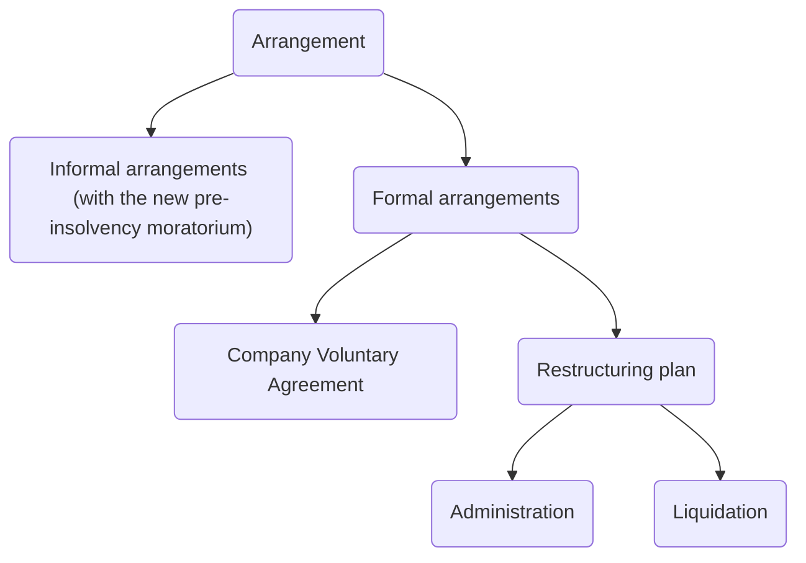

# Corporate Insolvency

## Introduction

Principle statute: the [Insolvency Act 1986](https://www.legislation.gov.uk/ukpga/1986/45/contents). This has been significantly amended by various legislation:

- The [Enterprise Act 2002](https://www.legislation.gov.uk/ukpga/2002/40/contents) aimed to promote the rescue of companies and introduced a new administration procedure
- [Small Business Enterprise and Employment Act 2015](https://www.legislation.gov.uk/ukpga/2015/26/contents/enacted)
- [Insolvency (England and Wales) Rules 2016](https://www.legislation.gov.uk/uksi/2016/1024/contents/made)
- [Corporate Insolvency and Governance Act 2020](https://www.legislation.gov.uk/ukpga/2020/12/contents/enacted)

IA 1986 introduced two key insolvency procedures aimed at achieving the objective of corporate rescue:

1. Company voluntary arrangements (CVAs)
2. Administration

[CIGA 2020](https://www.legislation.gov.uk/ukpga/2020/12/contents/enacted) introduced the pre-insolvency moratorium and the restructuring plan aimed at rescuing a company.

Insolvency is defined in [s 122(1)(f) IA 1986](https://www.legislation.gov.uk/ukpga/1986/45/section/122): a company may be wound up “if is it unable to pay its debts”.

## Tests

4 tests for insolvency:

Test | Description
---|---
Cash flow test | An inability to pay debts as they fall due ([s 123(1)(e) IA 1985](https://www.legislation.gov.uk/ukpga/1986/45/section/123))
Balance sheet test | Company's liabilities are greater than its assets (s 123(2))
Failure to comply with a statutory demand for a debt of over £750 | s 123(1)(a)
Failure to satisfy enforcement of a judgment debt | s 123(1)(b)

## Directors' Obligations

The directors must review the financial performance of a company and recognise when it is facing financial difficulties. Examples of financial difficulty include the following:

- Company has many unpaid creditors putting pressure on it to pay its debts
- Company has an overdraft which is fully drawn, and the bank is refusing to provide further credit
- Company has loans and other liabilities that exceed the value of its assets.

## Options for Company in Financial Difficulty

The directors have different options:

Option | Details
---|---
Do nothing | The directors risk personal liability under IA 1986 and breach of directors' duties under CA 2006
Apply for a pre-insolvency moratorium | Gives a company some breathing space
Do a deal | Reaching an informal or formal agreement with the company's creditors with a view to rescheduling debts.
Appoint administrator (see [[Administration and receivership]]) | Collective formal insolvency procedure (procedure considering the interests of all creditors). Aims, if possible, to rescue the company.
Put the company into [[Liquidation]] | Collective insolvency procedure under which a company's business is wound up, and its assets transferred to creditors. If there is a surplus of assets over liabilities, assets also transferred to members.

## Insolvency Procedures

A key feature of CVAs and restructuring plans is that the directors remain in control of the company and can exercise all their powers in the usual way. This happens with the supervision of an insolvency practitioner.

By contrast, in administration and [[Liquidation]], the administrators and liquidators respectively take control of the company and the directors are then unable to take decisions on behalf of the company.



### Informal Agreements

To avoid the time and cost of formal insolvency proceedings, informal negotiations can be held between a company and its creditors. The difficulty is getting all the creditors to agree at the same time. These are practical measures.

```ad-example

If a company needs to persuade a bank to keep lending money to enable it to keep trading, the company or its directors could offer the bank to:
- make additional payments or offer the bank additional security;
- reschedule outstanding debts; and/or
- reduce or hold over employees' salaries for a set period.
```

Creditors can enter into **standstill agreements** whereby they agree not to take enforcement action for a certain period of time, to give a company the breathing space to reach agreement with its other creditors. It is anticipated that the use of this will decline with the introduction of pre-insolvency moratorium under CIGA 2020.

### Pre-insolvency Moratorium

Introduced by [CIGA 2020](https://www.legislation.gov.uk/ukpga/2020/12/contents/enacted). A “moratorium” is a period during which creditors are unable to take action to enforce their debts, any existing court proceedings are stayed, and the company may not be wound up. It creates a breathing space for the company to attempt to resolve the situation.

#### Time Constraints

This lasts for 20 business days, but can be extended by directors for a further 20 business days. Further extensions are possible with the consent of a requisite majority of creditors and/ or court order.

The maximum period is one year, subject to a court order to extend further. The moratorium automatically comes to an end when the company enters into formal insolvency procedure.

#### Procedure

To obtain a pre-insolvency moratorium, the directors of the company must apply to court ([s A3 IA 1986](https://www.legislation.gov.uk/ukpga/1986/45/section/A3)). This must be accompanied by ([s A6 IA 1986](https://www.legislation.gov.uk/ukpga/1986/45/section/A6)):

1. A statement that the company is, or is likely to become, unable to pay its debts as they fall due
2. A statement from a licensed insolvency practitioner, known as a Monitor (usually an accountant), stating:
	- The company is an eligible company ([Schedule ZA1 IA 1986](https://www.legislation.gov.uk/ukpga/1986/45/schedule/ZA1)), and
	- It is likely that a moratorium will result in the rescue of the company.

The moratorium comes into force at the time that the documents are filed at the court ([s A7(1)(a) IA 1986](https://www.legislation.gov.uk/ukpga/1986/45/section/A7)). The monitor then has the responsibility to notify the registrar of companies and all the creditors of the company that the moratorium is in force ([s A8 IA 1986](https://www.legislation.gov.uk/ukpga/1986/45/section/A8)).

If a CVA plan is implemented/company enters administration/ company enters liquidation, the moratorium will automatically come to an end ([s A16 IA 1986](https://www.legislation.gov.uk/ukpga/1986/45/section/A16))

The monitor has a supervisory function during the pre-insolvency moratorium.

### Company Voluntary Arrangement (CVA)

The CVA is a compromise between a company and its creditors. Defined in [s 1(1) IA 1986](https://www.legislation.gov.uk/ukpga/1986/45/section/1) as

> “A composition in satisfaction of its debts or a scheme of arrangement of its affairs”.

The essence of a CVA is that the creditors agree to part payment of the debts or to a new timetable for repayment. The agreement must be reported to court, but there is no requirement for the court to approve the arrangement.

The CVA is supervised and implemented by an Insolvency Practitioner. But the company's directors remain in post and are involved in the implementation. Can also be used together with administration or liquidation.

#### Setting up CVA

- If the company is not in liquidation or administration, the directors draft the written proposals and appoint a nominee (an insolvency practitioner).
- The directors submit the proposals and a statement of the company's affairs to the nominee [(s 2(3) IA]((https://www.legislation.gov.uk/ukpga/1986/45/section/2))).
- The nominee considers the proposals, and, within 28 days, must report to court on whether to call a meeting of company and creditors ([s 2(1) and 2(2) IA 1986](https://www.legislation.gov.uk/ukpga/1986/45/section/2)).
- Nominee gives 14 days' notice of meeting to creditors. A meeting of the members must take place within 5 days of the creditors' decision
- Voting: proposals must be approved by
	- 75% in value of creditors (excluding secured creditors); and
	- A majority in value of unconnected creditors (investors not connected to the company) ([s 4A IA]((https://www.legislation.gov.uk/ukpga/1986/45/section/4))); and
	- A simple majority of members.

#### Effect of a CVA

A CVA is binding on all unsecured creditors, including those who did not vote/ voted against it. But secured/ preferential creditors are **not** bound unless they unanimously consent to the CVA ([s 4 IA 1986](https://www.legislation.gov.uk/ukpga/1986/45/section/4)).

#### Using CVAs

CVAs are used, either alone or within administration, in order to attempt to reach a compromise with creditors. They are particularly used when trying to get landlords to agree to a rent reduction in order to allow the company wiggle room to keep trading.

| Advantages                                                                                                                                                      | Disadvantages                                                                                           |
| --------------------------------------------------------------------------------------------------------------------------------------------------------------- | ------------------------------------------------------------------------------------------------------- |
| Directors retain control of the company, which is able to continue trading under a successful CVA and may exit this procedure as a solvent, profitable company. | Secured or preferential creditors are not bound unless they unanimously consent to the CVA (s 4(3) IA). |
| Binding on unsecured creditors (s 5(2)(b) IA) irrespective of how they voted.                                                                                   | Relatively complex procedure                                                                            |
| No court approval required, so costs less and is quicker than other insolvency procedures. Can be used alongside administration or liquidation.                                                                     | No longer offers a moratorium                                                                           |

Overall, CVAs are relatively rarely used due to the complexity of the procedure, and the fact that secured/ preferential creditors are not bound. This will probably fall further and be replaced by the Restructuring Plan introduced by CIGA 2020.

- [Clarks' use of CVA](https://www.theguardian.com/business/2020/nov/20/landlords-accuse-clarks-over-legal-deal-to-cut-shop-rents)
- [New Look's use of CVA](https://www.theguardian.com/business/2020/sep/15/new-look-strikes-deal-on-rent-cuts-and-payment-holidays)

### Restructuring Plan (CIGA 2020)

The purpose of the Plan is to compromise a company's creditors and shareholders, and restructure its liabilities so that a company can return to insolvency. The plan can bind secured creditors.

Relevant provisions: [Part 26A CA 2006](https://www.legislation.gov.uk/ukpga/2006/46/part/26A) (as amended by CIGA 2020). A plan can only be used by companies which have or are likely to encounter financial difficulties.

#### Key Features

- Creditors and members must be divided into classes. Each class which votes on the Plan must be asked to approve it. The Plan must be approved by $\geq 75\%$ in value of each class voting.
- The court must sanction the Plan, and it will then bind all creditors.
- The parties who can apply to the court for sanction of a restructuring plan are (s 901C(2) CA):
	- The company
	- Any creditor
	- Any member
	- The liquidator (if company is in liquidation)
	- The administrator (if company is in administration)

#### Advantages

The court can sanction a Plan if it is **just and equitable** to do so, even if:

- One or more classes do not vote to approve the plan
- It brings about a cross class cramdown;
	- Where a class of creditor can force the Plan on another class of creditor who has voted against the Plan
- It brings about a cramdown of shareholders;
	- Shareholders are forced to accept the Plan, even if it means diluting equity by creating [[debt-for-equity swaps]].

#### Usage

- A plan is likely to be used by directors following the use of a pre-insolvency moratorium. The company may apply for the pre-insolvency moratorium to protect itself, whilst the arrangements are made for the implementation of the Plan. The moratorium will end once the Plan received court sanction.
- Can also be used by administrators and liquidators
- May be better than a CVA because it can compromise the rights and claims of secured creditors and shareholders (which a CVA can't do).

See [Virgin Atlantic restructuring plan](https://uk.practicallaw.thomsonreuters.com/w-027-5147?transitionType=Default&contextData=(sc.Default)&firstPage=true).

## Directors' Liability, Insolvent Company

When a company becomes insolvent, the directors need to be careful how they act, since they may be held personally liable to compensate the company and its creditors if found guilty of:

- [[Misfeasance]] ([s 212 IA 1986](https://www.legislation.gov.uk/ukpga/1986/45/section/212))
- [[Fraudulent trading]] ([s 213 IA 1986](https://www.legislation.gov.uk/ukpga/1986/45/section/213), [246ZA IA 1986](https://www.legislation.gov.uk/ukpga/1986/45/section/246ZA))
- [[Wrongful trading]] ([s 214 IA 1986](https://www.legislation.gov.uk/ukpga/1986/45/section/214)/ [246ZB IA 1986](https://www.legislation.gov.uk/ukpga/1986/45/section/246ZB))

Liquidators and administrators have the power to bring proceedings for compensation against the directors personally for [[fraudulent trading]] and [[Wrongful trading]]. Liquidators can also bring proceedings for [[misfeasance]].
