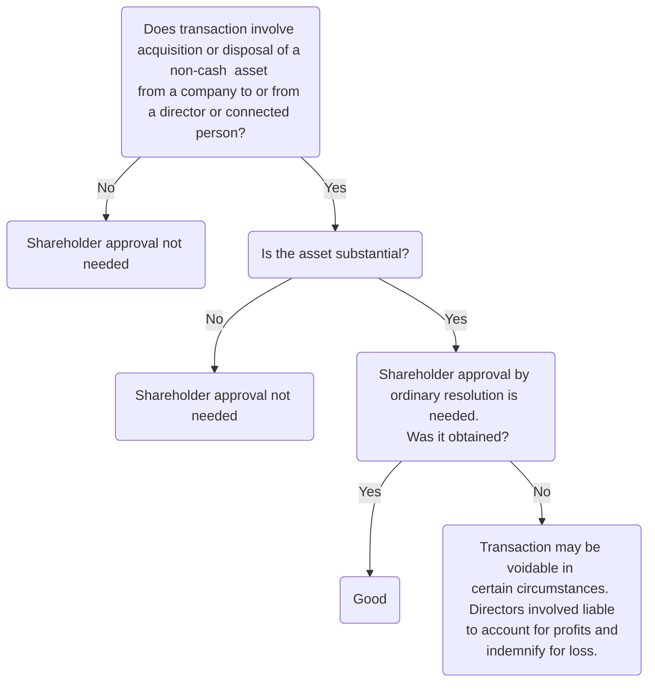

# Directors' duties

Directors' duties developed by courts of equity but codified in CA 2006. Note remedies for breach not codified (s 178: existing common law and equitable remedies still apply).

## Duties Owed to Whom

[s 170(1) CA 2006](https://www.legislation.gov.uk/ukpga/2006/46/section/170): general duties of directors owed by director to the **company**, not to shareholders directly. Note, this codifies in statute the principle originally established in [[Foss v Harbottle [1843] ]]. So company would be the claimant in proceedings concerning breach of duty by a director.

If director exceeds powers/ breaches duties, can be liable to company for loss caused. Liability for breach can be avoided if director's conduct capable of subsequent approval or ratification by shareholders ([s 239 CA 2006](https://www.legislation.gov.uk/ukpga/2006/46/section/239)).

Might be circumstances where directors owe fiduciary duties to shareholders, e.g., in family companies. See [[Sharp v Blank [2015] EWHC 3220 (Ch)]]

When a company is in financial difficulty, the position changes and directors' duties shift to protection of creditors.

## Shareholder Approval

If shareholders do not approve of the way directors are managing the company, they can change board composition by removing directors/ appointing new ones ([s 168 CA 2006](https://www.legislation.gov.uk/ukpga/2006/46/section/168)).

Articles will regulate procedure for passing board resolutions. Usually, board resolutions passed by a simple majority of those present and voting at a board meeting.

## Fiduciary Nature of Director

Directors subject to the fiduciary duties owed by agents. Principle: **fiduciaries must not benefit from their position of trust**. Summed up in [[Towers v Premier Waste Management Ltd [2012] BCC, 72]].

### Prior to CA 2006

Old common law and equitable duties:

- Common law duty of skill and care
- Fiduciary duties/ duties in equity, e.g.,
	- Duty to act bona fide in best interests of company
	- Duty to act within powers and for proper purposes and not for any collateral purpose
	- Duty not to misapply company property
	- Duty to account for a secret profit
	- Duty to avoid conflicting interests and duties
	- Duty not to fetter discretion

The old common law duties have largely been superseded by the statutory duties introduced by CA 2006, but they are still relevant. s 170(3) provides that the general duties are based on the old common law rules and equitable principles as they apply in relation to directors and have effect in place of those rules and principles as regards the duties owed to a company by a director.

s 170(4) CA 2006:

> “regard shall be had to the corresponding common law rules and equitable principles in interpreting and applying the general duties”.

The old common law duties can broadly be categorised as 'no conflict' and 'no profit' rules.

### Current Position

Former regime (under common law and equity) still applies to the extent not expressly provided for in CA 2006:

Section | Rule
---|---
s 170(3) CA 2006 | General duties are based on the old common law rules and equitable principles as they apply in relation to directors and have effect in place of those rules and principles as regards the duties owed to a company by a director.
s 170(4) CA 2006 | New duties shall be interpreted and applied in the same way as the common law rules and equitable principles

Practical effect: any claim for breach of duty must be based on statutory duties. But old case law relevant for interpretation of statutory duties (when it does not conflict with CA 2006).

## General Duties

Under part 10 CA 2006:

Section | Duty
---|---
[[s 171 CA 2006]] | Duty to act within powers
[[s 172 CA 2006]] | Duty to promote the success of the company for the benefit of the members as a whole
[[s 173 CA 2006]] | Duty to exercise independent judgment
[[s 174 CA 2006]] | Duty to exercise reasonable care, skill, and diligence
[[s 175 CA 2006]] | Duty to avoid conflicts of interest
[[s 176 CA 2006]] | Duty not to accept benefits from third parties
[[s 177 CA 2006]] | Duty to declare any interest in a proposed transaction

Note that s 175-177 replace/ supersede equitable duties stated as 'no conflict' and 'no profit/ misuse of position' rules. These were summarised in the following cases:

- [[Aberdeen Rly Co v Blaikie Bros [1854] 1 Macq 61]]
- [[Bray v Ford [1896] AC 44]]

The way in which directors' duties are framed results in an overlap between them. s 179 emphasises that the effect of duties is cumulative: necessary for directors to comply with every duty which may apply.

Note that s 172 and 175 duties overlap in many cases.

## Transactions Requiring Approval

Four types of transaction between company and its directors which require specific shareholder approval:

### Directors' Long-term Service Contracts (ss 188-189)

See [[Appointment and removal of directors]] for details.

### Substantial Property Transactions (ss 190-196)

These involve transactions between a company and its directors or connected person concerning “substantial non-cash assets”. Permitted but require shareholder approval by ordinary resolution .[^1]

[^1]: Strictly, Article 190 doesn't specify resolution required, so by s 281(3) can pass an ordinary resolution

>Consider the acquisition or disposal by a director or [[connected person]] of a [[substantial]] non-cash (any property other than cash — s 1163) asset to or from the company.

Shareholder approval must be given either before the transaction is entered into, or after, provided that the transaction is made conditional on approval being obtained. Possible for shareholders to approve the transaction after the event (s 196) but this does not absolve directors of potential liability under s 195.

#### Remedies

s 195 sets out the consequences of a substantial property transaction being entered into without shareholder approval.

Under s 195(2), the arrangement and any transaction arising from it, is voidable at the instance of the company. This is unless:

(a) restitution of any money or other asset that was the subject of the arrangement or transaction is no longer possible,

(b) the company has been indemnified in pursuance of this section by any other persons for the loss or damage suffered by it, or

(c) rights acquired in good faith, for value and without actual notice of the contravention by a person who is not a party to the arrangement or transaction would be affected by the avoidance.

For the directors involved (and those connected under s 195(4)), consequences set out in s195(3). They are liable to account to the company for any profits made and to indemnify the company for any losses incurred.

### Loans, Quasi-loans and Credit Transactions (ss 197-214)

Company loans to directors, although permitted, may also be subject to requirement of shareholder approval by ordinary resolution. Before shareholders can be asked to approve a loan to a director (or a director of a holding company) they must be given information about nature of transaction, amount, and purpose of loan and company's liability ([s 197(3) CA 2006](https://www.legislation.gov.uk/ukpga/2006/46/section/197)) in the form of a memorandum.

s 197 provisions regarding loans apply to all companies. s 198-201 further provisions regulating loans, which only apply to public companies and associated companies. Shareholders can approve the transaction after the event (s 214) but does not absolve directors of potential liability under s 213.

“Loan” only defined through the case law: in [[Champagne Perrier-Jouet SA v HH Finch Ltd [1982] 1 WLR 1359]] held to mean “a sum of money lent for a period of time, to be returned in money or money's worth”.

Loan vs remuneration: [[Currencies Direct Ltd v Ellis [2003] BCLC 482, CA]]

#### Exceptions

Exceptions to the requirement for shareholder approval:

Section of CA 2006 | Rule
---|---
s 204 | Expenditure on company business ($\leq £50,000$)
s 205 | Loans for defending proceedings brought against a director
s 206 | Loans for defending regulatory actions or investigations
s 207 | Minor and business transactions — loans $\leq £10,000$ do not require shareholder approval
s 208 | Intra group transactions
s 209 | Money lending companies (where loan is made in the ordinary course of business for the company)

#### Remedies (s 213)

In relation to transaction, the arrangement is voidable at the instance of the company (s 213(2)), unless:

(a) restitution of any money or other asset that was the subject matter of the arrangement or transaction is no longer possible,

(b) the company has been indemnified in pursuance of this section by any other persons for the loss or damage suffered by it, or

(c) rights acquired in good faith, for value and without actual notice of the contravention by a person who is not a party to the arrangement or transaction would be affected by the avoidance.

Directors involved (and those connected) liable to account to the company for any profits made and to indemnify the company for any loss incurred.

### Payments for Loss of Office (ss 215-222)

s 217: any payment for loss of office to a director needs to be approved by shareholders by way of an ordinary resolution.

> [!statute] Payment by company: requirement of members' approval
> (1) A company may not make a payment for loss of office to a director of the company unless the payment has been approved by a resolution of the members of the company.
> 
> (2) A company may not make a payment for loss of office to a director of its holding company unless the payment has been approved by a resolution of the members of each of those companies.
> 
> (3) A resolution approving a payment to which this section applies must not be passed unless a memorandum setting out particulars of the proposed payment (including its amount) is made available to the members of the company whose approval is sought—
> - (a) in the case of a written resolution, by being sent or submitted to every eligible member at or before the time at which the proposed resolution is sent or submitted to him;
> - (b) in the case of a resolution at a meeting, by being made available for inspection by the members both—
> 	- (i) at the company's registered office for not less than 15 days ending with the date of the meeting, and
> 	- (ii) at the meeting itself. 
> 
> (4)No approval is required under this section on the part of the members of a body corporate that—
> - (a) is not a UK-registered company, or
> - (b) is a wholly-owned subsidiary of another body corporate.

Two exceptions:

1. When the payment is made in good faith (s 220)
	1. In discharge of an existing legal obligation
	2. By way of damages for breach of such an obligation
	3. By way of settlement or compromise of a claim arising in connection with the termination of a person's office or employment
	4. By way of pension in respect of past services
2. When the payment is less than £200 (s 221)

If no shareholder approval obtained, the director holds payment on trust for the company (s 222), and any director authorising payment is jointly and severally liable to the company for any resulting loss.

## Consequences of Breach of Directors' Duties

Recall that [[Business Law and Practice/Company Law/Directors' duties]] are owed to the company and not to shareholders as individuals (s 170).

But since company inanimate, s 260 CA 2006 allows shareholders to bring [[Derivative claims]] on behalf of the company where the directors have acted in breach of their duties.

### Remedies

Recall that duties of directors were codified in CA 2006, but remedies for breach were not. Just had s178 saying that:

- Consequences of breach (or threatened breach) of sections 171-177 are the ==same as would apply if the corresponding common law rule or equitable principle applied==.
- Duties in those sections (except s 174) are enforceable in the same way as any other fiduciary duty owed to a company by its directors.

Breach of duty to exercise reasonable care, skill, and diligence (s 174) is a common law rather than fiduciary duty, so the only remedy for breach is damages.

s 179: more than one of the general duties may apply in any given case. So common to sue a director for breach of multiple duties.

Remedial options:

- Account for profits (personal remedy)
	- Directors held liable to account to the company for profits received from breach of their duties, regardless of whether they acted honestly
	- Only profits received as a result of the breach are payable
	- [[Murad v Al-Saraj [2005] EWCA Civ 959]]
	- In [[Regal (Hastings) Ltd v Gulliver [1942] 1 All ER 378]] directors bought cinemas and sold them for a personal profit.
	- Here suing the director for the physical cash (can't get it back if director bankrupt etc.)
- Account for profits (proprietary remedy)
	- Here can 'follow the money': can trace money through to the assets and take those instead.
	- Debate in the courts as to whether director held the profits of their breach of duty on constructive trust for the company or not.
	- Settled in [[FHR European Ventures LLP v Cedar Capital Partners LLC [2014] UKSC 45 [2015] AC 250]], which held that profits are held on constructive trust in all cases where profits can be identified as an asset capable of being held on constructive trust. (This basically means if profits were invested in shares, entitled to the dividends and stuff too).
- Damages
- Rescission
	- Rescind contract to before contract made, if possible
- Injunction.

### Relief From Liability

Four ways in which directors may be relieved of liability for breach of duty under CA 2006:

#### Authorisation by Director: Ss 175 & 177

Where directors are able to authorise conduct which would otherwise constitute a breach of duty under **s 175 or 177**, the effect is that no breach of duty will take place and the transaction is not liable to be set aside (no longer voidable) (s 180(1)).

#### Prior Consent, Approval, or Authorisation by Shareholders (s 180)

- [s 180(4) CA 2006](https://www.legislation.gov.uk/ukpga/2006/46/section/180) allows shareholders to authorise in advance conduct which would otherwise constitute a breach of duty by the directors
- Shareholders can authorise breaches of duty or even negligence, but not acts which are unlawful
- [[Sharma v Sharma [2013] EWCA Civ 1287 (Court of Appeal)]]

#### Ratification by Shareholders (s 239)

- The conduct of a director which amounts to breach of duty, negligence, default or breach of trust can be ratified by shareholders by ordinary resolution (disregarding the votes of directors involved, if also a shareholder, or any connected persons ([s 239(4) CA 2006](https://www.legislation.gov.uk/ukpga/2006/46/section/239)))
- Neither approval under s 180 nor ratification under s 239 will be effective unless decision is honest, bona fide and in best interests of company ([[Madoff Securities International Ltd v Raven [2013] EWHC 3147]])

#### Relief Granted by Court (s 1157)

Basically an equity thing. [s 1157(1) CA 2006](https://www.legislation.gov.uk/ukpga/2006/46/section/1157):

> If in proceedings for negligence, default, breach of duty or breach of trust against  
> (a) an officer of the company, or  
> (b) a person employed by a company as an auditor,  
> it appears to the court that the officer or person is or may be liable, but that he acted honestly and reasonably, and that having regard to all the circumstances of the case, he ought fairly to be excused, the court may relieve him from his liability on such terms as it thinks fit.

> [!test] Court granting equitable relief
> In [[Re HLC Environmental Projects Ltd [2013] EWHC 2876 Ch]], a three part test was established. Need that the director:
> - Acted honestly,
> - acted reasonably, and
> - considering the circumstances of case, ought fairly to be excused. 

The burden of proving honesty and reasonableness lies on the director. It is only if both of these are established that the court needs to consider the third element.

Such relief granted in [[Re D’Jan of London Ltd [1994] 1 BCLC 561 ChD]], where it was satisfied that non-disclosure breach was a minor error. But in other cases (e.g., [[Smith v Butler [2012] EWCA Civ 314]]), application for relief refused.

In [[Coleman Taymar Ltd v Oakes [2001] 2 BCLC 249]] the court held that relief under s 1157 can be granted in relation to a liability to account for profits as well as a liability to pay damages. **Honesty is a subjective requirement, whereas reasonableness is objective.**

### Indemnity and Insurance

[s 232 CA 2006](https://www.legislation.gov.uk/ukpga/2006/46/section/232): a company cannot exempt a director to any extent from **liability** in negligence, default, breach of duty or breach of trust, and any provision that purports to do this will be **void**.

Companies may provide their directors with:

- Insurance against such liability under s 233
- Qualifying third party indemnity provisions under s 234
- Qualifying pension scheme indemnity provisions under s 235

### Summary

| Section breached/to be breached        | Approval?                                            | Ratification?                       | Conditions                                                                  |
| -------------------------------------- | ---------------------------------------------------- | ----------------------------------- | --------------------------------------------------------------------------- |
| [[s 175 CA 2006]] or [[s 177 CA 2006]] | Directors or shareholders can authorise (s 180)             | Yes, by ordinary resolution (s 239)        | Decision must be honest, bona fide and in the best interests of the company |
| Any other breach of duty               | Shareholders can authorise (so long as not unlawful) | Yes, by ordinary resolution         | As above.                                                                   |
| Negligence, default or breach of trust | n/a                                                  | Yes, by ordinary resolution | As above.                                                                            |

## Structure

Answering a problem on directors' duties:

1. Explain that directors are subject to certain duties. These are statutory, but interpreted with regard to the duties as they developed under the common law.
2. Identify the situation that may concern a potential breach of duty. e.g., this may indicate that a director may have entered into, or be about to enter into, a contract which could constitute a breach of s 175
3. Analyse situation: is there an actual or potential conflict of interest? Explain individual requirements of s 175, using words of the statute, and any cases.
4. If there is a conflict of interest, is it to do with a proposed or existing transaction? General rule (s 177 & 182) that the director must declare it. Consider if s 176 is relevant, and note that director will be unable to obtain benefit from the third party, if any.
5. Do any of the s 177(6) factors apply? If so, state that director may avoid **having** to declare the interest, even if it is still advisable for them to do so.
6. The director must either make a one-off written declaration under s 184, or give the board general notice of the interest under s 185 (**before** entering the transaction – s 177(4))
7. State the effect that the director's interest will have: they will be unable to vote in the meeting or count towards the quorum (?), unless an exception applies (depending on what the Articles require, e.g., MA 14)
8. Consider whether there has been a breach of the duty. Can it be fixed by the declaration of interest and board authorisation? What remedies might be available? Any secret profit may be held on trust for the company
9. Conclude: how this will affect transaction, director and company in the given scenario.
