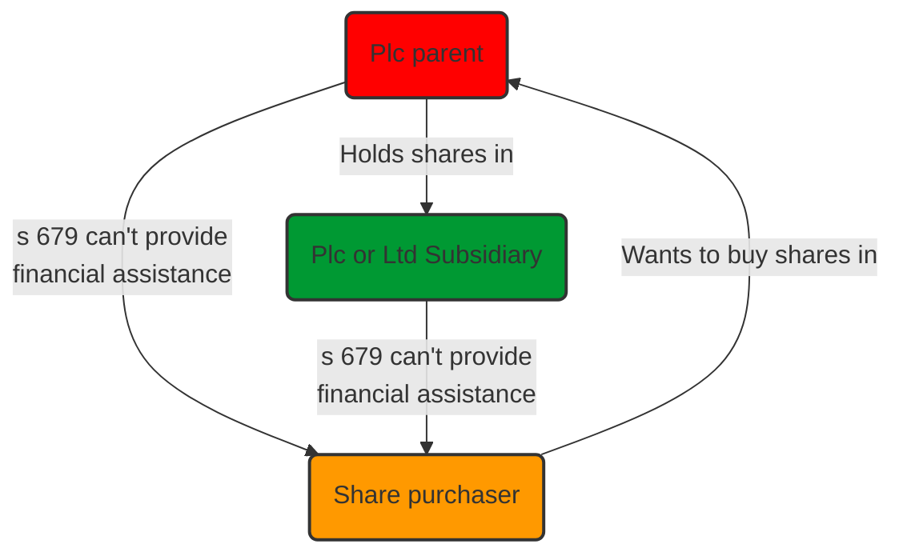
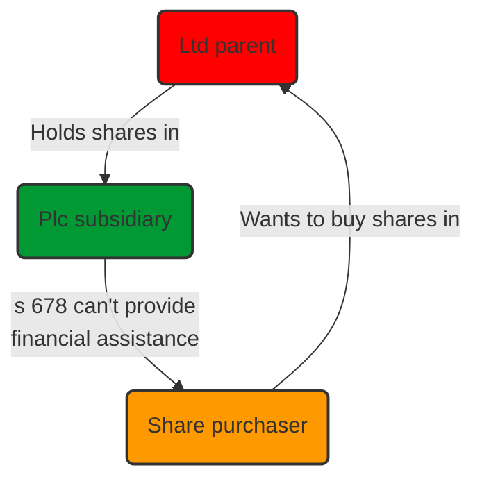

# Financial Assistance

## Definition

Refers to a company providing financial assistance for the purchase of its own shares. This includes financial assistance given by way of a gift, loan, guarantee, security or indemnity ([s 677 CA 2006](https://www.legislation.gov.uk/ukpga/2006/46/section/677)).

Financial assistance was defined in [[British and Commonwealth Holding PLC v Barclays Bank plc [1996] 1 WLR 1]] as

> “The section requires that there should be assistance or help for the purpose of acquiring the shares and that that assistance should be financial”.

## Prohibitions

CA 2006 **removed** the prohibition in relation to private companies, so now prohibition of financial assistance **only** applies in general to public companies.

- Both public companies and their private limited subsidiaries are prohibited from providing financial assistance for the purchase of shares in the public company ([s 678 CA 2006](https://www.legislation.gov.uk/ukpga/2006/46/section/678)).
- Public companies are also prohibited from providing financial assistance for the purchase of shares in their private limited **holding** companies ([s 679 CA 2006](https://www.legislation.gov.uk/ukpga/2006/46/section/679)).

The consequences of unlawful financial assistance is that the transaction will be held void and the company, and any officer in default, will be liable to a fine/ up to two years in prison.

## Exceptions

There are some exceptions, but these are narrowly construed.

### Unconditional Exceptions

[s 681 CA 2006](https://www.legislation.gov.uk/ukpga/2006/46/section/681)) contains a wide list of unconditional exceptions, mainly relating to financial assistance being offered for procedures which are authorised in other sections (e.g., redemption of shares, reduction of capital).

### Conditional Exceptions

[s 682 CA 2006](https://www.legislation.gov.uk/ukpga/2006/46/section/682)) lists a number of “conditional” exceptions, which apply only if the company has net assets and either:

1. Those assets are not reduced by the giving of financial assistance, or
2. To the extent that those assets are reduced, the assistance is provided out of distributable profits.

### Principal Purpose and Incidental Part of a Larger Purpose

One example of a conditional exception is financial assistance by a company for the purposes of an employee share scheme, provided this is made in good faith in the interests of the company or its holding company (s 682(2)(b)).

There are exceptions set out in s 678(2) and (3) and s 679 (2) and (3) which are designed to ensure that the prohibition in s 678(1) and s 679 (1) does not prohibit genuine commercial transactions that are in the interests of the company.

These provide that financial assistance is not prohibited:

- If the principal purpose of the assistance is not to give it for the purpose of an acquisition of shares, or where the assistance is incidental to some other larger purpose of the company; and
- In either case, where the financial assistance is given in good faith in the interests of the company.

These exceptions can be difficult to rely on ([[Brady v Brady [1989] AC 755]]) since they are extremely narrowly construed by the courts.

## Summary

### S 678

### S 679

