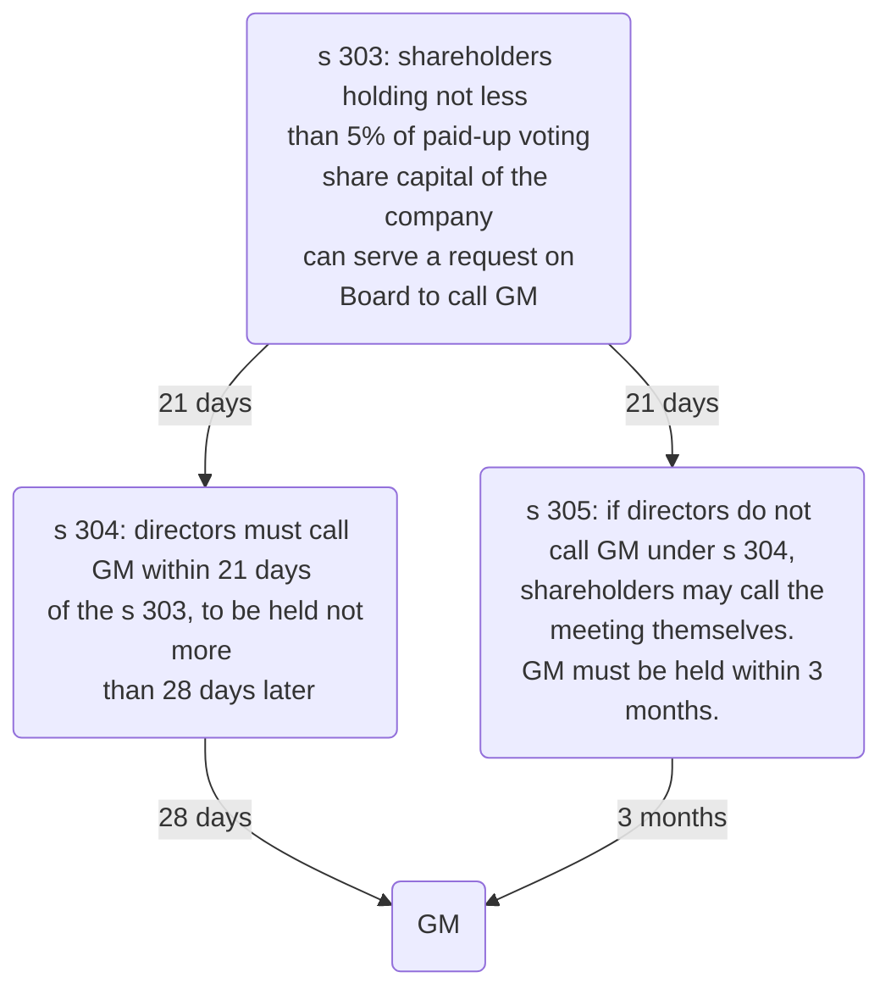

# General Meeting

## Calling a General Meeting

### Board of Directors

General Meetings are usually called by the board of directors ([s 302 CA 2006](https://www.legislation.gov.uk/ukpga/2006/46/section/302)) by passing a board resolution at a Board Meeting ([[Brown v La Trinidad (1887) 37 Ch. D. 1]]). This is usually passed by a simple majority vote of directors, or can be passed by a signed directors' written resolution.

> [!note]
> On a board resolution just to call a GM, MA stipulates that MA 14 restrictions on quorum and voting do not apply, since the board meeting decision is seen as purely procedural.

The Board must give 14 clear days' notice of a General Meeting ([s 307(1) CA 2006](https://www.legislation.gov.uk/ukpga/2006/46/section/307) & [s 360 CA 2006](https://www.legislation.gov.uk/ukpga/2006/46/section/360)). The exception is where the **short notice procedure** is used (s 307(4)-(6)): if $\geq 90\%$ of shareholders with voting rights agree, the general meeting can take place on short notice, e.g., immediately after the board meeting (note this requisite percentage can be changed between 90-95% in the Articles).

The notice for a general meeting must be timely ([s 307 CA 2006](https://www.legislation.gov.uk/ukpga/2006/46/section/307)) and appropriate ([s 311 CA 2006](https://www.legislation.gov.uk/ukpga/2006/46/section/311)). The validity of resolutions passed at a general meeting depends on proper notice being given.

### Shareholders

Shareholders can themselves call a General Meeting s 303-305. If the Board refuses to call a General Meeting, the shareholders have reserve power to do so themselves.

[s 303(1) CA 2006](https://www.legislation.gov.uk/ukpga/2006/46/section/303): shareholders together holding $\geq 5\%$ of paid-up voting share capital of the company can serve a request on the company (**'s 303 request'**). Must state the general nature of the business which shareholders wish to be dealt with at the General Meeting.

Under [s 304(1) CA 2006](https://www.legislation.gov.uk/ukpga/2006/46/section/304): when directors receive s 303 request, must call for the General Meeting within 21 days from the date of request, to be held on a date not more than 28 days after the **date of notice** convening General Meeting.

If directors fail to **call** a General Meeting, all the shareholders who submitted the s 303 request, or any of them representing $>50\%$ of the voting rights of those that submitted the request, can themselves call a General Meeting (pursuant to[s 305 CA 2006](https://www.legislation.gov.uk/ukpga/2006/46/section/305)).

If they call it themselves, a General Meeting must be held within **3 months** of the date that directors receive the initial request.

[s 305(6) CA 2006](https://www.legislation.gov.uk/ukpga/2006/46/section/305): if shareholders are forced to call the General Meeting themselves, can recover reasonable expenses for doing so from the company. Then the company can recoup monies from directors who should have called the meeting in the first place.

### Court

s 306: the court may order a GM to be held if it is impractical to call it in the normal way. Used very rarely.

Application to the court may be made by any director or shareholder with voting rights.

### Auditors

s 518: company's auditors have the right to call a meeting on their resignation if they wish to explain the circumstances of their resignation to the company. Usually happens when they have strong concerns about the financial management of the company.

## More on Notice

### Who to Notify

Notice must be given (s 310 CA 2006):

- To all shareholders
- To every director
- To the personal representative of a deceased member
- To the trustee in bankruptcy of a bankrupt member.

Companies articles may make alternative provision (s 310(4)), e.g., common to exclude giving notice to shareholders living overseas. Must also give notice to auditors (s 502(2)(a)).

### How to Notify

Can be hard-copy (handed to shareholders, or posted to address appearing on register–s 1143), electronically (Sch 5 part 3), via a website (sch 5 part 4), or some combination (s 308).

### Content

Must include:

- Time, date and place of meeting (s 311(1))
- General nature of business - subject to articles to the contrary (s 311(2))
- Statement of rights to appoint a proxy (s 325(1))
- Full text of any special resolution to be proposed (s 283(6)(a)).  
    - This cannot be subsequently amended at the GM ([[In the matter of Uniq PLC [2011] EWHC 749 (Ch))]]).  
    - But can be corrected by an accompanying circular.

No similar requirement to include the full next of an ordinary resolution, though this is common practice. Ordinary resolutions can be amended at the GM, provided the change is not so radical as to make notice of the meeting ineffective ([[Betts v MacNaghten [1910] 1 Ch 430]]).

If shareholders exercise their s 314(1) rights to have a statement circulated before the GM, this must be circulated with notice of the GM (s 315(1)).

### Length

> [!statute] s 307 - Notice required of a GM
> 
> (1) A general meeting of a private company (other than an adjourned meeting) must be called by notice of at least 14 days.
> 
> (2) A general meeting of a public company (other than an adjourned meeting) must be called by notice of—
> - (a) in the case of an annual general meeting, at least 21 days, and
> - (b) in any other case, at least 14 days.
> 
> (3) The company's articles may require a longer period of notice than that specified in subsection (1) or (2).
> 
> (4) A general meeting may be called by shorter notice than that otherwise required if shorter notice is agreed by the members.
> 
> (5) The shorter notice must be agreed to by a majority in number of the members having a right to attend and vote at the meeting, being a majority who—
> - (a) together hold not less than the requisite percentage in nominal value of the shares giving a right to attend and vote at the meeting (excluding any shares in the company held as treasury shares), or
> - (b) in the case of a company not having a share capital, together represent not less than the requisite percentage of the total voting rights at that meeting of all the members.
> 
> (6) The requisite percentage is—
> - (a) in the case of a private company, 90% or such higher percentage (not exceeding 95%) as may be specified in the company's articles;
> - (b) in the case of a public company, 95%.
> 
> (7) Subsections (5) and (6) do not apply to an annual general meeting of a public company (see instead section 337(2)).

- 14 clear days' notice (ss 307(1) & 360).
- Notice period usually includes weekends and bank holidays.
- Where a company has unamended Table A articles, those articles may extend this notice period (s 307(3)).
- The minimum notice period applicable to the GMs for public companies and traded companies is more complex.

#### Deemed Delivery

> [!attention]
> 
> In addition to the minimum 14 clear days’ notice period, it is usually necessary under s 1147 of the CA 2006 to add a further 48 hours before the GM can be held, unless the company’s articles state otherwise. This is because s 1147 provides that a document (including a notice of a GM) is deemed to have been received by the intended recipient 48 hours after it was sent by post or electronically.

### Short Notice

It is possible for the shareholders of a company to agree to hold a GM on short notice (CA 2006, s 307(4)), provided that:

1. a majority in number of the shareholders must agree to holding the meeting on short notice (CA 2006, s 307(5)); and
2. those shareholders must hold at least 90% of the voting shares in the private company (s 307(5)(a) and (6)(a)). This 90% threshold may be increased by the articles to 95% (s 307(6)(a)), which applies to many companies formed before the CA 2006 came into force.

There are circumstances for which short notice cannot be used, e.g., s 168 removal of a director.

### Invalid Notice

- Notice must be given in the proper form to all those entitled to it: if not done, then any resolutions purportedly passed at the meeting may be invalid (s 301(a)).
- A deliberate decision not to send a notice to a shareholder can also amount to a s 171(b) breach by a director for exercising their powers for an improper purpose.

But:

> [!statute] s 313 - Accidental failure to give notice of resolution or meeting
> 
> (1) Where a company gives notice of—
> - (a) a general meeting, or
> - (b) a resolution intended to be moved at a general meeting,
> 
> any accidental failure to give notice to one or more persons shall be disregarded for the purpose of determining whether notice of the meeting or resolution (as the case may be) is duly given.
> 
> (2) Except in relation to notice given under—
> - (a) section 304 (notice of meetings required by members),
> - (b) section 305 (notice of meetings called by members), or
> - (c) section 339 (notice of resolutions at AGMs proposed by members),
> 
> subsection (1) has effect subject to any provision of the company's articles

## Quorum

- Subject to the company's articles, the quorum for a General Meeting is two shareholders ([s 318(2) CA 2006](https://www.legislation.gov.uk/ukpga/2006/46/section/318))
- For single member companies, of course, the quorum is one (s 318(1)).
- No business other than the appointment of the chairman of the meeting can be transacted at a general meeting if the persons attending do not constitute a quorum ([MA 38](https://www.gov.uk/government/publications/model-articles-for-private-companies-limited-by-shares/model-articles-for-private-companies-limited-by-shares#quorumgen)).
- The quorum of a company with more than one shareholder cannot normally be reduced to one, because generally one person cannot constitute a ‘meeting’ ([[Sharp v Dawes (1876) 2 QBD 26 (CA)]]).
- In exceptional circumstances, the court may reduce the quorum to one under s 306 (e.g., where a shareholder refuses to attend a GM so that no decisions can be taken ([[Re El Sombrero Ltd [1958] Ch 900]])).
- GMs must be quorate throughout the meeting.

### Conflicts

- Generally, there is no restriction on shareholders who have a conflict of interest voting in a GM as, unlike directors, they are not fiduciaries ([[Pender v Lushington (1877) 6 ChD 70]]).
- Exceptions: shareholders with a conflict cannot vote on:
	- An ordinary resolution to ratify a director’s breach of duty (if that director is also a shareholder) (s239).
	- A special resolution to approve a buy-back out of share capital (that shareholder’s vote is ignored) (s695 and s717)
	

Note that this can be amended by the Articles; Table A makes the threshold 95%.

### Proxies

- Proxies can usually count as part of the quorum.
- But there must be at least two people physically present in the room for there to be a ‘meeting’ ([[Re Sanitary Carbon Co [1870] WN 233]]), so can't have a single shareholder + proxy.

### Permitted Attendees

The following can attend, though cannot vote unless they are also shareholders:

- Directors (MA 40(1))
- Auditors (s 502(2))
- Anybody granted permission by the chairman (MA 40(2)).

## Chairperson

- The Chairman at a GM does **not** get a casting vote – an ordinary resolution can only be passed with a “simple majority” i.e., more than 50% (s282).
- Role is to preside over meetings and keep order.
- The Chairman will usually be the same person who is the chairman at board meetings (MA 39 provides that unless a Chairman is specifically appointed, the Chairman of Board meetings will automatically be the Chairman at GMs.

## Voting

### Methods of Voting

Two methods for passing both ordinary resolutions (s 282) and special resolutions (s 283):

1. Show of hands – each shareholder gets one vote (s 284(2))
2. Poll vote – each shareholder gets one vote **per share** (s 284(3)).

Under [MA 42](https://www.gov.uk/government/publications/model-articles-for-private-companies-limited-by-shares/model-articles-for-private-companies-limited-by-shares#votinggen) a resolution put to the vote of a General Meeting must be decided on a show of hands unless a poll is demanded in accordance with the Articles. [MA 44](https://www.gov.uk/government/publications/model-articles-for-private-companies-limited-by-shares/model-articles-for-private-companies-limited-by-shares#pollvotes) deals with the right to demand a poll vote as follows:

> [!statute] MA 44 - Poll votes
> (1) A poll on a resolution may be demanded—
> - (a) in advance of the general meeting where it is to be put to the vote, or
> - (b) at a general meeting, either before a show of hands on that resolution or immediately after the result of a show of hands on that resolution is declared.
> 
> (2) A poll may be demanded by—
> - (a) the chairman of the meeting;
> - (b) the directors;
> - (c) two or more persons having the right to vote on the resolution; or
> - (d) a person or persons representing **not less than one tenth of the total voting rights** of all the shareholders having the right to vote on the resolution.
> 
> (3) A demand for a poll may be withdrawn if—
> - (a) the poll has not yet been taken, and
> - (b) the chairman of the meeting consents to the withdrawal.
> 
> (4) Polls must be taken immediately and in such manner as the chairman of the meeting directs.

If the vote is a poll vote, it is taken in writing with one vote per share, usually immediately ([[R v Chillington Iron Co (1825) 29 ChD 159]]); but votes cast in advance of the meeting may also be included in a poll vote, subject to the articles of the company (s 322A).

### Excluding

This right cannot be excluded: [s 321(1) CA 2006](https://www.legislation.gov.uk/ukpga/2006/46/section/321) states that a provision of a company's articles is void in so far as it would have the effect of excluding the right to demand a poll at a general meeting on any question other than

- the election of the chairman of meeting;
- the adjournment of the meeting

### Proxies

> [!statute] s 324 - Rights to appoint proxies
> 
> (1) A member of a company is entitled to appoint another person as his proxy to exercise all or any of his rights to attend and to speak and vote at a meeting of the company.
> 
> (2) In the case of a company having a share capital, a member may appoint more than one proxy in relation to a meeting, provided that each proxy is appointed to exercise the rights attached to a different share or shares held by him, or (as the case may be) to a different £10, or multiple of £10, of stock held by him.

- Corporate shareholders must appoint a representative to attend GMs ([s 323 CA 2006](https://www.legislation.gov.uk/ukpga/2006/46/section/323)).
- The proxy must vote in accordance with the wishes of the shareholder who appointed the proxy (s 322A).
- If a member wants to send a proxy to a meeting rather than attend personally, they must formally appoint a person as their proxy by depositing notice in writing at the registered office (MA 45).
- Every notice of a GM must inform the shareholders clearly of their right to appoint proxies under s 324 of the CA 2006 and under any wider rights in the articles (s 325).
- If it is intended to terminate a proxy’s authority, the company must have received notice of that intention before the start of the relevant GM (CA 2006, s 330).
- If the articles specify more than 48 hours’ notice then that provision is void under s 330(6).

## Annual General Meeting

Under CA 2006, private limited companies do **not** have to hold an AGM, though public companies still do ([s 336 CA 2006](https://www.legislation.gov.uk/ukpga/2006/46/section/336)).

AGM must be called by directors ([s 302 CA 2006](https://www.legislation.gov.uk/ukpga/2006/46/section/302)) on 21 clear days'[^1] notice (s 307(2), s 360(2)) within 6 months' of the financial year-end. See also [[Company procedure]].

[^1]: “Clear days” means the day the notice was given and the day of the meeting are discounted from calculation (s 360)

At the AGM, directors present an annual report. Shareholders with voting rights vote on current issues, such as appointments to the company's board of directors, executive compensation, dividend payments and the selection of auditors.
