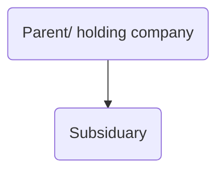

# Shareholders

## Function

Invest share capital (money) in return for a [[Shares]] in the ownership of the company, evidenced by a share certificate. Rights such as voting rights and rights to a dividend set out in Articles (and sometimes also Shareholder Agreement).

Membership begins when the member's name is entered into company's register of members ([s 112(2) CA 2006](https://www.legislation.gov.uk/ukpga/2006/46/section/122)).

Shareholder can be another company – so a company can be a wholly owned subsidiary of another (or not wholly owned but still subsidiary – see section [1159 CA 2006](https://www.legislation.gov.uk/ukpga/2006/46/section/1159)).

These [[Companies]] then together form a group. No limit on the number of companies that can form a group, no limit on number of subsidiaries…

Shareholders have limited liability. Note that if the nominal value of the shares is higher than the amount paid up, the total owed will be the difference between the amount paid up and the nominal value.

Shareholders own the company, and their investment is at risk. This has consequences:

1. Shareholders exercise ultimate control over the company
2. Shareholders hope to receive a financial return on their investment.

They exercise control by

1. Determining the company's constitution
2. Voting on [[Resolutions#Shareholder resolutions]]

Shareholders can appoint new directors whose approach to managing the company they prefer (MA 17) and can remove directors from the board ([s 168 CA 2006](https://www.legislation.gov.uk/ukpga/2006/46/section/168)).

## Shareholders' Reserve Powers

MA 4 Shareholders’ reserve power:

>(1) The shareholders may, by special resolution, direct the directors to take, or refrain from taking, specified action.  
>(2) No such special resolution invalidates anything which the directors have done before the passing of the resolution.

The company's articles regulate the relationship between the directors, acting through the board and shareholders, acting through the general meeting.

The [Model Articles](https://www.gov.uk/guidance/model-articles-of-association-for-limited-companies) give shareholders a minor role with powers limited to constitutional decisions.

The shareholders may act where the board of directors is unable to do so ([[Barron v Potter [1914] 1 Ch 895]]).

In order for shareholders to pass a resolution, they need to vote either at a [[General Meeting]] or use the [[Company procedure#Written resolutions procedure]].
