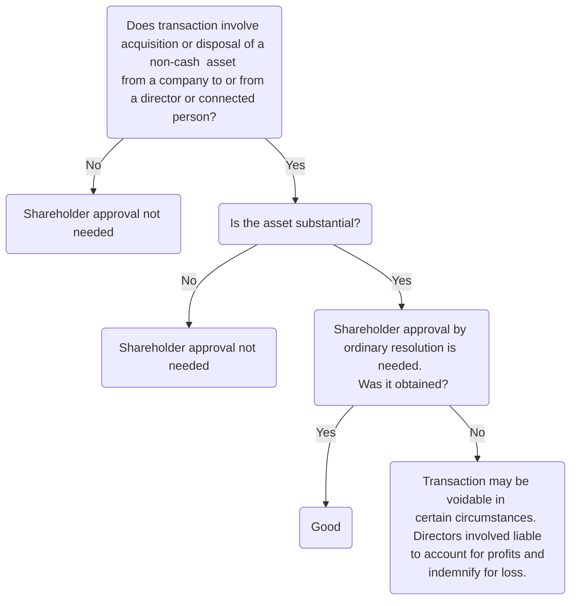

```toc
min_depth: 1
```

# Duties

## Introduction

### Pre-CA 2006

Directors subject to duties deriving from equitable principles and common law rules:

- The fiduciary duties imposed on directors therefore arose out of equitable principles (e.g., acting in good faith).
- Directors were also subject to the common law duty of skill and care.

### CA 2006

New duties: ss 171-181. More than one duty may apply to the directors in any one situation (CA 2006, s 179(1)).

### Relevance of pre-CA 2006 Rules

Former regime (under common law and equity) still applies to the extent not expressly provided for in CA 2006:

| Section | Rule |
| -------- | ---------------------------------------------------------------------------------------------------------------------------------------------------------------------------------------------------------------------------------- |
| s 170(3) | General duties are based on the old common law rules and equitable principles as they apply in relation to directors and have effect in place of those rules and principles as regards the duties owed to a company by a director. |
| s 170(4) | New duties shall be interpreted and applied in the same way as the common law rules and equitable principles |
| s 178 | The remedies for breach of the general duties will be the same as under the corresponding equitable principles or common law rules. |

### Who Owes Duties?

Directors. Recall s 250(1): includes any person occupying the position of director by whatever name called.

### To Whom?

Directors owe their duties to the company (CA 2006, s 170(1)).

> [!question] Who can take action?
> - The company itself (acting through the board of directors) must take action against a director for breach of these duties, as any wrong is committed against the company itself.
> -  In limited circumstances, the shareholders may bring a derivative action on behalf of the company to enforce the company’s rights.
> - Exceptionally, the directors might owe a duty to shareholders as well as to the company where, for example, they agreed to act as agents for the shareholders, or if they assumed responsibility for giving advice to the shareholders on their shareholdings, but this would seem to be relevant only in small family companies ([[Platt v Platt [1999] 2 BCLC 745]])

A director may also owe duties to the creditors of their company rather than to the shareholders if the company is insolvent or approaching insolvency (s 172(3)).

### Summary

Section | Duty
---|---
[[s 171 CA 2006]] | Duty to act within powers
[[s 172 CA 2006]] | Duty to promote the success of the company for the benefit of the members as a whole
[[s 173 CA 2006]] | Duty to exercise independent judgment
[[s 174 CA 2006]] | Duty to exercise reasonable care, skill, and diligence
[[s 175 CA 2006]] | Duty to avoid conflicts of interest
[[s 176 CA 2006]] | Duty not to accept benefits from third parties
[[s 177 CA 2006]] | Duty to declare any interest in a proposed transaction

Note that s 175-177 replace/ supersede equitable duties stated as 'no conflict' and 'no profit/ misuse of position' rules. These were summarised in the following cases:

- [[Aberdeen Rly Co v Blaikie Bros [1854] 1 Macq 61]]
- [[Bray v Ford [1896] AC 44]]

The way in which directors' duties are framed results in an overlap between them. s 179 emphasises that the effect of duties is cumulative: necessary for directors to comply with every duty which may apply.

Note that s 172 and 175 duties overlap in many cases.

## S 171

> [!statute] s 171 - Duty to act within powers
> A director of a company must—
> - (a) act in accordance with the company’s constitution, and
> - (b) only exercise powers for the purposes for which they are conferred.

Details:

1. Act in accordance with the company’s constitution
	- The company's constitution is defined in [s 257 CA 2006](https://www.legislation.gov.uk/ukpga/2006/46/section/257) and includes everything set out in the company's articles of association (s 17) and decisions taken in accordance with the articles (i.e., shareholder resolutions).
	- A director is in breach of this duty if he acts without authority, e.g. commits the company to borrow more than the articles allow without prior shareholder approval.
2. Only exercise powers for the purposes for which they are conferred.
	- Directors should exercise their powers “bona fide in what they consider–not what a court may consider–is in the interests of the company, and not for any collateral purpose.” ([[Re Smith and Fawcett Ltd. [1942] Ch 304]]). This duty codified the **'proper purposes' doctrine**.

### Proper Purposes Doctrine

Outlined in relevant case law:

- [[Hogg v Cramphorn [1967] Ch 254]]: whether purpose of a new share issue was malicious
- [[Howard Smith Ltd v Ampol Petroleum Ltd [1974] AC 821]]:
	- If directors exercise their powers for several purposes, then courts will only consider the dominant purpose.
	- If the dominant purpose is proper, even if the other purposes are improper, there will be no breach of duty.
	- The courts ascertain objective the purpose for which the power was conferred.
- [[Eclairs Group Ltd v JKX Oil & Gas plc [2015] UKSC 71]]: powers of directors to issue disclosure notice.
- [[Extrasure Travel Insurances Ltd v Scattergood [2003] 1 BCLC 598]]: the test of improper purpose is an objective one. See this case for a nice staged test.
- [[Teck Corporation v Millar (1972) 33 DLR (3d) 288]]: good faith vs proper purposes doctrine

Note the overlap between the duty to promote the success of the company (s 172) and the proper purposes' doctrine (s 171). The proper purposes doctrine operates to limit the authority of directors, even if their action was carried out in what they bona fide believed to be the best interests of the company. If the power is exercised primarily for some collateral purpose (construed objectively), then the action may be set aside.

## S 172

Success = long-term increase in company's value.

> [!statute] s 172 - Duty to promote the success of the company
> 
> (1) A director of a company must act in the way he considers, in good faith, would be most likely to promote the success of the company for the benefit of its members as a whole, and in doing so have regard (amongst other matters) to—
> - (a) the likely consequences of any decision in the long term,
> - (b) the interests of the company's employees,
> - (c) the need to foster the company's business relationships with suppliers, customers and others,
> - (d) the impact of the company's operations on the community and the environment,
> - (e) the desirability of the company maintaining a reputation for high standards of business conduct, and
> - (f) the need to act fairly as between members of the company.
> 
> (2) Where or to the extent that the purposes of the company consist of or include purposes other than the benefit of its members, subsection (1) has effect as if the reference to promoting the success of the company for the benefit of its members were to achieving those purposes.
> 
> (3) The duty imposed by this section has effect subject to any enactment or rule of law requiring directors, in certain circumstances, to consider or act in the interests of creditors of the company.

### Interpretation

Codifies the long-settled duty of a director to act honestly and in good faith, in the best interests of the company.

Lord Greene MR in [[Re Smith and Fawcett Ltd. [1942] Ch 304]], who stated that

>“[Directors] must exercise their discretion *bona fide* in what they consider—not what a court may consider—is in the interests of the company”.

Similarly, in [[Regentcrest v Cohen [2001] 2 BCLC 80]] it was held that the question for the court was not whether a director's actions were objectively in the best interests of the company, but whether **subjectively** the director honestly believed they were acting in the best interests of the company.

Although the test is **subjective**, the determination of whether a director has complied with s 172 will involve an element of objectivity.

Pennycuick J in [[Charterbridge Corpn Ltd v Lloyd's Bank Ltd (1970)]] stated that the test for determining this duty is

>“whether an intelligent and honest man in the position of a director of the company concerned, could, in the whole of the existing circumstances, have reasonably believed that the transactions were for the benefit of the company.”

In [[Re Southern Counties Fresh Food Ltd (2009)]], Warren J stated that

>“it is accepted that a breach will have occurred if it is established that the relevant exercise of power is one which could not be considered by any reasonable director to be in the interests of the company”.

In [[Madoff Securities International Ltd v Raven & Others [2013] EWHC 3147]], it was stated that a director may legitimately defer to his fellow directors’ views if he thinks they believe they are acting in the best interests of the company, even if he is not himself in agreement.

This test, in practice, makes it very difficult to challenge directors’ decision-making.

The approach requires directors to recognise that shareholder value for the company depends on successful management of relationship with other stakeholders. **Two factors**: directors' good faith and interests of company.

'Success' is defined as long term increase in value (s 172(1)(a)) and takes into account the effect of the directors' decision-making on the members as a whole and the other stakeholders.

### Duty to Creditors

Where a company is insolvent, duty extends to directors acting in the best interests of creditors:

- [[Item Software (UK) Ltd v Fassihi [2004] EWCA Civ 1244]]: in this case it was held that the duty to act bona fide in the interests of the company includes the duty to **disclose misconduct** by the director to the company.
- [[Re HLC Environmental Projects Ltd [2013] EWHC 2876 Ch]]: the court held that a director who **prefers one creditor to another** by deliberately paying one over the others (here a bank whose debt was guaranteed by the parent company, so as to assist the parent company) may be in breach of the duty to act in the interests of the creditors as a whole.

N.B. if this seems confusing, get even more confused by [an acadmic opinion](https://usir.salford.ac.uk/id/eprint/3112/1/CA_2006.pdf).

## S 173

> [!statute] s 173 - Duty to exercise independent judgment
> (1) A director of a company must exercise independent judgment.
> (2) This duty is not infringed by his acting –
> - (a) in accordance with an agreement duly entered into by the company that restricts the future exercise of discretion by its directors, or
> - (b) in a way authorised by the company’s constitution.

Where the board is able to establish that it was in the best interests of the company to enter into an agreement which fetters the discretion of the directors, this will not be a breach of s 173.

The duty is a restatement of the previous fiduciary duty that a director must not fetter their own discretion.

### Cases

- [[Fulham Football Club Ltd v Cabra Estates plc [1994] 1 BCLC 363 (Court of Appeal)]]: directors have the right to enter into a contract on behalf of the company that may in future require the directors to act in a particular way, provided it is done in good faith in the interests of the company.
- [[Madoff Securities International Ltd v Raven [2013] EWHC 3147]]: directors must be mindful of the individual nature of their duties. Can't be dominated, bamboozled or manipulated.

## S 174

> [!statute] s 174 - Duty to exercise reasonable care, skill and diligence
> (1) A director of a company must exercise reasonable care, skill and diligence.
> (2) This means the care, skill and diligence that would be exercised by a reasonably diligent person with-
> - (a) the general knowledge, skill and experience that may reasonably be expected of a person carrying out the functions carried out by the director in relation to the company, and
> - (b) the general knowledge, skill and experience that the director has.

### Interpretation

Codifies the common law duties of care and skill ([[Gregson v HAE Trustees Ltd [2008] EWHC 1006]]).

In early cases, the standard expected of directors was subjective, so poor directors could escape liability for company losses.

But [[Donoghue v Stevenson [1932] AC 562]] brought recognition of general duty of care and raised standard expected of directors to objective/ subjective test. This standard was borrowed on the [[Wrongful trading]] test used in s 214(4) IA 1986.

> [!test]
> The minimum standard expected of a director is that objectively expected of a director in that position, but then this can be subjectively raised if a particular director has special knowledge/ skill and experience. 

[[Re D’Jan of London Ltd [1994] 1 BCLC 561 ChD]]: director's actions will be measured against the conduct expected of a reasonably diligent person.

The standard applicable to director of a profitable company will change if it experiences financial difficulties ([[Roberts v Frohlich [2011] EWHC 257 (Ch)]]).

### Delegation

s 174 shares similarities with cases brought under Company Directors Disqualification Act 1986 in relation to delegation.

Principle: directors must be proactive in monitoring actions of delegates and other directors, and must keep themselves informed ([[Re Barings plc (No 5) [1999] 1 BCLC 433]]).

A director who is completely inactive will be in breach of this duty and may be held liable for wrongs committed by the company ([[Lexi Holdings plc (In Administration) v Luqman [2009] EWCA Civ 117]]—other directors responsible for not realising that one of them was stealing).

But directors able to legitimately defer to the views of a fellow director with greater experience when reasonable, and this did not breach the duty to exercise independent judgement: [[Madoff Securities International Ltd v Raven [2013] EWHC 3147]].

### Contract

There will usually also be a term in the director's service contract that they will perform their duties with reasonable skill and care. So a company can usually also seek damages for breach of contract.

## S 175

> [!statute] s 175 - Duty to avoid conflicts of interest
> (1) A director of a company must avoid a situation in which he has, or can have, a direct or indirect interest that conflicts, or possibly may conflict, with the interests of the company.
> 
> (2) This applies in particular to the exploitation of any property, information or opportunity (and it is immaterial whether the company could take advantage of the property, information or opportunity).
> 
> (3) This duty does not apply to a conflict of interest arising in relation to a transaction or arrangement with the company.
> 
> (4) This duty is not infringed—
> - (a) if the situation cannot reasonably be regarded as likely to give rise to a conflict of interest; or
> - (b) if the matter has been authorised by the directors.
> 
> (5) Authorisation may be given by the directors—
> - (a) where the company is a private company and nothing in the company's constitution invalidates such authorisation, by the matter being proposed to and authorised by the directors; or
> - (b) where the company is a public company and its constitution includes provision enabling the directors to authorise the matter, by the matter being proposed to and authorised by them in accordance with the constitution.
> 
> (6) The authorisation is effective only if—
> - (a) any requirement as to the quorum at the meeting at which the matter is considered is met without counting the director in question or any other interested director, and
> - (b) the matter was agreed to without their voting or would have been agreed to if their votes had not been counted.
> 
> (7) Any reference in this section to a conflict of interest includes a conflict of interest and duty and a conflict of duties.

Note that the Explanatory Notes to s 175 comment that the duty under s 175(4) to (6) is not infringed if

1. The situation cannot reasonably be regarded as likely to give rise to a conflict
2. Authorisation (in private or public companies) has been given by independent directors (who have no direct or indirect interest).

### Interpretation

Reasonable man test for what constitutes conflict of interest: [[Boardman v Phipps [1967] 2 A.C. 46]]. Note that the point of this was to make law more chill, Boardman acknowledged as unfair.

s 175(3) expressly **excludes** conflicts of interest arising in relation to **transactions or arrangements** with the company; these are instead subject to disclosure duties in s 177. Practical rule: many directors will have interests in multiple companies.

#### Corporate Opportunities

Corporate opportunity viewed as asset which may not be misappropriated by the directors:

- [[Cook v Deeks [1916] 1 AC 554 (Privy Council)]]
- [[Regal (Hastings) Ltd v Gulliver [1942] 1 All ER 378]]
- [[Bhullar v Bhullar [2003] EWCA Civ 424 (Court of Appeal)]]

It is irrelevant that the company could not/ would not have pursued that opportunity. If a director makes a personal profit out of their position, they are liable to account to the company for this. Principle expressly stated in s 175(2).

#### Resigning Directors

A director cannot resign from a company just to then exploit a corporate opportunity, which would otherwise be a breach of s 175.

s 170(2)(a):

>“a person who ceases to be a director continues to be subject (a) to the duty in section 175 (duty to avoid conflicts of interest) as regards the exploitation of any property, information or opportunity of which he became aware when he was a director.”

But need to consider all the facts to ascertain whether s 175 has been breached or not:

- [[Shepherds Investments Ltd v Walters [2006] EWHC 836]]
- [[CMS Dolphin Ltd v Simonet [2001] EWHC 415]]
- See also [[Foster Bryant Surveying v Bryant [2007] EWCA Civ 200]], but note this is a pre-CA 2006 case and questionable whether it would be decided the same way today.

In [[Towers v Premier Waste Management Ltd [2012] BCC, 72]], a director borrowed equipment from one of the company's customers for his personal interest without disclosing his personal interest to the board. Found to have breached s 175 despite no bad faith, no actual conflict and no quantifiable loss to the company. Director ordered to pay rental costs to the company.

#### Competing Directorships

A general equitable rule prevents a fiduciary from entering into a position which gives rise to conflicting fiduciary duties to another person without the informed consent of both principals ([[Clark Boyce v Mouat [1994] 1 AC 428]]). Company will need to authorise the conflict under the process in s 175(5) and 175(6).

But depends on facts of the case: in [[In Plus Group Ltd v Pyke [2002] EWCA Civ 370 (Court of Appeal)]] no breach was fiduciary duty was found.

### Consequences

If a director breaches this duty, they will be obliged to account for any profit made unless authorised by the company.

## S 176

> [!statute] s 176 - Duty not to accept benefits from third parties
> 
> (1) A director of a company must not accept a benefit from a third party conferred by reason of—
> - (a) his being a director, or
> - (b) his doing (or not doing) anything as director.
> 
> (2) A “third party” means a person other than the company, an associated body corporate or a person acting on behalf of the company or an associated body corporate.
> 
> (3) Benefits received by a director from a person by whom his services (as a director or otherwise) are provided to the company are not regarded as conferred by a third party.
> 
> (4) This duty is not infringed if the acceptance of the benefit cannot reasonably be regarded as likely to give rise to a conflict of interest.
> 
> (5) Any reference in this section to a conflict of interest includes a conflict of interest and duty and a conflict of duties.

### Interpretation

This duty replaces the equitable principle that fiduciaries must not accept secret commissions or bribes ([[Attorney General for Hong Kong v Reid [1994] 1 AC 324]]). Should be read in conjunction with wider no-conflict duty in [[s 175 CA 2006]].

s 176(4) states that duty is not infringed if acceptance of the benefit cannot reasonably be regarded as likely to give rise to a conflict of interest. “Benefits” construed in the ordinary meaning of the word. No provision for authorisation by the board here; ratification would need to be sought by shareholders under s 239 CA 2006.

Note that in general, this duty is construed widely, since the old interpretation was driven by bribes.

Note that this duty is absolute and there is **no** provision for authorisation by the board of directors for such a breach.

## S 177

> [!statute] s 177 - Duty to declare interest in proposed transaction or arrangement
> (1) If a director is in any way, directly or indirectly, interested in a proposed transaction or arrangement with the company, he must declare the nature and extent of that interest to the other directors.
> 
> (2) The declaration may (but need not) be made—
> - (a) at a meeting of the directors, or
> - (b) by notice to the directors in accordance with—
> 	- (i) section 184 (notice in writing), or
> 	- (ii) section 185 (general notice).
> 
> (3) If a declaration of interest under this section proves to be, or becomes, inaccurate or incomplete, a further declaration must be made.
> 
> (4) Any declaration required by this section must be made before the company enters into the transaction or arrangement.
> 
> (5) This section does not require a declaration of an interest of which the director is not aware or where the director is not aware of the transaction or arrangement in question. For this purpose a director is treated as being aware of matters of which he ought reasonably to be aware.
> 
> (6) A director need not declare an interest—
> - (a) if it cannot reasonably be regarded as likely to give rise to a conflict of interest;
> - (b) if, or to the extent that, the other directors are already aware of it (and for this purpose the other directors are treated as aware of anything of which they ought reasonably to be aware); or
> - (c) if, or to the extent that, it concerns terms of his service contract that have been or are to be considered—
> 	- (i) by a meeting of the directors, or
> 	- (ii) by a committee of the directors appointed for the purpose under the company's constitution.

### Aim

To ensure that the board of directors (who will act on behalf of the company) have full disclosure of a possible conflict of interest before deciding whether to enter into the transaction with one of their own directors.

### Making Declaration

- The declaration must be made before the company enters into the contract (CA 2006, s 177(4)).
- s 177(2)(a): may be made at a directors’ board meeting; or
	- Disclosure need not be formally in writing ([[Lee Panavision Ltd v Lee Lighting Ltd (1992)]])–orally is fine
- s 177(2)(b)(i): may be made by notice to the directors in writing
	- Must comply with the requirements of s 184 of the CA 2006, namely, it must be in paper or electronic form and be sent by hand, post or, if agreed by the recipient, by electronic means to all of the other directors.
- s 177(2)(b)(ii): declaration can be made by general notice.
	- Should be done if declaration arises repeatedly over time, e.g.,
		- s 185(2)(a): if the director of the company has an interest in another company.
		- s 185(2)(b): if the director made a general notice regarding the director’s connection with a specified person
	- Notice must:
		- be given to the other directors at a board meeting or read at the next board meeting after it was given (s 185(4)); and
		- (b) state the nature and extent of the director’s interest in the company or the nature of his connection with the specified person (s 185(3)).

Disclosure need not be formally in writing ([[Lee Panavision Ltd v Lee Lighting Ltd (1992)]]). Under s 180, if directors comply with duty to disclose, the transaction not liable to be set aside (though this is subject to other provisions in the company's constitution).

The idea of this section is to invite scrutiny of decisions. Even more checks and balances. Note already board authorisation under [[s 175 CA 2006]].

### Impact

MA 14(1): the director who made the declaration cannot vote as a director regarding the contract, nor form part of the quorum (minimum number of directors required) for a board meeting.

### Exceptions

See ss 177(5) & 177(6).

> [!note]
> If one of the two exceptions applies and the company has unamended MA, the director concerned will still not be able to vote or count in the quorum on the matter under discussion as art 14 of the model articles of private companies is still applicable.

A declaration does not need to be made where there is just one director of a company whose articles require only one director.

## S 177 Vs S 182

[s 177 CA 2006](https://www.legislation.gov.uk/ukpga/2006/46/section/177) places a duty on directors to disclose an interest in a **proposed** transaction with the company. [s 182 CA 2006](https://www.legislation.gov.uk/ukpga/2006/46/section/182) applies to cases where a director has an interest in a transaction **after it has been entered into by the company,** and also requires directors to disclose such interests.

Under s 187(1), the requirements under s 182 also apply to shadow directors, but with some amendments.

Breach of the duty under s 177 leads to civil consequences under s 178, which are the same as for breach of all the other duties (other than s 174), whereas breach of s 182 leads to criminal sanctions under s 183.

Note that these provisions do not apply to substantial property transactions, loans, quasi-loans and credit transactions which require the approval of the company’s members (ss 190–203).

# Remedies and Liability

Directors' duties are owed to the company and not to shareholders as individuals (s 170). But since company inanimate, s 260 CA 2006 allows shareholders to bring [[Derivative claims]] on behalf of the company where the directors have acted in breach of their duties.

## Remedies

Recall that duties of directors were codified in CA 2006, but remedies for breach were not. Just have s 178 saying that:

- Consequences of breach (or threatened breach) of sections 171-177 are **the same as would apply if the corresponding common law rule or equitable principle applied**.
- Duties in those sections (except s 174) are enforceable in the same way as any other fiduciary duty owed to a company by its directors.

Breach of duty to exercise reasonable care, skill, and diligence (s 174) is a common law rather than fiduciary duty, so the only remedy for breach is damages. Only a failure to make a declaration under s 182 is a criminal offence, punishable by fine (s 183(1)).

s 179: more than one of the general duties may apply in any given case. So common to sue a director for breach of multiple duties.

Remedial options:

- Account for profits (personal remedy)
	- Directors held liable to account to the company for profits received from breach of their duties, regardless of whether they acted honestly
	- Only profits received as a result of the breach are payable
	- In [[Regal (Hastings) Ltd v Gulliver [1942] 1 All ER 378]] directors bought cinemas and sold them for a personal profit.
	- Here suing the director for the physical cash (can't get it back if director bankrupt etc.)
- Account for profits (proprietary remedy)
	- 'Follow the money': can trace money through to the assets and take those instead.
	- Debate in the courts as to whether the director held the profits of their breach of duty on constructive trust for the company or not.
	- Settled in [[FHR European Ventures LLP v Cedar Capital Partners LLC [2014] UKSC 45 [2015] AC 250]], which held that profits are held on constructive trust in all cases where profits can be identified as an asset capable of being held on constructive trust. (This basically means if profits were invested in shares, entitled to the dividends and stuff too).
	- Returning company property.
- Payment of equitable compensation by the directors.
- Rescission
	- Rescind contract to before contract made, if possible
- Injunction against a director (usually when the breach is threatened).

The aim of these remedies is not to compensate the company for the breach of duty by the director, but to confiscate any profit made by the director in breach and give it to the company ([[Murad v Al-Saraj [2005] EWCA Civ 959]]).

## Avoiding Liability

### Prior Authorisation by Board: Ss 175 & 177

Where directors are able to authorise conduct which would otherwise constitute a breach of duty under **s 175 or 177**, the effect is that no breach of duty will take place and the transaction is not liable to be set aside (no longer voidable) (s 180(1)).

| Company         | s175 authorisation procedure                                                  |
| --------------- | ----------------------------------------------------------------------------- |
| Private company | Authorisation may be given provided the company's articles do not prevent it. |
| Public company  | Articles must specifically permit the directors to authorise the matter.                                                                               |

### Prior Authorisation by Shareholders (s 180)

- [s 180(4) CA 2006](https://www.legislation.gov.uk/ukpga/2006/46/section/180) allows shareholders to authorise in advance conduct which would otherwise constitute a breach of duty by the directors
- Shareholders can authorise breaches of duty or even negligence, but not acts which are unlawful
- [[Sharma v Sharma [2013] EWCA Civ 1287 (Court of Appeal)]]

### Ratification by Shareholders (s 239)

> [!statute] s 139 - Ratification of acts of directors
> 
> (1) This section applies to the ratification by a company of conduct by a director amounting to negligence, default, breach of duty or breach of trust in relation to the company.
> 
> (2) The decision of the company to ratify such conduct must be made by resolution of the members of the company.
> 
> (3) Where the resolution is proposed as a written resolution neither the director (if a member of the company) nor any member connected with him is an eligible member.
> 
> (4) Where the resolution is proposed at a meeting, it is passed only if the necessary majority is obtained disregarding votes in favour of the resolution by the director (if a member of the company) and any member connected with him.
> 
> This does not prevent the director or any such member from attending, being counted towards the quorum and taking part in the proceedings at any meeting at which the decision is considered.
> 
> (5) For the purposes of this section—
> - (a) “conduct” includes acts and omissions;
> - (b) “director” includes a former director;
> - (c) a shadow director is treated as a director; and
> - (d) in section 252 (meaning of “connected person”), subsection (3) does not apply (exclusion of person who is himself a director).
> ...

- The conduct of a director which amounts to breach of duty, negligence, default or breach of trust can be ratified by shareholders (disregarding the votes of directors involved, if also a shareholder, or any connected persons ([s 239(4) CA 2006](https://www.legislation.gov.uk/ukpga/2006/46/section/239)))
- The company cannot then take any action against the director for the breach.
- The voting restrictions do not apply if the matter is decided by unanimous consent (s 239(6)(a)).
- Neither approval under s 180 nor ratification under s 239 will be effective unless the decision is honest, bona fide and in the best interests of the company ([[Madoff Securities International Ltd v Raven [2013] EWHC 3147]]).
- Ratification is not possible if done unfairly or improperly, or if it is illegal or oppressive towards a minority ([[North-West Transportation Co Ltd v Beatty (1887) 12 App Cas 589]]). If there is unfair ratification, an [[Unfair Prejudice]] claim could be brought.

### Relief Granted by Court (s 1157)

Basically an equity thing. [s 1157(1) CA 2006](https://www.legislation.gov.uk/ukpga/2006/46/section/1157):

> If in proceedings for negligence, default, breach of duty or breach of trust against  
> (a) an officer of the company, or  
> (b) a person employed by a company as an auditor,  
> it appears to the court that the officer or person is or may be liable, but that he acted honestly and reasonably, and that having regard to all the circumstances of the case, he ought fairly to be excused, the court may relieve him from his liability on such terms as it thinks fit.

The director may apply to court for relief before a claim is made (s 1157(2)).

> [!test] Court granting equitable relief
> In [[Re HLC Environmental Projects Ltd [2013] EWHC 2876 Ch]], a three part test was established. Need that the director:
> - Acted honestly,
> - acted reasonably, and
> - considering the circumstances of case, ought fairly to be excused. 

The burden of proving honesty and reasonableness lies on the director. It is only if both of these are established that the court needs to consider the third element.

Such relief granted in [[Re D’Jan of London Ltd [1994] 1 BCLC 561 ChD]], where it was satisfied that non-disclosure breach was a minor error. But in other cases (e.g., [[Smith v Butler [2012] EWCA Civ 314]]), application for relief refused.

In [[Coleman Taymar Ltd v Oakes [2001] 2 BCLC 249]] the court held that relief under s 1157 can be granted in relation to a liability to account for profits as well as a liability to pay damages. **Honesty is a subjective requirement, whereas reasonableness is objective.**

### Insurance

[s 232 CA 2006](https://www.legislation.gov.uk/ukpga/2006/46/section/232): a company cannot exempt a director to any extent from **liability** in negligence, default, breach of duty or breach of trust, and any provision that purports to do this will be **void**.

Companies may provide their directors with:

- Insurance against such liability under s 233
- Qualifying third party indemnity provisions under s 234
- Qualifying pension scheme indemnity provisions under s 235

| Section breached/to be breached        | Approval?                                            | Ratification?                       | Conditions                                                                  |
| -------------------------------------- | ---------------------------------------------------- | ----------------------------------- | --------------------------------------------------------------------------- |
| [[s 175 CA 2006]] or [[s 177 CA 2006]] | Directors or shareholders can authorise (s 180)      | Yes, by ordinary resolution (s 239) | Decision must be honest, bona fide and in the best interests of the company |
| Any other breach of duty               | Shareholders can authorise (so long as not unlawful) | Yes, by ordinary resolution         | As above.                                                                   |
| Negligence, default or breach of trust | n/a                                                  | Yes, by ordinary resolution         | As above.                                                                   |

[[More Controls on Directors]]

## Directors' Liability

### Agency

A director is an agent of a company. Contracts are made in the name of the company, so directors are not personally liable for breach of contract. But liability can arise in two situations:

1. Exceeding actual authority
	- If actual authority < director's actions < apparent authority, director liable to indemnify company for any loss suffered and to account for any profit.
	- But shareholders can ratify breach (s 239)
2. Breach of warranty of authority
	- Else if apparent authority < director's actions, director does not bind company, but personally liable to third party on the contract for breach of warranty of authority.
	- s 40(2): an outsider dealing with a company is not bound to check on the powers of the directors or of the company.
	- s 40(1): as regards an outsider, the power of the directors to bind the company shall not be limited by the company’s constitution (provided outsider acting in good faith).
	- See [[Capacity and Authority#Statutory Deemed Authority s 40 CA 2006]].

### Torts

Any tort committed by the company does not usually give rise to liability for the directors, even if they caused the tort to be committed (because agency). But there are exceptions, if the director:

1. Commits a tort separate from that of the company ([[Standard Chartered Bank v Pakistan National Shipping Corporation (No 2) [2003] 1 All ER 173]]);
2. Voluntarily assumes personal responsibility for the tort by creating a special relationship between the director and the third party ([[Williams v Natural Life Health Foods Ltd [1998] 1 WLR 830]]); or
3. Procures or induces the company to commit a tort where the director acts beyond the director’s constitutional role in the company ([[MCA Records Inc v Charly Records Ltd [2003] 1 BCLC 93]]).

### Debts

Generally, directors have no liability whatsoever for any debts they incur on the company’s behalf.

Exceptions:

1. If the director engages in misconduct ([[Contex Drouzbha v Wiseman and another [2007] EWCA Civ 120]]). Punitive liability.
2. If directors have personally guaranteed a loan to the company and the company defaults under the terms of that loan. Personal contractual liability.

### Failure to Maintain Company Records

- Failure to keep proper company records: those in default (including directors) liable to a fine (s 1135(3)).
- Failure to keep proper accounting records: the directors in default (and other officers) may be sentenced to up to two years’ imprisonment (s 389).
- There are specific offences which will be committed for failure to keep a particular register up to date - more fines.

### Financial Records

Liability for failures can be civil or criminal.

### Share Capital Transactions

The directors of a company may be liable for breaches of the statutory rules seeking to protect the company’s share capital; e.g.,

- if there is prohibited [[Financial assistance]] (s 680(1)), or
- if a required directors’ statement is unreasonably given for a redemption or buy-back of shares out of capital (s 715).
- Punishable by up to two years’ imprisonment and a fine.

### Health and Safety Breaches

The directors (and other officers) may be criminally liable for breaches of health and safety legislation.

- Where the company’s actions have led to the death of an individual (e.g., an employee or a customer) and management failure is to blame, the directors may be prosecuted for the common law offence of gross negligence manslaughter.
- The Corporate Manslaughter and Corporate Homicide Act 2007 (CMCHA 2007) may be used only against a company–see [[Liability in tort and crime]].

### Bribery

A maximum prison sentence of 10 years and/or an unlimited fine may be imposed on directors under the Bribery Act 2010 for four criminal offences relating to bribery.

### Political Donations

If a company makes a donation to a political party under Part 14 of the CA 2006 without shareholder approval (where required), the directors will be personally liable under s 369(2) of the Act to reimburse the company to the amount of that donation.

# Substantial Property Transactions (ss 190-196)

If a director in their personal capacity, or someone "connected" to the director, buys something from or sells something to the company, the consent of the shareholders by resolution [^1] is necessary if the asset being bought or sold is a substantial non-cash asset.

[^1]: Strictly, Article 190 doesn't specify resolution required, so by s 281(3) can pass an ordinary resolution

> [!defn] Substantial (s 191)
> An asset is a substantial asset in relation to a company if its value:
> - Exceeds 10% of the company's asset value and is more than £5,000, or
> - Exceeds £100,000
> 
> These values should be determined at the date the contract is entered into (s 191(5)). The value of a series of contracts will be aggregated to determine if the threshold has been met (s 190(5)). 

> [!defn] Non-cash
> Any property, or interest in property, other than cash (s 1163). So note this inclues property rights (e.g., lease) and security (e.g., mortgage, floating charge). 

## Requirements

Must be:

1. an arrangement (also referred to in the CA 2006 at times as a ‘transaction’);
	- This will usually involve a contract between the parties, but also covers looser arrangements.
2. between the company and:
	- one of its directors, or
	- a person ‘connected’ with such a director, or
	- one of its holding company directors, or
	- a person ‘connected’ with a holding company director;
3. involving the acquisition of a ‘non-cash’ asset;
4. that is ‘substantial’.

## Connected Persons

The definition of “persons connected with a director” is set out in s 252-254 CA 2006. Complicated, but key categories are:

1. Members of director's family:
	- spouse or civil partner,
	- partner with whom the director lives in an 'enduring family relationship',
	- parents,
	- children or step-children (s 253),
	- partner's children or step-children if they are under 18 and live with the director.
2. Companies in which the director (and others connected with them) hold $>20\%$ of shares (s 254)
3. Business partner of the director/ those connected with them (s 252(2)(d))
4. Trustees of a trust the beneficiaries of which include the director or those connected with them (s 252(2)(c))

References to a director above also covers shadow directors (s 223(1)(b)).

## Effect

Shareholder approval must be given either before the transaction is entered into, or after, provided that the transaction is made conditional on approval being obtained. This can be an [[ordinary resolution]] at a general meeting or written resolution.

Possible for shareholders to approve the transaction within a reasonable time after the event (s 196) but this does not absolve directors of potential liability under s 195.

## Exceptions

Approval by shareholders is not required:

1. Where the company is a wholly-owned subsidiary of another;
2. A contract between a company and a director in their capacity as a director of the company (s 192(a));
3. A contract between a holding company and one of its subsidiaries (s 192(b)(i));
4. A contract between two wholly-owned subsidiaries of the same holding company (s 192(b)(ii));
5. If the company is insolvent and in administration/ liquidation (s 193(1)).

### Remedies

s 195 sets out the consequences of a substantial property transaction being entered into without shareholder approval.

> [!statute] s 195(2)
> The arrangement, and any transaction entered into in pursuance of the arrangement (whether by the company or any other person), is voidable at the instance of the company, unless—
> - (a) restitution of any money or other asset that was the subject matter of the arrangement or transaction is no longer possible,
> - (b) the company has been indemnified in pursuance of this section by any other persons for the loss or damage suffered by it, or
> - (c) rights acquired in good faith, for value and without actual notice of the contravention by a person who is not a party to the arrangement or transaction would be affected by the avoidance.

For the directors involved (and those connected under s 195(4)), consequences set out in s195(3). They are liable to account to the company for any profits made and to indemnify company for any losses incurred.

> [!statute] s 195(3)
> Whether or not the arrangement or any such transaction has been avoided, each of the persons specified in subsection (4) is liable—
> - (a) to account to the company for any gain that he has made directly or indirectly by the arrangement or transaction, and
> - (b) (jointly and severally with any other person so liable under this section) to indemnify the company for any loss or damage resulting from the arrangement or transaction.

> [!statute] s 195(4)
> The persons so liable are—
> - (a) any director of the company or of its holding company with whom the company entered into the arrangement in contravention of section 190,
> - (b) any person with whom the company entered into the arrangement in contravention of that section who is connected with a director of the company or of its holding company,
> - (c) the director of the company or of its holding company with whom any such person is connected, and
> - (d) any other director of the company who authorised the arrangement or any transaction entered into in pursuance of such an arrangement.



# Loans to Directors

> [!statute] s 197 - Loans to directors: requirement of members' approval
> 
> (1) A company may not—
> - (a) make a loan to a director of the company or of its holding company, or
> - (b) give a guarantee or provide security in connection with a loan made by any person to such a director,
> 
> unless the transaction has been approved by a resolution of the members of the company.
> 
> (2) If the director is a director of the company's holding company, the transaction must also have been approved by a resolution of the members of the holding company.
> 
> (3) A resolution approving a transaction to which this section applies must not be passed unless a memorandum setting out the matters mentioned in subsection (4) is made available to members—
> - (a) in the case of a written resolution, by being sent or submitted to every eligible member at or before the time at which the proposed resolution is sent or submitted to him;
> - (b) in the case of a resolution at a meeting, by being made available for inspection by members of the company both—
> 	- (i) at the company's registered office for not less than 15 days ending with the date of the meeting, and
> 	- (ii) at the meeting itself.
> 
> (4)The matters to be disclosed are—
> - (a) the nature of the transaction,
> - (b) the amount of the loan and the purpose for which it is required, and
> - (c) the extent of the company's liability under any transaction connected with the loan.
> 
> (5)No approval is required under this section on the part of the members of a body corporate that—
> - (a) is not a UK-registered company, or
> - (b) is a wholly-owned subsidiary of another body corporate.

Company loans to directors, although permitted, may also be subject to requirement of shareholder approval by ordinary resolution. Before shareholders can be asked to approve a loan to a director (or a director of a holding company) they must be given information about nature of transaction, amount of loan, purpose of loan and company's liability (s 197(4) in the form of a memorandum ([s 197(3) CA 2006](https://www.legislation.gov.uk/ukpga/2006/46/section/197)).

Approval is also needed when the loan/ security arrangements are entered into with a person connected with a director and the company is a public company/ company associated with a public company (ss 198201).

Shareholders can approve the transaction after the event (s 214) but does not absolve directors of potential liability under s 213.

“Loan” only defined through the case law: in [[Champagne Perrier-Jouet SA v HH Finch Ltd [1982] 1 WLR 1359]] held to mean “a sum of money lent for a period of time, to be returned in money or money's worth”.

Loan vs remuneration: [[Currencies Direct Ltd v Ellis [2003] BCLC 482, CA]].

## Quasi-loans and Credit Transactions

> [!defn] Quasi-loan
> Arises where the company meets some financial obligation of the director on the understanding that the director will reimburse it later (s 199(1)).

> [!defn] Credit transaction
> The company provides the director with goods or services and the director pays the company for these in instalments over time.

For a public company, or a company associated with a public company, prior shareholder approval is needed before entering into either a quasi-loan (s 198(3)) or credit transaction (s 201(3)). The restrictions extend to where these arrangements are made to a connected person of a public company or a company associated with a public company (CA 2006, ss 200(2) and 201(2)).

### Exceptions

Exceptions to the requirement for shareholder approval:

Section of CA 2006 | Rule
---|---
s 204 | Expenditure on company business ($\leq £50,000$)
s 205 | Loans for defending proceedings brought against a director
s 206 | Loans for defending regulatory actions or investigations
s 207 | Minor and business transactions—loans $\leq £10,000$ do not require shareholder approval
s 208 | Intra group transactions
s 209 | Money lending companies (where loan is made in the ordinary course of business for the company)

### Remedies (s 213)

In relation to transaction, the arrangement is voidable at the instance of the company, subject to certain exceptions:

> [!statute] s 213(2)
> The transaction or arrangement is voidable at the instance of the company, unless—
> - (a) restitution of any money or other asset that was the subject matter of the transaction or arrangement is no longer possible,
> - (b) the company has been indemnified for any loss or damage resulting from the transaction or arrangement, or
> - (c) rights acquired in good faith, for value and without actual notice of the contravention by a person who is not a party to the transaction or arrangement would be affected by the avoidance.

Directors involved (and those connected) liable to account to the company for any profits made and to indemnify the company for any loss incurred. It is possible for shareholders to ratify the failure to obtain shareholder approval (s 214).

### Service Contracts (ss 188-189)

An executive director is an employee of the company, so should be given a written employment contract — a service contract. No automatic entitlement for directors to be paid for services.

- Company must keep copy of directors' service contracts/ memoranda of the terms ([s 228 CA 2006](https://www.legislation.gov.uk/ukpga/2006/46/section/228)).
- Shareholders have right to inspect copies of directors' service contracts/ memoranda ([s 229 CA 2006](https://www.legislation.gov.uk/ukpga/2006/46/section/229)), must be provided within 7 days of request.

#### Long Term Service Contracts

- [Art 19 MA](https://www.gov.uk/government/publications/model-articles-for-private-companies-limited-by-shares/model-articles-for-private-companies-limited-by-shares#remuneration) means that terms of an individual director's service contract are for the board to determine. Only requires approval of resolution of board of directors, though shareholder approval required ([s 188 CA 2006](https://www.legislation.gov.uk/ukpga/2006/46/section/188)) to enter long-term service contracts (where service contract has guaranteed term which is or may be > 2 years).
- If shareholder approval not given, term incorporated into service agreement **void** under s 189(a) CA 2006. Additionally, under s 189(b) CA 2006, the service contract will be deemed to contain a term entitling company to terminate the contract at any time, by giving reasonable notice.

### Payments for Loss of Office (ss 215-222)

s 217: any payment for loss of office to a director needs to be approved by shareholders by way of an ordinary resolution.

> [!statute] s 217 - Payment by company: requirement of members' approval
> (1) A company may not make a payment for loss of office to a director of the company unless the payment has been approved by a resolution of the members of the company.
> 
> (2) A company may not make a payment for loss of office to a director of its holding company unless the payment has been approved by a resolution of the members of each of those companies.
> 
> (3) A resolution approving a payment to which this section applies must not be passed unless a memorandum setting out particulars of the proposed payment (including its amount) is made available to the members of the company whose approval is sought—
> - (a) in the case of a written resolution, by being sent or submitted to every eligible member at or before the time at which the proposed resolution is sent or submitted to him;
> - (b) in the case of a resolution at a meeting, by being made available for inspection by the members both—
> 	- (i) at the company's registered office for not less than 15 days ending with the date of the meeting, and
> 	- (ii) at the meeting itself. 
> 
> (4) No approval is required under this section on the part of the members of a body corporate that—
> - (a) is not a UK-registered company, or
> - (b) is a wholly-owned subsidiary of another body corporate.

Two exceptions:

1. When the payment is made in good faith (s 220)
	1. In discharge of an existing legal obligation
	2. By way of damages for breach of such an obligation
	3. By way of settlement or compromise of a claim arising in connection with the termination of a person's office or employment
	4. By way of pension in respect of past services
2. When the payment is less than £200 (s 221)

If no shareholder approval obtained, the director holds payment on trust for the company (s 222), and any director authorising payment is jointly and severally liable to the company for any resulting loss.

## Summary

|                                                                                                                              | Substantial property transaction | Loan to directors ltd | Loan to directors plc | Termination payment | Long-term service contract |
| ---------------------------------------------------------------------------------------------------------------------------- | -------------------------------- | --------------------- | --------------------- | ------------------- | -------------------------- |
| Documents must be circulated to shareholders with the written resolution or made available at/ before GM                     | N                                | Y                     | Y                     | Y                   | Y                          |
| Transaction void/ voidable if not properly approved                                                                          | Y                                | Y                     | Y                     | N                   | N                          |
| Director concerned and other directors who approved the transaction are liable to the company if it is not properly approved | Y                                | Y                     | Y                     | Y                   | N                          |
| Rules also apply to transactions involving connected persons                                                                 | Y                                | N                     | Y                     | Y                   | N                          |
| Shareholders of a wholly owned subsidiary don't have to pass a resolution                                                    | Y                                | Y                     | Y                     | Y                   | Y                          |
