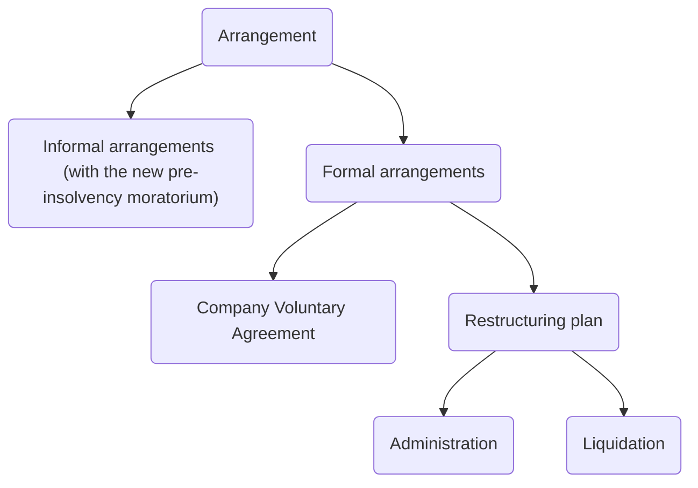

# Corporate Insolvency

```toc
```

Legislation: IA 1986.

Aims of insolvency law:

1. Protect creditors of the company
2. Balance interests of competing groups of creditors
3. Promote corporate rescues
4. Control/ punish directors.

## Proving Insolvency

```ad-statute
title: s 122 IA 1986 - Circumstances in which company may be wound up by the court.

(1) A company may be wound up by the court if—
- (a) the company has by special resolution resolved that the company be wound up by the court,
- (b) being a public company which was registered as such on its original incorporation, the company has not been issued with a trading certificate under section 761 of the Companies Act 2006 (requirement as to minimum share capital) and more than a year has expired since it was so registered,
- (c) it is an old public company, within the meaning of the Schedule 3 to the Companies Act 2006 (Consequential Amendments, Transitional Provisions and Savings) Order 2009,
- (d) the company does not commence its business within a year from its incorporation or suspends its business for a whole year;
- (f) **the company is unable to pay its debts,**
- (g) the court is of the opinion that it is just and equitable that the company should be wound up.
```

Test | Description
---|---
Cash flow test | An inability to pay debts as they fall due ([s 123(1)(e) IA 1985](https://www.legislation.gov.uk/ukpga/1986/45/section/123))
Balance sheet test | Company's liabilities are greater than its assets (s 123(2))
Failure to comply with a statutory demand for a debt of over £750 within 3 weeks | s 123(1)(a)
Failure to satisfy enforcement of a judgment debt | A creditor has enforced judgment against the company and attempted to execute the judgment and the debt is still unsatisfied in full or in part (s 123(1)(b))

### Options

- Take steps to put the company into liquidation themselves
- Talk to creditors to come to a compromise
- Enter a CVA
- Appoint administrator to take over the running of the company
- Utilise moratorium procedure (CIGA 2020)
- Enter into restructuring plan (CIGA 2020).
- Enter into a scheme of arrangement.

### Unpaid Creditor Options

#### Unsecured Creditor

- Serve a statutory demand for debts $>£750$ (s 123(1)(a)), wait 3 weeks, then present a petition to court to put the company into liquidation.
- Sue company, obtain judgment, execute judgment (s 123(1)(b) IA 1986), then present a petition to court to put the company into liquidation.
- Suggest a CVA
- Apply to court to put the company into administration.

#### Secured Creditor

As well as the above, a secured creditor can:

- Appoint an administrator out of court
- Appoint an LPA receiver
- Appoint an administrative receiver (if security for the debt was created before 15/09/03)

```ad-warning
If serving a statutory demand, the secured creditor must be careful to only serve this for the unsecured element of the debt, else it may lose its security. 
```

## Liquidation

```ad-defn
Liquidation is the process by which a company's business is wound up, and its assets transferred to creditors and (if there is a surplus of assets over liabilities) to its members.
```

Basic steps:

1. Liquidation proceedings commenced
2. Liquidator appointed
3. Liquidator collects company's assets and may review past transactions.
4. Liquidator distributes assets in the statutory order to the creditors
5. Company dissolved.

3 types of liquidation:

| Type                            | Description                                                                  |
| ------------------------------- | ---------------------------------------------------------------------------- |
| Compulsory [[Liquidation]]      | Commenced against an insolvent company by a 3rd party                        |
| Creditors voluntary liquidation | Commenced by an insolvent company, usually in response to creditor pressure. |
| Members' voluntary liquidation  | Commenced by a solvent company that wishes to cease trading/ is dormant.                                                                              |

## Compulsory Liquidation

This is a court-based process.

To begin the process, an applicant presents a winding up petition to the court under which the applicant requests the court to make a winding up order against the company on a number of statutory grounds.

When the court grants a petition for compulsory liquidation, the order operates in favour of all the creditors and contributories (members and some former members) of the company.

The Official Receiver will become the liquidator and continue in office until another person is appointed ([s 136(2) IA 1986](https://www.legislation.gov.uk/ukpga/1986/45/section/136)). The Official Receiver will notify Companies House and all known creditors of the liquidation. The Official Receiver has the power to summon separate meetings of the company's creditors and contributories for the purpose of choosing a person to become the liquidator of the company in their place (s 136(4)).

### Applying for a Winding up Order

The following can apply to the court for the issue of a winding up petition:

1. a creditor;
2. the company (acting by the shareholders; this would happen where there are insufficient assets in the company to fund a voluntary liquidation);
3. the directors (by board resolution); again, this would happen where there are insufficient assets to fund a voluntary liquidation;
4. an administrator;
5. an administrative receiver;
6. the supervisor of a CVA; and
7. The Secretary of State for Business, Energy & Industrial Strategy (on public policy grounds).

### Inability to Pay Debts

The **most common ground** for a winding up petition is the company's inability to pay its debts under [s 122(1)(f) IA 1986](https://www.legislation.gov.uk/ukpga/1986/45/section/122). This can be evidenced in several ways ( [s 123 IA 1986](https://www.legislation.gov.uk/ukpga/1986/45/section/123)):

1. Failure by the company to comply with a creditor’s statutory demand (s 123(1)(a))
	- A statutory demand is a written demand in a prescribed form requiring the company to pay a specific debt.
	- The statutory demand can only be used if the debt exceeds £750 and is not disputed on substantial grounds.
	- The company has 21 days in which to pay the debt, failing which the creditor has the right to petition the court to wind up the company.
2. The creditor sues the company, obtains judgment and fails in an attempt to execute the judgment debt (s 123(1)(b) IA 1986)
3. Proof to the satisfaction of the court that the company is unable to pay its debts as they fall due (the “cash-flow test”) (s 123(1)(c) IA 1986).
	- The cash flow test is usually satisfied by going through the statutory demand process in 1 above
	- Alternatively, the company admitting it cannot pay the debt in open correspondence.
4. Proof to the satisfaction of the court that the value of the company’s assets is less than the amount of its liabilities, taking into account contingent and prospective liabilities (the 'balance sheet test') (s 123(2))
	- [[Re Cheyne Finance plc [2007] EWHC 2402 (Ch) ]]

The cash-flow test must include a consideration of debts falling due in the reasonably near future ([[BNY Corporate Trustee Services Ltd v Eurosail-UK 2007-3BL plc [2013] ]]).

The court will consider all relevant factors and may dismiss the petition if the debtor company can show that it may recover its financial position or if the debt is disputed in any way by the debtor company ([[Tallington Lakes Ltd v Ancasta International Boat Sales Ltd [2012] EWCA Civ 1712]]).

- There must be a genuine and substantial dispute ([[Misra Ventures Ltd v LDX International Group LLP [2018] EWCA Civ 330]]).

If the winding-up petition is accepted and a winding-up order is made, the Official Receiver, a civil servant or court official will automatically become a liquidator. Must decide whether it is appropriate to appoint an insolvency practitioner as liquidator in their place. This will generally be done if $>50\%$ creditors by value choose a private practice insolvency practitioner.

```ad-note
Where a commercial debt is owed to a landlord and the Commercial Rent (Coronavirus) Act 2020 applies, a legally binding arbitration procss will be available to seek to resolve disputes about pandemic related debt. 
```

### Consequences of Winding up Order

To prevent an insolvent company from transferring its assets to third parties at the expense of its creditors, under [s 127 IA 1986](https://www.legislation.gov.uk/ukpga/1986/45/section/127) certain dispositions of a company's property, transfers of its [[shares]] and changes to its members will be void if made after the commencement of the winding up.

So if these dispositions etc. were made during the period between the presentation of the winding up petition and a winding up order being made, they will be [[void]]. This includes:

- Disposition of the company’s property;
- Transfer of the company’s [[shares]];
- Altering the status of the company’s members.

Once a compulsory winding up order has been made:

- An automatic stay will be granted on commencing or continuing with proceedings against the company;
- all employees will be automatically dismissed, and
- the directors lose their powers, and they are automatically dismissed from office.

## Voluntary Winding up

[s 84(1) IA 1986](https://www.legislation.gov.uk/ukpga/1986/45/section/84) allows for the company to be wound up without a court order in 3 situations:

Situation | Description
---|---
Shareholder resolution | Where the company's purpose according to the articles has expired and resolution of the shareholders (rare)
Members' voluntary liquidation (MVL) | Where the company resolves by special resolution to wind up the company. The company must be solvent.
Creditors' voluntary liquidation (CVL) | Where the company resolves that it is advisable to wind up the company due to its inability to carry on its business. Here the company is insolvent.

### Members' Voluntary Liquidation

Can only be used for companies which are solvent. The directors are required to swear a **declaration of solvency**, stating that they have made a full enquiry into the solvency, and they have formed the opinion that the company will be able to pay its creditors in full, together with interest at the official rate, within a period not exceeding 12 months from the commencement of the winding up ([s 89(1) IA 1986](https://www.legislation.gov.uk/ukpga/1986/45/section/89)). The declaration must also contain a statement of the company's assets and liabilities as at the latest practicable date before making the declaration.

Any director making a declaration of solvency who does not have reasonable grounds for their opinion is liable to a **fine or imprisonment** ([s 89(4) IA 1986](https://www.legislation.gov.uk/ukpga/1986/45/section/89)). If the debts are not actually paid in full within the specified period, it will be presumed that the director did not have reasonable grounds for their opinion.

The members must then pass a [[Special resolution]] to place the company into MVL and an [[Ordinary resolution]] to appoint a liquidator. The winding up commences when the special resolution is passed ([s 84(1) IA 1986](https://www.legislation.gov.uk/ukpga/1986/45/section/84) and [s 86 IA 1986](https://www.legislation.gov.uk/ukpga/1986/45/section/86)).

### Conversion of MVL to CVL

On a MVL, if the liquidator considers that the company will be unable to pay its debts in full together with interest within the period stated in the directors' declaration, they must change the members' winding up into a creditors' winding up by going through the procedural conditions in [s 95 IA 1986](https://www.legislation.gov.uk/ukpga/1986/45/section/95). This involves the liquidator preparing and sending a statement of the company’s affairs to the company's creditors.

The company's creditors may nominate a person to be liquidator. In most cases, this will be the insolvency practitioner who was appointed to deal with the MVL. The creditors' voluntary liquidation takes effect from the date of nomination of the liquidator.

### Creditors' Voluntary Liquidation

This is a form of insolvent liquidation commenced by resolution of the shareholders, but under the effective control of the creditors, who can choose the liquidator.

Where a directors' declaration of solvency has not been made, the liquidation will be a CVL. The procedure is for the shareholders to pass a special resolution to place the company into a CVL.

The shareholders may also nominate a person to be liquidator, but in any event within **14 days** of the special resolution being passed the directors of the company must ask the company’s creditors to either approve the nominated liquidator or put forward their own choice of liquidator. Where the creditors’ choice of liquidator differs from that of the company’s shareholders, the creditors’ nomination will take precedence.

The directors must also draw up a statement of the company’s affairs (setting out the company’s assets and liabilities) and send it to the company’s creditors.

## Role of the Liquidator

The appointment of a liquidator terminates the management powers of the company's directors, and these powers are transferred to the liquidator, together with their fiduciary duties. So liquidators must act in good faith, avoid conflicts of interest and not make a secret profit ([[Silkstone and Haigh Moore Coal Co v Edey [1900] ]]).

The liquidator must be a qualified Insolvency Practitioner ([s 230 IA 1986](https://www.legislation.gov.uk/ukpga/1986/45/section/230)) or the Official Receiver (appointed by the court in the short term) and acts as an officer of the court.

The liquidator in both a CVL and a compulsory liquidation has extensive statutory powers. Principle functions are:

- To secure and realise the assets of the company, then distribute to the company's creditors ([s 143 IA 1986](https://www.legislation.gov.uk/ukpga/1986/45/section/143));
- To take into their custody or under their control all the property of the company ([s 144 IA 1986](https://www.legislation.gov.uk/ukpga/1986/45/section/144))

The liquidator's powers to manage the company are set out in Part I to III [Sch 4 IA 1986](https://www.legislation.gov.uk/ukpga/1986/45/schedule/4), and include powers to

- Sell any of the company's property;
- Execute deeds and other documents in the name of the company;
- Raise money on the security of the company’s assets;
- Make or draw a bill of exchange or promissory note in the name of the company;
- Appoint an agent to do any business that the liquidator is unable to do;
- Do all other things that may be necessary to wind up the company's affairs and to distribute its assets.
- Carry on the business of the company, but only to the extent that is necessary for the beneficial winding up of the company.
- Commence or defend court proceedings in the name of the company, for example to recover debts owed to it or dispute debts alleged to be owed by the company.
- Pay debts and compromise claims.

Additional duties are imposed on the Official Receiver in compulsory liquidations, including presenting a report to the creditors and the court (s 132 IA 1986).

The liquidator will also review the actions of directors. If the director has transferred property after winding up has begun, or in anticipation of it up to one year beforehand, the director may be liable for fraud under s 206 IA 1986. If it appears to the liquidator during the course of a MVL that the company is insolvent, the liquidator must convert the liquidation to a CVL (s 95 IA 1986).

### Effect of Liquidation

- Directors' powers cease and the liquidator takes over the running of the company (ss 91 & 103 IA 1986).
- In a compulsory liquidation, directors' appointments are terminated ([[Measures Brothers Ltd v Measures [1910] 2 CH 248]]).

The liquidation is concluded when:

- Available assets are sold
- Money distributed to the creditors
- Liquidator released
- Accounts forwarded to Companies House and the court
- 3 months later, the company is dissolved by the Registrar of Companies.

### Liquidator's Powers to Avoid Certain Transactions

Liquidators have a duty to preserve the company's property and to maximise the value of the company's assets available for distribution. Empowered to avoid certain antecedent transactions in order to maximise assets available for distribution to creditors:

- Disclaim onerous property ([s178 IA 1986](https://www.legislation.gov.uk/ukpga/1986/45/section/178));
- Apply to court to set aside a transaction at an undervalue ([s238 IA 1986](https://www.legislation.gov.uk/ukpga/1986/45/section/238));
- Apply to court to set aside a preference ([s 239 IA 1986](https://www.legislation.gov.uk/ukpga/1986/45/section/239));
- Apply to court to set aside, or vary the [[terms]] of, an extortionate credit transaction ([s 244 IA 1986](https://www.legislation.gov.uk/ukpga/1986/45/section/244));
- Claim that a floating charge created for no new, or inadequate, [[consideration]] is invalid ([s 245 IA 1986](https://www.legislation.gov.uk/ukpga/1986/45/section/245));
- Apply to court to set aside a transaction that will defraud creditors ([s 423 IA 1986](https://www.legislation.gov.uk/ukpga/1986/45/section/423)).

Many of these powers also apply to administrators.

## Distribution of Assets

- Liquidator asks creditors to send them details of their debt on a standard form ("proving the debt").
- Liquidator approves/ rejects proof of debt.
- $\exists$ simplified procedure for small debts (<£1,000)

Then the assets are distributed; see [[Statutory order of priority on winding up]] and IA 1986, ss 175, 176ZA and 176A.

Essentially:

- Expenses of the winding up
- Preferential debts
- Monies secured by floating charges by the order of priority (subject to ring-fencing of a prescribed part for the unsecured creditors).
- Surplus distributed to shareholders.
- Unsecured creditors (ranking and abating equally)

## Alternatives to Liquidation

The company may try to avoid liquidation using:

1. Administration (IA 1986, Sch B1).
2. Company voluntary arrangements (CVAs) (IA 1986, Part I).
3. The moratorium procedure (CIGA 2020, s 1, inserting a new Part A1 into the IA 1986).
4. The restructuring plan procedure (CIGA 2020, s 7 and Sch 9, inserting a new Part 26A (ss 901A–910L) into CA 2006)
5. Schemes of arrangement (CA 2006, ss 895–901)
6. Informal agreements with creditors.



These are not mutually exclusive procedures.

[[Administration]]

### Creditors Voluntary Arrangement

#### Definition

The CVA is a compromise between a company and its creditors. Defined in [s 1(1) IA 1986](https://www.legislation.gov.uk/ukpga/1986/45/section/1) as

> “A composition in satisfaction of its debts or a scheme of arrangement of its affairs”.

The essence of a CVA is that the creditors agree to part payment of the debts or to a new timetable for repayment. The agreement must be reported to court, but there is no requirement for the court to approve the arrangement.

The CVA is supervised and implemented by an Insolvency Practitioner. But the company's directors remain in post and are involved in the implementation. Can also be used together with administration or liquidation.

#### Setting up CVA

- If the company is not in liquidation or administration, the directors draft the written proposals and appoint a nominee (an insolvency practitioner).
- The directors submit the written proposals to the creditors and a statement of the company's affairs to the nominee [(s 2(3) IA]((https://www.legislation.gov.uk/ukpga/1986/45/section/2))).
- The nominee considers the proposals, and, within 28 days, must report to court on whether to call a meeting of company and creditors ([s 2(1) and 2(2) IA 1986](https://www.legislation.gov.uk/ukpga/1986/45/section/2)).
	- May call a meeting of creditors under the "Decision Procedure" in IR 2016
	- May also call a meeting of members.
- Nominee gives 14 days' notice of meeting to creditors. A meeting of the members must take place within 5 days of the creditors' decision.
- Voting: proposals must be approved by
	- 75% in value of creditors (excluding secured creditors); and
	- A majority in value of unconnected creditors (investors not connected to the company) ([s 4A IA]((https://www.legislation.gov.uk/ukpga/1986/45/section/4))); and
		- It is for the convenor or chair of the meeting to decide if a creditor is connected.
	- A simple majority of members.
- All creditors (except secured and preferential who disagree) are bound, even if they did not take part in the Decision Procedure (s 5 IA 1986)
- Nominee becomes "supervisor" and reports to court on approval.
- Directors remain in office and run company, but supervisor checks implementation of proposals.
- Supervisor makes final report to creditors and members.

#### Effect of a CVA

A CVA is binding on all unsecured creditors (as regards past but not future debts - s 5 IA 1986), including those who did not vote/ voted against it.

But secured/ preferential creditors are **not** bound unless they unanimously consent to the CVA ([s 4 IA 1986](https://www.legislation.gov.uk/ukpga/1986/45/section/4)).

```ad-note
There is no statutory moratorium under a CVA, but a company could use the moratorium created by CIGA 2020 while creating a CVA proposal to be voted on. 
```

#### Using CVAs

CVAs are used, either alone or within administration, in order to attempt to reach a compromise with creditors. They are particularly used when trying to get landlords to agree to a rent reduction in order to allow the company wiggle room to keep trading.

| Advantages                                                                                                                                                      | Disadvantages                                                                                           |
| --------------------------------------------------------------------------------------------------------------------------------------------------------------- | ------------------------------------------------------------------------------------------------------- |
| Directors retain control of the company, which is able to continue trading under a successful CVA and may exit this procedure as a solvent, profitable company. | Secured or preferential creditors are not bound unless they unanimously consent to the CVA (s 4(3) IA). |
| Binding on unsecured creditors (s 5(2)(b) IA) irrespective of how they voted.                                                                                   | Relatively complex procedure                                                                            |
| No court approval required, so costs less and is quicker than other insolvency procedures. Can be used alongside administration or liquidation.                                                                     | No longer offers a moratorium                                                                           |

Overall, CVAs are relatively rarely used due to the complexity of the procedure, and the fact that secured/ preferential creditors are not bound. This will probably fall further and be replaced by the Restructuring Plan introduced by CIGA 2020.

- [Clarks' use of CVA](https://www.theguardian.com/business/2020/nov/20/landlords-accuse-clarks-over-legal-deal-to-cut-shop-rents)
- [New Look's use of CVA](https://www.theguardian.com/business/2020/sep/15/new-look-strikes-deal-on-rent-cuts-and-payment-holidays)

### Restructuring Plan (CIGA 2020)

The purpose of the Plan is to compromise a company's creditors and shareholders, and restructure its liabilities so that a company can return to insolvency. The plan can bind secured creditors. Acts as a compromise between the company and its creditors and/or shareholders.

Relevant provisions: [Part 26A CA 2006](https://www.legislation.gov.uk/ukpga/2006/46/part/26A) (as amended by CIGA 2020). A plan can only be used by companies which have or are likely to encounter financial difficulties, and propose to eliminate, reduce, prevent or mitigate the effect of these financial difficulties through the procedure. Lots of similarities with US Chapter 11 bankruptcy proceedings.

A company just needs to establish a 'sufficient connection' to the English jurisdiction to use the procedure - likely to present a low bar.

Typically, directors of a company, insolvency practitioners and restructuring lawyers prepare a restructuring plan proposal and apply to court for approval to convene meetings with the company's creditors and members.

#### Key Features

- Creditors and members must be divided into classes. Each class which votes on the Plan must be asked to approve it. The Plan must be approved by **$\geq 75\%$ in value of each class voting**.
- The court must sanction the Plan, and it will then bind all creditors.
- The parties who can apply to the court for sanction of a restructuring plan are (s 901C(2) CA):
	- The company
	- Any creditor
	- Any member
	- The liquidator (if company is in liquidation)
	- The administrator (if company is in administration)

There are usually two court hearings:

1. Convening meeting
	- Court considers whether:
		- Company is eligible
		- Creditor classes correctly formulated
		- Any creditors to be excluded from voting (no genuine economic interest)
		- Jurisdictional issues.
	- Creditors can make representations
	- If court is satisfied, it will make an order convening creditor and member meetings.
	- All creditors and members sent notice of the meetings and documentation outlining the restructuring plan.
	- Voting thresholds: approval of 75% in gross value of debt or equity that votes in each class of creditors or members.
2. Sanctioning hearing
	- Court decides whether to sanction the plan, in its absolute discretion.

#### Advantages

The court can sanction a Plan if it is **just and equitable** to do so, even if:

- One or more classes do not vote to approve the plan
- It brings about a cross class cramdown;
	- Where a class of creditor can force the Plan on another class of creditor who has voted against the Plan
- It brings about a cramdown of shareholders;
	- Shareholders are forced to accept the Plan, even if it means diluting equity by creating [[debt-for-equity swaps]].

```ad-test
title: Cross-class cram down
Will be ordered when:
1. Court satisfied that no member of the dissenting classes will be any worse off under the plan than they would have been under the 'relevant alternative'
2. At least one class that would benefit from the relevant alternative has voted in favour of the plan
3. The court is prepared to sanction the plan. 
```

```ad-defn
title: Relevant alternative
What the court considers to be most likely to occur if the plan is not sanctioned by the court (usually liquidation). 
```

#### Usage

- A plan is likely to be used by directors following the use of a pre-insolvency moratorium. The company may apply for the pre-insolvency moratorium to protect itself, whilst the arrangements are made for the implementation of the Plan. The moratorium will end once the Plan received court sanction.
- Can also be used by administrators and liquidators
- May be better than a CVA because it can compromise the rights and claims of secured creditors and shareholders (which a CVA can't do).

See [Virgin Atlantic restructuring plan](https://uk.practicallaw.thomsonreuters.com/w-027-5147?transitionType=Default&contextData=(sc.Default)&firstPage=true).

### Schemes of Arrangement

Similar to CVAs, but can be undertaken at any stage in the lifetime of a company. 2 court hearings needed, as well as meetings of creditors and shareholders. Often used to restructure large companies.

Need 75% in value + a majority in number of the creditors to agree. So this is harder to get agreed.

## Receivership

Secured creditors may be able to appoint an administrative receiver. Usually appointed where the company is not complying with the terms of the charge holder's loan agreement. The company does not need to be insolvent – a receiver may be appointed by a charge holder whenever the charge allows it.

| Receiver                            | Task                                                                                                                  |
| ----------------------------------- | --------------------------------------------------------------------------------------------------------------------- |
| Appointed by fixed charge holder    | Take possession of the charged property and deal with it for the benefit of the charge holder only (usually, sell it) |
| Appointed by floating charge holder | As above, but also have a duty to pay preferential creditors (s 40 IA 1986).                                                                                                                       |

### LPA Receivers

A fixed charge holder was traditionally appointed under LPA 1925, so referred to as an LPA Receiver. Now, an express power to appoint is usually conferred in the charge document. Does not need to be a licensed insolvency practitioner.

Fixed charge receivers are appointed by the holders of a fixed charge pursuant to the terms of the security documentation. They are appointed to enforce the [[security]], and recover the debt that is owing to their appointor, often a bank. Owe duties primarily and exclusively to the appointor. They owe their duties primarily and exclusively to the appointor. The duty to the chargor is to act in good faith in the course of their appointment.

It is a legal anomaly that fixed charge receivers are usually an agent of the chargor. Usually have extensive powers set out in the security documentation and some limited powers under the Law of Property Act 1925. These typically include the ability to sell, mortgage and collect rent.

### Administrative Receiver

s 29 IA 1986: can be appointed by a floating charge holder if the floating charge was granted before 15 September 2003 (ss 72A-72H IA 1986).

## Phoenix Companies

s 216 IA 1986:: prohibits the re-use of a company's name where the company has gone into insolvent liquidation. This is to prevent insolvency being used to clear debts and start afresh.

Directors of the new company may be held personally liable for its debts (s 216) unless they consent of the court to be directors of the new company. May also face criminal penalties.

Exceptions:

1. Where the successor company acquires the whole, or substantially the whole, of the business of an insolvent company, under arrangements made by an insolvency practitioner acting as its liquidator or administrator.
2. Directors of the successor phoenix company applying to court for leave to re-use the name of the insolvent company. Application within 7 days of the date on which the company went into liquidation, and leave granted by court within 6 weeks of the date.
3. A company can re-use the name of an insolvent company if;
	1. It has been known by that name for 12 months ending with the day before the liquidating company went into liquidation.
	2. It has not at any time in those 12 months been 'dormant' (defined s 252(5) CA 2006).
