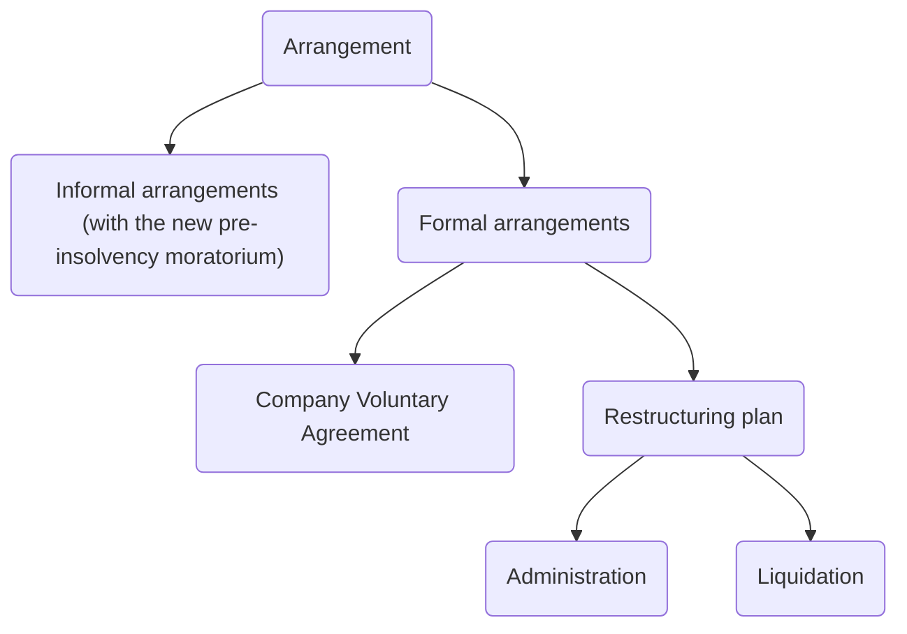

```toc
min_depth: 1
```

# Proving Insolvency

Legislation: IA 1986. Aims of insolvency law:

1. Protect creditors of the company
2. Balance interests of competing groups of creditors
3. Promote corporate rescues
4. Control/ punish directors.

```ad-statute
title: s 122(1) IA 1986 - Circumstances in which company may be wound up by the court.

A company may be wound up by the court if—
- (a) the company has by special resolution resolved that the company be wound up by the court,
- (b) being a public company which was registered as such on its original incorporation, the company has not been issued with a trading certificate under section 761 of the Companies Act 2006 (requirement as to minimum share capital) and more than a year has expired since it was so registered,
- (c) it is an old public company, within the meaning of the Schedule 3 to the Companies Act 2006 (Consequential Amendments, Transitional Provisions and Savings) Order 2009,
- (d) the company does not commence its business within a year from its incorporation or suspends its business for a whole year;
- (f) **the company is unable to pay its debts,**
- (g) the court is of the opinion that it is just and equitable that the company should be wound up.
```

Test | Description
---|---
Cash flow test | An inability to pay debts as they fall due ([s 123(1)(e) IA 1985](https://www.legislation.gov.uk/ukpga/1986/45/section/123))
Balance sheet test | Company's liabilities are greater than its assets (s 123(2))
Failure to comply with a statutory demand for a debt of over £750 within 3 weeks | s 123(1)(a)
Failure to satisfy enforcement of a judgment debt | A creditor has enforced judgment against the company and attempted to execute the judgment and the debt is still unsatisfied in full or in part (s 123(1)(b))

## Options

- Take steps to put the company into liquidation themselves
- Talk to creditors to come to a compromise
- Enter a CVA
- Appoint administrator to take over the running of the company
- Utilise moratorium procedure (CIGA 2020)
- Enter into restructuring plan (CIGA 2020).
- Enter into a scheme of arrangement.

## Unpaid Creditor Options

### Unsecured Creditor

- Serve a statutory demand for debts $>£750$ (s 123(1)(a)), wait 3 weeks, then present a petition to court to put the company into liquidation.
- Sue company, obtain judgment, execute judgment (s 123(1)(b) IA 1986), then present a petition to court to put the company into liquidation.
- Suggest a CVA
- Apply to court to put the company into administration.

### Secured Creditor

As well as the above, a secured creditor can:

- Appoint an administrator out of court
- Appoint an LPA receiver
- Appoint an administrative receiver (if security for the debt was created before 15/09/03)

```ad-warning
If serving a statutory demand, the secured creditor must be careful to only serve this for the unsecured element of the debt, else it may lose its security. 
```

# Directors' Duties on Insolvency

Note that under s 172(3), the duty to promote the success of the company for the benefit of members as a whole shifts to the benefit of creditors.

## Misfeasance

[[Directors]] owe duties to the company under s 171178 CA 2006. [[Breach]] of any such duties is generally actionable by the company, though [[Business Law and Practice/Company Fundamentals/Shareholders]] may be able to bring a claim for [[Unfair Prejudice]], [[just and equitable winding up]], or [[derivative claims]] on behalf of the company.

On a winding up, typically the liquidator brings an action against the directors under [s 212 IA 1986](https://www.legislation.gov.uk/ukpga/1986/45/section/212) for any breaches of duty committed by them.

s 212 does not create any new liability or rights, but simply provides a summary procedure to enable the company (acting by its liquidators) to pursue claims against directors who have breached their duties.

Where a person's liability is established, the court may order that person to compensate the company in respect of the money or property misapplied.

### Bringing a Claim

A claim may be brought by:

- A liquidator
- The Official Receiver
- Any creditor or contributory

The burden of proof is on the claimants to establish misfeasance on the part of the director/ other defendant ([[Mullarkey v Broad [2008] 1 BCLC 638]]).

### Against Whom May a Claim Be Brought?

s 212(1): a claim in misfeasance may be brought against:

1. Any person who is or has been an officer of the company (including present or former directors, managers or secretaries of the company)
2. Any others who acted in the promotion, formation or management of the company; and
3. A liquidator or administrative receiver (a claim for misfeasance can also be brought against an administrator under Schedule B1 to the IA 1986).

See [[Re Centralcrest Engineering Co Ltd [2000] BCC 727]] for claim against liquidator.

### Scope

Covers the whole spectrum of directors' duties. Includes:

- Misapplication of any money or assets of the company
- Breach of a statutory provision or duty, e.g.,
	- Unlawful loans to a director;
	- Director entering contract with his own company and failing to notify board ([s 177 CA 2006](https://www.legislation.gov.uk/ukpga/2006/46/section/177));
	- Failing to seek prior [[General Meeting]] approval where a director has entered into a substantial property transaction ([s 190 CA 2006](https://www.legislation.gov.uk/ukpga/2006/46/section/190)); and
	- A director failing to act within his powers ([s 171 CA 2006](https://www.legislation.gov.uk/ukpga/2006/46/section/171))
	- Directors responsible for transactions at an undervalue as provided in s 238 or preferences as provided in s 239 may thereby commit a misfeasance;
	- Breach of the duty to exercise reasonable care, skill and diligence, i.e., in negligence ([s 174 CA 2006](https://www.legislation.gov.uk/ukpga/2006/46/section/174)).

### Remedies

The court will examine the conduct of the director/ other person against whom the claim for misfeasance has been brought, and make an order for repayment, restoration or contribution to the company's assets as it thinks just.

The director may claim relief under [s 1157 CA 2006](https://www.legislation.gov.uk/ukpga/2006/46/section/1157), where the court is satisfied that the director acted honestly and reasonably, and, having regard to all the circumstances of the case, ought fairly to be excused.

A finding of misfeasance is also a relevant factor when the court considers whether to make a disqualification order against a director for unfitness under [s 6 Company Directors' Disqualification Act 1986](https://www.legislation.gov.uk/ukpga/1986/46/section/6).

### Ratification

Ratification by the shareholders under [s 239 CA 2006](https://www.legislation.gov.uk/ukpga/2006/46/section/239) can usually absolve the directors from personal liability for breach of duty. Ratification at a time when the company is solvent should preclude misfeasance proceedings.

When a company is facing insolvency, duties of directors shift towards the company's creditors, and away from the members as a whole (per case law). Rationale: in these circumstances, creditors are the ones who stand to lose if the directors breach their duties.

**Not** possible for shareholders to ratify breach of directors' duties at a time when the company's fortunes have declined to the extent that there is a reasonable possibility of the company going insolvent (s 239(7) CA 2006).

## Fraudulent Trading

The provisions on fraudulent and wrongful trading in IA 1986 were enacted to prevent the reckless and negligent conduct on the part of those running companies. They are examples of claims in which the corporate veil may be pierced and directors held liable for losses made by the company.

### Claim

A claim can be brought under s 213/ 246ZA IA 1986 against:

> Any person (s 213(2), s 246ZA) who is knowingly party to the carrying on of any business of the company, with intent to defraud creditors or for any fraudulent purpose (s 213(1), s 246ZA(1)).

[s 213 IA 1986](https://www.legislation.gov.uk/ukpga/1986/45/section/213) (in [[Liquidation]]) and [s 246ZA IA 1986](https://www.legislation.gov.uk/ukpga/1986/45/section/246ZA) (in administration) impose a civil liability to contribute to the funds available to the general body of unsecured creditors suffering loss caused by carrying on of the company's business with intent to defraud.

There is a corresponding criminal claim for fraudulent trading under [s 993 CA 2006](https://www.legislation.gov.uk/ukpga/2006/46/section/993). The claim may be brought by a liquidator (s 213) or by an administrator (s 246ZA), though court approval is required.

### Dishonesty

Actual dishonesty must be proven for a claim for fraudulent trading to succeed. This is assessed on a subjective basis, i.e., what the particular person knew or believed.

Knowledge includes blind-eye knowledge, which requires a suspicion of the relevant facts together with a deliberate decision to avoid confirming that they did exist ([[Morris v State Bank of India [2005] 2 BCLC 328]])

Fraud is defined for the purposes of s 213 as requiring

> “Real dishonesty involving, according to current notions of fair trading among commercial men at the present day, real moral blame.” ([[Re Patrick and Lyon Ltd [1933] Ch 786]])

Not necessary to show that all the company's creditors have been defrauded ([[Re Gerald Cooper Chemicals Ltd [1978] Ch 262]]).

### Remedies

A person found to be liable under s 213 / 246ZA can be ordered to make a contribution to the company's assets as the court thinks proper. The court does not have the power to include a punitive element in the amount awarded; the contribution should only reflect and compensate for the loss caused to the creditors ([[Morphitis v Bernasconi [2003] 2 BCLC 53]]).

Any sums recovered are held on trust for the unsecured creditors generally, and not for the defrauded creditor ([[Re Esal (Commodities) Ltd [1997] 1 BCLC 705]]).

#### Director Fraudulent Trading

Where the court makes an order against a person under s 213 / 246ZA, and that person is also a director, the court is likely also to make a disqualification order under [s 10 CDDA 1986](https://www.legislation.gov.uk/ukpga/1986/46/section/10).

#### Criminal Sanctions

Criminal sanctions can be imposed by the court under [s 993 CA 2006](https://www.legislation.gov.uk/ukpga/2006/46/section/993), to punish a person knowingly party to fraudulent trading, whether or not the company is being wound up. The penalties are imprisonment (of up to 10 years on indictment) and/or fines.

#### Fraudulent Vs Wrongful

A very high standard of proof is required in practice for a successful claim in fraudulent trading. So claims are rare, and claims for [[Wrongful trading]] under s 214 / 246ZB IA 1986 are more often brought against directors.

## Wrongful Trading

### Rationale

Liability for wrongful trading is a much more recent innovation than the introduction of liability for [[fraudulent trading]]. It was introduced to address criticism of the ineffectiveness of the fraudulent trading provisions, given the high bar of proof required for such claims.

### Purpose

The purpose of wrongful trading liability is to ensure that directors become aware that when an insolvent [[Liquidation]]/ administration is inevitable, they are under a duty to take every step possible to minimise the potential losses to the company's creditors.

If they fail, the court can order the directors to contribute to the insolvent estate by way of compensation for the losses that the general body of creditors have suffered as a result. This will increase the funds available for distribution to the unsecured creditors upon insolvency.

Wrongful trading liability imposes a personal liability on directors, and is an exception to the principle of limited liability, under which those who run a company cannot be liable for its unpaid debts.

There is no requirement to show intent or dishonesty.

### Who May Bring a Claim

A civil claim for wrongful trading can be brought against a director by a liquidator ([s 214 IA 1986](https://www.legislation.gov.uk/ukpga/1986/45/section/214)) or an administrator ([s 246ZB IA 1986](https://www.legislation.gov.uk/ukpga/1986/45/section/246ZB)). There are no criminal provisions for wrongful trading.

Wrongful trading is a major risk run by [[directors]] of a company trading on the brink of insolvency.

Administrators and liquidators can also now under [SBEEA 2015](https://www.legislation.gov.uk/ukpga/2015/26/contents/enacted) assign wrongful trading claims to a third party as a way of raising funds for the insolvent estate and thereby avoid the risk of litigation.

### Against Whom Can a Claim Be Brought

Can be brought against any person who was at the relevant time a director.

This includes shadow directors (defined in [s 251 CA 2006](https://www.legislation.gov.uk/ukpga/2006/46/section/251)), de facto and non-executive directors ([[Re Hydrodam (Corby) Ltd [1994] 2 BCLC 180]]).

Recall that under fraudulent trading, a claim could be brought against any person who had the intention to commit a fraud.

### Requirements for Liability

```ad-tip
title:Wrongful Trading (s 214(2)/246ZB(2))

For a director to be liable for wrongful trading, the court must be satisfied that the company has gone into insolvent [[Liquidation]] or insolvent administration, and 
1. At some time before the commencement of the winding up or insolvent administration (for convenience, that time is referred to as the ‘point of no return’)
2. The director knew or ought to have concluded that
3. There was no reasonable prospect that the company would avoid going into insolvent [[liquidation]] (or insolvent administration).
```

For these purposes, a company goes into insolvent liquidation/ administration at a time when its assets are insufficient for the payment of its debts and other liabilities, and the expenses of the winding up/ administration (s 214(6) / 246ZB(6)).

Insolvency for wrongful trading purposes is judged solely on the balance sheet test, not on the cash flow test ([s 214(6) IA 1986](https://www.legislation.gov.uk/ukpga/1986/45/section/214)).

#### Continued Trading

It must be proven that the director in question allowed the company to continue trading during the period in which they knew/ ought to have known that there was no reasonable prospect that the company would avoid going into insolvent liquidation/ administration, and that the continued trading made the company's position worse ([[Re Continental Assurance Co of London plc [2001] BPIR 733]]).

But if the company has not reached 'the point of no return', then wrongful trading liability cannot arise. Only if this point has been reached should the defence below be considered.

[[Re Produce Marketing Consortium Ltd [1989] BCLC 513, ChD]]: there is an obligation laid on [[companies]] to keep accounting records which disclose with **reasonable accuracy** the financial position of the company. This minimum standard holds regardless of the size of the company, though a higher standard will be imposed for larger companies.

### The 'every Step' Defence

This defence is laid out in s 214(3) / 246ZB(3).

Assuming the company has reached the point of no return, a director may be able to escape liability if they can satisfy the court that, after they first knew/ ought to have concluded that there was no reasonable prospect of the company avoiding an insolvent administration/ liquidation, they took every step with a view to minimising the potential loss to the company's creditors.

Evidence of this:

- Voicing concerns at board meetings;
- Seeking independent financial/ legal advice;
- Ensuring adequate, up-to-date financial information was available;
- Suggesting reductions in overheads/liabilities;
- Not incurring further credit; and
- Consulting a lawyer and/or an insolvency practitioner for advice on continued trading and the different insolvency procedures.

The burden of proof for this is on the directors: [[Brooks v Armstrong [2015] EWHC 2289]].

### Reasonably Diligent Person Test

The 'reasonably diligent person' test (s 214(4) / 246ZB(4)) is applied to determine:

- Whether a liquidator or administrator has established that a director ought to have concluded that there was no reasonable prospect of avoiding an insolvent liquidation or administration (the s 214(2) / 246ZB(2) liability), and
- Whether the director then took every step to minimise the potential loss to the company’s creditors (the s 214(3) / 246ZB(3) defence).

Test:

- The facts which a director ought to have known or ascertained,
- The conclusions which they ought to have reached and
- The steps which they ought to have taken are those which would have been known or ascertained, or reached or taken, by a reasonably diligent person having both:
	- The general knowledge, skill and experience that may reasonably be expected of a person carrying out the same functions as are carried out by the director in question (an objective test); and
	- The actual knowledge, skill and experience of that particular director (a subjective test).

The court then applies the **higher** of these standards.

### Advice to Directors

- Directors should hold board meetings to review the company's financial position, and consider whether it is appropriate to incur new credit/ liabilities.
- Minutes of each meeting should be written up.
- Lawyers advising a company often take an active role in helping directors to prepare minutes and ensure that board meetings consider all relevant issues.
- A director cannot escape liability by simply resigning, since a claim for wrongful trading can be brought against any person who was a director at the relevant time ([[Re Purpoint Ltd [1991] BCLC 491]]).
- The best course of action is for the company to seek professional advice as soon as possible ([[Re Continental Assurance Co of London plc [2001] BPIR 733]]).
- But the absence of warnings from advisors does not relieve directors of the responsibility to review the company's position critically ([[Re Brian D Pierson (Contractors) Ltd [2001] 1 BCLC]]).

### Remedies

If a director is found liable for wrongful trading, the court can order that director to make such contribution to the assets of the company as the court thinks fit.

The court has wide discretion to determine the extent of the directors' liability. The contribution will ordinarily be based on the additional depletion of the company's assets caused by the directors' conduct from the date that the directors ought to have concluded that the company could not have avoided an insolvent administration/ liquidation (i.e., the point of no return).

#### Apportioning Contributions

An order by the court for a director to contribute to the company's assets is compensatory, not penal. An order to contribute can be made against the directors on a joint and several basis. But the court also has discretion to apportion liability between directors based on culpability by ordering the more culpable directors to pay less.

Where the court makes a contribution order against a director, the court also has discretion to make a disqualification order against them under [s 10 CDDA 1986](https://www.legislation.gov.uk/ukpga/1986/46/section/10).

#### No Relief

Under [s 1157 CA 2006](https://www.legislation.gov.uk/ukpga/2006/46/section/1157) the court may ordinarily relieve a director from liability in proceedings for negligence, breach of duty or breach of trust, if it is satisfied that they acted honestly and reasonably. And having regard to all the circumstances of the case, the director ought fairly to be excused. But this relief is **not** available in wrongful trading proceedings ([[Re Produce Marketing Consortium Ltd [1989] BCLC 513, ChD]]).

The risk of action for wrongful trading can be of concern to directors, particularly in a difficult economic climate. For this reason, the government suspended the wrongful trading provisions from 01/03/20-30/09/20 to allow company directors to attempt to keep their business going during COVID without risking personal liability. A further suspension was announced 26/11/20-30/04/21.

# Liquidation

```ad-defn
Liquidation is the process by which a company's business is wound up, and its assets transferred to creditors and (if there is a surplus of assets over liabilities) to its members.
```

Basic steps:

1. Liquidation proceedings commenced
2. Liquidator appointed
3. Liquidator collects company's assets and may review past transactions.
4. Liquidator distributes assets in the statutory order to the creditors
5. Company dissolved.

3 types of liquidation:

| Type                            | Description                                                                  |
| ------------------------------- | ---------------------------------------------------------------------------- |
| Compulsory [[Liquidation]]      | Commenced against an insolvent company by a 3rd party                        |
| Creditors voluntary liquidation | Commenced by an insolvent company, usually in response to creditor pressure. |
| Members' voluntary liquidation  | Commenced by a solvent company that wishes to cease trading/ is dormant.                                                                              |

## Compulsory Liquidation

This is a court-based process.

To begin the process, an applicant presents a winding up petition to the court under which the applicant requests the court to make a winding up order against the company on a number of statutory grounds.

When the court grants a petition for compulsory liquidation, the order operates in favour of all the creditors and contributories (members and some former members) of the company.

The Official Receiver will become the liquidator and continue in office until another person is appointed ([s 136(2) IA 1986](https://www.legislation.gov.uk/ukpga/1986/45/section/136)). The Official Receiver will notify Companies House and all known creditors of the liquidation. The Official Receiver has the power to summon separate meetings of the company's creditors and contributories for the purpose of choosing a person to become the liquidator of the company in their place (s 136(4)).

### Applying for a Winding up Order

The following can apply to the court for the issue of a winding up petition:

1. a creditor;
2. the company (acting by the shareholders; this would happen where there are insufficient assets in the company to fund a voluntary liquidation);
3. the directors (by board resolution); again, this would happen where there are insufficient assets to fund a voluntary liquidation;
4. an administrator;
5. an administrative receiver;
6. the supervisor of a CVA; and
7. The Secretary of State for Business, Energy & Industrial Strategy (on public policy grounds).

### Inability to Pay Debts

The **most common ground** for a winding up petition is the company's inability to pay its debts under [s 122(1)(f) IA 1986](https://www.legislation.gov.uk/ukpga/1986/45/section/122). This can be evidenced in several ways ( [s 123 IA 1986](https://www.legislation.gov.uk/ukpga/1986/45/section/123)):

1. Failure by the company to comply with a creditor’s statutory demand (s 123(1)(a))
	- A statutory demand is a written demand in a prescribed form requiring the company to pay a specific debt.
	- The statutory demand can only be used if the debt exceeds £750 and is not disputed on substantial grounds.
	- The company has 21 days in which to pay the debt, failing which the creditor has the right to petition the court to wind up the company.
2. The creditor sues the company, obtains judgment and fails in an attempt to execute the judgment debt (s 123(1)(b) IA 1986)
3. Proof to the satisfaction of the court that the company is unable to pay its debts as they fall due (the “cash-flow test”) (s 123(1)(c) IA 1986).
	- The cash flow test is usually satisfied by going through the statutory demand process in 1 above
	- Alternatively, the company admitting it cannot pay the debt in open correspondence.
4. Proof to the satisfaction of the court that the value of the company’s assets is less than the amount of its liabilities, taking into account contingent and prospective liabilities (the 'balance sheet test') (s 123(2))
	- [[Re Cheyne Finance plc [2007] EWHC 2402 (Ch) ]]

The cash-flow test must include a consideration of debts falling due in the reasonably near future ([[BNY Corporate Trustee Services Ltd v Eurosail-UK 2007-3BL plc [2013] ]]).

The court will consider all relevant factors and may dismiss the petition if the debtor company can show that it may recover its financial position or if the debt is disputed in any way by the debtor company ([[Tallington Lakes Ltd v Ancasta International Boat Sales Ltd [2012] EWCA Civ 1712]]).

- There must be a genuine and substantial dispute ([[Misra Ventures Ltd v LDX International Group LLP [2018] EWCA Civ 330]]).

If the winding-up petition is accepted and a winding-up order is made, the Official Receiver, a civil servant or court official will automatically become a liquidator. Must decide whether it is appropriate to appoint an insolvency practitioner as liquidator in their place. This will generally be done if $>50\%$ creditors by value choose a private practice insolvency practitioner.

```ad-note
Where a commercial debt is owed to a landlord and the Commercial Rent (Coronavirus) Act 2020 applies, a legally binding arbitration procss will be available to seek to resolve disputes about pandemic related debt. 
```

### Consequences of Winding up Order

To prevent an insolvent company from transferring its assets to third parties at the expense of its creditors, under [s 127 IA 1986](https://www.legislation.gov.uk/ukpga/1986/45/section/127) certain dispositions of a company's property, transfers of its [[shares]] and changes to its members will be void if made after the commencement of the winding up.

So if these dispositions etc. were made during the period between the presentation of the winding up petition and a winding up order being made, they will be [[void]]. This includes:

- Disposition of the company’s property;
- Transfer of the company’s [[shares]];
- Altering the status of the company’s members.

Once a compulsory winding up order has been made:

- An automatic stay will be granted on commencing or continuing with proceedings against the company;
- all employees will be automatically dismissed, and
- the directors lose their powers, and they are automatically dismissed from office.

## Voluntary Winding up

[s 84(1) IA 1986](https://www.legislation.gov.uk/ukpga/1986/45/section/84) allows for the company to be wound up without a court order in 3 situations:

Situation | Description
---|---
Shareholder resolution | Where the company's purpose according to the articles has expired and resolution of the shareholders (rare)
Members' voluntary liquidation (MVL) | Where the company resolves by special resolution to wind up the company. The company must be solvent.
Creditors' voluntary liquidation (CVL) | Where the company resolves that it is advisable to wind up the company due to its inability to carry on its business. Here the company is insolvent.

### Members' Voluntary Liquidation

Can only be used for companies which are solvent. The directors are required to swear a **declaration of solvency**, stating that they have made a full enquiry into the solvency, and they have formed the opinion that the company will be able to pay its creditors in full, together with interest at the official rate, within a period not exceeding 12 months from the commencement of the winding up ([s 89(1) IA 1986](https://www.legislation.gov.uk/ukpga/1986/45/section/89)). The declaration must also contain a statement of the company's assets and liabilities as at the latest practicable date before making the declaration.

Any director making a declaration of solvency who does not have reasonable grounds for their opinion is liable to a **fine or imprisonment** ([s 89(4) IA 1986](https://www.legislation.gov.uk/ukpga/1986/45/section/89)). If the debts are not actually paid in full within the specified period, it will be presumed that the director did not have reasonable grounds for their opinion.

The members must then pass a [[Special resolution]] to place the company into MVL and an [[Ordinary resolution]] to appoint a liquidator. The winding up commences when the special resolution is passed ([s 84(1) IA 1986](https://www.legislation.gov.uk/ukpga/1986/45/section/84) and [s 86 IA 1986](https://www.legislation.gov.uk/ukpga/1986/45/section/86)).

### Conversion of MVL to CVL

On a MVL, if the liquidator considers that the company will be unable to pay its debts in full together with interest within the period stated in the directors' declaration, they must change the members' winding up into a creditors' winding up by going through the procedural conditions in [s 95 IA 1986](https://www.legislation.gov.uk/ukpga/1986/45/section/95). This involves the liquidator preparing and sending a statement of the company’s affairs to the company's creditors.

The company's creditors may nominate a person to be liquidator. In most cases, this will be the insolvency practitioner who was appointed to deal with the MVL. The creditors' voluntary liquidation takes effect from the date of nomination of the liquidator.

### Creditors' Voluntary Liquidation

This is a form of insolvent liquidation commenced by resolution of the shareholders, but under the effective control of the creditors, who can choose the liquidator.

Where a directors' declaration of solvency has not been made, the liquidation will be a CVL. The procedure is for the shareholders to pass a special resolution to place the company into a CVL.

The shareholders may also nominate a person to be liquidator, but in any event within **14 days** of the special resolution being passed the directors of the company must ask the company’s creditors to either approve the nominated liquidator or put forward their own choice of liquidator. Where the creditors’ choice of liquidator differs from that of the company’s shareholders, the creditors’ nomination will take precedence.

The directors must also draw up a statement of the company’s affairs (setting out the company’s assets and liabilities) and send it to the company’s creditors.

## Role of the Liquidator

The appointment of a liquidator terminates the management powers of the company's directors, and these powers are transferred to the liquidator, together with their fiduciary duties. So liquidators must act in good faith, avoid conflicts of interest and not make a secret profit ([[Silkstone and Haigh Moore Coal Co v Edey [1900] ]]).

The liquidator must be a qualified Insolvency Practitioner ([s 230 IA 1986](https://www.legislation.gov.uk/ukpga/1986/45/section/230)) or the Official Receiver (appointed by the court in the short term) and acts as an officer of the court.

The liquidator in both a CVL and a compulsory liquidation has extensive statutory powers. Principle functions are:

- To secure and realise the assets of the company, then distribute to the company's creditors ([s 143 IA 1986](https://www.legislation.gov.uk/ukpga/1986/45/section/143));
- To take into their custody or under their control all the property of the company ([s 144 IA 1986](https://www.legislation.gov.uk/ukpga/1986/45/section/144))

The liquidator's powers to manage the company are set out in Part I to III [Sch 4 IA 1986](https://www.legislation.gov.uk/ukpga/1986/45/schedule/4), and include powers to

- Sell any of the company's property;
- Execute deeds and other documents in the name of the company;
- Raise money on the security of the company’s assets;
- Make or draw a bill of exchange or promissory note in the name of the company;
- Appoint an agent to do any business that the liquidator is unable to do;
- Do all other things that may be necessary to wind up the company's affairs and to distribute its assets.
- Carry on the business of the company, but only to the extent that is necessary for the beneficial winding up of the company.
- Commence or defend court proceedings in the name of the company, for example to recover debts owed to it or dispute debts alleged to be owed by the company.
- Pay debts and compromise claims.

Additional duties are imposed on the Official Receiver in compulsory liquidations, including presenting a report to the creditors and the court (s 132 IA 1986).

The liquidator will also review the actions of directors. If the director has transferred property after winding up has begun, or in anticipation of it up to one year beforehand, the director may be liable for fraud under s 206 IA 1986. If it appears to the liquidator during the course of a MVL that the company is insolvent, the liquidator must convert the liquidation to a CVL (s 95 IA 1986).

### Effect of Liquidation

- Directors' powers cease and the liquidator takes over the running of the company (ss 91 & 103 IA 1986).
- In a compulsory liquidation, directors' appointments are terminated ([[Measures Brothers Ltd v Measures [1910] 2 CH 248]]).

The liquidation is concluded when:

- Available assets are sold
- Money distributed to the creditors
- Liquidator released
- Accounts forwarded to Companies House and the court
- 3 months later, the company is dissolved by the Registrar of Companies.

### Liquidator's Powers to Avoid Certain Transactions

Liquidators have a duty to preserve the company's property and to maximise the value of the company's assets available for distribution. Empowered to avoid certain antecedent transactions in order to maximise assets available for distribution to creditors:

- Disclaim onerous property ([s178 IA 1986](https://www.legislation.gov.uk/ukpga/1986/45/section/178));
- Apply to court to set aside a transaction at an undervalue ([s238 IA 1986](https://www.legislation.gov.uk/ukpga/1986/45/section/238));
- Apply to court to set aside a preference ([s 239 IA 1986](https://www.legislation.gov.uk/ukpga/1986/45/section/239));
- Apply to court to set aside, or vary the [[terms]] of, an extortionate credit transaction ([s 244 IA 1986](https://www.legislation.gov.uk/ukpga/1986/45/section/244));
- Claim that a floating charge created for no new, or inadequate, [[consideration]] is invalid ([s 245 IA 1986](https://www.legislation.gov.uk/ukpga/1986/45/section/245));
- Apply to court to set aside a transaction that will defraud creditors ([s 423 IA 1986](https://www.legislation.gov.uk/ukpga/1986/45/section/423)).

Many of these powers also apply to administrators.

## Distribution of Assets

- Liquidator asks creditors to send them details of their debt on a standard form ("proving the debt").
- Liquidator approves/ rejects proof of debt.
- $\exists$ simplified procedure for small debts (<£1,000)

Then the assets are distributed; see [[Statutory order of priority on winding up]] and IA 1986, ss 175, 176ZA and 176A.

Essentially:

- Expenses of the winding up
- Preferential debts
- Monies secured by floating charges by the order of priority (subject to ring-fencing of a prescribed part for the unsecured creditors).
- Surplus distributed to shareholders.
- Unsecured creditors (ranking and abating equally)

# Administration

Administration is a procedure aiming to rescue a company which is insolvent if at all possible, or to achieve a better result for creditors if not.

It is a “collective procedure”, meaning the administrator acts in the interests of the creditors as a whole rather than on behalf of a particular creditor.

Administrators are qualified insolvency practitioners, who can be appointed by the court or under the out-of-court procedure.

The main advantage is that the administrator has the benefit of a moratorium, allowing them to operate almost unhindered by creditors from the outset.

## Purpose

[s 8 IA 1986](https://www.legislation.gov.uk/ukpga/1986/45/section/8) and [Schedule B1 IA 1986](https://www.legislation.gov.uk/ukpga/1986/45/schedule/B1) set out the objectives of the administration.

State that an administrator

> “…must perform his functions with the objective of:  
> (a) rescuing the company as a going concern, or  
> (b) achieving a better result for the company's creditors as a whole than would be likely if the company were wound up…,  
> (c) realising the property in order to make a distribution to one or more secure or preferential creditors.”

These cascading objectives guide the actions of the administrator throughout the process. Objective (b) is most likely to be achieved.

The administrator can only move down the list if the alternative is not reasonably practicable, or if (b) is better for the creditors as a whole and (c) will not unnecessarily harm them ((IA 1986, Sch B1, para 3(3) and (4))).

The administrator has to perform all their duties in the interests of the company’s creditors as a whole (IA 1986, Sch B1, para 3(2)).

## Appointment

### Court Procedure

The court may appoint an administrator where the company is or is likely to become unable to pay its debts (IA 1986, Sch B1 para 10) on the application of (IA 1986, Sch B1 para 12):

- The company
- The [[directors]]
- One or more creditors.

The appointment may only be made where the order is reasonably likely to achieve the purpose of the administration (Sch B1 para 11(b)):

> The court may make an administration order in relation to a company only if satisfied—  
> (a) that the company is or is likely to become unable to pay its debts, and  
> (b) that the administration order is reasonably likely to achieve the purpose of administration

See [[AA Mutual International Insurance Co Ltd [2004] EWHC Ch 1]].

```ad-action
As soon as reasonably practicable after making the application, the applicant must notify:
1. any person who has appointed (or is entitled to appoint) an administrative receiver of the company;
2. any qualifying floating charge holder (QFCH) who may be entitled to appoint an administrator; and
3. such other persons as may be prescribed by the IR 2016.
```

### Out of Court Procedure

The following parties may appoint an administrator using the out-of-court procedure:

- The company (Sch B1 para 22(1))
- The [[directors]] (Sch B1 para 22(2)); or
- A [[Qualifying Floating Charge]] holder (Sch B1 para 14)

```ad-defn
title: Qualifying Floating Charge Holder 'QFCH'
TLDR: The holder of a floating charge created after 15 September 2003 relating to the whole or substantially the whole of the company's property ([Sch B1 para 14 IA 1986](https://www.legislation.gov.uk/ukpga/1986/45/schedule/B1)). 

---

A qualifying floating charge (QFC) is one where the charge document:
- (a) states that para 14 of Sch B1 to the IA 1986 applies to it and–
	- (i) purports to empower the holder of the floating charge to appoint an administrator of the company, or
	- (ii) purports to empower the holder of the floating charge to make an appointment which would be the appointment of an administrative receiver within the meaning given by s 29(2) of the IA 1986; and
- (b) is a QFC which, on its own or with other security held by the same lender, relates to the whole, or substantially the whole, of the company’s property (para 14(3)).
```

The most common method of appointing an administrator is by directors using the out-of-court procedure.

```ad-warning
title: Exception

Directors **cannot** use the out-of-court procedure where a creditor has presented a petition for the winding up of the company. The directors can then apply to court for an administration order, or the qualifying floating charge holder can use the out-of-court procedure to appoint an administrator. 
```

### Statutory Moratorium

Key benefit: during administration, the company is given a **moratorium** (Sch B1 para 42-44 IA 1986). During this time, all business documents and the company website must state that the company is in administration.

During the moratorium (except with the consent of the court/ administrator):

1. No order or resolution to wind up the company can be made/ passed
2. No administrative receiver of the company can be appointed
3. No steps can be taken to enforce any [[security]] over the company's property, or to repossess goods subject to security, hire-purchase and retention of title;
4. No legal proceedings, execution or other process can be commenced or continued against the company or its property, and
5. A landlord cannot forfeit a lease of the company’s premises by means of peaceable re-entry.

### Appointment by a QFCH

Lenders with a QFC can easily appoint administrators.

If there is another QFCH whose charge would have priority, the lender cannot appoint an administrator until it has given 2 business days' written notice of its intention. Allows the holder of prior charge time to consider whether to appoint an administrator itself (effectively a very short interim moratorium).

The floating charge must be enforceable, due to the occurrence of some trigger event, e.g., late payment by the borrower.

It is not possible for a QFCH to appoint an administrator out-of-court under IA 1986, Sch B1, para 14 where there is a provisional liquidator or an administrative receiver already appointed, or the company is already being wound up.

```ad-action
Notice of appointment has to be filed at court by the lender together with various documents. The notice must include a statutory declaration by the lender to the effect that:
1. the lender is the holder of a QFC in respect of the company’s property;
2. the floating charge has become enforceable; and
3. the appointment is in accordance with IA 1986, Sch B1.
```

Once these documents have been filed at court (and the other parts of Sch B1, para 18 are complied with) the administration begins.

An 'old' floating charge before 15 September 2003, which complies with the para 14(3) conditions will enable the lender to choose between appointing an administrator and appointing an administrative receiver.

### Process

1. Administrator appointed
2. Main moratorium comes into effect
3. Administrator puts forward proposals
	1. Creditors may seek further details or amend proposals (IA 1986, Sch B1, para 53(1)(b)).
	2. Creditors have final say on this: the proposal is approved if a majority in value of creditors present and voting vote in favour (so long as unconnected with company).

### Effects

The effects of the administration order are:

1. The company is managed by the administrator
2. The directors' powers cease, though they are still in office
3. Moratorium continues
4. Administrator controls the company's assets; and
5. Administrator carries out administrator's proposals, which have been approved by creditors.

### Powers and Duties

Administrators have wide powers to

> “do all such things as may be necessary for the management of the affairs, business and property of the company”

These include powers to:

- Remove and appoint directors (s 14, Sch 1 and para 61 Sch B1)
- Call a meeting of creditors or administrators, if required (para 62 Sch B1)
- Apply to the court for directions (para 63 Sch B1)
- Pay money to a creditor, but only with court permission if they are an unsecured creditor (para 65)
- Pay money to any party if likely to assist the administration (para 66)
- Dispose of property subject to a floating charge (para 70 Sch B1);
- Dispose of property subject to a fixed charge (with the court's consent) (Para 71 Sch B1).
- Deal with property that is subject to a hire-purchase agreement (para 72)

Additionally, the Small Business, Enterprise and Employment Act 2015 (SBEEA 2015) granted additional powers to administrators to allow them to bring proceedings against directors for fraudulent and [[Wrongful trading]].

#### Approach of the Court

In [[Re T & D Industries Ltd [2000] 1 LWR 646]], held that administration was meant to be a cheaper, more commercial alternative to liquidation, so the administrator had substantial autonomy to act without consulting the court.

### End of Administration

The administration may be ended (Sch B1 IA 1986):

1. Automatically after 1 year from the date the administration took effect (may be extended) (para 76).
2. On application by the administrator to the court (para 79) if:
	1. They think the purpose of administration cannot be achieved
	2. They think the company should not have entered administration.
	3. Creditors' meeting requires them to make an application, or
	4. They think the purpose of administration has been sufficiently achieved in relation to the company.
3. By termination where the object has been achieved (para 80)
4. By the court ending the administration on the application of a creditor (para 81)
5. By the court converting the administration into a liquidation in the public interest (para 82)
6. By the administrator converting the administration into a CVL (para 83)
7. By the administrator dissolving the company where they believe there is no property which might permit a distribution to creditors (para 84);
8. When the administrator resigns (para 87), is removed (para 88), ceases to be qualified (para 89) or is replaced by those who appointed the administrator in the first place (paras 92, 93, 94).

### Pre-pack Administration

A pre-packaged administration is where the business of an insolvent company is prepared for sale to a selected buyer, prior to the company's entry into administration. The agreed sale is carried out by an insolvency practitioner shortly after their appointment. Often, the pre-pack purchaser will be one or more of the existing owners or directors of the insolvent company.

Pre-packaged sales are controversial, particularly where the sale is to existing members or management. The concern is that often creditors are given insufficient information to determine whether the sale was in their best interests. The unsecured creditors are not consulted and are unlikely to be paid their debts.

This concern led to calls for greater transparency, and the Association of Business Recovery Professionals issued a Statement of Insolvency Practice (SIP) in 2013, requiring clear, comprehensive and timely explanations to creditors following pre-packaged sales. The administrator must disclose to unsecured creditors:

- Source of administrator's introduction
- Extent of administrator's involvement prior to appointment
- Valuations of the business or the underlying assets
- Alternative courses of action considered
- Why it was not appropriate to keep the business trading and sell it as a going concern
- Whether efforts were made to consult major creditors
- Identities of purchasers and any connections to former management.

The government have since passed Administration (Restrictions on Disposal etc to Connected Persons) Regulations 2021 (SI 2021/427) which came into force on 30 April 2021. These impose more onerous obligations.

# Other Alternatives

The company may try to avoid liquidation using:

1. Administration (IA 1986, Sch B1).
2. Company voluntary arrangements (CVAs) (IA 1986, Part I).
3. The moratorium procedure (CIGA 2020, s 1, inserting a new Part A1 into the IA 1986).
4. The restructuring plan procedure (CIGA 2020, s 7 and Sch 9, inserting a new Part 26A (ss 901A–910L) into CA 2006)
5. Schemes of arrangement (CA 2006, ss 895–901)
6. Informal agreements with creditors.



These are not mutually exclusive procedures.

## Creditors Voluntary Arrangement

### Definition

The CVA is a compromise between a company and its creditors. Defined in [s 1(1) IA 1986](https://www.legislation.gov.uk/ukpga/1986/45/section/1) as

> “A composition in satisfaction of its debts or a scheme of arrangement of its affairs”.

The essence of a CVA is that the creditors agree to part payment of the debts or to a new timetable for repayment. The agreement must be reported to court, but there is no requirement for the court to approve the arrangement.

The CVA is supervised and implemented by an Insolvency Practitioner. But the company's directors remain in post and are involved in the implementation. Can also be used together with administration or liquidation.

### Setting up CVA

- If the company is not in liquidation or administration, the directors draft the written proposals and appoint a nominee (an insolvency practitioner).
- The directors submit the written proposals to the creditors and a statement of the company's affairs to the nominee [(s 2(3) IA]((https://www.legislation.gov.uk/ukpga/1986/45/section/2))).
- The nominee considers the proposals, and, within 28 days, must report to court on whether to call a meeting of company and creditors ([s 2(1) and 2(2) IA 1986](https://www.legislation.gov.uk/ukpga/1986/45/section/2)).
	- May call a meeting of creditors under the "Decision Procedure" in IR 2016
	- May also call a meeting of members.
- Nominee gives 14 days' notice of meeting to creditors. A meeting of the members must take place within 5 days of the creditors' decision.
- Voting: proposals must be approved by
	- 75% in value of creditors (excluding secured creditors); and
	- A majority in value of unconnected creditors (investors not connected to the company) ([s 4A IA]((https://www.legislation.gov.uk/ukpga/1986/45/section/4))); and
		- It is for the convenor or chair of the meeting to decide if a creditor is connected.
	- A simple majority of members.
- All creditors (except secured and preferential who disagree) are bound, even if they did not take part in the Decision Procedure (s 5 IA 1986)
- Nominee becomes "supervisor" and reports to court on approval.
- Directors remain in office and run company, but supervisor checks implementation of proposals.
- Supervisor makes final report to creditors and members.

### Effect of a CVA

A CVA is binding on all unsecured creditors (as regards past but not future debts - s 5 IA 1986), including those who did not vote/ voted against it.

But secured/ preferential creditors are **not** bound unless they unanimously consent to the CVA ([s 4 IA 1986](https://www.legislation.gov.uk/ukpga/1986/45/section/4)).

```ad-note
There is no statutory moratorium under a CVA, but a company could use the moratorium created by CIGA 2020 while creating a CVA proposal to be voted on. 
```

### Using CVAs

CVAs are used, either alone or within administration, in order to attempt to reach a compromise with creditors. They are particularly used when trying to get landlords to agree to a rent reduction in order to allow the company wiggle room to keep trading.

| Advantages                                                                                                                                                      | Disadvantages                                                                                           |
| --------------------------------------------------------------------------------------------------------------------------------------------------------------- | ------------------------------------------------------------------------------------------------------- |
| Directors retain control of the company, which is able to continue trading under a successful CVA and may exit this procedure as a solvent, profitable company. | Secured or preferential creditors are not bound unless they unanimously consent to the CVA (s 4(3) IA). |
| Binding on unsecured creditors (s 5(2)(b) IA) irrespective of how they voted.                                                                                   | Relatively complex procedure                                                                            |
| No court approval required, so costs less and is quicker than other insolvency procedures. Can be used alongside administration or liquidation.                                                                     | No longer offers a moratorium                                                                           |

Overall, CVAs are relatively rarely used due to the complexity of the procedure, and the fact that secured/ preferential creditors are not bound. This will probably fall further and be replaced by the Restructuring Plan introduced by CIGA 2020.

- [Clarks' use of CVA](https://www.theguardian.com/business/2020/nov/20/landlords-accuse-clarks-over-legal-deal-to-cut-shop-rents)
- [New Look's use of CVA](https://www.theguardian.com/business/2020/sep/15/new-look-strikes-deal-on-rent-cuts-and-payment-holidays)

### Restructuring Plan (CIGA 2020)

The purpose of the Plan is to compromise a company's creditors and shareholders, and restructure its liabilities so that a company can return to insolvency. The plan can bind secured creditors. Acts as a compromise between the company and its creditors and/or shareholders.

Relevant provisions: [Part 26A CA 2006](https://www.legislation.gov.uk/ukpga/2006/46/part/26A) (as amended by CIGA 2020). A plan can only be used by companies which have or are likely to encounter financial difficulties, and propose to eliminate, reduce, prevent or mitigate the effect of these financial difficulties through the procedure. Lots of similarities with US Chapter 11 bankruptcy proceedings.

A company just needs to establish a 'sufficient connection' to the English jurisdiction to use the procedure - likely to present a low bar.

Typically, directors of a company, insolvency practitioners and restructuring lawyers prepare a restructuring plan proposal and apply to court for approval to convene meetings with the company's creditors and members.

#### Key Features

- Creditors and members must be divided into classes. Each class which votes on the Plan must be asked to approve it. The Plan must be approved by **$\geq 75\%$ in value of each class voting**.
- The court must sanction the Plan, and it will then bind all creditors.
- The parties who can apply to the court for sanction of a restructuring plan are (s 901C(2) CA):
	- The company
	- Any creditor
	- Any member
	- The liquidator (if company is in liquidation)
	- The administrator (if company is in administration)

There are usually two court hearings:

1. Convening meeting
	- Court considers whether:
		- Company is eligible
		- Creditor classes correctly formulated
		- Any creditors to be excluded from voting (no genuine economic interest)
		- Jurisdictional issues.
	- Creditors can make representations
	- If court is satisfied, it will make an order convening creditor and member meetings.
	- All creditors and members sent notice of the meetings and documentation outlining the restructuring plan.
	- Voting thresholds: approval of 75% in gross value of debt or equity that votes in each class of creditors or members.
2. Sanctioning hearing
	- Court decides whether to sanction the plan, in its absolute discretion.

#### Advantages

The court can sanction a Plan if it is **just and equitable** to do so, even if:

- One or more classes do not vote to approve the plan
- It brings about a cross class cramdown;
	- Where a class of creditor can force the Plan on another class of creditor who has voted against the Plan
- It brings about a cramdown of shareholders;
	- Shareholders are forced to accept the Plan, even if it means diluting equity by creating [[debt-for-equity swaps]].

```ad-test
title: Cross-class cram down
Will be ordered when:
1. Court satisfied that no member of the dissenting classes will be any worse off under the plan than they would have been under the 'relevant alternative'
2. At least one class that would benefit from the relevant alternative has voted in favour of the plan
3. The court is prepared to sanction the plan. 
```

```ad-defn
title: Relevant alternative
What the court considers to be most likely to occur if the plan is not sanctioned by the court (usually liquidation). 
```

#### Usage

- A plan is likely to be used by directors following the use of a pre-insolvency moratorium. The company may apply for the pre-insolvency moratorium to protect itself, whilst the arrangements are made for the implementation of the Plan. The moratorium will end once the Plan received court sanction.
- Can also be used by administrators and liquidators
- May be better than a CVA because it can compromise the rights and claims of secured creditors and shareholders (which a CVA can't do).

See [Virgin Atlantic restructuring plan](https://uk.practicallaw.thomsonreuters.com/w-027-5147?transitionType=Default&contextData=(sc.Default)&firstPage=true).

### Schemes of Arrangement

Similar to CVAs, but can be undertaken at any stage in the lifetime of a company. 2 court hearings needed, as well as meetings of creditors and shareholders. Often used to restructure large companies.

Need 75% in value + a majority in number of the creditors to agree. So this is harder to get agreed.

## Receivership

Secured creditors may be able to appoint an administrative receiver. Usually appointed where the company is not complying with the terms of the charge holder's loan agreement. The company does not need to be insolvent – a receiver may be appointed by a charge holder whenever the charge allows it.

| Receiver                            | Task                                                                                                                  |
| ----------------------------------- | --------------------------------------------------------------------------------------------------------------------- |
| Appointed by fixed charge holder    | Take possession of the charged property and deal with it for the benefit of the charge holder only (usually, sell it) |
| Appointed by floating charge holder | As above, but also have a duty to pay preferential creditors (s 40 IA 1986).                                                                                                                       |

### LPA Receivers

A fixed charge holder was traditionally appointed under LPA 1925, so referred to as an LPA Receiver. Now, an express power to appoint is usually conferred in the charge document. Does not need to be a licensed insolvency practitioner.

Fixed charge receivers are appointed by the holders of a fixed charge pursuant to the terms of the security documentation. They are appointed to enforce the [[security]], and recover the debt that is owing to their appointor, often a bank. Owe duties primarily and exclusively to the appointor. They owe their duties primarily and exclusively to the appointor. The duty to the chargor is to act in good faith in the course of their appointment.

It is a legal anomaly that fixed charge receivers are usually an agent of the chargor. Usually have extensive powers set out in the security documentation and some limited powers under the Law of Property Act 1925. These typically include the ability to sell, mortgage and collect rent.

### Administrative Receivership

The new administration procedure can into effect on 15/09/03, replacing administrative receivership. Administrative receivership still exists for charges created before 15 September 2003. s 29 IA 1986: administrative receiver can be appointed by a floating charge holder if the floating charge was granted before 15 September 2003 (ss 72A-72H IA 1986).

Whilst administration is a collective procedure; in contrast, receivership is an individual enforcement procedure which benefits only the appointing creditor.

When a particular creditor (for example, a bank) have significant control of a company’s assets, they have the power to call in ‘an administrative receiver’ if a floating charge that was granted before 15 September 2003 is breached. Whereas administration offers a possible route towards a return to profitability, receivership means the end of a company, often ending in liquidation.

Main defects:

- Administrative receivership seen to be too slanted towards the interests of the secured creditor who appointed the receiver.
- Unwieldy and expensive.

## Phoenix Companies

s 216 IA 1986: prohibits the re-use of a company's name where the company has gone into insolvent liquidation. This is to prevent insolvency being used to clear debts and start afresh.

Directors of the new company may be held personally liable for its debts (s 216) unless they consent of the court to be directors of the new company. May also face criminal penalties.

Exceptions:

1. Where the successor company acquires the whole, or substantially the whole, of the business of an insolvent company, under arrangements made by an insolvency practitioner acting as its liquidator or administrator.
2. Directors of the successor phoenix company applying to court for leave to re-use the name of the insolvent company. Application within 7 days of the date on which the company went into liquidation, and leave granted by court within 6 weeks of the date.
3. A company can re-use the name of an insolvent company if;
	1. It has been known by that name for 12 months ending with the day before the liquidating company went into liquidation.
	2. It has not at any time in those 12 months been 'dormant' (defined s 252(5) CA 2006).

# Statutory Order of Priority on Winding up

A liquidator will (and an administrator may) be required to distribute the assets of the company to its creditors by way of a dividend. This must be done in a specified order of priority, according to rules which have no single source, but are found in different parts of IA 1986, IR 2016 and general law.

The order presented is simplified and assumes there is a [[qualifying floating charge]] (QFC) granted on or after the relevant date (15/09/2003).

Administrators may also pay dividends to unsecured creditors if they have court permission to do so. The statutory order of distribution can be affected by priority or subordination agreements entered into by creditors, under which one class of creditor agrees to rank behind another.

Administrators may also pay dividends to unsecured creditors if they have court permission to do so. The statutory order of distribution can be affected by priority or subordination agreements entered into by creditors, under which one class of creditor agrees to rank behind another.

## Order

1. Liquidator’s fees and expenses of preserving and realising assets subject to fixed charges.
2. Amount due to fixed charge creditor out of the proceeds of selling assets subject to the fixed charge.
3. Other costs and expenses of the [[Liquidation]].
4. Preferential creditors (the first tier and then the secondary tier).
5. Creation of the prescribed part fund (if available) for unsecured creditors.
6. Amount due to creditors with floating charges.
7. Unsecured/trade creditors (including payment of the prescribed part).
8. Interest owed to unsecured creditors.
9. [[Business Law and Practice/Company Law/Shareholders]].

### Fixed Charge Assets

Assets are divided into two funds which are applied separately: the assets subject to a fixed charge, and the remaining assets. The remaining assets will be subject to the floating charge in this example, since assuming there is a QFC (a charge over the whole of the company's assets).

Assets subject to fixed charges are realised first by the liquidator. The proceeds from these assets are applied as:

1. Liquidator's costs of preserving and realising assets subject to a fixed charge;
2. Fixed charge creditors (in respect of assets subject to a fixed charge)

The proceeds of selling assets which are subject to a fixed charge must first be used to pay off the debt secured by such charge (or mortgage). The proceeds will be paid net of the liquidator's costs and associated fees of realising the assets. If the proceeds are not sufficient to discharge the debt in full, then the creditor must await payment of the balance at an appropriate later point in the order of priority. Payment of this balance will depend on whether or not the same debt was also secured by a floating charge.

### Assets Subject to a Floating Charge

Here it is presumed there is a QFC, so all the remaining assets of the company are subject to this. The remaining assets are realised, and the proceeds applied as follows:

### Other Costs and Expenses of the Liquidation

This includes the cost of selling assets secured by a floating charge, and the costs and expenses incurred in pursuing litigation (such as actions concerning [[Wrongful trading]] or voidable transactions). Such litigation will require prior approval from preferential creditors and floating charge folders, or alternatively from the Court. Otherwise, the liquidator cannot claim the costs of litigation.

### Preferential Debts (Schedule 6)

[Enterprise Act 2002](https://www.legislation.gov.uk/ukpga/2002/40/contents) removed the preferential status of certain Crown debts, previously payable ahead of other creditors. But this has since been instated. For insolvencies occurring on or after 1/12/20, there are two tiers of preferential debts:

| Tier        | Description                                                                                                                                                                                                                                                                                                                                                                                                  |
| ----------- | ------------------------------------------------------------------------------------------------------------------------------------------------------------------------------------------------------------------------------------------------------------------------------------------------------------------------------------------------------------------------------------------------------------ |
| First tier  | Wages and salary of employees for work done in the four months before the insolvency date (IA 1986, Sch 6, para 9), up to a maximum of £800 per person (Insolvency Proceedings (Monetary Limits) Order 1986 (SI 1986/1996), art 4).  Holiday pay due to any employee whose contract has been terminated, whether that termination takes place before or after the insolvency date (IA 1986, Sch 6, para 10). |
| Second tier | Debts due within certain periods to HMRC in respect of PAYE, employee national insurance contributions and VAT. Note HMRC remains an unsecured creditor for corporation taxes and other taxes owed directly by the company.                                                                                                                                                                                                                                                                                               |

### Prescribed Part Fund

[Enterprise Act 2002](https://www.legislation.gov.uk/ukpga/2002/40/contents) introduced the “prescribed part” fund into the IA 1986 to increase the chance that unsecured creditors would get paid something in a liquidation. The idea is that money previously payable preferentially to the Crown is reserved for the unsecured creditors and does not flow into the pocket of floating charge holders. The prescribed part fund is sometimes referred to as the “ring-fenced” fund.

The prescribed part fund is calculated by reference to a percentage of the company's net property which is subject to floating charges (50% of the first £10,000 of net floating charge realisations, plus 20% of anything thereafter, up to £800,000 limit). This is set aside for distribution to the company's unsecured creditors ([s 176A IA 1986](https://www.legislation.gov.uk/ukpga/1986/45/section/176)). ‘Net property’ means the proceeds of selling property other than that which is subject to a fixed charge, after deduction of the liquidator’s expenses and any preferential debts.

```ad-important
Secured creditors are not allowed to have access to the ring-fenced fund for any unsecured portion of their debts ([[Re Airbase (UK) Ltd v HMRC [2008] EWHC 124 (Ch)]]).
```

The pot of money is reserved to be shared rateably among the unsecured creditors when they are paid. For this purpose, a floating charge holder who suffers a shortfall on floating charge realisations does **not** share in the prescribed part fund, although the shortfall does constitute an unsecured claim against the company.

The ring-fencing provisions only apply to realisations from floating charges created on or after the Relevant Date.

### Floating Charge Creditors

The liquidator next pays any remaining realisations from assets subject to floating charges to the floating charge holders themselves (according to the priority of their security, if there is more than one floating charge holder).

### Unsecured Creditors

These could include:

- Ordinary trade creditors who have not been paid
- Secured creditors, to the extent that security is invalid or assets subject to the security have not realised sufficient funds to pay off the secured debt.

All the unsecured creditors rank and abate equally (“pari passu” rule). So if not enough money is available, an equal percentage of the total claim of each creditor will be paid. Secured creditors who have not been paid in full from the realisation of assets subject to their security can only claim as unsecured creditors against realisations from unsecured assets, so they are **not** eligible for any payment from the prescribed part fund.

### Interest on Unsecured (including preferential) Debts

Interest accruing on unsecured debts from the commencement of the winding up.

### Shareholders

The shareholders who participate in the equity of the company will rank last. Their rights, as between themselves, will depend on the rights attributable to their particular class/ classes of shares. This will be written into the Articles of Association. Preferential shareholders may have preferential rights to a return of their capital on a winding up in priority to ordinary shareholders.

In most insolvent liquidations, the shareholders are unlikely to receive any value from their shares.

```ad-defn
title: Rank and abate equally
Means that all creditors in a particular category share the money available.
```

# Voidable Transactions

## Introduction

IA 1986 gives both a liquidator and an administrator the ability to challenge certain transactions that have taken place within specified statutory periods prior to company insolvency. These are known as 'voidable'/ 'antecedent' transactions.

The aim of a challenge is to restore the company to the same position it would have been in had the transaction not taken place, and thereby, increase the funds available to the insolvent estate for the benefit of creditors.

Known as 'clawback' provisions, since they can result in an order reversing transactions, or provision for financial restitution to be paid. The beneficiary of the transaction with the insolvent company is the target of the proceedings, rather than the directors responsible for entering the transaction.

Liquidators or administrators may investigate fraudulent trading or wrongful trading. On liquidation only, a liquidator may also disclaim onerous transactions (IA 1986, s 178) and  
investigate misfeasance (IA 1986, s 212).

## Types

Four different voidable transactions may be challenged by either a liquidator or administrator under relevant provisions of IA 1986:

1. Transactions at an undervalue ([s 238 IA 1986](https://www.legislation.gov.uk/ukpga/1986/45/section/238))
2. Transactions defrauding creditors ([s 423 IA 1986](https://www.legislation.gov.uk/ukpga/1986/45/section/238))
3. Preferences ([s 239 IA 1986](https://www.legislation.gov.uk/ukpga/1986/45/section/238))
4. Avoidance of floating charges ([s 245 IA 1986](https://www.legislation.gov.uk/ukpga/1986/45/section/238))

|     Type of voidable transaction                |     Relevant time prior to the onset of insolvency    |     Is insolvency required at the time or as a result of   the transaction?    |     What other elements are required?                                                                                           |     Defences?                                                              |
|-------------------------------------------------|-------------------------------------------------------|--------------------------------------------------------------------------------|---------------------------------------------------------------------------------------------------------------------------------|----------------------------------------------------------------------------|
|     Transaction at an undervalue – s 238        |     2 years                                           |     Yes     (presumed if connected person)                                     |     Gift or consideration ‘significantly’ less                                                                                  |     Company acted in good faith and transaction   benefited the company    |
|     Preference – s 239                          |     6 months     (2 years if connected person)        |     Yes                                                                        |     Payment put creditor in a better position +     Desire to prefer      (desire to prefer is presumed if connected person)    |     No desire to prefer e.g commercial pressure.                           |
|     Avoidance of floating charge – s 245        |     12 months     (2 years if connected)              |     Yes     (No need to prove if connected person)                             |     Automatically void if no ‘new’ monies/’fresh’   consideration                                                               |     Valid for ‘new’ monies/’fresh’ consideration                           |
|     Transaction defrauding creditors – s 423    |     None                                              |     No                                                                         |     Transaction at an undervalue and intention to   defraud creditors                                                           |     No intention/TUV                                                       |

## Challenging Voidable Transactions

A liquidator or administrator seeking to challenge any voidable transaction (except for a transaction defrauding creditors under s 423) will need to ask the following questions in each case:

1. Did the transaction involve a ‘connected person’ or ‘associate’?
2. Did the transaction take place within the ‘relevant time’?
3. Was the company insolvent at the time of the transaction, or did it become insolvent as a result of the transaction?
4. Is there a presumption available which shifts the burden of proof from the liquidator/administrator to the other party?

## Transactions by a Company at an Undervalue (TUV)

The provisions under s 238 concern loss of value from a company, whether through gifts or a significant inequality in consideration, to the company's detriment, where the company is insolvent.

Insolvency here means 'inability to pay debts under s 123', i.e., either on a cash flow or balance sheet basis. Note, this is a wider definition than 'insolvency' for [[Wrongful trading]] purposes.

### Bringing a Claim

A claim may be brought under s 238(1) by:

- A liquidator
- An administrator

A transaction at an undervalue is either (s 238(4)):

1. A gift
2. A transaction for a consideration the value of which, in money or money's worth, is significantly less in value than the consideration provided by the company.

This involves a monetary comparison between what the company gave away and what it received under the transaction.

### Granting security/ Payment of a Dividend

It was generally thought that the granting of security by a company cannot amount to a transaction at an undervalue on the basis that the security does not itself deplete the assets of the company/ diminish their value ([[Re MC Bacon Ltd [1990] BCLC 324]]).

But then in [[Hill v Spread Trustee Company Limited [2006] EWCA Civ 542]] it was found that the granting of security for no consideration can be challenged as a transaction at an undervalue.

So the law is now uncertain given the differences in views between these cases.

```ad-note
title: TLDR
Granting of security is unlikely to be  a transactino at an undervalue.
```

Similar uncertainty exists around whether a dividend, lawfully paid, could amount to a transaction at any undervalue. [[BTI 2014 LLC v Sequana SA & others [2019] EWCA Civ 112]] suggests that a dividend can be attacked as a transaction at an undervalue.

### When and How Can the Transaction Be Avoided

The court may set aside a transaction as a transaction at an undervalue if:

- The company made a gift or otherwise entered into a transaction for a consideration, the value of which in money or money’s worth is significantly less in value than the consideration provided by the company.
- It took place within the ‘relevant time’ (s 238(2)) – in the **two years** preceding the onset of insolvency (s 240(1)(a))
	- "Onset of insolvency"
		- For CL, the date of presentation of the petition
		- For CVL, the date it formally enters liquidation
		- For administration, the date when the company files a Notice of Intention to Appoint an Administrator, or the date when it actually goes into administration (whichever is earlier).
		- The commencement of the relevant insolvency procedure (administration or [[Liquidation]]) (s 240(3)).
	- Note that the relevant time is two years, regardless of whether the transaction took place with a connected person or not.
- It is proved by the applicant that the company was **insolvent** at the time of the transaction or became so as a result of it (s 240(2)). Where a transaction at an undervalue is entered into with a person connected with the company, insolvency is presumed unless the connected person proves otherwise (s 240(2)).
	- Here connected person means director/shadow director, or an associate.
- Sections 249 and 435 set out the definitions of ‘connected persons’ and ‘associates’ respectively.

### Defences

No order will be made to set aside the transaction if the court is satisfied that (s 238(5) IA 1986):

1. The company entered into the transaction in **good faith** and for the purpose of carrying on its business; and
2. At the time there were **reasonable grounds** for believing that the transaction would benefit the company.

This is often relied on in practice.

### Sanctions

The court has a **discretion** to make such order as it thinks fit to restore the position as if the company had not entered the transaction (s 238(3)).

s 241(1): provides a non-exhaustive list of the types of restoration order that the court might make under s 238 (and under s 239 in relation to voidable preference). These include:

- Returning property to the company (s 241(1)(a))
- Returning proceeds of sale to the company (s 241(1)(b))
- Discharge of any security (s 241(1)(c)).

Any such order should not prejudice a subsequent purchaser from the party which transacted at an undervalue with (or received a preference from) the company, provided they were acting 'in good faith and for value' (s 241(2)).

But under s 241(2A) there is a rebuttable presumption that an acquisition by a subsequent purchaser was **not** in good faith, where the subsequent purchaser either:

- Had notice of the relevant surrounding circumstances (i.e., the transaction at an undervalue or preference) and of the relevant proceedings; or
- Was connected with or was an associate of either the company or the party which transacted at an undervalue with (or received a preference from) the company.

In such circumstances, the burden of proof shifts to the subsequent purchaser to show good faith.

## Transactions Defrauding Creditors (TDC)

Such claims can be made under [s 423 IA 1986](https://www.legislation.gov.uk/ukpga/1986/45/section/423). These claims do not necessarily relate to insolvency, can also be brought by a victim of the transaction in question where the company is solvent.

Requirements for the claim:

1. There has been a transaction at an undervalue (s 238 IA 1986)
2. The intention/ purpose of the transaction was to put assets beyond the reach of creditors of the company, or otherwise prejudice their interests (s 423(3) IA 1986).

Then this transaction can be avoided under s 423(3). This includes future creditors who were unknown at the time of transaction.

Insolvency practitioners may prefer to bring claims under s 238 (TUV) rather than s 423. Under s 238, it need not be proved that the purpose of the transaction was to put the assets beyond the reach of creditors, or otherwise prejudice them.

Where the challenge is made by an administrator or liquidator, it may therefore be easier to establish the claim under s 238, assuming that the claim satisfies the criteria for challenging an undervalue transaction under the above sections (i.e. ‘relevant time’ and insolvency).

### Who Can Claim

An application to the court to set aside the transaction can be made by any of the following (s 424):

1. A liquidator or an administrator;
2. A supervisor of a voluntary arrangement; or
3. A victim of the transaction in question.

There is **no** ‘relevant time’ or period within which the transaction must have taken place. However, generally speaking, the more recent the transaction, the more likely it is that the applicant will be able to show the necessary intent.

The court may make such order as it thinks fit to restore the position to what it would have been but for the transaction in question (s 423(2)). A non-exhaustive list of orders is set out in s 425(1).

The main advantage of a claim under s 423 is that it does not face the risk of becoming time-barred in the same way as a claim under s 238.

## Preferences by a Company

The purpose of [s 239 IA 1986](https://www.legislation.gov.uk/ukpga/1986/45/section/239) is to prevent a creditor obtaining an improper advantage over other creditors of a company, at a time when the company is insolvent. A claim may be brought under s 239(1) by:

- A liquidator
- An administrator.

The company gives preference to a person if:

- That person is a creditor of the company (or a surety or guarantor of any of the company’s debts or liabilities); and
- The company does anything or allows anything to be done which has the effect of putting that person in a better position in the event of the company going into insolvent liquidation than he/she would otherwise have been in.

### When Can Preference Be Avoided

The preference is voidable if:

- It was given within the ‘relevant time’ (s 239(2)) – in the **6 months** preceding the ‘onset of insolvency’ (s 240(1)(b)), being the commencement of the relevant insolvency procedure (s 240(3)). The relevant time is extended to **2 years** for preferences to connected persons and associates (s 240(1)(a)). (See sections 249 and 435 for definitions of ‘connected persons’ and ‘associates’).
- It is proved that the company was insolvent (on either a cash flow or balance sheet basis) at the time of the transaction or became so as a result of it (s 240(2)).
- It is proved that the company was ‘influenced … by a desire’ to prefer the creditor (s 239(5)). This is a **subjective** test (as opposed to an intention to prefer, which is objective). The company must have positively wished to put the party in a better position ([[Re MC Bacon Ltd [1990] BCLC 324]]).

```ad-warning
Here there is no statutory presumption of knowledge of insolvency where the preference is given to a person who is connected with the company (in contrast to TUV).
```

```ad-example
title: Preference examples
- Making an unsecured creditor secured;
- Paying one unsecured creditor before other unsecured creditors
- Allowing a supplier of goods to change its T&Cs to include a retention of title clause where none existed previously. 
- Allowing a creditor to enter judgment against the company when the company has a good defence of the claim. 
```

### Connected Persons

If the preference is given to a [[connected person]] or [[associate]], there is a rebuttable presumption that the company was influenced by the desire to protect the creditor (s 239(6)). This shifts the burden of proof from the liquidator or administrator to the preferred person to rebut the statutory presumption.

So it is for the preferred person to rebut this presumption.

### Defences

The defence available is an absence of the desire to prefer, required by s 239(5).

### Sanctions

The court has a discretion to make an order to restore the position as if the company had not given the preference (s 239(3)).

Section 241(1) provides a non-exhaustive list of the types of restoration order that the court may make.

Note that s 241(2) and s 241(2A) apply to both preferences and transactions at an undervalue.

#### Exorbitant Credit Transactions

A liquidator or an administrator may apply to reopen credit transactions made within three years from when the company went into liquidation (IA 1986, s 244(2)) if the credit transaction was "extortionate", meaning the transaction grossly contravenes ordinary principles of fair dealing.

## When Can Floating Charges Be Avoided

For the floating charge to be invalid:

- Must have been created within the 'relevant time'
	- This is **12 months** preceding the onset of insolvency (i.e., commencement of administration or liquidation (s 245(2) & 245(3)(b))
	- Relevant time is extended to **two years** in the case of a floating charge granted to a connected person (s 245(3)(a)).
- Unless the floating charge was granted to a 'connected person' or 'associate', it must be proved that the company:
	- Was insolvent (on a cash flow or balance sheet basis) at the time of the floating charge's creation, or
	- Became insolvent as a consequence of the transaction under which the charge was created (s 245(4)).

### When Are New Floating Charges Valid

Even if the above requirements are met, a floating charge will be valid to the extent that 'new money' or other fresh consideration is provided to the company (or existing debts extinguished), in return for the grant of the floating charge on or after its creation (s 245(2)).

s 245(2) effect: if a floating charge is granted to secure the repayment of a new loan made on or after the creation of the charge, then it will be valid.

```ad-example

An example of when a floating charge would be void is where an existing unsecured creditor is granted a floating charge by a company which is insolvent and the charge purports to secure the repayment of existing monies owed to that creditor.

If s 245 did not apply, such an unsecured creditor would thereby improve its position in the order of priority if the company later went into an insolvency procedure, which would be unfair on the company’s other unsecured creditors. However, if (and to the extent that) an existing unsecured creditor provides further credit to the company (or to the extent that any other new credit is given by a new creditor) then that creditor is entitled to have the protection of a valid floating charge.
```

### Avoidance of Floating Charges

Where a floating charge is void under s 245, only the security (and its advantage to a floating charge creditor in the order of priority) is void, and not the debt itself. A floating charge is also void against the liquidator, administrator, and other creditors, if it is not duly registered with Companies House under [s 859H CA 2006](https://www.legislation.gov.uk/ukpga/2006/46/section/859H).

A floating charge granted to a creditor may also be voidable as a transaction at an undervalue or a preference, under s 238 and 239.
