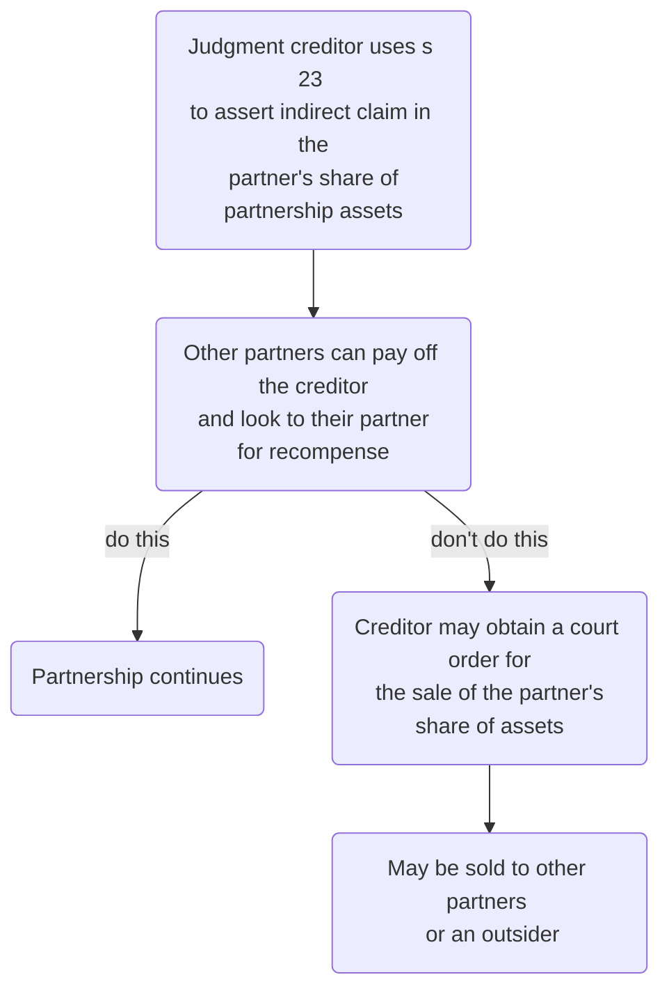

---
pandoc-latex-admonition:
  - color: firebrick
    classes: [admonition, admonition-danger]	
  - color: blue
    classes: [admonition, admonition-note]
  - color: green
    classes: [admonition, admonition-statute]
  - color: aquamarine
    classes: [admonition, admonition-action]
  - color: orange
    classes: [admonition, admonition-warning]
  - color: blue
    classes: [admonition, admonition-note]
  - color: yellow
    classes: [admonition, admonition-defn]
  - color: darkred
    classes: [admonition, admonition-guid]
  - color: pink
    classes: [admonition, admonition-test]
  - color: cyan
    classes: [admonition, admonition-tip, admonition-important]
  - color: purple
    classes: [admonition, admonition-example]
  - color: gray
    classes: [admonition]
aliases: 
tags: partnership
title: Dissolution of Partnership
date created: Friday, July 8th 2022, 12:06:35 pm
date modified: Friday, September 2nd 2022, 4:58:08 pm
---

# Dissolution of Partnership

## Introduction

Dissolution is when a partnership ends. Main question: what happens to the business and its assets? Should be dealt with in partnership agreement, otherwise PA 1890 applies defaults.

## Dissolution

```ad-defn
Dissolution of a partnership means that the contractual relationship joining all the current partners comes to an end. So if a partner leaves and another joins, strictly one partnership is dissolved and a new one formed. 
```

ss 32-35 specify certain events which trigger a partnership to be dissolved (though most can be excluded by agreement).

| Type of dissolution | Description |
| -------------------------------- | ------------------------------------------------------------------------------------------------------------------------------------------------------------------------------ |
| Technical or partial dissolution | Where the partnership continues despite a change in the membership of the firm. The Act does not provide for such an event so needs to be expressly provided for by agreement. |
| General or full dissolution | Involves a complete winding up of the partnership and cessation of its business. |

### Notice

Notice of dissolution may be given by any partner to the others (ss 26 & 32). The notice need not state a reason for dissolution and can have immediate effect.

```ad-defn
A partnership which is terminable under s 26 is known as a 'partnership at will'.
```

```ad-statute
title: s 26
(1) Where no fixed term has been agreed upon for the duration of the partnership, any partner may determine the partnership at any time on giving notice of his intention so to do to all the other partners.

(2) Where the partnership has originally been constituted by deed, a notice in writing, signed by the partner giving it, shall be sufficient for this purpose.
```

```ad-statute
title: s 32
Subject to any agreement between the partners, a partnership is dissolved—

- (a) If entered into for a fixed term, by the expiration of that term:

- (b) If entered into for a single adventure or undertaking, by the termination of that adventure or undertaking:

- (c) If entered into for an undefined time, by any partner giving notice to the other or others of his intention to dissolve the partnership.

In the last mentioned case the partnership is dissolved as from the date mentioned in the notice as the date of dissolution, or, if no date is so mentioned, as from the date of the communication of the notice.
```

### Expiry of Fixed Term

A partnership dissolves on the expiry of a fixed term for which the partners have agreed to continue in partnership, unless their agreement provides for continuance after the fixed term has expired (PA 1890, s 32).

If partners continue their relationship after a fixed term has expired, they will be presumed to be partners on the same terms as before, except that their new partnership is a partnership at will and its terms must be consistent with that type of partnership (s 27).

If partners wish to dissolve the partnership part way through a fixed term partnership, this requires unanimity under s 19 PA because it involves dissolution contrary to the original agreement.

### Charging Order Over Partner's Assets

A notice of dissolution may be given by the other partners to a partner whose share in the

partnership assets has been charged under s 23 by order of the court as security for the

payment of that partner’s private debt (PA 1890, s 33).

A judgment creditor of a partner (in their private capacity) may use s 23 as a means of enforcing the judgment. The creditor is not permitted to make any direct claim on the partnership assets, event though the partner will be joint owner of the assets.

Effect: the partner has an indirect claim by coming chargee of the partner's share in those assets. May also be entitled to receive partner's share of profits.

Then the other partners have the right to pay off the creditor and look to their partner for recompense.

If they don't, to enforce the charge, the creditor may obtain a court order for the sale of the partner's share of the assets. If such a sale is ordered, the most likely buyers are other partners. If they don't buy, an outsider can buy. Note that the outsider is **not** then a partner, just an owner in a share in the assets.

Partners may choose at this point to just dissolve the partnership, rather than live with this unsatisfactory arrangement.



### Death or Bankruptcy

```ad-statute
title: s 33
(1)  Subject to any agreement between the partners, every partnership is dissolved as regards all the partners by the death or bankruptcy of any partner.

(2)  A partnership may, at the option of the other partners, be dissolved if any partner suffers his share of the partnership property to be charged under this Act for his separate debt.
```

The personal representatives of the deceased/ trustee in bankruptcy can collect the former partner's share of the estate.

With a joint venture, need a mechanism for unwinding if one party becomes insolvent.

### Illegality

```ad-statute
title: s 34
A partnership is in every case dissolved by the happening of any event which makes it unlawful for the business of the firm to be carried on or for the members of the firm to carry it on in partnership. 
```

This includes cases where:

- The partnership sells alcohol and loses its license to do so
- In a law firm, where one of the partners is struck off the Roll of Solicitors.

This provision cannot be excluded even by a written partnership agreement, in contrast to ss 32-33.

### Court Order for Dissolution

The court has power (PA 1890, s 35) to order dissolution on various grounds. One of these is the 'just and equitable' ground. It provides the court with such a wide discretion that it effectively makes the other, more specific, grounds unnecessary.

Cases are unusual because most partnerships can be dissolved without court intervention. The partners can often negotiate dissolution (e.g., where one partner leaves and is paid for their share).

But if the partnership agreement is dumb and very binding, a court order can break through the agreement without any partner being liable for breach of contract.

### Other Means

Other provisions may also lead to a court order for the dissolution of a partnership, for example the Insolvency Act 1986 may be used by creditors, amongst others, to wind up a partnership which is insolvent.

Finally, a misrepresentation made by a prospective partner to another which induces the latter to enter into partnership may entitle the latter to rescind the agreement. This is recognised by section 41.

### Summary

| Section | Type of dissolution |
| ------- | ------------------------------------------ |
| s 26 | Retirement from partnership at will |
| s 32 | Dissolution by expiration or notice |
| s 33 | Dissolution by bankruptcy, death or charge |
| s 34 | Dissolution by illegality of partnership |

## Express Terms on Dissolution

### Restrictions on Dissolution

Generally inappropriate to leave the question of dissolution to PA 1890.

Usually exclude:

- Partnership at will
- Death or bankruptcy causing dissolution

### Purchase of Outgoing Partner's Share

If dissolution occurs where one partner leaves (by retirement, expulsion, death or bankruptcy) and the others are to continue as partners, the agreement should contain provisions allowing for the remaining partners to purchase the share of the former partner and fixing the terms of the purchase.

If the agreement does not deal with the question of payment for the use of the former partner’s share in the assets since the former partner left, the former partner will be entitled to receive, at the former partner’s option, either:

- interest at 5% per annum on the value of the former partner’s share, or
- such sum as the court may order as representing the share of profits made which is attributable to the use of the former partner’s share (PA 1890, s 42).

The purchase agreement can exclude this entitlement.

### Limiting a Retiring Partner's Right

It would be prudent to limit a retiring partner’s right to require the partnership assets to be sold on a partial dissolution. In return that partner will want their share to be purchased by the continuing partners.

### S 44 PA 1890

Further, section 44 of the Partnership Act sets out how partnership assets must be applied on dissolution and the rules for settling accounts between partners. They cannot ignore the rights of third parties to be paid before themselves but subject to that proviso the rules in section 44 can be varied by agreement between the partners. Again, in providing for a partial dissolution it would be prudent to vary them. Usually, the continuing partners promise to settle the debts of the business in return for the right to continue.

### Partner's Authority

On dissolution each partner’s authority continues for the purpose of winding up the affairs of the partnership.

### Managing Dissolution

#### Duration of Partnership

The advantage of an express provision as to the duration of the partnership is that it avoids a partnership at will or for an undefined time. It avoids the risk of immediate and unexpected dissolution by one partner giving notice under either of sections 26 and 32 of the Act. This is not to imply that a partnership must be for a fixed term. An agreement can provide that the partnership will continue until terminated in accordance with the terms of the agreement, thus displacing the effect of sections 26 and 32(c). For example, a partner can be required to give specific notice at any time to dissolve the partnership, say 6 months' notice.

#### Scope of Partial Dissolution

So, those terms should identify when a partner may leave, the procedures they must follow to do so and whether, in doing so, a partial dissolution is possible so that the other partners may continue.

#### Events Giving Rise to Full Dissolution

The agreement should also identify the circumstances in which a full dissolution can occur. Remember, under the Act certain events automatically trigger full dissolution and they may need to be disapplied insofar as that is possible. For example, section 34, which automatically dissolves an illegal partnership, cannot be disapplied.

#### Terms for Settlement of Affairs

Finally terms for settlement of the affairs of the partnership should be negotiated. If they are to have the right to continue then terms for continuation by the remaining partners should settled and included in the agreement. Outgoing partners will want the certainty of having their share bought out at an appropriate price and failing that the right to require full dissolution so that partnership assets can be sold to realise capital. Remember, the Act does not provide for partial dissolution.

## Post-dissolution

### Disposing of Business

If partners cannot reach an agreement as to continuing business/ purchasing shares, necessary to dispose of business. Proceeds of sale used to pay off creditors and then pay partners the amounts they are entitled.

May be by sale of as a going concern, or by breaking up the business and selling assets separately.

```ad-statute
title: s 39
Every partner has the right to insist on a disposal and payment, if necessary by applicaiton to court. 
```

### Goodwill

Clearly, if the business is broken up and assets sold separately, there is financial disadvantage.

```ad-defn
title: Goodwill
The benefit of a business's reputation and connections. 
```

Goodwill is commonly valued by a year or two's profit. Alternatively, consider the value from a buyer's perspective, versus their option of setting up under a new business. Goodwill can be sold!

Also consider that the buyer of goodwill is likely to insist on the seller entering into a covenant in restraint of trade for the protection of the goodwill which the buyer is purchasing. So a partner will have to accept a covenant in restriction of trade (which will be valid only if reasonable in the circumstances).

## Distribution of Proceeds

Unless there is agreement to the contrary, the proceeds of sale of the business or its assets will

be used in the following sequence (PA 1890, s 44).

1. Creditors of the firm paid in full
	1. If shortfall, partners must pay the balance from their private assets.
2. Partners who lent money to the firm must be repaid, together with any interest.
3. Partners must be paid their capital entitlement.
4. If there is a surplus, this will be shared between partners in accordance with their partnership agreement.

### Parties

```ad-statute
title: s 38 PA 1890
Each partner (except a bankrupt partner) has continuing authority to act for the purposes of winding up the firm’s affairs.
```

- So often no need for anyone external in a dissolution.
- But if there is dispute/ problems, any partner may apply to court for the appointment of a person (or one of the partners):
	- as receiver to deal with the assets, or
	- as receiver and manager to conduct the business.
- They are an officer of the court, and entitled to receive remuneration from the partnership assets (but not from the partners' personal money).
