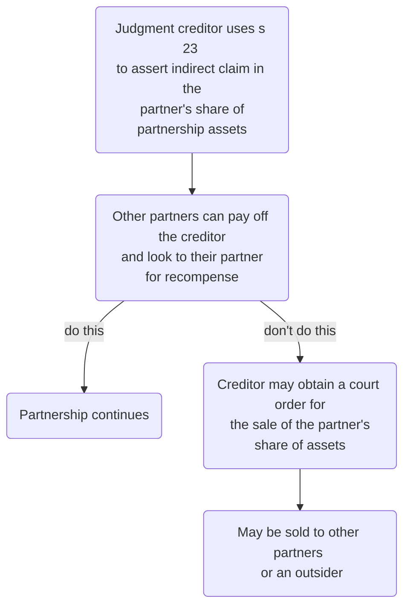

```toc
min_depth: 1
```

# Start of Partnership

## Introduction

The starting point is the Partnership Act 1890. The Law Commission issued a Consultation Paper in Autumn 2000 on revision of the law of partnerships, but this has been shelved.

Because it is a relationship, partnership imposes rights and obligations on the partners. The relationship is governed by contractual principles, but because it is also fiduciary in nature, equitable principles also regulate their relationship.

### Definition

- Describes a business relationship based on an agreement.
- Agreement may be oral or in writing, or implied by contract.
- Partnership not necessarily recognised as such by the parties.
- [[Khan v Miah [2000] 1 WLR 2123]]: the partnership had commenced even though the restaurant had not opened
- [[Young v Zahid [2006] EWCA Civ 613]]: partner in law firm who has only paid a fixed salary was still held to be a partner.
- [[Rowlands v Hodson [2009] EWCA Civ 1042]]: a solicitor who sold her interest in the partnership to a successor but retained a supervisory role was held to be a partner.

There must be more than mere agreement or setting up a partnership to form a partnership ([[Ilott v Williams & Others [2013] EWCA Civ 645]]). There must be a “carrying on a business in common”.

A partnership does not have a separate legal existence. May be created:

- For a specific purpose or for a pre-determined period of time; or
- So as to continue without reference to duration – a partnership 'at will'.

### Fundamental Characteristics

Rights include:

- Being involved in making decisions which affect the business
- Share the profits of the business
- Examine the accounts of the business
- Insist on openness and honesty from fellow partners
- Veto the introduction of a new partner
- Responsibility for sharing losses made by the business.

N.B. some of these can be excluded by the agreement governing the relationship.

## Setting up Partnership

Advisable to have a written agreement, which is well drafted. Default provisions from 1890 definitely not fit for purpose.

In [[Ham v Ham and Another [2013] EWCA Civ 1301]], the Court of Appeal criticised poorly drafted partnership agreements.

### Formalities

#### Business Names

Where ss 1192-1206 CA 2006 apply, there are controls over the choice of partnership name (ss 1193, 1194) and requirements as to revealing the names and business addresses of partners (s 1201).

These controls don't apply if the name of the partnership consists only of the names of partners, because then the Act will not apply.

If the Act applies, certain words or expressions forming part of the business name require written approval of the Secretary of State for Business, Energy and Industrial Strategy.

Also, silly rules, such as that prescribed information must appear on all stationery (s 1202). Most people ignore this and it's not deep. Also, there are exceptions.

Non-compliance will be punishable by fine, and partners will be unable to enforce contracts if the other party was prejudiced by non-compliance.

There are other peculiar statutory regulations about taxes etc.

#### Partnerships and Joint Ventures

Partnerships can also be used for joint ventures between companies. This is also governed by PA 1890. Advantages:

- Informal nature
- Commercial secrecy
- Tax relief

#### Other Structures

Other types of partnership may exist. For example the term ‘group partnership’ refers to a partnership between two or more partnerships. A sub-partnership is a partnership within a partnership, or put another it way it is a partnership with a share of another partnership.

# Partnership Agreement

## Introduction

Default provisions for partnerships in the absence of an express agreement: s 24 PA 1890.

## Common Provisions

Sensible provisions to include in an express agreement:

- Commencement date for mutual rights and responsibilities
- Name of partnership! May be different from business/ trading name
- Financial inputs and possible future contributions
- Shares in profits/ losses
	- PA 1890 implies that profits and losses will be shared equally, irrespective of initial investments.
- Any partner salaries
- Interest on partners' capital contributions?
- Profit-sharing ratio, and what happens in the event of a loss
	- Are salaries and interest on capital still paid out?
- Drawings
	- Monthly limit on drawings for each partner
	- Maybe a periodic review of this
	- Especially important for a joint venture.
- Shares in changes in asset values
	- Asset revaluation/ sale implication for partners?
	- Partners often content to share increases/ decreases equally, which will be the effect of PA 1890.
	- The basis for division of increases/decreases is known as the **'asset-surplus sharing ratio'**.
- Agree place and nature of business. Once agreed, any change would need the unanimous consent of partners.
- Ownership of assets
	- Deciding what is a partnership asset and what belongs to partners individually.
	- Evidence saves disputes on this.
	- Note that even title deeds may not be conclusive since one partner may have legal title in their sole name whilst holding the asset on trust for all the partners beneficially.
		- Recall that company case.
	- See [[Don King Productions Inc v Warren (No 1) [2000] Ch 291]].

### Work Input

PA 1890 implies a term into a partnership agreement (in the absence of contrary), that all partners are entitled to take part in the management of the business, albeit without any obligation to do so.

Wilful neglect of the business may mean the other partners are entitled to be compensated for the extra work undertaken by them.

The agreement should set out the degree of commitment expected of each partner. This is usually expressed in general terms; e.g., a partner must “devote their whole time and attention to the business”. Also, possible to specify that such partners must not be involved in any other business whatsoever during the partnership. Qualifications then involve holiday, sickness etc.

Without an express term to such an effect it will be very difficult, if not impossible, to show that a partner’s pursuit of outside interests or lack of commitment involve a breach of the terms of the partnership. Neither the Act nor the common law imposes any obligation on partners to involve themselves in the affairs of the partnership. The fact that some partners devote all of their time and efforts to its success is no guarantee that the other partners will do so too. An express term dealing with this issue is essential.

### Roles

Each partner's role should be explicitly stated. Anything agreed is binding between the partners, and any partner who ignores such a restriction would be acting in breach of contract.

### Decision-making

Unless agreed to the contrary, all partnership decisions will be made on the basis of a simple majority, except decisions on changing the nature of the business or on introduction of a new partner, which require unanimity.

```ad-note
Anything contained in the agreement is a term of the contract between the partners so cannot be altered without the consent of all parties to the contract. The consent could be built into the contract itself - the agreement might contain provision for altering its terms (e.g., with a majority vote).
```

In a joint venture between companies, a decision-making mechanism will need to be included in the agreement.

### Duration

#### Dissolution by Notice

If there is no provision in the agreement, the partnership can be dissolved at any time by any partner giving notice to the others. This is a **partnership at will**.

> [!tip]  
> A partnership cannot be a 'partnership at will' under s 26 if there is any limitation placed on a partners right to terinate the agreement by unilaterally giving notice ([[Moss v Elphick [1910] 1 KB 846]]).

The notice of dissolution can have immediate effect and need not even be in writing, unless the agreement was by deed. This can cause instability, so usually restrictions are put on partners' abilities to dissolve the partnership.

s 32 PA 1890 defines the basis on which partnerships of any type are to be dissolved, subject to alternative agreement between the partners.

#### Other Solutions

Possible provisions and effects:

- Any notice of dissolution must allow a minimum period before taking effect.
	- This give time to settle what should happen on the dissolution.
- Agree a duration of fixed term of a number of years.
	- This provides certainty, but is inflexible in committing each partner to the partnership for a certain duration.
- The partnership is to continue for as long as there are at least two remaining partners, despite the departure of any partner by reason of retirement, expulsion, death or bankruptcy
	- Flexible, allows partners to leave
	- Provides stability
	- Can include ancillary provisions such as delaying payment to the outgoing partner, to mitigate financial problems of buying out a departing partner's share.

#### Death or Bankruptcy

```ad-statute
title: s 33 PA 1890
Unless there is contrary agreement, the death or bankruptcy of a partner will automatically cause dissolution of the entire partnership. 
```

Sensible to add a provision saying if other partners buy out, the partnership will continue. In a joint venture between companies, the agreement will need a mechanism for unwinding if one party becomes insolvent.

#### Court Order

```ad-statute
title: s 35 PA 1890
On certain grounds, the court can make an order for dissolution. This allows the partner to break their agreement with the other partners without being liable for breach of contract.
```

#### Retirement

PA 1890 provides for retirement, but only for a partnership at will, by dissolving the partnership under s 26.

Usually desirable to have express provision governing the question of when a partner can retire and payment for the departing partner's share by the others.

#### Expulsion

Amounts to terminating the contract with the outgoing partner without their consent. It is an important sanction for breach of agreement or other stipulated forms of misconduct.

Agreement should state grounds on which right is exercisable and how it will be exercised.

#### Payment for Outgoing Partner's Share

When a person ceases to be a partner because of retirement, expulsion, death or bankruptcy and the others continue, the will need to pay for the outgoing partner's share in the business. The agreement should contain appropriate terms (to avoid having to negotiate this every time).

If the agreement is silent and settlement cannot be reached:

```ad-statute
title: s 42 PA 1890
If a person ceases to be a partner and others continue in the partnership, but there is a delay in final payment of the former partner's share, the former partner/ their estate is entitled to receive either:
- Interest at 5% on the aount of their share, or
- Such share of the profits as is attributable to the use of the outgoing partner's share.
```

Provisions drafted here should include:

- Whether partners have a binding obligation to purchase the outgoing partner's share
- Basis on which the outgoing partner's share will be valued
- Provision for a professional valuation if agreement cannot be reached
- Date on which payment due
- Indemnity for firm liabilities.

#### Restraint of Trade After Departure

##### Competition

There should always be a provision limiting an outgoing partner's freedom to compete with the firm to protect the business connections of the continuing firm and to protect its confidential information. Drafting critical: unreasonable clauses will be held void. Must aim to protect the purchaser of a business, rather than to restrict the activities of the departing partner.

In [[Bridge and Deacons]] it was held that restraint of trade clauses must only protect a legitimate interest, such as a business and its goodwill, a share of which has been acquired from the partner being restrained. Secondly, they must do no more is than is necessary to protect that interest.

```ad-defn
title: Non-competition clause
A commonly used clause prevents a person from being involved in any way in a competing business. 
```

##### Other Forms of Restraint

- A 'non-dealing clause' seeks to prevent the former partner from entering into contracts with customers or former customers or employees of the partnership which they have left.
- A 'non-solicitation clause' merely seeks to prevent them from soliciting contracts from such customers or employees.

#### Arbitration

To avoid expense, delay and adverse publicity, the agreement may provide that certain disputes be resolved by arbitration.

#### Sharing Between Partners

```ad-statute
title: s 24 PA 1890
The interests of partners in the partnership property and their rights and duties in relation to the partnership shall be determined, subject to any agreement express or implied between the partners, by the following rules:—

(1) All the partners are entitled to share equally in the capital and profits of the business, and must contribute equally towards the losses whether of capital or otherwise sustained by the firm.

(2) The firm must indemnify every partner in respect of payments made and personal liabilities incurred by him—

- (a) In the ordinary and proper conduct of the business of the firm; or,

- (b) In or about anything necessarily done for the preservation of the business or property of the firm.

(3) A partner making, for the purpose of the partnership, any actual payment or advance beyond the amount of capital which he has agreed to subscribe, is entitled to interest at the rate of five per cent. per annum from the date of the payment or advance.

(4) A partner is not entitled, before the ascertainment of profits, to interest on the capital subscribed by him.

(5) Every partner may take part in the management of the partnership business.

(6) No partner shall be entitled to remuneration for acting in the partnership business.

(7) No person may be introduced as a partner without the consent of all existing partners.

(8) Any difference arising as to ordinary matters connected with the partnership business may be decided by a majority of the partners, but no change may be made in the nature of the partnership business without the consent of all existing partners.

(9) The partnership books are to be kept at the place of business of the partnership (or the principal place, if there is more than one), and every partner may, when he thinks fit, have access to and inspect and copy any of them.
```

Generally, the Act aims for equality between partners. That is not always wanted, and sometimes more sophisticated rights and duties are more appropriate to a particular partnership. As a result, the terms implied by the Partnership Act are often overridden.

When drafting a partnership agreement, remember that lay-people will also be reading it, so make it more of a manual of rules rather than just being efficiency and only introducing terms which contradict PA 1890.

# Partner Responsibilities

## Introduction

A partner as certain responsibilities towards others and corresponding rights.

## Utmost Good Faith

```ad-important
By common law, a partnership is a relationship onto which is imposed a duty of utmost fairness and good faith from one partner to another. 
```

Perhaps the most fundamental obligation imposed on a partner is the duty to conduct oneself with complete good faith towards co-partners in all partnership dealings and transactions. This duty is fiduciary in nature and an inherent obligation of partnership. Partners must conduct themselves towards one another with the ‘highest standard of honour’, integrity and openness, even where their interests conflict.

```ad-example
In [[Helmore and Smith]] one judge said that he could not conceive of a stronger case of a fiduciary relationship than that which exists between partners. For example, in _Law and Law_ the court said that a partner negotiating to buy the share of another partner and who is in possession of facts material to that negotiation, is under a duty to disclose those facts to the selling partner and not to conceal what the seller does not know, even if to do so will affect the price the seller will demand. This obligation is now reflected to a large extent by the terms of section 28 of the Partnership Act.
```

### Applications in PA 1890

| Section | Description |
| ------- | ------------------------------------------------------------------------------------------------------------------------------------------------------------------------------------------------------------------------ |
| s 28 | Partners must divulge to one another all relevant information connected with the business and their relationship. |
| s 29 | Partners must be prepared to share with their fellow partners any profit or benefit they receive that is connected with or derived from the partnership, business or its property without the consent of other partners. |
| s 30 | Partners must be prepared to share with their fellow partners any profits they make from carrying out a competing business without the consent of other partners. |

In effect, partners, as fiduciaries, must not place themselves in a position whereby their interests conflict with those with whom they have a fiduciary relationship. This relationship is reciprocal in nature. Consequently, a partner who, in retaliation to another partner’s breach of duty, commits their own breach will substantially prejudice their position. It is also important to appreciate that the duty exists during negotiations to enter into partnership and whilst a partnership is being wound up.

### Disapplying Ss 28 and 29

Lastly, whilst section 19 of the Partnership Act permits the statutory duties under sections 28 to 30 to be disapplied by agreement, there is no clear authority that partners can disapply the equitable duty of good faith. Lindley & Banks on Partnership takes the view that it is possible but makes the point that a partner, properly advised, would not contemplate condoning in advance all potential breaches of duty by another.

In fact, it is common practice to impose a contractual duty of good faith to sit alongside the equitable duty so as to provide contractual remedies to sit alongside the equitable remedy.

```ad-example
The doctrine of caveat emptor does not apply to partners' dealings with one another. So in negotiating to sell the partnership business premises owned by them, a partner must not suppress information which will affect the valuation.
```

Key case: [[Broadhurse v Broadhurst]].

## Further Responsibilities

These include:

- The responsibility for bearing a share of any loss made by the business (s 24(1) PA 1890)
- The obligation as a firm to indemnify fellow partners against bearing more than their share of any liability or expense connected with the business (s 24(2) PA 1890).

There will be plenty of other responsibilities, derived from the [[Partnership Agreement]].

# Liability for Firm Debts

## Introduction

Transactions affecting a partnership generally involve contracts. Contracts may be made by all the partners acting collectively or just one partner.

In cases where partners contest that they are liable:

- First identify whether the firm is liable
- If the firm is liable, identify which individuals are liable.

The relevant provisions of PA 1890 are based on the law of agency:

| Section | Description | Details |
| ------- | --------------------------------------------------------------- | ------------------------------------------------------------------------------------------------------------------------------------------------------------------------------------------------------------------------------------- |
| s 5 | Power of a partner to bind the firm | Every partner is an agent of the firm and his other partners for the purpose of the business partnership. So all acts are binding unless (1) the partner has no authority, and (2) the person he is dealing with knows/believes this. |
| s 6 | Partners bound by acts on behalf of firm | An act or instrument done in firm name is binding on the firm and all partners. |
| s 7 | Partners using business credit for private purposes | When a partner pledges firm credit for a purpose not connected, the firm is not bound, though the partner incurs personal liability. |
| s 8 | Effect of notice that firm will not be bound by acts of partner | Restrictions can be placed on partners' ability to bind the firm, then acts in contravention of the agreement are not binding wrt people with notice of the agreement. |

```ad-note
"Firm" here means "partners", since the partnership has no legal personality. 
```

s 5: the act has to be in the usual course of business (see [[Hirst v Etherington [1999] Lloyd's Rep PN 938]]).

## Firm Liability

s 5 deals with partner's authority; there is no equivalent provision for companies in CA 2006.

### Actual Authority

The firm will always be liable for actions which were actually authorised. Ways to authorise:

1. The partners may have acted jointly in making the contract;
2. Express actual authority: partners may have expressly instructed one of the partners to represent the firm in a particular transaction/ type of transaction (e.g., to purchase stock)
3. Implied actual authority: partners impliedly accepting that one or more of the partners have the authority to represent the firm in a particular type of transaction.
	- If all partners are actively involved in running the business without limitations agreed, it will be implied that each partner has authority to act in the ordinary course of business
	- Authority can be implied by a regular course of dealing by one partner to which the other have acquiesced.

### Apparent/ Ostensible Authority

The firm may be liable for actions which were not actually authorised, but which may have appeared to an outsider to be authorised. Legal reasoning: each partner is an agent of the firm ad of their fellow partners for the purposes of the partnership business. The firm will be liable by application of s 5 where:

1. The transaction is one relating to the type of business in which the firm is apparently engaged ('business of the kind carried on by the firm' – s 5);
2. The transaction is for which a partner in such a firm would usually be expected to have the authority to act ('in the usual way' – s 5);
3. The other party to the transaction did not know that the partner did not actually have the authority to act; and
4. The other party deals with a person whom they know or believe to be a partner.

(3) and (4) are subjective tests, whereas (a) and (b) are objective.

- In [[JJ Coughlan v Ruparelia [2003] EWCA Civ 1057]], the other partners were not liable in contract.
- In [[Bourne v Brandon Davis [2006] EWHC 1567 (Ch)]], held that musicians in a pop group could not have their performing rights assigned *en bloc* by another member of the group without their consent.

### Personal Liability

- In all the above instances, the partner will be personally liable to the other party.
- Where a partner has acted without actual authority but has made the firm liable by virtue of their apparent authority, they are liable to indemnify the partner's fellow partners for any liability or loss they incur.

### Tortious Liability

So far liability in contract was considered. What about liability in tort?

s 10 makes the firm liable for any wrongful act or omission of a partner who acts in the ordinary course of the firm's business or with the authority of the partner's partners.

```ad-statute
title: s 10 PA 1890
Where, by any wrongful act or omission of any partner acting in the ordinary course of the business of the firm, or with the authority of his co-partners, loss or injury is caused to any person not being a partner in the firm, or any penalty is incurred, the firm is liable therefor to the same extent as the partner so acting or omitting to act.
```

```ad-statute
title: s 12 PA 1890
Every partner is liable jointly with his co-partners and also severally for everything for which the firm while he is a partner therein becomes liable under either of the two last preceding sections. 
```

- s 10 covers all types of wrongdoing, including a dishonest breach of trust or fiduciary duty, and is not limited to common law torts ([[Dubai Aluminium Co Ltd v Salaam [2002] 3 WLR 1913]])
- ss 5 and 10 do not make the other partners liable for breach of contract and deceit arising out of a fraudulent investment scheme ([[JJ Coughlan v Ruparelia [2003] EWCA Civ 1057]]).

## Enforcing Firm Liability

### Potential Defendants

The range of potential defendants is extensive, including:

- The partner with whom the person made the contract can be sued individually (privity of contract).
- Firm can be sued
	- Claim should start here if the partnership has a name and if it is appropriate to do so (CPR Part 7 PD 7 5A.1).
	- All those who were partners at the time are jointly liable to satisfy the judgment .
- Any person who was a partner at the time when the debt/ obligation was incurred can be sued individually.
- A person who left the firm before debt/ obligation incurred, or joined since, is generally not liable (s 17 PA 1890), but can be in cases of
	- 'Holding out'
	- Failure to give appropriate notice of retirement
	- Novation agreement.

Details of this joint liability are found in [Civil Liability (Contribution) Act 1978](https://www.legislation.gov.uk/ukpga/1978/47/contents).

| Section | Provision |
| ------- | -------------------------------------------------------------------------------------------------------------------------------------------------------------------------------------------------- |
| s 1(1) | Any person liable in respect of any damage suffered by another person may recover contribution from any other person liable in respect of the same damage (whether jointly with him or otherwise). |
| s 2(1) | Subject to subsection (3) below, in any proceedings for contribution under section 1 above the amount of the contribution recoverable from any person shall be such as may be found by the court to be just and equitable having regard to the extent of that person’s responsibility for the damage in question. |

### Suing the Firm

Usually most appropriate to sue the partners as a group of persons in the firm's name. Then the judgment can be enforced against the partnership assets, and potentially against assets owned personally by partners.

### 'Holding Out'

Where a creditor of a partnership has relied on a representation that a particular person was a partner in that firm, the creditor may be able to hold that person liable for the firm's debts (s 14 PA 1890).

- Applies even if the person was never a partner at the firm
- Representation may be oral, in writing or by conduct (previous course of dealing)
- Representation may be by the person themselves, or by another with their knowledge.

In [[Sangster v Biddulphs [2005] EWHC 658 (Ch)]], the test relied on for liability under s 14 was that from [[Nationwide Building Society v Lewis [1998] Ch 482]]. This was that for liability there had to be

(a) holding out,  
(b) reliance thereon, and  
(c) the consequent giving of credit to the firm.

### Failure to Notify Leaving

The firm’s debts can be enforced against all those who were partners at the time when the debt or obligation was incurred. Although a person may retire from a partnership, they remain liable on those contracts already made. The terms for the purchase of the partner’s share in the business should include a provision whereby the purchasing partner(s) indemnify the partner against liability for any such debts which were taken into account in valuing the partner’s share.

```ad-action
When a partner leaves the partnership, the partner must give notice of their leaving since otherwise the partner may become liable for the acts of their former partner(s) done after the partner leaves the firm, if the creditor is unaware that the partner has left. s 36 prescribes the notices which the partner should give:

1. Actual notice (e.g., by sending out standard letters announcing the partner is leaving) to all those who have dealt with the firm prior to the partner leaving (s 36(1)); and
2. An advertisement in the London Gazette as notice to any person who did not deal with the firm prior to the date of that partner's retirement or expulsion (s 36(2)).
```

A creditor who was unaware of the partner’s leaving and who can establish that the type of notice appropriate to the creditor (as above) was not given, will be able to sue the former partner for the firm’s debt, in spite of the fact that he has ceased to be a partner. The principle on which s 36 is based, unlike that on which s 14 is based, does not depend on the creditor having relied on some representation at the time of the transaction. Rather the creditor is given the right to assume that the membership of the firm continues unchanged until notice of the prescribed type (as above) is given. It follows that, if the creditor was never aware that the person had been a partner, no notice of any sort will be required since that creditor cannot be assuming the continuance of that person in the partnership (s 36(3)).

If the reason for ceasing to be a partner is death or bankruptcy (rather than retirement or expulsion), no notice of the event is required. The estate of the deceased or bankrupt partner is not liable for events occurring after the death or bankruptcy.

### Novation Agreement

A novation agreement is a tripartite contract involving:

1. the creditor of the firm,
2. the partners at the time the contract with the creditor was made, and
3. the newly constituted partnership.

```ad-example
Say one partner leaves and another joins. Under a contract of novation, it can be agreed that a creditor will release the initial partners and the new partners will take over this liability. 
```

```ad-question
title: What if a partner retires and no new partner retires?
To make the novation contractually binding, either there must be consideration for the creditor's promise to release the retiring partner from liability, or the contract must be executed as a deed. 
```

## Inability to Pay

### General Rule

- A creditor can sue the firm as a group of persons or individually sue any of the persons liable as partners.
- If they sue an individual who can't pay, they are at liberty to commence fresh proceedings against another/ the firm.
- Judgment against the firm can be enforced against the private assets of any person liable as partner.
- If impossible to satisfy, the firm is insolvent and all individuals are insolvent.
- Insolvency proceedings likely to follow.

### Insolvency

The law on insolvency of a partnership and of its partners individually is governed by the Insolvent Partnerships Order 1994 (SI 1994/2421) (as amended by SI 2002/1308) and the Insolvency Act 1986.

```ad-tip
title: Principle

Although a partnership is not a person in its own right, nevertheless an insolvent partnership may be wound up as an unregistered company or may avail itself of the
rescue procedures available to companies, such as a ‘voluntary arrangement’ with creditors or an ‘administration order’ of the court.
```

With a partnership joint venture involving companies, the agreement will need to provide a

mechanism to unwind the joint venture in the event that one party may be heading for

insolvency.

## Summary

![[partner-authority-flow.png]]

# Dissolution of Partnership

## Introduction

Dissolution is when a partnership ends. Main question: what happens to the business and its assets? Should be dealt with in partnership agreement, otherwise PA 1890 applies defaults.

## Dissolution

```ad-defn
Dissolution of a partnership means that the contractual relationship joining all the current partners comes to an end. So if a partner leaves and another joins, strictly one partnership is dissolved and a new one formed. 
```

ss 32-35 specify certain events which trigger a partnership to be dissolved (though most can be excluded by agreement).

| Type of dissolution | Description |
| -------------------------------- | ------------------------------------------------------------------------------------------------------------------------------------------------------------------------------ |
| Technical or partial dissolution | Where the partnership continues despite a change in the membership of the firm. The Act does not provide for such an event so needs to be expressly provided for by agreement. |
| General or full dissolution | Involves a complete winding up of the partnership and cessation of its business. |

### Notice

Notice of dissolution may be given by any partner to the others (ss 26 & 32). The notice need not state a reason for dissolution and can have immediate effect.

```ad-defn
A partnership which is terminable under s 26 is known as a 'partnership at will'.
```

```ad-statute
title: s 26
(1) Where no fixed term has been agreed upon for the duration of the partnership, any partner may determine the partnership at any time on giving notice of his intention so to do to all the other partners.

(2) Where the partnership has originally been constituted by deed, a notice in writing, signed by the partner giving it, shall be sufficient for this purpose.
```

```ad-statute
title: s 32
Subject to any agreement between the partners, a partnership is dissolved—

- (a) If entered into for a fixed term, by the expiration of that term:

- (b) If entered into for a single adventure or undertaking, by the termination of that adventure or undertaking:

- (c) If entered into for an undefined time, by any partner giving notice to the other or others of his intention to dissolve the partnership.

In the last mentioned case the partnership is dissolved as from the date mentioned in the notice as the date of dissolution, or, if no date is so mentioned, as from the date of the communication of the notice.
```

### Expiry of Fixed Term

A partnership dissolves on the expiry of a fixed term for which the partners have agreed to continue in partnership, unless their agreement provides for continuance after the fixed term has expired (PA 1890, s 32).

If partners continue their relationship after a fixed term has expired, they will be presumed to be partners on the same terms as before, except that their new partnership is a partnership at will and its terms must be consistent with that type of partnership (s 27).

If partners wish to dissolve the partnership part way through a fixed term partnership, this requires unanimity under s 19 PA because it involves dissolution contrary to the original agreement.

### Charging Order Over Partner's Assets

A notice of dissolution may be given by the other partners to a partner whose share in the

partnership assets has been charged under s 23 by order of the court as security for the

payment of that partner’s private debt (PA 1890, s 33).

A judgment creditor of a partner (in their private capacity) may use s 23 as a means of enforcing the judgment. The creditor is not permitted to make any direct claim on the partnership assets, event though the partner will be joint owner of the assets.

Effect: the partner has an indirect claim by coming chargee of the partner's share in those assets. May also be entitled to receive partner's share of profits.

Then the other partners have the right to pay off the creditor and look to their partner for recompense.

If they don't, to enforce the charge, the creditor may obtain a court order for the sale of the partner's share of the assets. If such a sale is ordered, the most likely buyers are other partners. If they don't buy, an outsider can buy. Note that the outsider is **not** then a partner, just an owner in a share in the assets.

Partners may choose at this point to just dissolve the partnership, rather than live with this unsatisfactory arrangement.



### Death or Bankruptcy

```ad-statute
title: s 33
(1)  Subject to any agreement between the partners, every partnership is dissolved as regards all the partners by the death or bankruptcy of any partner.

(2)  A partnership may, at the option of the other partners, be dissolved if any partner suffers his share of the partnership property to be charged under this Act for his separate debt.
```

The personal representatives of the deceased/ trustee in bankruptcy can collect the former partner's share of the estate.

With a joint venture, need a mechanism for unwinding if one party becomes insolvent.

### Illegality

```ad-statute
title: s 34
A partnership is in every case dissolved by the happening of any event which makes it unlawful for the business of the firm to be carried on or for the members of the firm to carry it on in partnership. 
```

This includes cases where:

- The partnership sells alcohol and loses its license to do so
- In a law firm, where one of the partners is struck off the Roll of Solicitors.

This provision cannot be excluded even by a written partnership agreement, in contrast to ss 32-33.

### Court Order for Dissolution

The court has power (PA 1890, s 35) to order dissolution on various grounds. One of these is the 'just and equitable' ground. It provides the court with such a wide discretion that it effectively makes the other, more specific, grounds unnecessary.

Cases are unusual because most partnerships can be dissolved without court intervention. The partners can often negotiate dissolution (e.g., where one partner leaves and is paid for their share).

But if the partnership agreement is dumb and very binding, a court order can break through the agreement without any partner being liable for breach of contract.

### Other Means

Other provisions may also lead to a court order for the dissolution of a partnership, for example the Insolvency Act 1986 may be used by creditors, amongst others, to wind up a partnership which is insolvent.

Finally, a misrepresentation made by a prospective partner to another which induces the latter to enter into partnership may entitle the latter to rescind the agreement. This is recognised by section 41.

### Summary

| Section | Type of dissolution |
| ------- | ------------------------------------------ |
| s 26 | Retirement from partnership at will |
| s 32 | Dissolution by expiration or notice |
| s 33 | Dissolution by bankruptcy, death or charge |
| s 34 | Dissolution by illegality of partnership |

## Express Terms on Dissolution

### Restrictions on Dissolution

Generally inappropriate to leave the question of dissolution to PA 1890.

Usually exclude:

- Partnership at will
- Death or bankruptcy causing dissolution

### Purchase of Outgoing Partner's Share

If dissolution occurs where one partner leaves (by retirement, expulsion, death or bankruptcy) and the others are to continue as partners, the agreement should contain provisions allowing for the remaining partners to purchase the share of the former partner and fixing the terms of the purchase.

If the agreement does not deal with the question of payment for the use of the former partner’s share in the assets since the former partner left, the former partner will be entitled to receive, at the former partner’s option, either:

- interest at 5% per annum on the value of the former partner’s share, or
- such sum as the court may order as representing the share of profits made which is attributable to the use of the former partner’s share (PA 1890, s 42).

The purchase agreement can exclude this entitlement.

### Limiting a Retiring Partner's Right

It would be prudent to limit a retiring partner’s right to require the partnership assets to be sold on a partial dissolution. In return that partner will want their share to be purchased by the continuing partners.

### S 44 PA 1890

Further, section 44 of the Partnership Act sets out how partnership assets must be applied on dissolution and the rules for settling accounts between partners. They cannot ignore the rights of third parties to be paid before themselves but subject to that proviso the rules in section 44 can be varied by agreement between the partners. Again, in providing for a partial dissolution it would be prudent to vary them. Usually, the continuing partners promise to settle the debts of the business in return for the right to continue.

### Partner's Authority

On dissolution each partner’s authority continues for the purpose of winding up the affairs of the partnership.

### Managing Dissolution

#### Duration of Partnership

The advantage of an express provision as to the duration of the partnership is that it avoids a partnership at will or for an undefined time. It avoids the risk of immediate and unexpected dissolution by one partner giving notice under either of sections 26 and 32 of the Act. This is not to imply that a partnership must be for a fixed term. An agreement can provide that the partnership will continue until terminated in accordance with the terms of the agreement, thus displacing the effect of sections 26 and 32(c). For example, a partner can be required to give specific notice at any time to dissolve the partnership, say 6 months' notice.

#### Scope of Partial Dissolution

So, those terms should identify when a partner may leave, the procedures they must follow to do so and whether, in doing so, a partial dissolution is possible so that the other partners may continue.

#### Events Giving Rise to Full Dissolution

The agreement should also identify the circumstances in which a full dissolution can occur. Remember, under the Act certain events automatically trigger full dissolution and they may need to be disapplied insofar as that is possible. For example, section 34, which automatically dissolves an illegal partnership, cannot be disapplied.

#### Terms for Settlement of Affairs

Finally terms for settlement of the affairs of the partnership should be negotiated. If they are to have the right to continue then terms for continuation by the remaining partners should settled and included in the agreement. Outgoing partners will want the certainty of having their share bought out at an appropriate price and failing that the right to require full dissolution so that partnership assets can be sold to realise capital. Remember, the Act does not provide for partial dissolution.

## Post-dissolution

### Disposing of Business

If partners cannot reach an agreement as to continuing business/ purchasing shares, necessary to dispose of business. Proceeds of sale used to pay off creditors and then pay partners the amounts they are entitled.

May be by sale of as a going concern, or by breaking up the business and selling assets separately.

```ad-statute
title: s 39
Every partner has the right to insist on a disposal and payment, if necessary by applicaiton to court. 
```

### Goodwill

Clearly, if the business is broken up and assets sold separately, there is financial disadvantage.

```ad-defn
title: Goodwill
The benefit of a business's reputation and connections. 
```

Goodwill is commonly valued by a year or two's profit. Alternatively, consider the value from a buyer's perspective, versus their option of setting up under a new business. Goodwill can be sold!

Also consider that the buyer of goodwill is likely to insist on the seller entering into a covenant in restraint of trade for the protection of the goodwill which the buyer is purchasing. So a partner will have to accept a covenant in restriction of trade (which will be valid only if reasonable in the circumstances).

## Distribution of Proceeds

Unless there is agreement to the contrary, the proceeds of sale of the business or its assets will

be used in the following sequence (PA 1890, s 44).

1. Creditors of the firm paid in full
	1. If shortfall, partners must pay the balance from their private assets.
2. Partners who lent money to the firm must be repaid, together with any interest.
3. Partners must be paid their capital entitlement.
4. If there is a surplus, this will be shared between partners in accordance with their partnership agreement.

### Parties

```ad-statute
title: s 38 PA 1890
Each partner (except a bankrupt partner) has continuing authority to act for the purposes of winding up the firm’s affairs.
```

- So often no need for anyone external in a dissolution.
- But if there is dispute/ problems, any partner may apply to court for the appointment of a person (or one of the partners):
	- as receiver to deal with the assets, or
	- as receiver and manager to conduct the business.
- They are an officer of the court, and entitled to receive remuneration from the partnership assets (but not from the partners' personal money).
