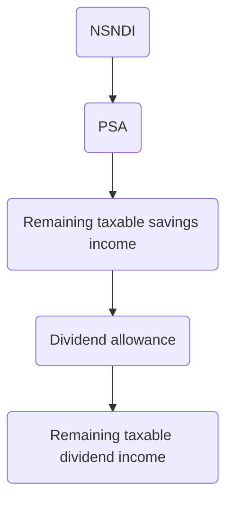

# Income Tax

```toc
```

## Purpose

About 1/3 of UK tax receipts come from income tax, collected by HMRC. Individual taxed on total from all taxable incomes.

- Statute
	- Income Tax Act 2007 (ITA 2007)
	- Income Tax (Trading and Other Income) Act 2005 (ITTOIA 2005)
	- Income Tax (Earnings and Pensions) Act 2003 (ITEPA 2003).
- Courts
	- Appeal by a taxpayer heard by the First-tier Tribunal, with further appeals to the Upper Tribunal (Tax and Chancery Chamber), and for points of law to [[Court of Appeal]] --> [[Supreme Court]].
- Official statements
	- Produced by HMRC to explain and qualify legislation.
	- Not binding on courts.
	- Extra-Statutory Concessions
		- HMRC waives right to collect tax which would otherwise be due if taxpayer satisfies terms.
		- Statements of Practice
			- Announced by press release, published in professional journals
			- Indicate HMRC's views of particular tax provisions.
- Tax year: 6th April–5th April.
- Income tax subject to general anti-abuse rules ('GAAR') introduced by Finance Act 2013.

## Income

Income tax is recurrent, whereas capital transactions are usually one-off. Income tax paid by individuals, partnerships, personal representatives and trustees. Companies pay corporation tax. There are tax-efficient ways of giving to charity.

> [!example] Income
> - Interest
> - Dividends
> - Salary/ wages
> - Rent

> [!example] Capital
> - Sale of shares
> - Buying a house
> - Sale of antique

 Income can be received gross (trading income, property income), or net–tax-deducted (employment income, PAYE). Sources of income for an individual include trading income, employment income, property income and saving and investment income.

Categorised as:

| Category                                | Sources of income                                   |
| --------------------------------------- | --------------------------------------------------- |
| Non-savings non-dividend income (NSNDI) | Trading income, employment income, property income. |
| Savings income                          | Savings and investment income                       |
| Dividend income                         | Savings and investment income.                                                     |

## Calculation

1. Calculate total income
	- Trading profits
	- Employment/ pensions income
	- Interest from banks
	- Investment income (interest, annuities, dividends)
	- Property income
2. Deduct allowable reliefs
	- Interest payments on a loan to:
		- Buy a share in a partnership
		- Invest in a close company
		- Personal representative to pay IHT.
3. Deduct personal allowance
	- £12,570
	- Reduces by £1 for every £2 of income over £100,000
	- £0 if income over £125,140.
	- Personal Savings Allowance (PSA):
		- Basic rate: £1,000 at 0%
		- Higher rate: £500 at 0%
		- Additional rate: £0
	- Dividend allowance
		- £2,000 at 0%
	- These are classified as nil rate bands, not exemptions.
		- The treatment of these allowances as nil rate bands has the potential to take a taxpayer into a higher tax band, increasing the amount of tax payable.
4. Calculate tax for each separate income stream at the applicable rate
	1. £37,700 basic rate
	2. £150,000 higher rate
	3. Above this, additional rate.
5. Calculate overall tax available.
	- Add all the tax paid
	- Credit for tax already paid.

![[tax-rates.png]]

## Total Income

| Statute            | Source                         | Details                                                            |
| ------------------ | ------------------------------ | ------------------------------------------------------------------ |
| Part 2 ITTOIA 2005 | Trading income                 | Applies to self-employed, including sole traders and partnerships. |
| Part 3 ITTOIA 2005 | Property income                | Rents and other receipts from land                                 |
| Part 4 ITTOIA 2005 | Savings and investment income  | Interest, annuities, dividends                                     |
| Part 5 ITTOIA 2005 | Miscellaneous income           | Annual income not otherwise charged                                |
| ITEPA 2003         | Employment and pensions income | Income arising out of employment, including social security payments.                                                                   |

Income is divided into chargeable sources because each part has its own rules for calculating the amount of income; the income is actually net of certain allowable expenses of an income nature (e.g., repairs to a property).

### Exempt Income

Exempt items include:

- Certain State benefits
- Interest on Savings Certificates
- Scholarships
- Interest on damages for personal injuries/ death
- Income from investments in ISAs
- Gross income $\leq £7,500$ from letting a furnished room in taxpayer's home
- Annual payments under certain insurance policies
- Premium bond winnings.

![[income-streams.png]]

### Tax Deducted at Source

Most employment income is deducted at source. Sums received after deduction at source must be grossed to find the original sum from which the tax was deducted.

The PAYE system takes into account personal allowances etc. to deduct tax at mostly the appropriate rate. Taxpayers are given a P60 certificate of tax paid by their employer, which they can then use as the basis of filing a tax return if they have other income sources.

## Allowable Reliefs

Interest payments on qualifying loans receive tax relief. These include:

- A loan to buy a share in a partnership or contribute capital/ make a loan to a partnership.
- A loan to invest in a close trading company
- A loan to personal representatives to pay income tax.

Subject to a cap of £50,000, or 25% of income, whichever greater

## Personal Allowances

Depends on the taxpayer's personal circumstances rather than the type of income. Main factors: level of total income and any disability allowances.

- Personal Allowance is £12,570, until at least 2026
- Subject to an income limit of £100,000: reduced by £1 for every £2 earned over £100,000
- Applies in order to: NSNDI, then savings income, then dividend income
- Each spouse independently liable for tax on their own income and has their own personal allowance.

### Marriage Allowance

Since April 2015: transferable 'marriage allowance'. Where one spouse/ partner does not have enough income to use their personal allowance fully, can transfer £1,260 to spouse/ civil partner.

### Blind Person's Allowance

£2,600 allowance.

### Property and Trading Allowances

Allowances for small amounts of property and trading income available to all taxpayers.

| Amount of gross property/ trading income | Effect                                                           |
| ---------------------------------------- | ---------------------------------------------------------------- |
| $\leq £1,000$                            | Income not subject to income tax, no need to submit a tax return |
| $>£1,000$                                | Taxpayer can choose to take £1,000 deduction against gross income/ deduct actual expenses.                                                                  |

### Personal Savings and Dividend

PSA can be set against savings income.

| Tax rate                 | Income band (Taxable Income) | Allowance       |
|:------------------------ |:---------------------------- |:--------------- |
| Basic rate taxpayer      | £0-£37,700                   | £1,000 tax free |
| Higher rate taxpayer     | £37,701-£150,000             | £500 tax free   |
| Additional rate taxpayer | £150,001 and above           | No allowance    |

#### Dividend Allowance

All taxpayers entitled to £2,000.

#### Nil Rate Bands

Importantly, the above allowances are not tax exemptions but nil rates for each type of income.

So allowances are **not** set off to reduce taxable income; only personal allowance is relevant for calculating taxable income.

## Rates of Tax

$\text{Taxable income} - \text{S\&D income} = \text{Taxable NSNDI}$

Note NSNDI is taxed at a higher rate than savings and dividend income.

### Order of Taxation

Income taxed in slices:

1. NSNDI
2. Savings income
3. Dividend income

| Slice       | Type                                   | Details                                                                                                     |
| ----------- | -------------------------------------- | ----------------------------------------------------------------------------------------------------------- |
| Top slice   | Dividends: taxed at the dividend rates | Dividend ordinary rate: 8.75% Dividend upper rate: 33.75% Dividend additional rate: 39.35%                  |
| Next slice  | Interest: taxed at the savings rates   | Starting rate for savings: 0% Savings basic rate: 20% Savings higher rate: 40% Savings additional rate: 45% |
| Taxed first | NSNDI: taxed at the main rates         | Basic rate: 20% Higher rate: 40% Additional rate: 45%                                                       |

### Savings Income

|                                      Savings Income                                       |     |
|:-----------------------------------------------------------------------------------------:|:---:|
|                                           Less                                            |     |
|                                     PSA (taxed @ 0%)                                      |     |
|                             Remaining Taxable Savings Income                              |     |
| This is the amount of savings income which will be subject to tax at the relevant rate(s) |     |

| Starting rate for savings of 0% | £0-£5,000        |
|:------------------------------- |:---------------- |
| Savings basic rate of 20%       | £5,001-£37,700   |
| Savings higher rate of 40%      | £37,701-£150,000 |
| Savings additional rate of 45%  | over £150,000    |

Dealing with PSA checklist:

1. Tax PSA at 0%
2. Calculate relevant rate of tax from (PSA + taxable NSNDI) total
3. Tax remaining savings income at the appropriate rate, using the table above.

(could be sad and code this up)

### Taxing Dividend Income

|                                      Dividend Income                                       |     |
|:------------------------------------------------------------------------------------------:|:---:|
|                                            Less                                            |     |
|                              Dividend Allowance (taxed @ 0% )                              |     |
|                                              =                                              |     |
|                             Remaining Taxable Dividend Income                              |     |
| This is the amount of dividend income which will be subject to tax at the relevant rate(s) |     |

| Dividend ordinary rate of 8.75% | £0-£37,700 |
| :--- | :--- |
| Dividend upper rate of 33.75% | £37,701-£150,000 |
| Dividend additional rate of 39.35% | over £150,000 |

Taxing dividends checklist:

- Tax dividend allowance at 0%
- Add dividend allowance to taxable NSNDI + total savings income (including PSA) to establish rates of tax.
- Tax remaining dividend income at appropriate rates, see table above.



## Collection of Income Tax

2 methods of collection:

- Deduction at source
	- Trading profits (ITTOIA 2005, Part 2)
	- Rent (ITTOIA 2005, Part 3)
- Self-assessment.
	- Taxpayer completes annual tax return
	- Tax returns issued soon after **5 April**.
	- Statutory obligation to notify HMRC of an income liable to tax, even if no tax return received.

### Dates for Payment

Online tax return and any payment must be filed by **31 January** following the tax year to which the return relates.

Taxpayer automatically required to make two payments on account towards the income tax due for the year. No payments on account are required if this relevant amount is below a certain rate, set so most employees and pensioners do not have to make payments on account.

### Penalties

- Interest charged on any amount of tax unpaid at the due date of payment.
- Fixed penalties for late payment/ non-payment.
- Statutory requirement to maintain adequate records to support the return.
