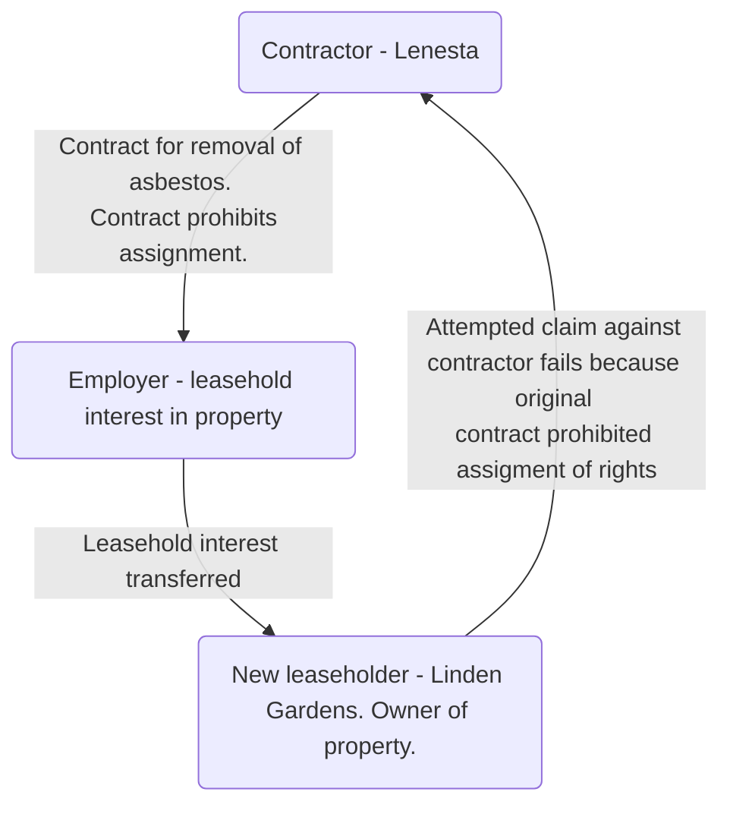

# Linden Gardens Trust v Lenesta Sludge Disposals Ltd and others

#key-case

The case involved a contract between an 'employer' and a 'contractor' (Lenesta) whereby the latter was to remove asbestos from a property in which the employer had a leasehold interest. The property was ultimately destined to be developed as shops, offices and residential flats.

Both parties knew that the building was going to be leased on to a third party. The contract contained a clause preventing the employer from assigning its rights under the contract to anyone else without the written consent of the contractor. The work under this contract was completed in 1980 and in 1985 the employer transferred its interest in the property to the plaintiffs, Linden Gardens Trust, who subsequently discovered asbestos in the property that should rightly have been removed under the original contract.

Linden Gardens Trust paid to have the asbestos removed and, when the original contracting party (the employer) assigned their right to sue the contractors to them, they (Linden Gardens Trust) brought an action to recover the losses sustained in remedying the defective performance under the contract between the employer and Lenesta.

It was held that the plaintiffs had no right to sue due to the prohibition of assignment contained within the original contract between the employer and the contractor.

