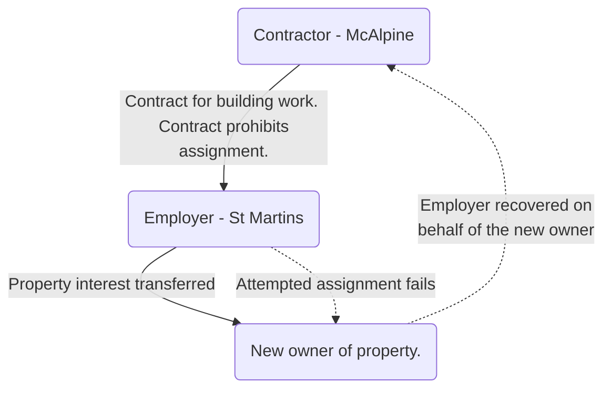

# St. Martins Property Corporation Ltd and another v Sir Robert McAlpine & Sons Ltd [1994] 1 AC 85

#key-case

This case has very similar facts to [[Linden Gardens Trust v Lenesta Sludge Disposals Ltd and others]] and the court held that the third party should fail on the same point as above, i.e. the assignment of the employer's rights to the third party was ineffective due to the prohibition against assignment without consent. However, unlike in Linden Gardens, the employer had been joined as a party to the legal action.

On appeal, the employer argued that a principle arising from a shipping case, [[The Albazero [1976] 3 All ER 129]], should be applied to this situation.

> In The Albazero, the court had ruled that where a contract was entered into by A and B, both of whom knew that the end benefit of the contract was going to reside in a third party, C, then in that situation, either party breaching the contract could be sued by the other party on behalf of the contemplated third party.

In St. Martins Property Corporation Ltd and another v McAlpine the court held, applying The Albazero principle, that, the employer could sue to recover the contemplated third party's loss.

## Abstract

Clause 17(1) of the Standard Form Building Contracts 1963 operates so as effectively to prohibit assignment of the contract by the employer without the consent of the contractor. Two cases were heard together on appeal where identical issues arose. The lessees of a building entered into a standard form JCT contract with D (contractors) to remove asbestos from the building. Clause 17(1) provided the employer shall not, without written consent of the contractor, assign his contract. In both cases the lessees assigned their interests in the property, their legal rights, benefits of contracts, etc., to the plaintiffs in actions which had begun in respect of poor work. The official referee held that the assignment was ineffective. The Court of Appeal reversed the decision. D appealed.

Held, allowing the appeal, that on a true construction of cl. 17(1) the wording prohibited assignment without consent; that since a party to such a contract might have a genuine commercial interest in ensuring that contractual relations with the party he selected were preserved, there was no reason for holding the contractual prohibition on assignment as being contrary to public policy (_[Helstan Securities Ltd v Hertfordshire CC [1978] 3 All E.R. 262, [1978] 5 WLUK 96](https://uk.westlaw.com/Document/I6547C460E43611DA8FC2A0F0355337E9/View/FullText.html?originationContext=document&transitionType=DocumentItem&ppcid=f331ecae5c2e4742b494b0041819db04&contextData=(sc.Default))_ considered).
