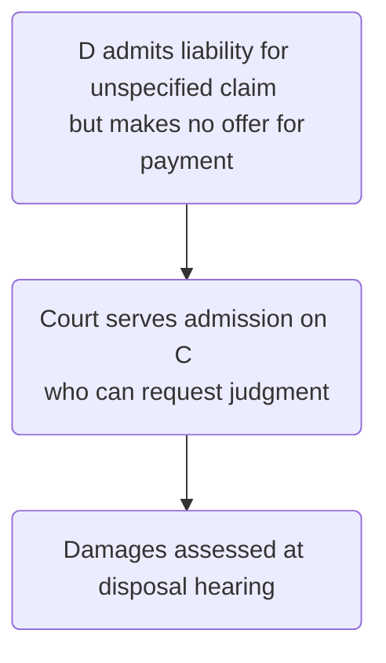
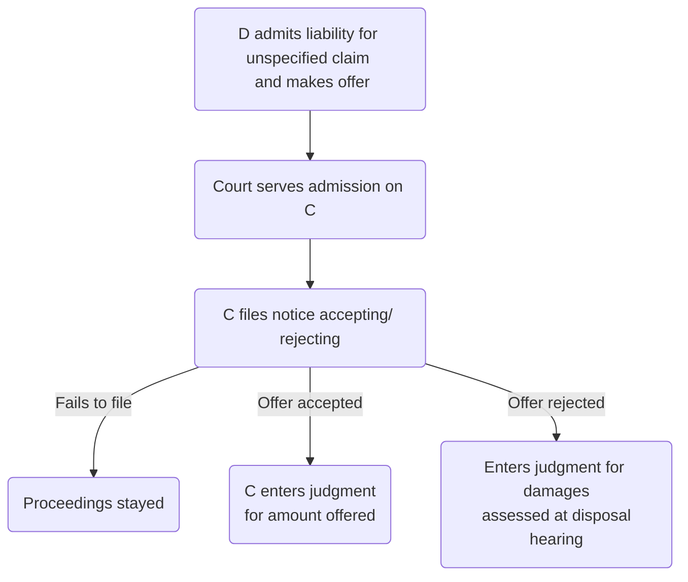

# Commencement-mermaid

```mermaid
graph TD

id1(D admits liability for unspecified claim <br/> but makes no offer for payment) --> id2(Court serves admission on C <br/>who can request judgment)
id2 --> id3(Damages assessed at disposal hearing)

```

```mermaid
graph TD

id1(D admits liability for unspecified claim <br/> and makes offer) --> id2(Court serves admission on C)
id2 --> id3("C files notice accepting/ rejecting")
id3 --> |Fails to file| id4.1(Proceedings stayed)
id3 --> |Offer accepted| id4.2(C enters judgment <br/>for amount offered)
id3 --> |Offer rejected| id4.3(Enters judgment for damages<br/> assessed at disposal hearing)

```
