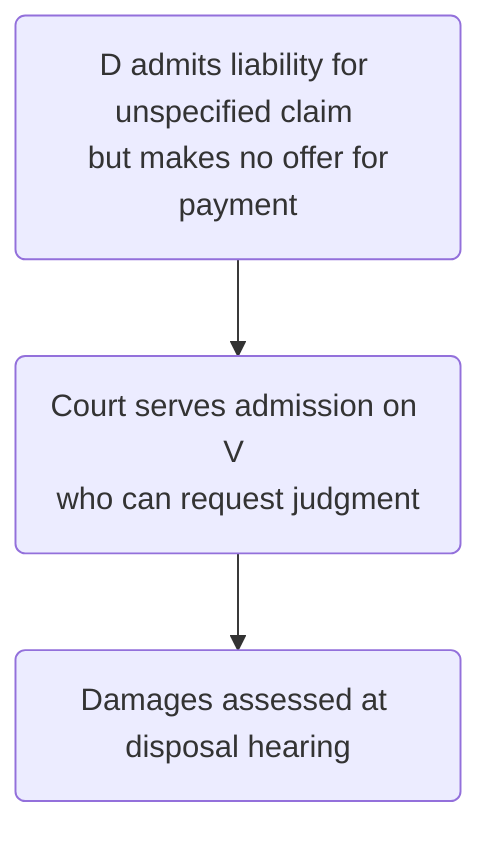
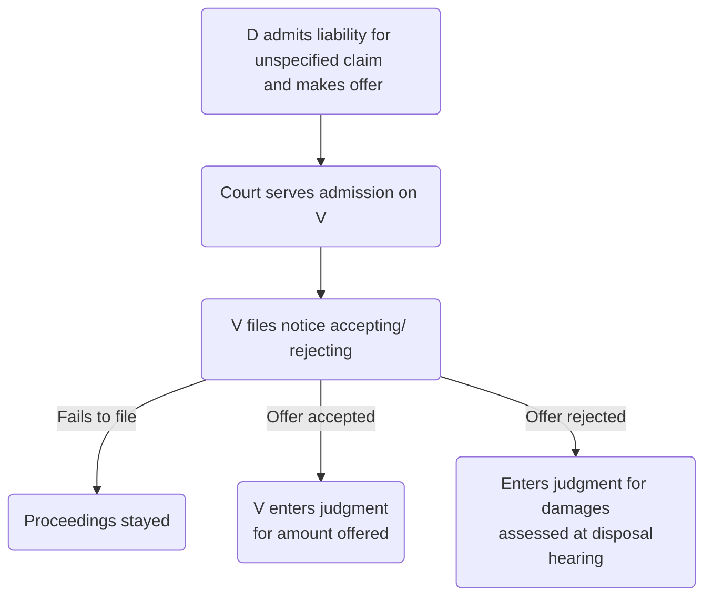

# Responding to Proceedings

## First Steps

There are 3 broad ways in which D may respond:

1. Filing an acknowledgement of service;
2. Filing a defence;
3. Filing an admission.

If the defendant does not respond within the  
appropriate time period, the claimant may enter judgment ‘in default’ of the defendant filing  
an acknowledgement of service and/or a defence.

![[responses-to-claim.png]]

## Computing Time

```ad-statute
title: CPR r 2.8 - Time
(1) This rule shows how to calculate any period of time for doing any act which is specified –  
- (a) by these Rules; 
- (b) by a practice direction; or 
- (c) by a judgment or order of the court.  
  
(2) A period of time expressed as a number of days shall be computed as clear days.  
  
(3) In this rule ‘clear days’ means that in computing the number of days –  
- (a) the day on which the period begins; and 
- (b) if the end of the period is defined by reference to an event, the day on which that event occurs  

are not included.
```

Any order imposing a time limit should, wherever practicable, give a calendar date, i.e., the day, month, year and deadline time for compliance.

## Acknowledgement of Service (part 10)

![[file-acknowledgement.png]]

## Time Limits

If the defendant fails to respond within a set time, the claimant can usually enter judgment.

```ad-statute
title: r 10.2 - Consequence of not filing an acknowledgment of service
If—
- (a) a defendant fails to file an acknowledgment of service within the period specified in rule 10.3; and
- (b) does not within that period file a defence in accordance with Part 15 or serve or file an admission in accordance with Part 14, 

the claimant may obtain default judgment if Part 12 allows it.
```

```ad-statute
title: r 10.3(1)- The period for filing an acknowledgment of service

(1) The general rule is that the period for filing an acknowledgment of service is—
- (a) 14 days after service of the particulars of claim where the defendant is served with a claim form which states that particulars of claim are to follow; and
- (b) 14 days after service of the claim form in any other case.
```

Note that service means deemed service. So:

|                                                     | When default judgment can be entered                        |
|:--------------------------------------------------- |:----------------------------------------------------------- |
| Claim form served with particulars of claim         | 15th day after (deemed) service of the claim form           |
| Particulars of claim served after claim form served | 15th day after (deemed) service of the particulars of claim |

### Completing Acknowledgement Form

D should include:

- Full name, pointing out correction if incorrect.
- Address for service (in E&W)
- Whether D intends to defend all of claim/ part of claim/ contest jurisdiction.
- The form must be signed by the defendant or their solicitor.

File form at the court where the claim was issued. The court will then notify the claimant in writing.

| Types of defendant | Who signs                                                                                                                                    |
| ------------------ | -------------------------------------------------------------------------------------------------------------------------------------------- |
| [[Business Law and Practice/Company Law/Business models/Partnership]]    | Service acknowledged in the name of the partnership by any partner/ authorised person, on behalf of all those who were partners at the time. |
| Company            | Senior person (e.g., director, treasurer, secretary) signs.                                                                                                                                              |

### Disputing Jurisdiction

r 11: if D wants to dispute the jurisdiction of the court, they must indicate this on an acknowledgement of service. Must then challenge the jurisdiction by making an application within 14 days, or they will be treated as having submitted to the jurisdiction.

If the court refuses the defendant’s application, the original acknowledgement of service ceases to have effect and the defendant must file a further acknowledgement within 14 days.

### Defence (part 15)

#### Time Limit

```ad-statute
title: r 15.4(1) - The period for filing a defence
(1) The general rule is that the period for filing a defence is –
- (a) 14 days after service of the particulars of claim; or
- (b) if the defendant files an acknowledgment of service under Part 10, 28 days after service of the particulars of claim.
```

```ad-bug

Remember that the day of deemed service of a claim form or particulars of claim will not always be the same. So if the claim form and particulars of the claim are served together, there is ambiguity. Interpret this as r 15.4 sets out the general position, but r 10.3 applies in respect of default judgment.
```

To avoid this ambiguity, best to file an acknowledgement of service as quickly as possible and then 28 days given from service of particulars to file defence.

#### Time Extension

The time for filing a defence may be extended by agreement between the parties for a period of up to 28 days. Should then give the court written notice of the agreement.

Any further extension must be authorised by the court, which will usually grant a short extension at D's expense, or a longer one if pre-action protocol has not been followed.

A party will need good reasons justifying the extension.

#### Drafting

| Type of claim          | Response |
| ---------------------- | -------- |
| Specified amount       | Form N9B |
| Unspecified amount     | Form N9C |
| Solicitor acting for D | Defence usually prepared separately.         |

#### Filing and Serving

When the defence is filed, a copy must be served on all other parties. The court will effect service, unless the defendant’s solicitor has told the court that they will do so.

### Admissions (part 14)

#### Whole Admission

Admission of whole claim but request time to pay:

![[admission-request-time.png]]

Where deciding the time and rate of payment, the court will take into account:

1. the defendant’s statement of means;
2. the claimant’s objections to the defendant’s request; and
3. any other relevant factors.

#### Part Admission–Specified

![[admission-part-specified.png]]

#### Part Admission–Unspecified

No offer:



Offer made:



#### Challenging

When a court decides time or rate of payment, either party may apply for re-determination by a judge within 14 days of service of the determination on the applicant.

#### Interest

```ad-test
title: Claiming interest
Judgment may include interest if following conditions met:
1. Particulars of claim include a claim for interest, and all details set out in [r 16.4](https://www.justice.gov.uk/courts/procedure-rules/civil/rules/part16#16.4) complied with.
2. Where interest claimed under s 25A SCA 1981 or s 69 CCA 1984, rate is no hgher than rate of interest payable on judgment debts (8% pa) when claim form was issued.
3. Request for judgment includes calculation of interest claimed since claim form.
```

If the above conditions are not satisfied, the judgment will be for an amount of interest to be decided by the court (e.g., for interest claimed under Late Payment of Commercial Debts (Interest) Act 1998).

Can be varied:

```ad-statute
title: PD 14 para 6 - Varying the rate of payment

**6.1** Either party may, on account of a change in circumstances since the date of the decision (or re-determination as the case may be) apply to vary the time and rate of payment of instalments still remaining unpaid.

**6.2** An application to vary under paragraph 6.1 above should be made in accordance with Part 23.
```

### Default Judgment (part 12)

![[default-judgment.png]]

#### Not Available

The claimant may not enter a default judgment in the following types of cases:

1. a claim for delivery of goods under an agreement regulated by the Consumer Credit Act 1974;
2. a Part 8 claim;
3. a mortgage claim;
4. a claim for provisional damages;
5. a claim in a specialist court.

#### Procedure

Must fill in the relevant form, and also satisfy the court that:

1. the particulars of claim have been served on the defendant;
2. the defendant has not acknowledged service or filed a defence (or any document intended to be a defence), at the date on which judgment is entered, and the relevant time period has expired;
3. the defendant has not satisfied the claim;
4. the defendant has not admitted liability for the full amount of the claim.

```ad-tip
The filing of an acknowledgment of service or a defence, even late, will prevent the entry of
judgment in default.
```

#### Details

| Aspect of default judgment | Details                                                                                                                                                                                  |
| -------------------------- | ---------------------------------------------------------------------------------------------------------------------------------------------------------------------------------------- |
| Specified amount           | If the request for specified amount does not indicate date of full payment or payment by instalments, the court will normally give judgment for immediate full payment.                  |
| Unspecified amount         | Court decides amount of claim and costs at a full hearing.                                                                                                                               |
| Interest                   | See test above for when default judgment will take the interest as given, otherwise the court determines.                                                                                |
| Co-defendants              | The claimant may enter a default judgment against one or more of the co-defendants while proceeding with their claim against the other defendants, if they can be dealt with separately. |
| Setting aside              | A defendant against whom a default judgment has been entered may apply to have it set aside.                                                                                             |
| Effect of stays            | Freezes all time limits and deadlines.                                                                                                                                                                                          |

```ad-important
Other than in cases where judgment has been wrongly entered, an application to set aside judgment in default is treated as an application for “relief from sanctions”.  This means that the case of _Denton v TH White_ should be considered in addition to the relevant Civil Procedure Rule.
```

![[denton-rules.png]]
