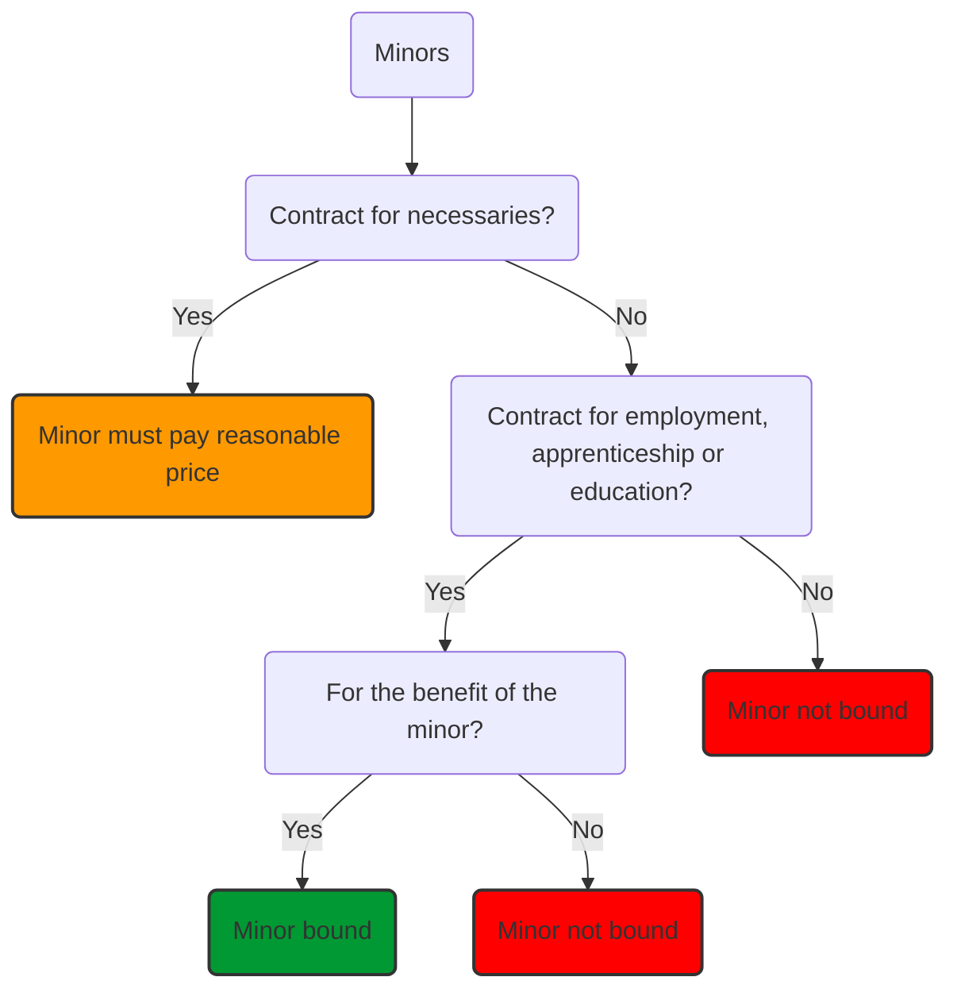

# Capacity

If a person does not have capacity to enter a contract, entering into a contract with them is unlikely to bind them.

Rules on capacity to contract for those who are weak and less capable of looking after themselves, like children, mentally ill etc. Aim to protect the vulnerable, and also those entering into contracts with them.

Those 18 or over have full capacity if of sound mind and not suffering from a factor ruling out capacity (like being drunk)

## Minors

In general, a person not bound by a contract entered into under the age of 18, even if the other person doesn't know/ the minor has lied.

### Exceptions

- 'Necessaries'
	- Minor bound by contract to supply necessaries to them
	- Under [[Sale of Goods Act 1979]] s 3(3), necessaries are goods suitable to the condition in life of the minor and their actual requirements at the time of sale and delivery (see [[Nash v Inman (1908) 2 KB 1]])
	- Minor must pay a reasonable price for the goods, rather than the actual cost of the necessaries supplied
- Minors bound by contracts of employment, apprenticeship or education BUT only if it is for their benefit
	- [[Aylesbury Football Club v Watford Association Football Club (QB 12 June 2000)]]

### Effect

Unless one of the exceptions apply, the contract cannot be enforced against the minor. The minor can enforce the contract against the other party.

If a minor ratifies a contract once they reach 18, the contract is binding on them.

## Mental incapacity/ Intoxication

s 2 of the [Mental Capacity Act 2005](https://www.legislation.gov.uk/ukpga/2005/9/contents):

> a person lacks capacity if “he is unable to make a decision for himself in relation to the matter”

Capacity depends not only on the state of the person but the decision being made.

Can be broken down into ability to (s 3(1)):

- Understand the relevant information
- Retain relevant information
- Use relevant information
- Communicate decision

According to s 3(4), the relevant information relates to the reasonably foreseeable consequences of:

- Deciding one way or another, and
- failing to make a decision.

The Court of Protection has power to make declarations as to a person's capacity and ability to contract in specified situations (s 15).

s 7: A person without capacity still remains liable to pay a reasonable price for 'necessaries'.

In any other case of incapacity: position is that contract is binding unless person claiming incapacity can establish that ([[Imperial Loan Co Ltd v Stone [1892] 1 QB 599]]):

1. They did not understand what they were doing
2. The other party knew this to be the case

Similarly, for drunken persons: individual will have to pay a reasonable price for necessaries, but not bound by any other contract made ([[Matthews v. Baxter (1873) LR 8 Ex 132]]).
