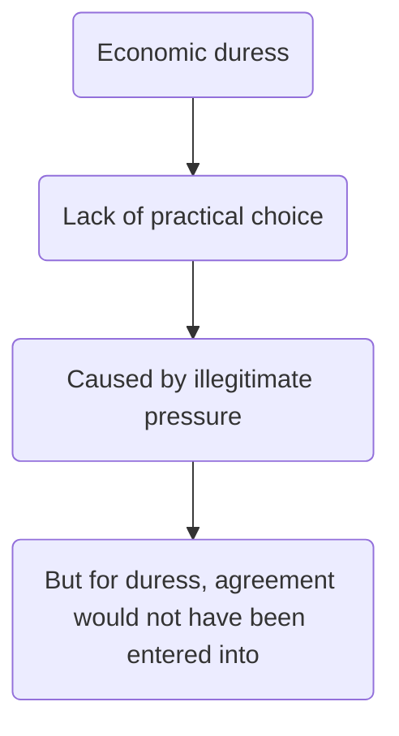

# Economic duress

Developed v recently. Problematic, not as settled as the other doctrines. Note that post [[Williams v Roffey Bros & Nichol (Contractors) Ltd [1991] 1 QB 1]] the doctrine of duress assumes greater significance. The difficulty is that duress has been bedevilled by conceptual confusion, with the result that it is not easy to identify its limits and it is not obvious that it is ready to play the role which has been allocated to it.

## Definition

[[DSND Subsea Ltd v Petroleum Geo Services ASA [2000] 7 WLUK 875]]. Mr Justice Dyson set out the definition of economic duress:

> "The ingredients of actionable duress are that there must be **pressure**,  
(a) whose practical effect is that there is compulsion on, or a **lack of practical choice**, for the victim,  
(b) which is **illegitimate**, and  
(c) which is a **significant cause** inducing the claimant to enter into the contract"

Note that duress trumps the principle of freedom of contract.

Digression:  
Avoid duress issue when drafting contract by adding clauses like price escalation, want contracts to be as certain as possible. But also want contracts to have built in flexibility. Ask client what worst case scenario is.

## Key Case

[[Carillion Construction Ltd v Felix (UK) [2001] BLR 1]] — successfully argued that revised contract was voidable on the basis of duress.

Test in DSND applied:

- Lack of practical choice
	- Carillion would incur heavy fees for late completion in relation to contract
- Caused by pressure
	- Refused to complete work unless new terms agreed
- Pressure illegitimate
	- Threat to breach contract unlawful, made in order to extort money
- Agreement would not have been entered into if not for duress

## Lack of Practical Choice

See [[Carillion Construction Ltd v Felix (UK) [2001] BLR 1]]. Court accepted the Carillion had paid this sum under duress. Their alternative would have been to seek a [[mandatory injunction]], but this would have taken 6 seeks to held that this would be unrealistic to expect given the commercial deadlines.

Held there was illegitimate pressure or a threat --> resorting to a legal remedy was held not to constitute a practical alternative.

Other cases:

- [[Atlas Express v Kafco Ltd [1989] 1 All ER 641]] → lack of practical choice through time pressure created by obligations under contracts with third parties can form the basis of duress.
- [[B & S Contracts and Design Ltd v Victor Green Publications Ltd [1984] ICR 419]] --> no practical choice but to pay, so economic duress. Asking for more money because of a price increase or potential loss under threat of breach of contract is not looked kindly upon by the Courts.
- [[Kolmar Group AG v Traxpo Enterprises PVT Ltd [2010] EWHC 113]] -> threat of defaulting on another contract.

See also [[Pakistan International Airline Corporation v Times Travel Ltd]].

In [[Huyton SA v Peter Cremer GmbH & Co [1999] 1 Lloyd's Rep 620]], Mance J state that while it was ‘not necessary to go so far as to say that it is an inflexible third essential ingredient of economic duress that there should be no or no practical alternative course open to the innocent party’, it seemed to him ‘self-evident that relief may not be appropriate, if an innocent party decides, as a matter of choice, not to pursue an alternative remedy which any and possibly some other reasonable persons in his circumstances would have pursued’.

## Illegitimate Pressure

Dyson J in DSND:

> "In determining whether there has been illegitimate pressure, the court takes into account a range of factors. These include whether there has been an actual or threatened breach of contract; whether the person allegedly exerting the pressure has acted in good or bad faith; whether the victim protested at the time; and whether he affirmed and sought to rely on the contract. These are all relevant factors. Illegitimate pressure must be distinguished from the rough and tumble of the pressures of normal commercial bargaining."

Note that in DSND, the safety and insurance position of the workforce were at issue, so the pressure was not held to be illegitimate.

### Threatened Breach of Contract

- This is unlawful
- [[Breach]] is a whole topic, but here consider as a failure to comply with [[Terms]] of contract, leading to right to claim damages.
- ==Threat to breach a contract usually amounts to illegitimate pressure==.
- [[Carillion Construction Ltd v Felix (UK) [2001] BLR 1]] and [[Atlas Express v Kafco Ltd [1989] 1 All ER 641]] examples of this
- If unlawful threat made for illegitimate ends, the threat is made in bad faith and will inevitably lead to finding of duress
- In [[Universe Tankships Inc of Monrovia v International Transport Workers' Federation (The Universe Sentinel) [1983] 1 AC 366]] demand was found to be in bad faith.
- Need to distinguish bad faith vs just driving a hard bargain: like in [[Alec Lobb v Total Oil [1983] 1WLR 87]]
- Contrast also to [[DSND Subsea Ltd v Petroleum Geo Services ASA [2000] 7 WLUK 875]], where the pressure exerted by DSND was “reasonable behaviour by a contractor acting bona fide in a very difficult situation” (Dyson). Here, DSND threatened to suspend its work under the contract until PGS' provision of insurance and indemnities covering the safety of the deep sea divers under the contract was clarified.

#### Practical Point

Say contract entered into under good faith, but then times changed and e.g., price of producing goods for party A became more expensive. Here, if Party A seeks to renegotiate a contract under threat of breaching it, risks the contract being unenforceable due to duress.

Commercial reality: contracting parties expected to consider risks. Can always enter into shorter contract/ none at all/ include price escalation clause in contract.

### Victim Protest

Victim should demonstrate evidence of protest at time alleged duress exerted (e.g., Carillon wrote an angry letter, material in their claim succeeding).

Contrast to [[North Ocean Shipping Co Ltd v Hyundai Construction Co Ltd and Another (The Atlantic Baron) [1979] QB 705]].

### Did the Victim Affirm

In [[North Ocean Shipping Co Ltd v Hyundai Construction Co Ltd and Another (The Atlantic Baron) [1979] QB 705]] couldn't get relief for alleged duress because of delay in taking action. So they affirmed variation to the contract.

### More Fun

See also [[Illegitimacy in economic duress]]

## Significant Cause

Show that agreement not entered into if there had not been the duress ([[Huyton SA v Peter Cremer GmbH & Co [1999] 1 Lloyd's Rep 620]]).

Note that the modern authority supports the application of the 'but for' test ([[Pakistan International Airline Corporation v Times Travel Ltd]])

## Economic Duress and Consideration

TLDR: even if good consideration (by way of practical benefit to support a variation), promise not enforceable where duress exercised to extract promise to pay more.

Say the new contract involves sale of some good for more. To establish if this is binding:

- Consideration
- Intent to create legal relations
- Agreement.

Recall that if a party does no more than already contractually bound to do, no consideration to make the variation binding ([[Stilk v Myrick (1809) 2 Camp 317]]).

But if X does something above and beyond contractual obligations, might amount to good consideration.

And in [[Williams v Roffey Bros & Nichol (Contractors) Ltd [1991] 1 QB 1]] Court of Appeals willing to look imaginatively at doctrine of consideration. But even when practical benefit exists, not enforceable where duress has been exercised to extract promise to pay less. See [[Existing obligation]].

[[Illegitimacy in economic duress]]

[[North Ocean Shipping Co Ltd v Hyundai Construction Co Ltd and Another (The Atlantic Baron) [1979] QB 705]]). This means that it is necessary for the party alleging duress to take steps to set aside the agreement. A failure to do this in a reasonable time can lead to the conclusion that the agreement has been affirmed, so cannot be set aside. This is because rescission is an equitable remedy.
