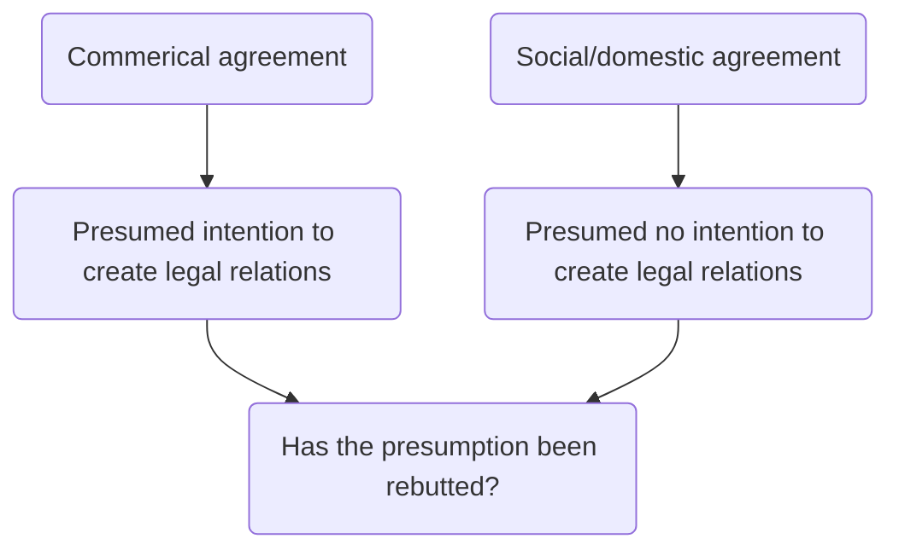

# Intent to create legal relations

> An intention to enter into an agreement that has legal ramifications (a contract)

Test for intention is objective: what the actions of parties suggest would be seen to suggest by a reasonable person ([[Merritt v Merritt [1970] 1 WLR 1211]]).

## Commercial Contracts

- Generally assumed that in commercial contracts, the parties intend that agreements should be legally binding.
- If a party to a commercial contract wishes to assert that legal relations were not intended, onus on them to do so (and burden of proof is heavy).
- Parties can include wording in the agreement indicating that parties do not intend to create legal relations. Can use the expression "subject to contract" to indicate that parties do not intend to be bound until formal execution of a contract.
- Recall in [[Carlill v Carbolic Smoke Ball Co (1893) 1 QB 256]] court held that company had demonstrated intention to be bound.

Can be difficult to ascertain whether particular promise is intended to have legal effect: [[Esso Petroleum Co. v Commissioners of Customs and Excise [1976] 1 WLR 1]].

The burden of proving that there was no intention to create legal relations falls on the party asserting that position ([[Volumatic Ltd v Ideas for Life Ltd [2019] EWHC 2273]]).

Performance of the contract is persuasive evidence of the intention to create legal relations ([[Anchor 2020 Ltd v Midas Construction Ltd [2019] EWHC 435 (TCC)]])

## Social/ Domestic Agreements

- Presumed that there is not an intention to create legal relations
- None of the parties would reasonably envisage the right to sue for failure to honour the commitment
- Exceptions often between spouses who are in the process of separating/ separated
- Often difficult cases: [[Jones v Padavatton [1969] 1 WLR 328]]
