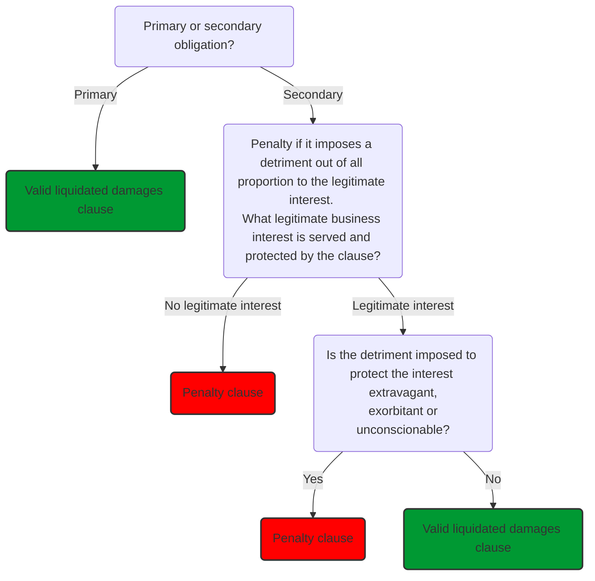

# Liquidated damages and penalties

Contracts arise from the agreement of the parties. The starting point of contract law is to support parties' agreements on as many matters as possible.

The parties can agree not only to the terms of the contract, but also the nature and scope of the consequences of a breach of contract.

> A liquidated damages clause stipulates a certain sum which is to be payable on a particular breach of contract.

This can be commercially advantageous for a company, since it fixes the amount that will be due for a breach as a debt arising under the contract (reduced uncertainty). Means a party can take risks into account when determining the price for a contract. Very common clauses in construction and technology industries.

## Court Intervention

There are instances where a court will intervene. Courts have jurisdiction to intervene in a contract to strike down a liquidated damages' clause which requires the party in breach to pay an excessive sum such that it becomes a 'penalty'. If a clause is regarded as a penalty, it will be struck down by the Court, and the claimant will only be entitled to 'unliquidated damages' (those assessed in the normal way).

> A **penalty clause** is a liquidated damages' clause which requires the party in breach to pay an excessive sum, such that it becomes a penalty, and therefore the clause will not be upheld.

Test for determining whether a clause is a valid liquidated damages clause or a penalty: [[ParkingEye Limited v Beavis [2015] UKSC 67]] and [[Cavendish Square Holdings BV v Talal El Makdessi [2015] UKSC 67]] (these two cases were heard together).

## *Makdessi* Test

Is the clause a primary or secondary obligation?

- A clause will be primary if it is part of the primary obligations in the commercial context of the contract, i.e., furthers the commercial objective of the contract.
- A clause will be secondary if it is an obligation triggered by a breach of contract to compensate the innocent party.

If primary, the clause will not engage the penalty rule at all, so will be valid.

If secondary, the clause will be a penalty if it imposes a detriment out of all proportion to any legitimate interest of the innocent party in the performance of the primary obligation. Test for this:

- What (if any) legitimate business interest is served and protected by the clause?
- Is the detriment imposed to protect that interest extravagant, exorbitant or unconscionable?

The burden of proof is on the person alleging that the clause is a penalty to prove this.

The law on penalties is a clear interference with freedom of contract, so will not be invoked lightly to strike down a clause in a contract freely negotiated between parties of equal bargaining power. A party can sometimes have a legitimate interest in enforcing performance which goes beyond simply being compensated for losses. A clause which is not disproportionate to that protection of legitimate business interest will be upheld.

Where the parties have negotiated a contract, on a level playing field and with the assistance of professional advisors, it will be hard for the party paying liquidated damages to challenge the validity of those provisions on the basis that they are a penalty.

Careful drafting to frame provisions as primary rather than secondary obligations can reduce the chance of a party falling foul of the law on penalties ([[Holyoake v Candy [2017] EWHC 3397 (Ch)]]). Key: to prevent an allegation that the clause is a secondary liability payable on breach in either substance or form.

For example, taking a scenario where Brett agrees to build a house for Damon at a price of £100,000 by 15 May 2019:

(a) a clause requiring payment of a sum of £1000 per day for late completion might be regarded as secondary and subject to the law on penalties; alternatively

(b) the obligation could be redrafted so that the price payable is lower, but Brett receives a 'bonus' for delivery on time. This provision might be regarded as a primary obligation intended to set the price and so not subject to the law on penalties.

