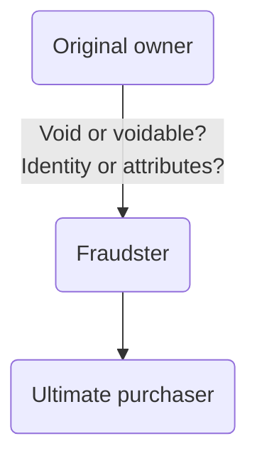

# Mistake

## Introduction

Mistake has a narrower meaning in contract law than the ordinary English meaning.

An **operative mistake** is a mistake which is recognised in the law of contract as preventing a contract from taking legal effect; the contract will be [[void]] from the outset (*void ab initio*).

The law of mistake is an exception to the general rule of contract that parties are bound by the terms of their agreement and must rely on the contract for protection from the effect of facts unknown to them.

Idea: the parties have not truly reached an agreement: either the parties cannot be said to have reached agreement because of the mistake, or the mistake renders the agreed contract something other than that which was intended.

## Categories

Three categories of mistakes:

| Category of mistake | Explanation                                                                                                                   | Remedy                                                                                                                                                                                                                          |
| ------------------- | ----------------------------------------------------------------------------------------------------------------------------- | ------------------------------------------------------------------------------------------------------------------------------------------------------------------------------------------------------------------------------- |
| Common mistake      | Occurs where both parties to an agreement are suffering from the same misapprehension.                                        | Common mistake as to existence of the subject matter voids contract unless contract allocates the risk. Common mistake as to fact/quality fundamental to agreement voids contract only in the most severe instances of mistake. |
| Mutual mistake      | Occurs where both parties are mistaken, but they are mistaken about different things. They have negotiated at cross-purposes. | Mutual mistake as to the identity of the subject matter voids contract.                                                                                                                                                         |
| Unilateral mistake  | Occurs where only one party is mistaken, and the other party knows, or is deemed to know, or the mistake.                     | Unilateral mistake as to the identity of the person contracted voids contract, but hard to show for face-to-face transactions.                                                                                                  |

### Common Mistake

It is necessary to consider whether the underlying common mistake is sufficiently fundamental to affect the validity of the contract. An example is where the subject-matter of the contract is not in existence. Unless the contract is interpreted as providing for this possibility, the contract is void.

In the absence of contractual mis-description, the general proposition is that mistake about the quality of goods does not void the contract. This is the case even if the mistake as to quality affects the utility of the goods to the buyer, or the value of the goods.

Suggested that there is a limited category of cases where the mistake is so severe that the contract will be void for mistake as to quality. But debate as to what the test to apply here is:

- Whether the mistake is such that the subject matter is 'essentially different' from that intended ([[Bell v Lever Brothers [1932] AC 161]])
- Whether the mistake renders the assumed performance 'impossible'
- Whether the subject matter is rendered 'radically different'.

Common mistake will not apply where:

1. The mistake is not sufficiently fundamental
2. One party is at fault
3. The contract makes provision for the issue.

### Mutual Mistake

e.g., Party A is offering one thing while B is accepting another. Such a contract will be void.

Courts will apply an objective test and decide what a reasonable third party would believe the agreement to be, based on the words and conduct of the parties. It may be decided that the agreement was that which A understood it to be, that which B understood it to be, or no meaning can be attributed to the agreement at all. Then the court will hold that the contract is binding upon both parties in that sense.

### Unilateral Mistake

> e.g., A buyer is shopping for a wedding dress when she sees a dress by a famous designer on sale for £100. The seller had made a mistake when writing the price tag, and it should have been on sale for £1000. The buyer knows that the dress is under-priced,, and she quickly buys the dress.
>
> There is no real agreement as the seller made a unilateral mistake in expressing his intention, so the acceptance does not correspond to the offer. In cases of mistake, a contract is void, not voidable.

Often relied upon where there has been a mistake as to the identity of the other contracting party ([[Lewis V Averay [1972] 1 QB 198]]). Circumstances where such a claim will succeed are very tightly constrained, particularly in the case of face-to-face contracts.

The general rule is that where there is a unilateral mistake as to identity in a face to face setting, the contract formed is voidable as it is presumed that the seller intended to contract with the person in front of them identified by sight and hearing and that is what happened. However, the contract will be void if the seller can persuade the court that the identity of the buyer was fundamental to the contract.

Considering the [[Lewis V Averay [1972] 1 QB 198]] case, it is important whether a contract is void for mistake or voidable for misrepresentation.

Where a contract for sale of goods is voidable, then until it is avoided, title still passes from the seller to the buyer. However, the buyer's title is a 'voidable title' — one that could later be avoided. This is protected under statute thanks to the [[Sale of Goods Act 1979]].

[s 23 Sale Of Goods Act 1979](https://www.legislation.gov.uk/ukpga/1979/54/section/23):

> When the seller of goods has a voidable title to them, but his title has not been avoided at the time of the sale, the buyer acquires a good title to the goods, provided he buys them in good faith and without notice of the seller’s defect of title.

So as long as the third party does not know about or have reason to suspect the deception, the third party has acquired good title, and the claimant cannot take the car back. Practically, the seller is likely to be left without remedy.

But where the identity of the buyer is fundamental, and the contract is void for mistake, then it is void and ineffective from the outset. The buyer has no title and cannot give any title to the third party by selling the goods on (principle of *nemo dat quod non habet*: no one gives who possesses not). Since the third party has no title, they must return the goods to the duped seller, even if they paid for them.

#### Parties Not Contracting Face-to-face

The law is more lenient when parties are not contracting face-to-face ([[Cundy v Lindsay (1878) 3 App Cas 459]]).

Leading case: [[Shogun Finance Ltd V Hudson [2004] 1 AC 919]]. Here the House of Lords considered both face-to-face situations and distance-selling situations. The majority found that it was a distance-selling situation, and decided to keep the distinction.

Not every distance selling transaction will result in the court finding the contract void by mistake ([[King’s Norton Metal Co Ltd v Edridge Merrett & Co Ltd (1897) 14 TLR 98 (CA)]] – voidable for fraudulent misrepresentation).
