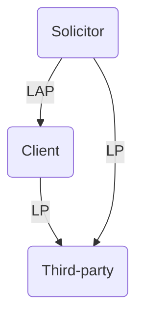

# Disclosure and Inspection

```toc
```

## Purpose

Litigation cannot do real justice unless the court does not have all the relevant information.

Pre-action protocols require parties to share information, but no general obligation to show the contents of documents. The only way to compel disclosure of a document is by court order.

Disclosure and inspection enables parties to better evaluate the strength of the opponent's case before trial. Intended to promote settlements. But inspection is subject to restrictions.

The idea behind these steps is that each party should know, prior to trial, the evidence that the other side intends to rely on–whether it be documents, the recollection of a witness or the opinion of an expert. This permits each party to prepare its case in full knowledge of the evidence and avoids what is sometimes known as ‘trial by ambush’, where a party produces important new evidence for the first time at trial.

Statute: Part 31 CPR 1998. Applies to all claims except Small Claims Track claims.

## Definitions

```ad-defn
title: Disclosure
A party discloses a document by stating that the document exists or has existed (r 31.2).
```

Can be done by serving a list of documents on every other party.

```ad-defn
title: Documents
Anything in which information of any description is recorded (r 31.4)
```

## Disclosure on Each Track

| Track        | Disclosure                                                                                                                           |
| ------------ | ------------------------------------------------------------------------------------------------------------------------------------ |
| Small claims | Part 31 provisions do not apply. Parties must 14 days before hearing, file and serve copies of all documents they intend to rely on. |
| Fast track   | Norm is standard disclosure                                                                                                          |
| Multi-track  | Norm is standard disclosure.                                                                                                                                      |

### Disclosure Report

r 31.5(3): parties must file and serve a disclosure report $\geq 14$ days before first case management conference. Report should be in form N263 and:

- Describe of what documents exist or may exist which are or may be relevant to the matter
- Describe where and with whom located
- Describe how electronic documents stored
- Estimate costs involved in giving standard disclosure
- State disclosure directions sought
- Verify with statement of truth.

### Overriding Objective

Parties must $\geq 7$ days before first case management conference agree a proposal in relation to disclosure that meets the overriding objective.

### Possible Disclosure Directions

r 31.5(7): these include

1. Order dispensing with disclosure
2. Order that party disclose documents on which they rely
3. Order that directs disclosure to be given by each party, issue by issue
4. Order that each party disclosure documents which might reasonably contain information useful/ damaging to that party
5. Order for standard disclosure
6. Any other appropriate order.

r 31.5(8): the court may specify searches to be carried out, formats for documents, and other practical measures.

## Standard Disclosure

```ad-statute
title: r 31.6
Standard disclosure requires a party to disclose only–
- (a) the documents on which he relies; and
- (b) the documents which –
	- (i) adversely affect his own case;
	- (ii) adversely affect another party’s case; or
	- (iii) support another party’s case; and
- (c) the documents which he is required to disclose by a relevant practice direction.
```

### Issues in Dispute

What is the 'case'? See statements of case! No need to disclose documents relating to issues which are in agreement. In most cases, liability and quantum will be in dispute. But documents concerning costs should also be included as part of standard disclosure.

Only need to search for documents which affect the case to a material extent.

No need to disclose documents which only call into question the reliability of a party/ their witnesses.

### Control of Documents

```ad-statute
title: r 31.8
(1) A party’s duty to disclose documents is limited to documents which are or have been in his control.

(2) For this purpose a party has or has had a document in his control if –
- (a) it is or was in his physical possession;
- (b) he has or has had a right to possession of it; or
- (c) he has or has had a right to inspect or take copies of it.
```

It is open to parties to agree in writing to dispense with/ limit standard disclosure, though this is not common.

## Disclosure of Copies

Just disclose a single copy of a document, unless there are any modifications (e.g., handwritten notes).

## Duty to Search (r 31.7)

### Reasonable Search

A party must make a reasonable search for all documents that could adversely affect their own/ another party's case. Reasonableness depends on:

- Number of documents involved
- Nature and complexity of case
- Ease and expense of retrieval
- Significance of document.

### Electronic Documents

**PD 31B** sets out provisions. General principles:

- Manage efficiently
- Use technology
- Generally provide in a format providing the other party the same ability to access/ search/ review documents.
- Don't disclose irrelevant documents.

Parties will agree categories of documents, preservation, keywords, exchange of data etc. There is an optional Electronic Disclosure Questionnaire.

### Limits

If a party has limited their search, the limits must be disclosed in the disclosure statement.

## Right of Inspection

**Rule 31.3(1)** gives a party a right of inspection of a disclosed document, except where:

- (a) the document is no longer in the control of the party who disclosed it (see 11.4);
- (b) the party disclosing the document has a right or a duty to withhold inspection of it; or
- (c) a party considers it would be disproportionate to the issues in the case to permit inspection of documents within a category and states in their disclosure statement that inspection of those documents will not be permitted on the grounds that to do so would be disproportionate.

### Procedure

**r 31.15**: where a party has a right to inspect a document, that party wishing to inspect must  
give written notice of their wish to inspect, and the party who disclosed the document must  
permit inspection not more than seven days after the date on which they received the notice. Can also request to inspect a copy (and offer to pay reasonable copying costs).

## Standard Disclosure Procedure

Each party must make and serve a list of documents using **Practice Form N264**. This must identify documents in a convenient order and manner as concisely as possible. **PD 31A para 3**: normally necessary to list documents in date order, numbering consecutively and giving each a brief description.

List is in 3 parts on the final page:

1. Documents in the party's control which they are happy for the other side to inspect
2. Documents of which the other party has control but where the party objects to inspection (usually because of privilege)
3. Documents not privileged but no longer in party's control, along with an explanation of what happened to them.

## Disclosure Statement

### Individual Must Sign

A party is under an obligation to disclose documents that might adversely affect their own case or support another party's case. It is essential that parties comply fully and honestly with the requirements of disclosure.

Parties must produce a disclosure statement (r 31.10(5)):

- Setting out the extent of the search that has been made to locate documents
- Certifying that they understand the duty to disclose documents
- Certifying that to the best of their knowledge, they have carried out that duty.

By **r 31.10(9)**, a disclosure statement may be made by a person who is not a party only where this is permitted by a relevant Practice Direction.

```ad-example
The only provision in PD 31A is at para 4.7, which provides that ‘an insurer or the Motor Insurers’ Bureau may sign a disclosure statement on behalf of a party where the insurer or the Motor Insurers’ Bureau has a financial interest in the result of proceedings brought wholly or partially by or against that party’.
```

### Contempt of Court

```ad-defn
Proceedings for contempt of court may be brought against a person if they make, or cause to be made, a false disclosure statement without an honest belief in its truth.
```

The proceedings require the permission of the court, unless they are brought by the Attorney-General.

### Solicitors' Duties

```ad-statute
title: Practice Direction 31A, para 4.4
If the disclosing party has a legal representative acting for them, the legal representative must endeavour to ensure that the person making the disclosure statement understands the duty of disclosure.
```

## Continuing Obligation (r 31.11)

Disclosure is an obligation that continues until the proceedings are concluded. If documents to which the duty of disclosure extends come to a party’s notice at any time during the proceedings, even though the party has already supplied a list of documents, they must immediately notify every other party.

If a document is found after a party’s list of documents has been served, and it satisfies the test in **r 31.6**, notice should be given by way of letter or a supplemental list. If the party wishes to rely on the document at trial, either the opponent will have to agree or a successful application made to the court for permission to do so. Even if permission is given, the opponent may still argue at trial that little weight should be attached to the evidence.

## Withholding Inspection

A party can withhold the right to inspect a document that has been disclosed. Usually, a party claims the documents are privileged from inspection.

3 classes of privileged documents:

- Documents protected by legal professional privilege
- Documents tending to incriminate the party producing them
- Documents privileged on the grounds of public policy.

### Legal Professional Privilege

#### Advice Privilege

Communication passing between a party and their legal advisor, or between legal advisors.

Letters and other communications passing between a party and their solicitor are privileged from inspection, provided they are written by or to the solicitor in their professional capacity and for the **sole or dominant purpose** of obtaining legal advice or assistance for the client (“dominant purpose test”).

“Legal advice” includes information passed between solicitor and client, so advice may be sought and given.

But this is not a blanket exemption for all solicitor-client communication; it applies only to information passed between the client and a solicitor acting in the capacity of solicitor. Documents sent to or from an independent third party are not covered by this privilege; 'copying in' a solicitor will not mean the information can be withheld. If the communication is made for the purpose of committing a fraud or crime, it will not attract privilege ([[R v Cox and Railton (1884)]]).

The privilege extends to

- Communications between a party and their solicitor's employee/ agent,
- Communications between a party and a solicitor in their service.
- Communications from a solicitor to a third party containing information provided by the client to the solicitor which is covered by legal advice privilege and which the client has given the lawyer authority to disclose.

```ad-guid
title: Purpose
To allow free access to the legal profession. 
```

But the privilege does not extend to an accountant who provides legal advice ([[R (on the application of Prudential Plc) v Special Commissioner of Income Tax [2013] UKSC 1]]).

#### Solicitor-TP Litigation Privilege

Communications passing between the solicitor and a third party are privileged from  
inspection only if:

1. They come into existence after litigation is contemplated or commenced; and
2. They are made with a view to the litigation, either for the **sole or dominant purpose** of obtaining or giving advice in regard to it, or for obtaining evidence to be used in it.

This includes, for example, an AEI policy.

#### Client-TP Litigation Privilege

Documents that have passed between the client and a third party are privileged if the **sole or dominant purpose** for which they were produced was to obtain legal advice in respect of existing or contemplated litigation, or to conduct, or aid in the conduct of, such litigation, usually to have as evidence.

 The burden is on the party claiming privilege to establish that the dominant purpose, at the time the document came into existence, was litigation. An expert report commissioned by the client and later used for litigation is not good enough.

Where the claimant is not an individual, the privilege applies to communications between individuals within an organisation, where the dominant purpose of communications was in obtaining legal advice in respect of existing or contemplated litigation.



#### Purpose of Privilege

Safeguards Art 8 ECHR right to respect for private life. A client should be able to consult their lawyer in confidence.

#### Waiver of Privilege

The client may waive legal privilege. Once a copy of the privileged document is served on the other side, privilege is waived. This is standard for witness statements and expert reports which each party intends to rely on at trial.

### Incriminating Documents

A party is entitled to claim privilege for documents that will tend to incriminate either  
themselves, their spouse or civil partner. This rule applies to criminal liability or penal  
proceedings under the law of any part of the UK.

### Public Policy Privilege

If producing a copy of a document would be injurious to the public interest, it may be withheld on the ground of public policy. The judge has to consider whether the withholding of the documents is necessary for the proper functioning of the public service.

### Challenging Privilege (r 31.19)

A party who wishes to challenge their opponent’s claim to privilege can apply for the court to decide whether the claim to privilege should be upheld. The court may require the party claiming privilege to produce the document to court.

### Inadvertent Disclosure

#### Obvious Mistake

- If privileged documents are mistakenly listed in part 1 rather than part 2 of a party's list, no harm done if the error is before inspection.
- If inspection of privileged material is allowed inadvertently
	- If it is obvious to the solicitor receiving the privileged document that a mistake has been made, the solicitor should return the document.
	- If not obvious that a mistake had been made
		- Receiving party may use the document in litigation
		- But disclosing party might obtain an injunction if it can persuade the court that the reasonable solicitor would have found it obvious that disclosure was a mistake.
		- Court may also order that the receiving party's solicitors can no longer act in the litigation.

```ad-action
If you're unsure of if a document is privileged, best practice to point it out to the other side when reliance is placed during litigation.
```

### Without Prejudice Correspondence

Records information as part of a party's attempt to settle a case. So if it meets the r 31.6 test, should be disclosed and no privilege from inspection claimed. It does not matter that this such correspondence is not admissible at trial.

Note that in multi-party correspondence, a document could be privileged w.r.t $D_1$ but not privileged w.r.t $D_2$.

## Disclosure List

### Part 1

In Part 1 of the list of documents (documents in the party's control which they do not mind being inspected), the actual documents are identified so that the other parties can decide whether or not they wish to inspect them. Permissible to redact irrelevant parts of an entry - make it clear on the list that a redacted version will be available.

### Part 2

The party should disclose the type of documents for which they are claiming privilege from inspection, e.g., “various expert reports”. The objections to inspection must then be stated.

When claiming legal professional privilege (the most common ground), include details of when and why the document was created.

### Part 3

Actual non-privileged documents the party once had, but are no longer in the party's control. Often comprises of original letters, the copies of which have been detailed in the first part of the list.

## Failure to Disclose

```ad-statute
title: r 31.21
A party may not rely on any document which he fails to disclose or in respect of which he fails to permit inspection unless the court gives permission.
```

Failure to disclose a document harming a case may result in the case being struck out.

## Subsequent Use

```ad-statute
title: r 31.22
(1) A party to whom a document has been disclosed may use the document only for the purpose of the proceedings in which it is disclosed, except where –
- (a) the document has been read to or by the court, or referred to, at a hearing which has been held in public;
- (b) the court gives permission; or
- (c) the party who disclosed the document and the person to whom the document belongs agree.

(2) The court may make an order restricting or prohibiting the use of a document which has been disclosed, even where the document has been read to or by the court, or referred to, at a hearing which has been held in public.
```

## Applying for Specific Disclosure

```ad-statute
title: r 31.12
(1) The court may make an order for specific disclosure or specific inspection.

(2) An order for specific disclosure is an order that a party must do one or more of the following things –
- (a) disclose documents or classes of documents specified in the order;
- (b) carry out a search to the extent stated in the order;
- (c) disclose any documents located as a result of that search.

(3) An order for specific inspection is an order that a party permit inspection of a document referred to in rule 31.3(2). (Rule 31.3(2) allows a party to state in his disclosure statement that he will not permit inspection of a document on the grounds that it would be disproportionate to do so).
```

A party may apply for an order for specific disclosure. This should specify the order the applicant wants the court to make and the grounds for the application. Before making an application, ask the other side to comply.

An application will require a witness statement in support, detailing the date of order for standard disclosure and the document(s) the applicant believes should have been included in the list.

When making an order, the court will consider all the circumstances. An 'unless order' will often be made. Respondent should also seek a costs order.

## Pre-action Disclosure

A party may make this application when unsure of whether they have a good case. See [[Early Action#Pre-action Disclosure]] and r 31.16.

### Non-party Disclosure

Where proceedings have commenced, a party to the proceedings can apply for disclosure  
against a non-party (r 31.17). Enables a party to proceedings that are already in existence to obtain disclosure of documents from a non-party if it is going to help resolve the issues in the case.

The most common application is when a party indicates on their list that they no longer have a document in their possession, but that X does.

```ad-statute
title: r 31.17
(1) This rule applies where an application is made to the court under any Act for disclosure by a person who is not a party to the proceedings.

(2) The application must be supported by evidence.

(3) The court may make an order under this rule only where–
- (a) the documents of which disclosure is sought are likely to support the case of the applicant or adversely affect the case of one of the other parties to the proceedings; and
- (b) disclosure is necessary in order to dispose fairly of the claim or to save costs.

(4) An order under this rule must –
- (a) specify the documents or the classes of documents which the respondent must disclose; and
- (b) require the respondent, when making disclosure, to specify any of those documents –
	- (i) which are no longer in his control; or
	- (ii) in respect of which he claims a right or duty to withhold inspection.

(5) Such an order may –
- (a) require the respondent to indicate what has happened to any documents which are no longer in his control; and
- (b) specify the time and place for disclosure and inspection.
```

## Disclosure and Solicitors' Duties

para 1.4 SRA Code for Solicitors: a solicitor must never mislead the court. If a document is found which was not disclosed but should have been, advise the client to disclose it and how to do so. If a client refuses to allow disclosure, withdraw from the case. But do not inform other parties of the reason for ceasing to act (client confidentiality).

The client should sign the disclosure statement only after giving legal advice. A client should start to preserve documents when first notified of the claim. [[Woods v Martin’s Bank [1959] 1 QB 55]] imposes a duty on a solicitor to the court to examine their  
client’s documents themselves in order to ensure that proper disclosure is made.

## Inspection of Standard Disclosure Documents

### Scrutinise Opponent's List

- Check disclosure statement
- Ask yourself what you expect to see in Part 1
- Inspect Part 1
- Check each privilege properly claimed in Part 2
- Check if there's anything in Part 3 other than an original of a document copy listed in Part 1.

### Inspection

Consider whether you need photocopies or original. Check you have everything.

## Disclosure Pilot Scheme

From 1 January 2019, all new and existing proceedings in the Business and Property Courts of England and Wales are subject to a disclosure pilot scheme, with some exceptions.

The scope of the disclosure should be no wider than is reasonable and proportionate to determine the issues. Any documents of which a person with accountability is aware and which have been within the party’s control will be within the definition in para 2.8 and subject to the disclosure duties set out in para 3.

### Initial Disclosure

With the statement of case, file an initial disclosure list of documents. This should list documents and also contain copies of them.

### Extended Disclosure

Parties should state within 28 days of the final statement of case, whether it is likely to request Extended Disclosure on one or more issues. Then must prepare a draft List of Issues for Disclosure. This means the key issues in dispute.

There is a menu of 5 depths of disclosure to choose from. Need to back up with evidence and tell the court why you need more disclosure.

### Disclosure Guidance Hearing

Parties may seek guidance from the court, additionally to the guidance given in a case management conference.
