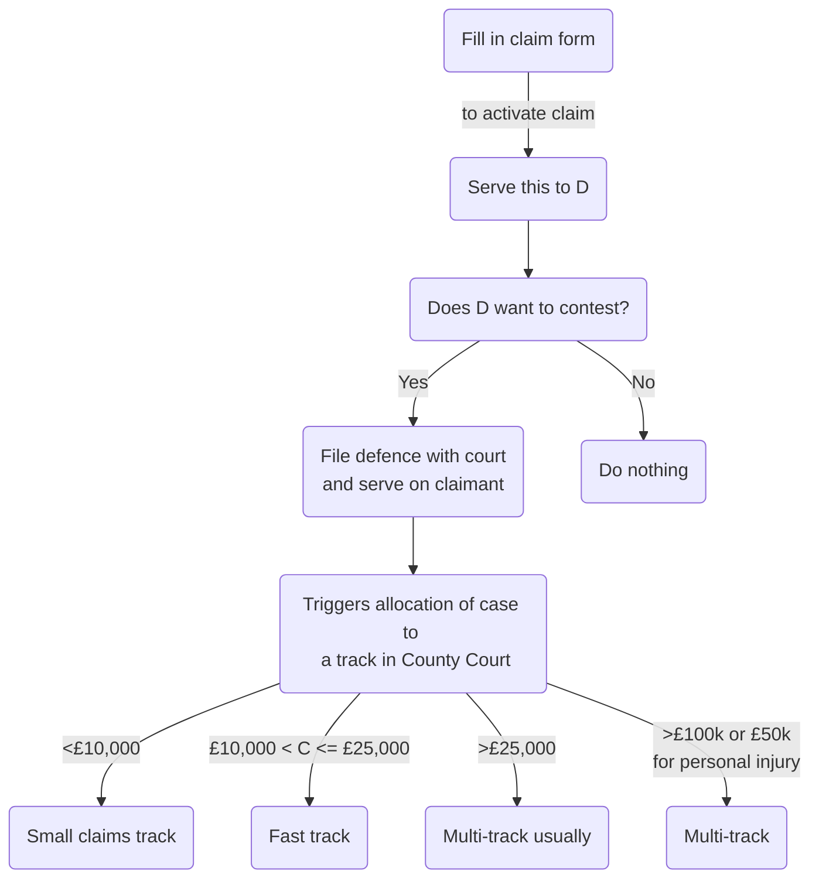

# Case Management

```toc
```

## Court's Powers

The court has a duty to manage cases actively:

```ad-statute
title: r 1.4 CPR 1998
(1) The court must further the overriding objective by actively managing cases.

(2) Active case management includes —
- (a) encouraging the parties to co-operate with each other in the conduct of the proceedings;
- (b) identifying the issues at an early stage;
- (c) deciding promptly which issues need full investigation and trial and accordingly disposing summarily of the others;
- (d) deciding the order in which issues are to be resolved;
- (e) encouraging the parties to use an alternative dispute resolution(GL) procedure if the court considers that appropriate and facilitating the use of such procedure;
- (f) helping the parties to settle the whole or part of the case;
- (g) fixing timetables or otherwise controlling the progress of the case;
- (h) considering whether the likely benefits of taking a particular step justify the cost of taking it;
- (i) dealing with as many aspects of the case as it can on the same occasion;
- (j) dealing with the case without the parties needing to attend at court;
- (k) making use of technology; and
- (l) giving directions to ensure that the trial of a case proceeds quickly and efficiently.
```

r 3.1(2): lists many of the court's powers. The court can make any order subject to conditions and can specify the consequence of non-compliance.

Under r 3.1(5) the court may make an order that a party pay a sum of money into court pending the outcome of proceedings if that party has failed to comply with a rule/ PD/ pre-action protocol without good reason. The court must have regard to both the amount in dispute and the costs the parties have/ will incur.

### Striking Out Statement of Case

```ad-statute
title: r 3.4(2) CPR 1998
The court may strike out a statement of case if it appears to the court –
- (a) that the statement of case discloses no reasonable grounds for bringing or defending the claim;
- (b) that the statement of case is an abuse of the court’s process or is otherwise likely to obstruct the just disposal of the proceedings; or
- (c) that there has been a failure to comply with a rule, practice direction or court order.
```

This is frequently used when a statement of case is vague/ incoherent, or where the facts disclosed do not disclose any legally recognisable claim. If a statement of case is salvageable through amendment, the court may give a part the opportunity to do this.

The court may make such an order on its own volition/ following an application to court by the other party. If D did not comply with the order, then the claimant would be able to obtain judgment simply by filing a request for judgment (stating that the right to enter judgment has arisen because the court's order has not been obeyed). D could then apply to court under r 3.6 for the judgment to be set aside, not after 14 days after judgment served. r 3.9 sets out relief from sanctions.

### Non-compliance with rule/ PD/ Court Order

Valid grounds for striking out a statement of case. But other sanctions also available. So which sanction should be used when?

- Starting point: there are less drastic but equally effective ways of dealing with a failure to comply with CPR/ court orders ([[Biguzzi v Rank Leisure plc [1999] 1 WLR 1926]], which in many cases would produce a more just result.
- All circumstances are considered, particularly factors relevant to r 3.9.
- Overriding objective and duty to ensure fairness, a central consideration in the exercise of the court's discretion.
- Striking out a case because of procedural irregularities may violate Article 6(1) ECHR right to a fair trial.
- So striking out used where default is so bad it amounts to abuse of court/ where it is no longer possible to have a fair trial.

### Other Sanctions

| Sanction       | Details                                                                                                    |
| -------------- | ---------------------------------------------------------------------------------------------------------- |
| Costs          | Require the party in default to pay the other party's costs occasioned by the delay on an indemnity basis. |
| Interest       | Court may make orders affecting the interest payable on any damages subsequently awarded to C.             |
| Limited issues | Limiting the issues which are allowed to proceed to trial.                                                 |

### Unless Order

```ad-question
title: A party has not taken a step in proceedings according to a court order, what should the other party do?
1. Chase up the defaulting party in correspondence. 
2. Apply to the court for an unless order. 
	- Do this promptly
	- First warn the other party of intention to do so.
```

PD 28 para 5.1:

> [w]here a party has failed to comply with a direction given by the court, any other party may apply for an order to enforce compliance or for a sanction to be imposed or both of these.

If the other party cannot make the deadline set by an unless order, should apply to the court to have it extended, since the strike out takes effect without any other order.

## Relief From Sanctions

### Timing

If a Rule/ PD/ court order requires a party to do something in a specific time, this time can be extended by up to 28 days by agreement between the parties, unless explicitly prohibited by the court/ risks breaking hearing date (r 3.8(4)).

### Relevant Factors

By r 3.9(1), where a party applies for relief from any sanction for failure to comply with any  
rule, practice direction or court order, the court will consider all the circumstances of the  
case, so as to enable it to deal justly with the application, including the need:

1. for litigation to be conducted efficiently and at proportionate cost; and
2. to enforce compliance with rules, practice directions and orders.

### Denton

```ad-test
title: Denton test
The test was established in [[Denton v TH White Ltd [2014] EWCA Civ 906]] as follows:
1. Identify and assess the seriousness or significance of the relevant failure. If a breach was not serious or significant, relief would usually be granted and there would be no need to spend much time on the second and third stages.
2. Consider why the failure or default occurred.
3. Evaluate ‘all the circumstances of the case, so as to enable [the court] to deal justly with the application’.
```

- The court normally considers as one of the relevant circumstances of the case the defaulter’s previous conduct in the litigation, including any non-compliance with court orders.
- A party might be penalised if they sought to take advantage of a mistake by an opponent where the failure was neither serious nor significant. Opposing an application for relief would be viewed as a breach of r 1.3, which requires parties to help the court to further the **overriding objective**.
- Breaches which affect the effective timetabling of cases are likely to be considered significant.
- Lack of promptness in applying for relief may often be a critical factor.

## Directions Questionnaire

Allocation is dealt with by Part 26 CPR 1998. Timeline:

- Defence served
- Court serves on each party a notice of the proposed allocation (Form 149A/ N149B/ N149C for small claims/ fast-track/ multi-track).
- Parties file and serve answers to 'directions questionnaire' (form N181, or N180 if small claims track provisionally allocated).
	- Directions questionnaire available online, legal representatives should download and fill this in unprompted.
- If multi-track provisionally allocated, also send:
	- Case summary (if case management conference)
	- Disclosure report
	- Costs budget
	- Budget discussion report.

### Completing Questionnaire

Form N181 must be completed by each party and filed by the set date. Parties should consult one another and cooperate in completing the questionnaire.

r 26.3(6A): the date for filing **cannot** be varied by agreement between the parties. Divided into 10 sections.

| Directions questionnaire section   | Details                                                                                                                                                                                                                                                                                                      |
| ---------------------------------- | ------------------------------------------------------------------------------------------------------------------------------------------------------------------------------------------------------------------------------------------------------------------------------------------------------------ |
| Part A Settlement                  | Parties reminded that they should try to settle a case, and that answers will impact costs decision. Parties must indicate if they want to try to settle (one month stay of proceedings). Or court can order a stay on its own initiative. Parties can request the court to arrange a mediation appointment. |
| Part B Court                       | Asks parties whether there is any reason to be heard in a particular court, along with reasons. Special provisions if claim issued at Central Office of Royal Courts of Justice (RCJ).                                                                                                                       |
| Part C Pre-action protocols        | Have parties complied with pre-action protocols, if not then why.                                                                                                                                                                                                                                            |
| Part D Case management information | Asks parties if they have made an application to the court. Relevant to allocating a track: the largest of the claims/ counterclaims will determine the track which the case is placed on. More questions if multi-track allocation (e.g., about disclosure of electronic documents).                        |
| Part E Experts                     | Parties should indicate if they wis hto rely on expert evidence at trial.                                                                                                                                                                                                                                    |
| Part F Witnesses                   | Parties name witnesses of fact they intend to call at trial, and identify facts each witness will address. But not obliged to 'name names', can just say number of witnesses. Court can limit numbers.                                                                                                       |
| Part G Trial                       | Parties give a realistic estimate of how long the trial will last.                                                                                                                                                                                                                                           |
| Part H Costs                       | If multi-track, legal advisers should file and serve a costs budged.                                                                                                                                                                                                                                         |
| Part I Other info                  | State purpose of any application the party intends to make in the near future.                                                                                                                                                                                                                               |
| Part J Directions                  | Parties should attempt to agree proposed directions. Specimen directions for multi-track found on MOJ website. All proposed directions for fast-track must be based on CPR Part 28.                                                                                                                                                                                                                                                                                                             |

### Transfer of Money Claims

r 26.2: automatic transfer of High Court proceedings where:

- The claim is for a specified amount of money,
- D an individual
- Claim commenced in a court other than D's home court.

When a defence is filed, the claim will be sent to D's home court.

r 26.2A: transfer of money claims within the County Court–similar provisions.

If proceedings are transferred, the court in which the proceedings commenced will serve the notice of proposed allocation before the proceedings are transferred and will not transfer proceedings until all parties have complied with the notice/ time for doing so expired.

### Failure to File Directions Questionnaire

#### [[County Court]] Money Claim

If r 26.2A applies, and any party does not comply with notice of proposed allocation, the court will serve a further notice, requiring compliance within 7 days. If they still don't comply, the party's statement of case is struck out automatically without a further court order.

#### Other Claims

If a party fails to comply with the notice of proposed allocation, the court makes an order it considers appropriate. This may include: (i) an order for directions; (ii) an order striking out the claim; (iii) an order striking out the defence and entering judgment; or (iv) listing the case for a case management conference.

#### Exchanging Questionnaires

Parties must exchange questionnaires–check for any new info.

## Allocation of Track

Most important factor is the value of the claim. But the court also takes into account other factors (r 26.8(1)).



```ad-statute
title: r 16.8(1) CPR 1998
When deciding the track for a claim, the matters to which the court shall have regard include –
- (a) the financial value, if any, of the claim;
- (b) the nature of the remedy sought;
- (c) the likely complexity of the facts, law or evidence;
- (d) the number of parties or likely parties;
- (e) the value of any counterclaim or other Part 20 claim and the complexity of any matters relating to it;
- (f) the amount of oral evidence which may be required;
- (g) the importance of the claim to persons who are not parties to the proceedings;
- (h) the views expressed by the parties; and
- (i) the circumstances of the parties.
```

```ad-statute
title: r 26.8(2)
It is for the court to assess the financial value of a claim and in doing so it will disregard –
- (a) any amount not in dispute;
- (b) any claim for interest;
- (c) costs; and
- (d) any contributory negligence.
```

The fast track is the normal track for claims with a value exceeding £10,000, but not £25,000, only if the trial is likely to last for no longer than one day; oral expert evidence at trial will be limited to no more than one expert per party in relation to any expert field and there will be expert evidence in no more than two expert fields.

PD 26, para 8.1(2): the court may allocate a claim to the small claims track even if it exceeds £10,000.

If a party is dissatisfied, may appeal/ apply to the court for reallocation of the claim (PD 26 para 11).

### Part 27: Small Claims Track

Aims are to process claims quickly at minimal cost.

```ad-statute
title: PD 26 para 8(1)
- (a) The small claims track is intended to provide a proportionate procedure by which most straightforward claims with a financial value of not more than £10,000 can be decided, without the need for substantial pre-hearing preparation and the formalities of a traditional trial, and without incurring large legal costs.
- (b) The procedures laid down in Part 27 for the preparation of the case and the conduct of the hearing are designed to make it possible for a litigant to conduct their own case without legal representation if they wish.
- (c) Cases generally suitable for the small claims track will include consumer disputes, accident claims, disputes about the ownership of goods, and most disputes between a landlord and tenant other than those for possession.
- (d) A case involving a disputed allegation of dishonesty will not usually be suitable for the small claims track.
```

All claims other than road traffic accidents, personal injury or housing disrepair will be  
referred to the Small Claims Mediation Service if all parties consent to referral in their  
directions' questionnaire. If the claim is settled, proceeds automatically stayed (r 26.4A(5)).

In most cases, the court will order standard direction s and fix a date for the final hearing. Rare for there to be a preliminary hearing. By r 27.2(3), the court may of its own initiative order a party to provide further information. Under r 27.14, the costs which can be recovered by a successful party are extremely limited.

Standard directions which a court gives set out in PD 27 appendices. The hearing will be informal, and if all parties agree, the court can deal with the claim without a hearing (i.e., just based on the statements of case).

r 27.14: generally, the only costs recoverable are the fixed costs attributable to issuing the claim, any court fees paid and sums to represent travelling expenses and loss of earnings or leave.

### Part 28: Fast Track

Generally, the court will allocate a case to this track without a hearing and order standard directions.

General timetable:

| Event                                                     | Period from date of allocation |
| --------------------------------------------------------- | ------------------------------ |
| Disclosure                                                | 4 weeks                        |
| Exchange of witness statements                            | 10 weeks                       |
| Exchange of experts' reports                              | 14 weeks                       |
| Court sends pre-trial checklist, listing questionnaires   | 20 weeks                       |
| Parties file pre-trial checklists, listing questionnaires | 22 weeks                       |
| Hearing                                                   | 30 weeks                               |

#### Varying Directions

- To vary certain directions, an application must be made to the court (r 28.4):
	- The return of a pre-trial checklist
	- Trial
	- Trial period.
- Also, parties cannot agree to vary any matter which would alter these dates.
- Apply ASAP (PD 28 para 4.2(1))–and at least within 14 days (para 4.2(2)).

#### Variation by Consent

If agreement relates to an act which does not need the court's consent, parties need not file written agreement to vary. Else, apply to court for an order by consent. File a draft of the order sought and agreed statement of the reasons why.

#### Failure to Comply

PD 28 para 5: if a party fails to comply with a direction, another party may apply for an order enforcing compliance/ for sanctions.

This will only exceptionally lead to a postponement of the trial date (para 5.4(1)). Court may order that the trial continue for issues which can be resolved.

```ad-tip
The trial date is sacrosanct. 
```

#### Exchange of Witness Statements & Reports

Usually exchanged simultaneously. The court will not make a direction giving permission for an expert to give oral evidence unless it believes that it is necessary in the interests of justice to do so (PD 28, para 7.2(4)(b) and r 35.5(2)). Usual provision is expert evidence by written reports. Often a single joint expert is appointed.

#### Pre-trial Checklist (PD 28 Para 6)

```ad-guid
title: Purpose
To check that directions have been complied with so the court can fix a date for trial.
```

The court will specify when to return the pre-trial checklist ( $\geq 8$ weeks before trial). Form N170 used. Parties encouraged to exchange before filing.

#### Listing Directions (PD 28 Para 7)

The court will confirm or fix the date, length and place of the trial. Normally $\geq 3$ weeks notice of trial. Parties should try to agree directions, including

- (a) evidence;
- (b) a trial timetable and time estimate;
- (c) preparation of a trial bundle.
	- Should be lodged with court $3\leq \text{days} \leq 7$ before trial.
	- Should include 250 word case summary, agreed by parties if possible.

The court may fix a listing hearing on three days’ notice if either:

- (a) a party has failed to file the pre-trial checklist; or
- (b) a party has filed an incomplete pre-trial checklist; or
- (c) a hearing is needed to decide what directions for trial are appropriate.

### Part 29: Multi-track

#### Directions

Court will either:

- Give directions and set a timetable
	- PD 29 para 410
	- General approach is to give directions and maximise reconciliation.
- Fix a case management conference/ pre-trial review, and give directions it sees fit.

No deadline for the trial date.

The starting point for drafting case management directions will be relevant model standard directions. It is usual for the last direction to require the parties to ‘inform the court immediately if the claim is settled, whether or not it is then possible to file a draft consent order to give effect to their agreement’.

#### Case Management Conference

```ad-statute
title: PD 29 para 5.1
The court will at any case management conference:

(1) review the steps which the parties have taken in the preparation of the case, and in particular their compliance with any directions that the court may have given,

(2) decide and give directions about the steps which are to be taken to secure the progress of the claim in accordance with the overriding objective, and

(3) ensure as far as it can that all agreements that can be reached between the parties about the matters in issue and the conduct of the claim are made and recorded.
```

Court will consider (PD 29 para 5.3):

- Whether each party has clearly stated their case
- Whether any amendments to any documents needed
- Necessary disclosure of documents
- Expert evidence reasonably required
- Factual evidence to disclose
- Arrangements about further info/ questioning experts
- Whether to order a split trial on one or more issue.

##### Who Should Attend

- r 29.3(2): representative familiar with the case must attend the case management conference.
- PD 29, para 5.2(2): the representative should be someone who is personally involved in the conduct of the case, and who has both the authority and information available to deal with any matter that may reasonably be expected to be dealt with.
- PD 29 para 5.2(3): where the inadequacy of the person attending, or of their instructions, leads to the adjournment of a hearing, the court will expect to make a wasted costs order.
- May also be SRA implications: principle 7 (client's best interest), principle 1 (proper administration of justice) .

##### Expert Evidence

```ad-statute
title: PD 29 para 5.5
1. The court will not at this stage give permission to use expert evidence unless it can identify each expert by name or field in its order and say whether his evidence is to be given orally or by the use of his report.
2. A party who obtains expert evidence before obtaining a direction about it does so at his own risk as to costs, except where he obtained the evidence in compliance with a pre-action protocol.
```

##### Preparing

```ad-statute
title: PD 29 para 5.6
To assist the court, the parties and their legal advisers should:
1. ensure that all documents that the court is likely to ask to see (including witness statements and experts’ reports) are brought to the hearing,
2. consider whether the parties should attend,
3. consider whether a case summary will be useful, and
4. consider what orders each wishes to be made and give notice of them to the other parties.
```

##### Case Summary

```ad-statute
title: PD 29 para 5.7
(1) A case summary:
- (a) should be designed to assist the court to understand and deal with the questions before it,
- (b) should set out a brief chronology of the claim, the issues of fact which are agreed or in dispute and the evidence needed to decide them,
- (c) should not normally exceed 500 words in length, and
- (d) should be prepared by the claimant and agreed with the other parties if possible.
```

The case summary is meant to assist the judge to identify issues in dispute. In the case summary, parties can name witnesses, or just say how many will likely be used and fields of expertise.

#### Variation of Directions

A party must apply to the court if they wish to vary the date which the court has fixed for:

- (a) a case management conference;
- (b) a pre-trial review;
- (c) the return of a pre-trial checklist under r 29.6;
- (d) the trial; or
- (e) the trial period.

A party wishing to vary a direction must apply asap. There is an appeals process - the court will give all parties 3 days' notice of any associated hearing.

#### Non-compliance with Directions (PD 29 Para 7)

The other party can apply for an order for compliance/ sanctions.

#### Pre-trial Checklist (PD 29 Para 8)

Again, deadline $\geq 8$ weeks before trial, and parties given $\geq 14$ days to complete pre-trial checklist. Parties encouraged to exchange copies.

On receipt of pre-trial checklists, the court may decide to hold a pre-trial review (with $\geq 7$ days notice). Standard practice in complex cases.

As soon as practicable after pre-trial checklists/ listing hearing/ pre-trial review, court will set a timetable and notify parties.

## Costs Management

### Costs Budgets

Parties provide budgets in a prescribed form of their own future costs. These are updated regularly and submitted for agreement to the party, and then to the court for adjudication in case of dispute.

Courts make a **costs management order** to ensure **future** costs are reasonable and do not become disproportionate. Not possible to incur costs and then put them in a budget.

#### Scope

- r 3.12(1) limits costs management to all multi-track cases where the amount of money claimed is less than £10 million.
- A litigant in person does not have to prepare a budget or file a budget discussion report.

#### Timing

The court will set a date for filling costs budget.

| Size of claim      | Deadline for filing costs budget       |
| ------------------ | -------------------------------------- |
| Claims $< £50,000$ | When directions questionnaire is filed |
| Other claims       | 21 days before first case management conference.                                        |

#### Contents

- Details of costs already incurred
- Estimate of future costs
- Assumptions on which future costs are based
- Any ADR or settlement discussions.

The above are known as 'phases'. Budget must be verified by a statement of truth by a senior lawyer. The Statement of Truth to be completed for a budget should read: "This budget is a fair and accurate statement of incurred and estimated costs which it would be reasonable and proportionate for my client to incur in this litigation." See Appendix A(9) for Precedent H.

#### Budget Discussion Report

Parties should complete a budget discussion report (Precedent R), filed $\geq 7$ days before first case management conference. Sets out:

- Figures agreed for each phase
- Figures not agreed
- Summary of grounds of dispute.

The court will review this if there are entire phases not agreed upon.

#### Subsequent Changes in Figures

Difficult to persuade a court to rectify a costs budget. Budget must be revised if there is a "significant development". Significance must be decided upon in light of all the circumstances.

- Starting point: last approved budget.
- The court can challenge.
- Amended budget must use Precedent T.

#### Failure to File Budget

r 3.14: unless the court orders otherwise, any party who fails to file a budget despite  
being required to do so, will be treated as having filed a budget comprising only the applicable court fees: in effect, only the court fees incurred by the defaulting party may potentially be recoverable under a costs order in the future.

This can subsequently be eased.

#### Costs of Preparing Budget

Recoverable costs cannot exceed £1,000/ 1% of approved budget. All budgeting and costs management costs cannot exceed 2% of approved budget.

### Judicial Approach

Parties encouraged to agree budgets when possible. "Reasonable and proportionate" construed loosely - lawyers are hella expensive.

The court may not approve costs incurred before the date of any budget.

### Practical Points

- After a budget has been approved, party must re-file and re-serve the budget.
- r 3.18: A costs management order will affect a party who secures a standard basis costs order in the litigation, since standard basis costs are assessed with reference to the submitted budget. Cannot be departed from unless there is good reason. Costs outside the phases will be subject to detailed assessment.
- If no costs management order has been made, and there is a difference of $\geq 20\%$ between the costs claimed by a receiving party /costs shown in a budget, then the receiving party must provide reasons for the difference. If the court thinks this is unreasonable, they can choose the recoverable costs.
