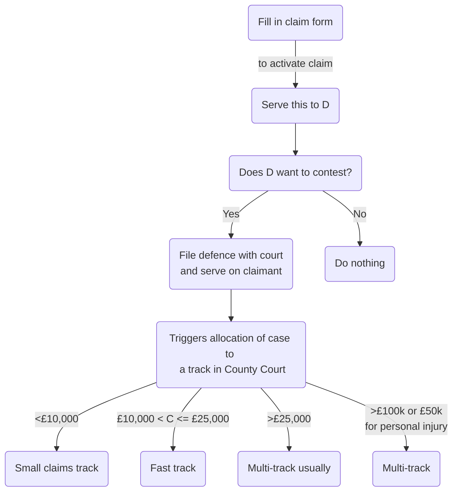

# mermaid

```mermaid
graph LR
id1(District judge) --> id2(Circuit judge)
```

```mermaid
graph LR

id1(Master/ district judge) --> id2(High Court judge)
```

```mermaid
graph TD

id1(Fill in claim form) -->|to activate claim| id2(Serve this to D)
id2 --> id3("Does D want to contest?")
id3 --> |Yes| id4.1(File defence with court <br/>and serve on claimant)
id3 -->|No| id4.2(Do nothing)
id4.1 --> id5(Triggers allocation of case to <br/> a track in County Court)
id5 --> |"<£10,000"| id6.1(Small claims track)
id5 --> |"£10,000 < C <= £25,000"| id6.2(Fast track)
id5 --> |">£25,000"| id6.3(Multi-track usually)
id5 --> |">£100k or £50k <br/>for personal injury"| id6.4(Multi-track)
```
