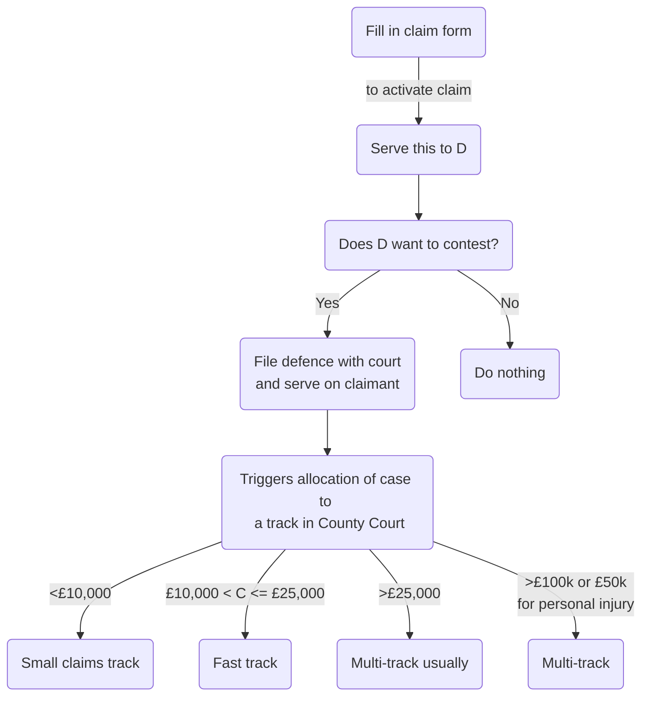

# Civil Litigation

## Woolf and Jackson Reforms

The nature of civil litigation dramatically changed on 26/04/99, when Civil Procedure Rules 1998 (CPR 1998) (SI 1998/3132) came into force. This is the court's attempt to implement the 'Woolf Reforms', set out in Lord Woolf's report, Access to Justice.

The aim was to simplify the legal system and cut costs. Further changes occurred in Apr 2013 following a review by Lord Justice Jackson.

### Overriding Objective

A civil justice system that was just, fair and easily understood, as well as being reasonable in cost and timescales. Woolf thought it necessary to transfer control of litigation from the parties to the court. The court then imposes strict timetables, backed by a system of sanctions.

> [!statute] r 1.1 CPR 1998
> (1) These Rules are a new procedural code with the overriding objective of enabling the court to deal with cases justly.
> 
> (2) Dealing with a case justly includes, so far as is practicable—
> 
> - (a) ensuring that the parties are on an equal footing;
> 
> - (b) saving expense;
> 
> - (c) dealing with the case in ways which are proportionate—
> 
> 	- (i) to the amount of money involved;
> 	
> 	- (ii) to the importance of the case;
> 	
> 	- (iii) to the complexity of the issues; and
> 	
> 	- (iv) to the financial position of each party;
> 
> - (d) ensuring that it is dealt with expeditiously and fairly; and
> 
> - (e) allotting to it an appropriate share of the court’s resources, while taking into account the need to allot resources to other cases.

### Unequal Representation

In [[Maltez v Lewis (1999) The Times, 4 May]], the court held that it was a fundamental right of citizens to be represented by counsel or solicitors of their own choice. But the court would intervene subtly to achieve a level playing field; e.g., by giving a small law firm more time, having a larger firm prepare trial bundles. So the court would ensure compliance with the overriding objective when representatives were unequal.

#### Conditionality of Procedures

In addition, note that in his Final Report, Lord Woolf suggested that:

> Where one of the parties is unable to afford a particular procedure, the court, if it decides that that procedure is to be followed, should be entitled to make its order conditional upon the other side meeting the difference in costs of the weaker party, whatever the outcome.

#### Applicability

The overriding objective must be kept in mind at all times when conducting civil litigation by the court:

> [!statute] r 1.2 CPR
> The court must seek to give effect to the overriding objective when it—
> - (a) exercises any power given to it by the Rules; or
> - (b) interprets any rule.

and by the parties:

> [!statute] r 1.3 CPR
> The parties are required to help the court to further the overriding objective. 

#### Parties' Duty

All other rules are designed to try to achieve the overriding objective. Observe that r 1.3 imposes a positive duty on solicitors and their clients to help the court further the overriding objective. This applies to dealings (including correspondence) between legal representatives as well as dealings with the court.

> [!question] Does this mean a party to litigation owes a duty to the other party?
> No - [[Woodward v Phoenix Healthcare Distribution Ltd [2018] EWHC 2152 (Ch)]]. HHJ Hodge: 
> > In my judgment, the culture introduced by the CPR does not require a solicitor who has in no way contributed to a mistake on the part of his opponent, or his opponent’s solicitors, to draw attention to that mistake. That is, in my judgment, not required by CPR 1.3; and it does not amount to ‘technical game playing'.

See also [[Hannigan v Hannigan [2000] 2 FCR 650]].

#### Professional Conduct

So each party is required to help the court further the overriding objective, but neither has an obligation nor duty to their opponent.

A solicitor is also bound by the standards of professional conduct set by the SRA – see [[Professional Conduct and Regulation 1#SRA]].

#### Judicial Case Management

Under CPR 1998, the court has a duty to manage cases and will determine the pace of litigation. Governed by Rule 1.4

> [!statute] r 1.4 CPR
> (1) The court must further the overriding objective by actively managing cases.
> 
> (2) Active case management includes —
> 
> - (a) encouraging the parties to co-operate with each other in the conduct of the proceedings;
> 
> - (b) identifying the issues at an early stage;
> 
> - (c) deciding promptly which issues need full investigation and trial and accordingly disposing summarily of the others;
> 
> - (d) deciding the order in which issues are to be resolved;
> 
> - (e) encouraging the parties to use an alternative dispute resolution(GL) procedure if the court considers that appropriate and facilitating the use of such procedure;
> 
> - (f) helping the parties to settle the whole or part of the case;
> 
> - (g) fixing timetables or otherwise controlling the progress of the case;
> 
> - (h) considering whether the likely benefits of taking a particular step justify the cost of taking it;
> 
> - (i) dealing with as many aspects of the case as it can on the same occasion;
> 
> - (j) dealing with the case without the parties needing to attend at court;
> 
> - (k) making use of technology; and
> 
> - (l) giving directions to ensure that the trial of a case proceeds quickly and efficiently.

#### Vulnerable Parties or Witnesses

Practice Direction 1A makes provision for how the court gives effect to the Overriding Objective in relation to vulnerable parties or witnesses.

- Try to identify vulnerability at earliest possible stage
- Court should consider ordering 'ground rules' before a vulnerable witness gives evidence.

## Rules

### Scope

The CPR 1998 apply to all proceedings in the County Court, High Court and the Civil Division

of the Court of Appeal, except:

- (a) insolvency proceedings;
- (b) family proceedings;
- (c) adoption proceedings;
- (d) proceedings before the Court of Protection;
- (e) non-contentious probate proceedings;
- (f) proceedings where the High Court acts as a Prize Court (e.g., Admiralty proceedings);
- (g) election petitions in the High Court.

### Practice Directions

These flesh out the rules and supplement them.

## Civil Claim Overview

5 stages of a civil claim:

![[5-stages-civil.png]]

### Stage 1: Pre-commencement

- Identify client objectives
	- Legal or otherwise
	- Compensation? Apology?
- Identify prospective parties
	- General rule: “all persons to be sued should be sued at the same time and in the same action” – [[Morris v Wentworth-Stanley [1999] QB 1004]]
	- Consider whether each D is worth suing
- Evidence
	- Never delay taking a statement.
- Costs
	- Client needs to know from outset
- Check limitation period and jurisdiction (is it England and Wales? Are there alternatives?)
- Dispute resolution
	- Ensure client weighs up many factors including costs, time and resources and effect on business.
- Pre-action protocols
	- Govern the steps parties should take before commencing a court case.
	- Failure to follow a protocol step or its spirit will incur a sanction if litigation is commenced.
	- Many protocols have been approved by MoJ, setting out how parties should behave.
	- Where none apply, should follow Practice Direction on Pre-action Conduct and Protocols.
- Alternative Dispute Resolution (ADR)
	- Parties and solicitors encouraged to enter into discussions/ negotiations before proceedings
	- By r 1.4(2)(e), active case management by the court will include encouraging them to use an ADR procedure the court considers appropriate.
- Standard letter before claim
	- If the claim is one to which an approved protocol applies (e.g., professional negligence),
		- Information to be included will be specified in the protocol
	- Else:
		- Enough information must be given so that the prospective D can commence investigations, or at least put a broad valuation on the claim.
		- See [Practice Direction - Pre-action Conduct and Protocols](https://www.justice.gov.uk/courts/procedure-rules/civil/rules/pd_pre-action_conduct).
	- Letter of response
		- Prospective D should:
			- Acknowledge safe receipt of the letter of claim
			- State whether or not liability is admitted
			- If not admitted, say why
			- If contributory negligence alleged, give details
			- Question of ADR should be addressed.

### Stage 2: Commencement of Claim

The client should appreciate:

- that the court will impose a strict timetable of steps that must be taken;
- that any unfavourable documents will have to be shown to the other side;
- that they might have to attest at trial;
- that if they want to stop litigation at any point, they will have to pay the opponent's costs (unless otherwise negotiated).

#### Mechanics

| Track | Details |
| ------------ | ---------------------------------------------------------------------------- |
| Small claims | Typically concern consumer disputes, parties not expected to be represented. |
| Fast track | Usually legal representation, court tightly controls costs and types of evidence. Single joint expert should be used by parties where necessary, and trial must be conducted within one day. |

#### Stage 3: Interim Matters

Careful court management of a case:

- Directions given to the parties as to the steps that must be taken to prepare for trial.
- Strict timetable impose as to when each step should be taken.
	- In small claims and fast tracks, these directions can be given without any court hearings
	- For multi-track, parties usually meet with a judge at case management conference.

The most common case management directions

are for:

- (a) standard disclosure (i.e., the parties list the documents in their possession that they intend to rely on, or which are adverse to their case, or support an opponent’s case ; and
- (b) the exchange of evidence before trial that the parties intend to rely on (e.g., experts’ reports and statements, known as ‘witness statements’, of non-expert witnesses.

Parties may apply to the court for any specific orders that may be required.

#### Stage 4: Trial

- Small claims is v informal and at the direction of the judge
- Fast track and multi-track: formal rules of evidence.
- Judge decides on costs
	- General rule is that loser pays winner's costs
	- If parties cannot agree on amount of costs, determined post-trial by a costs judge.

#### Stage 5: Post-trial

 - A party may decide to appeal all or part of the trial judge's decision.
 - A party awarded costs/ damages will expect to be paid by a date set by the court.
	 - If not paid, apply to court to enforce the judgment.
	 - Often involves court officials going to premises and taking belongings to be sold at public auction.

## Case Analysis

### Causes of Action

> [!defn] Cause of action
> A cause of action is the legal basis of a claim. e.g., breach of contract, negligence, negligenct misstatement, misrepresentation, nuisance... 

> [!example] Breach of contract
> To succeed in a claim for breach of contract, need to establish:
> - (a) contract (its formation – parties, date, written or oral, subject matter (goods, goods and
> - services/materials and work, services), consideration);
> - (b) terms relied on (express and/or implied);
> - (c) breach of those terms;
> - (d) factual consequences of the breach of those terms;
> - (e) damage and loss.

Often, solicitors record their analysis in a table. Continually review issues in dispute and how they will be proved.

> [!important]
> Key case analysis points are:
> 1. Viability
> 2. Liability
> 3. Quantum
