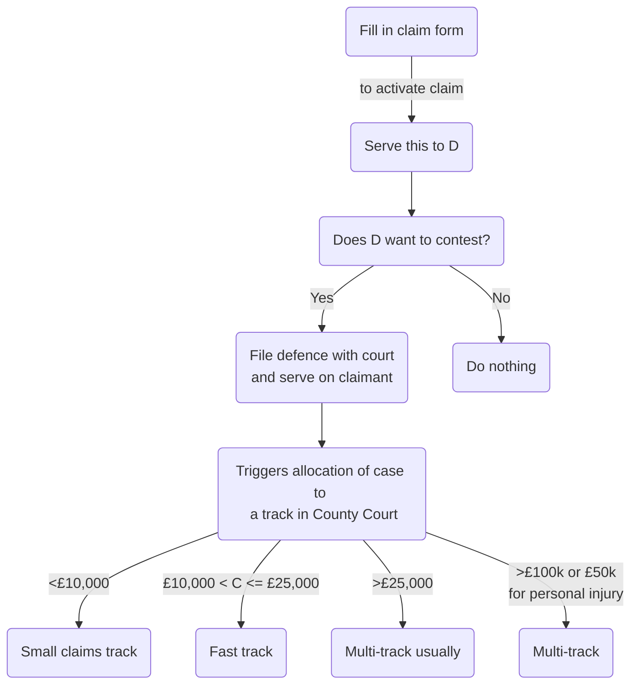

```toc
```

# Civil Litigation

## Woolf and Jackson Reforms

The nature of civil litigation dramatically changed on 26/04/99, when Civil Procedure Rules 1998 (CPR 1998) (SI 1998/3132) came into force. This is the court's attempt to implement the 'Woolf Reforms', set out in Lord Woolf's report, Access to Justice.

The aim was to simplify the legal system and cut costs. Further changes occurred in Apr 2013 following a review by Lord Justice Jackson.

### Overriding Objective

A civil justice system that was just, fair and easily understood, as well as being reasonable in cost and timescales. Woolf thought it necessary to transfer control of litigation from the parties to the court. The court then imposes strict timetables, backed by a system of sanctions.

```ad-statute
title: r 1.1 CPR 1998
(1) These Rules are a new procedural code with the overriding objective of enabling the court to deal with cases justly.

(2) Dealing with a case justly includes, so far as is practicable—

- (a) ensuring that the parties are on an equal footing;

- (b) saving expense;

- (c) dealing with the case in ways which are proportionate—

	- (i) to the amount of money involved;
	
	- (ii) to the importance of the case;
	
	- (iii) to the complexity of the issues; and
	
	- (iv) to the financial position of each party;

- (d) ensuring that it is dealt with expeditiously and fairly; and

- (e) allotting to it an appropriate share of the court’s resources, while taking into account the need to allot resources to other cases.
```

### Unequal Representation

In [[Maltez v Lewis (1999) The Times, 4 May]], the court held that it was a fundamental right of citizens to be represented by counsel or solicitors of their own choice. But the court would intervene subtly to achieve a level playing field; e.g., by giving a small law firm more time, having a larger firm prepare trial bundles. So the court would ensure compliance with the overriding objective when representatives were unequal.

#### Conditionality of Procedures

In addition, note that in his Final Report, Lord Woolf suggested that:

> Where one of the parties is unable to afford a particular procedure, the court, if it decides that that procedure is to be followed, should be entitled to make its order conditional upon the other side meeting the difference in costs of the weaker party, whatever the outcome.

#### Applicability

The overriding objective must be kept in mind at all times when conducting civil litigation by the court:

```ad-statute
title: r 1.2 CPR
The court must seek to give effect to the overriding objective when it—
- (a) exercises any power given to it by the Rules; or
- (b) interprets any rule.
```

and by the parties:

```ad-statute
title: r 1.3 CPR
The parties are required to help the court to further the overriding objective. 
```

#### Parties' Duty

All other rules are designed to try to achieve the overriding objective. Observe that r 1.3 imposes a positive duty on solicitors and their clients to help the court further the overriding objective. This applies to dealings (including correspondence) between legal representatives as well as dealings with the court.

```ad-question
title: Does this mean a party to litigation owes a duty to the other party?
No - [[Woodward v Phoenix Healthcare Distribution Ltd [2018] EWHC 2152 (Ch)]]. HHJ Hodge: 
> In my judgment, the culture introduced by the CPR does not require a solicitor who has in no way contributed to a mistake on the part of his opponent, or his opponent’s solicitors, to draw attention to that mistake. That is, in my judgment, not required by CPR 1.3; and it does not amount to ‘technical game playing'.
```

See also [[Hannigan v Hannigan [2000] 2 FCR 650]].

#### Professional Conduct

So each party is required to help the court further the overriding objective, but neither has an obligation nor duty to their opponent.

A solicitor is also bound by the standards of professional conduct set by the SRA – see [[Professional Conduct and Regulation 1#SRA]].

#### Judicial Case Management

Under CPR 1998, the court has a duty to manage cases and will determine the pace of litigation. Governed by Rule 1.4

```ad-statute
title: r 1.4 CPR
(1) The court must further the overriding objective by actively managing cases.

(2) Active case management includes —

- (a) encouraging the parties to co-operate with each other in the conduct of the proceedings;

- (b) identifying the issues at an early stage;

- (c) deciding promptly which issues need full investigation and trial and accordingly disposing summarily of the others;

- (d) deciding the order in which issues are to be resolved;

- (e) encouraging the parties to use an alternative dispute resolution(GL) procedure if the court considers that appropriate and facilitating the use of such procedure;

- (f) helping the parties to settle the whole or part of the case;

- (g) fixing timetables or otherwise controlling the progress of the case;

- (h) considering whether the likely benefits of taking a particular step justify the cost of taking it;

- (i) dealing with as many aspects of the case as it can on the same occasion;

- (j) dealing with the case without the parties needing to attend at court;

- (k) making use of technology; and

- (l) giving directions to ensure that the trial of a case proceeds quickly and efficiently.
```

#### Vulnerable Parties or Witnesses

Practice Direction 1A makes provision for how the court gives effect to the Overriding Objective in relation to vulnerable parties or witnesses.

- Try to identify vulnerability at earliest possible stage
- Court should consider ordering 'ground rules' before a vulnerable witness gives evidence.

## Rules

### Scope

The CPR 1998 apply to all proceedings in the County Court, High Court and the Civil Division of the Court of Appeal, except:

- (a) insolvency proceedings;
- (b) family proceedings;
- (c) adoption proceedings;
- (d) proceedings before the Court of Protection;
- (e) non-contentious probate proceedings;
- (f) proceedings where the High Court acts as a Prize Court (e.g., Admiralty proceedings);
- (g) election petitions in the High Court.

### Practice Directions

These flesh out the rules and supplement them.

## Civil Claim Overview

5 stages of a civil claim:

![[5-stages-civil.png]]

### Stage 1: Pre-commencement

- Identify client objectives
	- Legal or otherwise
	- Compensation? Apology?
- Identify prospective parties
	- General rule: “all persons to be sued should be sued at the same time and in the same action” – [[Morris v Wentworth-Stanley [1999] QB 1004]]
	- Consider whether each D is worth suing
- Evidence
	- Never delay taking a statement.
- Costs
	- Client needs to know from outset
- Check limitation period and jurisdiction (is it England and Wales? Are there alternatives?)
- Dispute resolution
	- Ensure client weighs up many factors including costs, time and resources and effect on business.
- Pre-action protocols
	- Govern the steps parties should take before commencing a court case.
	- Failure to follow a protocol step or its spirit will incur a sanction if litigation is commenced.
	- Many protocols have been approved by MoJ, setting out how parties should behave.
	- Where none apply, should follow Practice Direction on Pre-action Conduct and Protocols.
- Alternative Dispute Resolution (ADR)
	- Parties and solicitors encouraged to enter into discussions/ negotiations before proceedings
	- By r 1.4(2)(e), active case management by the court will include encouraging them to use an ADR procedure the court considers appropriate.
- Standard letter before claim
	- If the claim is one to which an approved protocol applies (e.g., professional negligence),
		- Information to be included will be specified in the protocol
	- Else:
		- Enough information must be given so that the prospective D can commence investigations, or at least put a broad valuation on the claim.
		- See [Practice Direction - Pre-action Conduct and Protocols](https://www.justice.gov.uk/courts/procedure-rules/civil/rules/pd_pre-action_conduct).
	- Letter of response
		- Prospective D should:
			- Acknowledge safe receipt of the letter of claim
			- State whether or not liability is admitted
			- If not admitted, say why
			- If contributory negligence alleged, give details
			- Question of ADR should be addressed.

### Stage 2: Commencement of Claim

The client should appreciate:

- that the court will impose a strict timetable of steps that must be taken;
- that any unfavourable documents will have to be shown to the other side;
- that they might have to attest at trial;
- that if they want to stop litigation at any point, they will have to pay the opponent's costs (unless otherwise negotiated).

#### Mechanics



| Track | Details |
| ------------ | ---------------------------------------------------------------------------- |
| Small claims | Typically concern consumer disputes, parties not expected to be represented. |
| Fast track | Usually legal representation, court tightly controls costs and types of evidence. Single joint expert should be used by parties where necessary, and trial must be conducted within one day. |

#### Stage 3: Interim Matters

Careful court management of a case:

- Directions given to the parties as to the steps that must be taken to prepare for trial.
- Strict timetable impose as to when each step should be taken.
	- In small claims and fast tracks, these directions can be given without any court hearings
	- For multi-track, parties usually meet with a judge at case management conference.

The most common case management directions

are for:

- (a) standard disclosure (i.e., the parties list the documents in their possession that they intend to rely on, or which are adverse to their case, or support an opponent’s case ; and
- (b) the exchange of evidence before trial that the parties intend to rely on (e.g., experts’ reports and statements, known as ‘witness statements’, of non-expert witnesses.

Parties may apply to the court for any specific orders that may be required.

#### Stage 4: Trial

- Small claims is v informal and at the direction of the judge
- Fast track and multi-track: formal rules of evidence.
- Judge decides on costs
	- General rule is that loser pays winner's costs
	- If parties cannot agree on amount of costs, determined post-trial by a costs judge.

#### Stage 5: Post-trial

 - A party may decide to appeal all or part of the trial judge's decision.
 - A party awarded costs/ damages will expect to be paid by a date set by the court.
	 - If not paid, apply to court to enforce the judgment.
	 - Often involves court officials going to premises and taking belongings to be sold at public auction.

## Case Analysis

### Causes of Action

```ad-defn
title: Cause of action
A cause of action is the legal basis of a claim. e.g., breach of contract, negligence, negligenct misstatement, misrepresentation, nuisance... 
```

```ad-example
title: Breach of contract
To succeed in a claim for breach of contract, need to establish:
- (a) contract (its formation – parties, date, written or oral, subject matter (goods, goods and
- services/materials and work, services), consideration);
- (b) terms relied on (express and/or implied);
- (c) breach of those terms;
- (d) factual consequences of the breach of those terms;
- (e) damage and loss.
```

Often, solicitors record their analysis in a table. Continually review issues in dispute and how they will be proved.

```ad-important
Key case analysis points are:
1. Viability
2. Liability
3. Quantum
```

# First Interview Considerations

## Purpose

Solicitor needs to:

- Identify client objectives
- Explain issues and options
- Agree next steps

```ad-defn
The scope of the work to be done for the client is formally known as the solicitor's "retainer".  
```

## Professional Conduct

### Duty of Confidentiality

```ad-statute
title: Para 6.3 Code for Solicitors
A solicitor is under a duty to maintain the confidentiality of their client's affairs except the client's prior authority is obtained to disclose particular information, or if the solicitor is required or permitted by law to do so. 
```

If a solicitor holds confidential information on (former) client A, they should not risk breaching confidentiality by acting, or continuing to act, for another client (B) on a matter where:

- that information might reasonably be expected to be material and
- client B has an interest adverse to client A.

See [[Professional Conduct and Regulation 1#Ch 12 LF Confidentiality]].

### Conflict of Interest

A solicitor should not act for two or more clients where this would cause a conflict of interest.

```ad-defn
A conflict of interests exists if the
solicitor owes separate duties to act in the best interests of two or more clients in relation to the same or related matters, and those duties conflict or there is a significant risk that those duties may conflict.
```

See [[Professional Conduct and Regulation 1#Ch 13 LF Conflicts of Interest]].

### Money Laundering

See [[Professional Conduct and Regulation 2#Ch 15 Money Laundering]].

```ad-question
title: A solicitor should ask: 
Who is my client and am I authorised to act?
```

### Officer of Court

The solicitor has an overriding duty not to mislead the court (para 1.4 Code for Solicitors). The solicitor must disclose all relevant legal authorities to the court, even if these are not favourable to their case.

A solicitor must be mindful of their core duties and abide by SRA principles.

## Funding

Discuss costs with the clients, including advising the client of different types of funding available.

The solicitor should explain potential costs given potential steps of litigation and agree on a ceiling figure and review dates. It is unusual for there to be a fixed fee – this can be the case for taking some specific step (e.g., attending a hearing).

If a solicitor fixes their fee too low, tough. Still obliged to complete work to the ordinary standard of care ([[Inventors Friend Ltd v Leathes Prior (a firm) [2011] EWHC 711]]).

If you don't give clients regular cost information, can be bound by original costs estimate ([[Reynolds v Stone Rowe Brewer [2008] EWHC 497]]).

### Types of Costs

The solicitor should explain the distinction between solicitor and client costs, and the costs that may be awarded between parties in litigation.

```ad-statute
title: r 44.2(2)(a) CPR 1998
As a general rule the unsuccessful party in litigation will be ordered to pay the costs of the successful party.
```

If a client wins the case, they will still have to pay their own solicitor's costs, and then they will receive their costs from the opponent. But it is normal for the costs awarded to be less than the actual legal cost paid.

Even if successful, the court has the power to reduce costs to reflect any unreasonable conduct on the part of the successful party ([[Benyatov v Credit Suisse Securities (Europe) Ltd [2022] WL 00509179]]).

### Contingency Fee Arrangements

```ad-defn
title: Contingency fee arrangement
The client only pays a fee if they are successful.
```

These used to be completely illegal – solicitors could only charge clients on a time basis. Currently, only two types are legal:

- Conditional fee arrangement
- Damages-based agreement.

### Conditional Fee Arrangements

```ad-defn
title: Conditional fee arrangement (CFA)
‘An agreement with a person providing advocacy or litigation services which provides for his fees and expenses, or any part of them, to be payable only in specified circumstances’ - s 58(2)(a) of the Courts and Legal Services Act 1990 (CLSA 1990)
```

(Circumstances are winning the case).

Note they can be 'no win, no fee', but also 'no win, less fee'. Any fee payable is based on the solicitor's usual hourly charging rates, up to a maximum of 100% extra. So maximum you can charge is 200% of normal fee.  

A CFA is enforceable only if it meets the requirements of ss 58 and 58A of the Courts and Legal Services Act 1990. These provide that a CFA:

- (a) may be entered into in relation to any civil litigation matter, except family proceedings;
- (b) must be in writing; and
- (c) must state the percentage by which the amount of the fee that would be payable if it were not a CFA is to be increased (the success fee).

Where it is agreed that the solicitor should receive higher than normal payment if the case is won, the success fee cannot exceed 100% of the solicitor’s normal charges. This limit is set by the CFA Order 2013 (SI 2013/689), reg 3 (although note that different provisions apply to personal injury claims).

The solicitor should explain the circumstances in which the client may be liable for their own legal costs (and when the solicitor would seek payment) and their right to an assessment of those costs. Also check if the client has before-the-event legal insurance.

The CFA is usually worded, so the solicitors' firm has a right to take enforcement action in the client's name.

#### Drafting CFA

Draft carefully, including a clear definition of 'win'. Does there need to be a threshold level of damages obtained?

#### Success Fee

If the opponent is ordered to pay costs, these cannot include the success fee, which will be payable by the client. Make this crystal.

The solicitor is taking a risk here, so they should perform a thorough risk assessment (likely damages, chances of client succeeding, likely time taken etc.). This might take time and research, and the success fee should not be set arbitrarily.

```ad-question
title: Can you accept a client suggested success fee which is exorbitant?
No:
- principle 2 - upholding public trust and confidence, 
- principle 4 - acting with honesty, 
- principle 5 - acting with integrity, 
- principle 6 - acting in best interests of client,
- para 1.2 - solicitor must not abuse their position by taking unfair advantage of the client, 
- para 8.7 - ensuring clients receive the best possible information about how their matter will be priced.
```

#### Liability for Costs

If a CFA client loses their case, they will not usually have to pay their own solicitor's fees, but will be liable for their opponent's costs including disbursements. They will also have to fund disbursements such as barrister and expert witness fees.

Can mitigate by purchasing after-the-event insurance (AEI). The solicitor should discuss with the client whether this is appropriate.

#### Damages-based Agreement

Key statute:

```ad-statute
title: s 58AA(3)(a) CLSA 1990
An agreement between a person providing advocacy services, litigation services or claims management services and the recipient of those services which provides that—
- (i) the recipient is to make a payment to the person providing the services if the recipient obtains a specified financial benefit in connection with the matter in relation to which the services are provided, and
- (ii) the amount of that payment is to be determined by reference to the amount of the financial benefit obtained.
```

It means that if the client receives damages, the solicitor's fee is an agreed percentage of those damages.

A DBA is only enforceable if it meets the requirements of s 58AA(4) of the CLSA 1990. These are that the agreement:

- (a) must be in writing;
- (b) must not provide for a payment above a prescribed amount or for a payment above an amount calculated in a prescribed manner;
- (c) must comply with such other requirements as to its terms and conditions as are prescribed; and
- (d) must be made only after the person providing services under the agreement has provided prescribed information.

As per Damages-Based Agreements Regulations 2013 (SI 2013/609):

- the DBA must not provide for a payment above an amount which, including VAT, is equal to 50% of the sums ultimately recovered by the client.
- This cap is inclusive of counsel fees, but not disbursements.
- Cap does not apply to any appeal proceedings.

Regulation 4 provides that the client cannot be required to pay an amount other than the agreed fee net of the following:

- (i) any costs (including fixed costs) and counsel’s fees, that have been paid or are payable by another party to the proceedings by agreement or order; and
- (ii) any expenses incurred by the solicitor after accounting for any amount which has been paid or is payable by another party to the proceedings by agreement or order. Expenses in this context would include disbursements such as experts’ fees and court fees.

The terms and conditions of a DBA must specify:

- (i) the claim or proceedings or parts of them to which the agreement relates;
- (ii) the circumstances in which the representative’s payment, expenses and costs, or part of them, are payable; and
- (iii) the reason for setting the amount of the payment at the level agreed.

```ad-question
title: Is a DBA valid if it contains a clause which provides that the client must pay the solicitors’ normal fees and disbursements if they terminate the retainer prematurely?
Yes, see [[Zuberi v Lexlaw Ltd [2021] EWCA Civ 16]]. The case is also authority for the use of so-called ‘hybrid DBAs’. For example, a law firm may receive concurrent funding via both a DBA and some other form of retainer; this might consist of the DBA in the event of the claim’s success and discounted hourly rate fees in the event of the claim’s failure. Alternatively, a DBA might comprise one or other of the methods of funding for different stages of the legal proceedings.
```

```ad-warning
Slightly different provisions for the DBA for personal injury claims/ employment matters.
```

#### Insurance

The solicitor should check if the client has before-the-event (BEI) insurance, which might fund the litigation. This is commonly part of household/ motor insurance.

Discuss with the client whether litigation is covered on existing policy, or if AEI should be purchased. Often a very good option. A solicitor who fails to discuss the possibility of such insurance may be negligent and in breach of professional insurance.

#### Third Party Funding

Trade union or organisational funding available? Historically, commercial funding of litigation has been unlawful, but in recent years has become accepted.

#### Public Funding

There are *very* limited circumstances in which public funding (legal aid) is available for civil litigation. But this usually doesn't apply (budget cuts cri).

- Administered by the Legal Aid Agency (LAA).
- Usually not available for cases that could be financed by a CFA.
- Claims in negligence for personal injury, death or damage to property are excluded, as are claims brought or defended by sole traders.
- Only available if financially eligible and a cost-benefit analysis will be carried out.
- A contribution from income could be required towards costs. This is payable monthly for as long as the claim is funded by the LAA.

In [[David Truex, Solicitor (a firm) v Kitchin [2007] EWCA Civ 618]], the Court of Appeal held that a solicitor must from the outset of a case consider whether a client might be eligible for legal aid.

##### Statutory Charge

Where a publicly-funded client recovers money from proceedings, they may have to pay some or all of their legal costs to the LAA out of the money recovered. Known as the statutory charge, and will apply to the extent costs are not recovered from the opponent.

The same principle applies to property as well a money. A solicitor must ensure that the client understands.

## Case Analysis

Recall the need to assess viability, liability, and quantum.

### Liability

- What is the cause of action?
- Is there more than one?
- Establish legal elements for the claim to succeed.

### Limitation

A solicitor must ascertain when the limitation period began and when it will expire. Continually review this.

```ad-question
title: What if claim forms are sent to the court very close to the expiration date?
Per [[St Helens Metropolitan BC v Barnes [2006] EWCA Civ 1372]], 
> Proceedings are started when the court issues a claim form at the request of the claimant (see rule 7.2) but where the claim form as issued was received in the court office on a date earlier than the date on which it was issued by the court, the claim is ‘brought’ for the purposes of the Limitation Act 1980 and
> any other relevant statute on that earlier date.
```

The Limitation Act 1980 (LA 1980) (as amended) prescribes fixed periods of time for issuing

various types of proceedings. This is important to a client because if this period of time elapses without proceedings being issued, the case becomes ‘statute-barred’. The claimant can still commence their claim, but the defendant will have an impregnable defence. If the defendant wishes to rely on this, it must be stated specifically in their defence.

### Contractual/ Tortious Claims

- The basic rule is that the claimant has six years from the date when the cause of action accrued to commence their proceedings.
	- In contract, the cause of action accrues as soon as the breach of contract occurs.
	- With an anticipatory breach of contract, the cause of action accrues when the intention not to perform the contract is made clear, and not at the later date when performance was due to occur ([[Hochester v de la Tour (1853) 2 E & B 678]])
- In tort, the cause of action accrues when the tort is committed.
	- In negligence, the cause of action accrues only when some damage occurs (this may be a later date than the breach of duty itself – think misrepresentation claims)
- The basic rule is modified for certain claims such as personal injury.

### Latent Damage

In a non-personal injury claim based on negligence, where the damage is latent at the date when the cause of action accrued, s 14A of the LA 1980 provides that the limitation period expires either:

- (a) six years from the date on which the cause of action accrued; or
- (b) three years from the date of knowledge of certain material facts about the damage, if this period expires after the period mentioned in (a).

Additionally, there is a long-stop limitation period of 15 years from the date of the alleged breach of duty (LA 1980, s 14B). It may bar a cause of action at a date earlier than the claimant's knowledge, or even before a cause of action has accrued.

### Person Under Disability

```ad-defn
Either a child (under 18) or a protected party (a person of unsound mind under the meaning of the Mental Capacity Act 2005 who is incapable of managing and administering their property and affairs).
```

When the claimant is a person under disability when a right of action accrues, the limitation

period does not begin to run until the claimant ceases to be under that disability.

### Contractual Limitation

Check if any limitation period is specified in the contract.

| Type of claim | Statutory limitation period |
| :--- | :--- |
| Contract (excluding personal injury) | 6 years (LA 1980,s 5) |
| Tort (excluding personal injury and latent damage) | 6 years (LA 1980, s 2) |
| Latent damage | 6 years or 3 years from date of knowledge (LA 1980,s 14A) |

### Remedies

Different remedies available – remember contract law. The most common one is damages.

```ad-defn
title: Quantum
How much D will pay to V if liability is proved (or vice versa if not).
```

### Damages

Rule as to quantum depends on the type of claim being pursued.

### Contract

A claim for damages arises when one party to the contract has failed to perform an obligation under the contract. Purpose: to put the injured party in the position they would have been in if the contract had been performed properly.

Damages must not be too remote from the breach to be recoverable.

### Tort

Injury, loss or damage is caused to the claimant or their property. Aim is to put V, as far as possible, in the position they would have been in if the damage had not occurred.

### Duty to Mitigate

Remember claimants have a duty to try to mitigate their losses. In [[Frost v Knight (1872) LR 7 Ex 111]]

the court observed that this duty means looking at what the claimant

> ‘has done, or has had the means of doing, and, as a prudent man, ought in reason to have done, whereby his loss has been, or would have been, diminished’.

### Debt

A debt action is a particular type of contract claim. The claimant is claiming a sum which D promised to pay under the contract. Note that in debt actions, V has no duty to mitigate their loss.

```ad-example
If the buyer takes delivery for goods but fails to pay, the action is for debt.
```

### Quantum

Think about the evidence you have to prove the loss. Figures or estimates?

## Viability and Burden of Proof

### Viability

Viability of a claim depends on a number of questions.

```ad-note
title: Considerations
- Who is the prospective defendant?
- Is there more than one possible defendant?
- Where is the defendant?
- Is the defendant solvent?
- Where are the defendant’s assets?
- What are those assets worth?
- Will the defendant be able to pay any judgment?
- What can the client afford to pay?
- Does the client have any suitable BEI?
- Is the case suitable for a CFA or DBA and/or AEI cover?
- Does the client qualify for public funding or require third-party funding?
- How much time and resources will the client have to commit to investigate and deal
with the case?
- Does a cost–benefit analysis suggest the desirability of a quicker and cheaper solution
than litigation can offer?
```

### Defendants and Status

The case analysis must identify against whom each cause of action lies. Recall the general rule that all persons to be sued should be sued at the same time and in the same claim.

Must ensure that each of the prospective D's are sued in their correct capacity (personally/ as a partnership/ as a director etc.).

#### D's Solvency

… check D is solvent. Do this through a company search/ bankruptcy search, Facebook stalking etc.

#### Whereabouts

D must be traceable. An inquiry agent may be helpful.

#### The Claim

Involves balancing the merits of the claim against the overall cost of pursuing it and the prospects of a successful outcome. Tell the client about the overriding objective and r 1.3 that parties must help the court to further it.

#### Alternative Remedies

Advise the client on, e.g., alternative dispute resolution.

#### Burden of Proof

- Legal burden
	- The party asserting a fact must prove it unless admitted by their component.
		- e.g., claimant alleging breach of contract must prove a contract existed, that D broke terms, and loss suffered.
		- D must prove any allegation of failure to mitigate loss or contributory negligence.
- Balance of probabilities
	- Standard of proof.

## Interest

### Specified and Unspecified Claims

A claim for a fixed amount of money is a specified amount. A specified claim is in the nature of a debt, i.e., a fixed amount of money due and payable under and by virtue of a contract.

Here, the amount known will be known and fixed, or mathematically determinable.

If the court will have to conduct an investigation to decide on the amount of money payable, the claim is best seen as being for an unspecified amount, even if the claimant puts some figures forward for the amount claimed.

If mixed, classified as unspecified.

### Entitlement to Interest

Pre-action, a prospective claimant can demand interest on a claim only if entitled to it under

any contractual provision (including any provision implied by the [Late Payments of Commercial Debts (Interest) Act 1998](https://www.legislation.gov.uk/ukpga/1998/20/contents)).

Where the remedy sought by the claimant is damages or the repayment of a debt, the court may award interest on the sum outstanding.

#### Breach of Contract and Debt Claims

There are 3 alternative claims to interest:

1. The contract may specify a rate of interest payable on any outstanding sum – the rate negotiated by the parties.
2. May be possible to claim under the Late Payment of Commercial Debts (Interest) Act 1998.
3. In all other cases, the court has a discretion to award interest either under s 35A of the Senior Courts Act 1981 (SCA 1981) in respect of High Court cases, or under s 69 of the County Courts Act 1984 (CCA 1984) in respect of County Court cases. The current rate of interest payable under either statute is 8% pa in non-commercial cases and, generally, 1% or 2% pa over base rate in commercial cases.

In a debt claim, interest must be claimed precisely. Give a lump sum for accrued interest from breach of contract until date of issue of proceedings, and a daily rate thereafter. In a debt claim, where s 35A of the SCA 1981 or s 69 of the CCA 1984 applies, the convention is to claim interest from and including the day after the last day payment was due.

#### Late Payment of Commercial Debts (Interest) Act 1998

This Act (as amended by the Late Payment of Commercial Debt Regulations 2013 (SI 2013/395) and the Late Payment of Commercial Debts (Amendment) Regulations 2015 (SI 2015/ 1336)) gives a statutory right to interest on commercial debts that are paid late if the contract itself does not provide for interest in the event of late payment.

##### Scope

The term ‘commercial debt’ includes debts arising from the supply of goods and services. As the Act is only concerned with commercial debt, it does not apply to unspecified claims or a specified amount owed by a consumer.

##### Details

Interest under the Act can be claimed at a rate of 8% pa above the Bank of England’s reference  
rate on the date the debt became due for payment. The reference rate is the base rate applicable on 31 December and 30 June each year and will apply for the following six months.

The interest accrues from the expiry of any period of credit under the contract. If the contract does not provide for any such period, interest can be claimed from 30 days after the latest of:

- (a) delivery of the bill;
- (b) delivery of the goods;
- (c) performance of the service.

The parties may agree to extend the period from 30 days up to a maximum of 60 days. Any further extension must not be grossly unfair to the supplier.

In addition to the debt and interest, the Act also provides for payment of a fixed sum of between £40 and £100 compensation for late payment, the amount varying according to the size of the debt. In addition, the supplier may also claim as compensation any ‘reasonable’ costs of recovering

the debt that exceed the fixed sum.

##### Tort

The court has a general discretion to award interest on damages in any negligence claim. This power is derived from SCA 1981, s 35A in respect of High Court claims, and from CCA 1984, s 69 in respect of County Court claims. Generally speaking, if interest has been claimed properly, the court will normally exercise its discretion to award interest for such period as it considers appropriate.

##### Specifics

Though theoretically damages can be awarded from when the cause of action first arose, in practice it is normally made from when the loss is sustained. See [[Kaines (UK) Ltd v Osterreichische [1993] 2 Lloyd’s Rep 1]].

Awards of interest are compensatory in measure. Judges are a bit fluffy about them and the circumstances of the claimant; not simply the cost of finance at the time.

In [[Tate & Lyle Food and Distribution Ltd v Greater London Council [1982] 1 WLR 149]], Forbes J said:

> One looks, therefore, not at the profit which the defendant wrongly made out of the money he withheld – this would indeed involve a scrutiny of the defendant’s financial position – but at the cost to the [claimant] of being deprived of the money which he should have had. I feel satisfied that in commercial cases, the interest is intended to reflect the rate at which the [claimant] would have had to borrow money to supply the place of that which was withheld.

```ad-defn
title: Commercial case
Generally, one where all parties are in business and the claim is based on the transaction of trade and commerce. 
```

In non-commercial cases, the courts award interest at their discretion under s 35A of the SCA 1981 or s 69 of the CCA 1984 at 8% pa. Traditionally, in commercial cases, the award of interest has been at 1% or 2% over base rate. However, in J[[aura v Ahmed [2002] EWCA Civ 210]], the Court of Appeal held that it is permissible for a judge to depart from this conventional rate if it is necessary to reflect the higher rate at which the claimant had to borrow, e.g., if the claimant was a small businessperson who could only borrow from a bank at 3% pa over base rate.

Generally, a person of the claimant's general position will be considered, but no regard will be given to the claimant's particular attributes.

Generally, simple interest rather than compound interest is awarded (unless there is a contractual term providing for this), or in exceptional cases (see [[Sempra Metals Ltd v Inland Revenue Commissioners [2007] UKHL 34]]).

 ![[Interest-flowchart.png]]

Key questions:

- Is the claim based on a written contract providing for interest?
- Is the claim for the payment of a commercial debt?

Remember D might be in a position to make a claim that includes interest.

## Foreign Element

In international cases, consider:

- Which countries can the claim be brought in?
- English courts can hear any proceedings if the claim form was served on D whilst they were present in England and Wales.
- D could object to the proceedings continuing in England, on the basis that a court abroad would be the most appropriate forum.

## Litigation Alternatives

### Arbitration

```ad-defn
title: Arbitration
Adjudication operating outside the normal court process, by which a third party reaches a decision binding on the parties in dispute. 
```

Many business contracts specify using arbitration rather than litigation.

Advantages:

- Speed
- Less formal
- Private
- Often more practical than the solutions a court has power to order
- Decisions binding on parties.

```ad-important
The winning party to an arbitration can apply to the High Court for permission to enforce the arbitration award as if it were a court judgment (Arbitration Act 1996, s 66).
```

Disadvantages:

- Certain remedies like injunctions not available
- Can be less in depth than a court investigation
- Not always cheaper.

### Alternative Dispute Resolution

Independent third parties helps parties reach a solution. The third party will often suggest a solution to the parties but not impose one (known as ‘non-determinative ADR’). But sometimes the third party will impose a solution (known as ‘determinative ADR’). The decision to use ADR is voluntary; the parties choose the process and either of them can withdraw at any time before a settlement is reached.

```ad-example
title: ADR examples
- mediation
- expert appraisal
- expert determination
```

Under the CPR 1998, the courts actively encourage parties to use some form of ADR.

```ad-question
title: Can a court order that parties must use an ADR method?

No, held the Court of Appeal in [[Halsey v Milton Keynes General NHS Trust [2004] EWCA Civ 576]]. 
```

Distinguish this from Early Neutral Evaluation, which the court can order parties to engage with since it is part of the court process (unlike mediation etc.).

### Trade Schemes

Some professional bodies and trade associations have their own dispute resolution schemes

### Negotiating Settlements

Negotiations should be commenced as soon as possible. Once reasonable attempts at settling have been exhausted, there may be no option but to go to court.

### Insurance

Many D's are insured. The existence of insurers does not affect the conduct of proceedings, though the majority of policies require the insured to notify the insurer of any potential claim.

$\exists$ circumstances where a judgement against an insured defendant can be enforced against the insurers. Notice of the proceedings must be served on the insurers either before or within seven days of commencing proceedings to invoke these provisions.

### Motor Insurance Bureau (MIB)

Two schemes allowing the victims of uninsured/ untraced drivers to recover losses. It is set up by insurance companies and financed by them.

### Criminal Injuries Compensation Authority (CICA)

Body set up by the Government to provide the victims of criminal acts with ex gratia compensation for any personal injuries sustained as a result of those acts.

### Criminal Compensation Order

Criminal courts have powers to order compensation in respect of any personal injury, loss or damage resulting from a criminal offence when imposing a sentence at the end of criminal proceedings.

# Early Action

- After the initial interview, a number of practical preliminary steps should be taken by the solicitor.
- Bear in mind CPR 1998 pre-action protocols if appropriate.
- If not, comply with the 'spirit' of the protocols and the Practice Direction on the Pre-action Conduct and Protocols.

## Writing to the Client

Advise client in writing. By now you should have identified the cause of action, undertaken any necessary legal research and assessed the available evidence. If a proof of evidence has been taken from the client, this should be sent to the client for approval and signature. If there are any ‘gaps’ in the case – factual issues in respect of which there is no evidence or weak evidence – you must explain this to the client and outline the options.

Either include details of funding and costs, or put these in a separate letter. Cost advice should include:

- (a) advising the client of the basis and terms of the firm’s charges;
- (b) advising the client of likely payments to third parties (eg court fees, barristers’ fees, experts’ fees);
- (c) setting out how the client has agreed to pay; and
- (d) advising the client of their potential liability for another party’s costs.

## Interviewing Witnesses

### Proof of Evidence

Take a proof of evidence from a witness asap. The solicitor may request an interview with anyone who may have information about the case. However, there is nothing that can be done if a witness absolutely refuses to give a statement.

### Professional Conduct

It is permissible for a solicitor to interview and take a proof of evidence (statement) from a prospective witness where that witness has already been interviewed by another party.

However, there is a risk that the solicitor will be exposed to the allegation that they have improperly tampered with evidence. This can be overcome by offering to conduct the interview in the presence of a representative of the other party.

A client can through their solicitor pay reasonable expenses to a witness and reasonable compensation for their time attending court.

### Reluctant Witness

Important to persuade potential witnesses to give a statement if at all possible – otherwise at trial there is no guarantee they will say anything useful.

### Taking Proof of Evidence

Interview may be at the solicitor's office or wherever the witness prefers (e.g., their home).

- Take personal details
- Note relationship to client
- Ask open and closed questions
- Want to record the witness's own words
- Obtain relevant documents – probe about this
- Picture painting – need the witness to tell a story which is clear.
- Set witness statement out in numbered paragraphs.
- Judge credibility of witness: are there any inconsistencies? Spot and clarify these now rather than have them come up in trial.
- Pursue other lines of inquiry opened up by interview.
- Be wary of witness being 'too helpful' - better to spot weaknesses now
- Summarise what you have grasped
- Type up proof of evidence and send it to the witness for correction/ approval.

## Preserving Documents

Ask client to bring all relevant documents with them as soon as possible.

- A solicitor is under an obligation, both as a matter of professional conduct and under the CPR 1998, to ensure that the client understands the rules relating to disclosure of documents.
- Explain that documents includes digital recordings, laptops, etc.
- Explain that the duty extends to documents that the client might previously have had in their physical possession, even if they have now been, say, lost, destroyed or given to someone else.

Read documents to ensure there are no nasty surprises (e.g., limitation clauses in contracts).

## Obtaining Expert Evidence

### Instructing Expert

- Firm probably has contacts
- If counsel are involved from an early stage, they may be able to recommend suitable experts.
- Look through The Law Society, or Academy of Expert Witnesses.

Expert must:

- Have expertise
- Be able to present a convincing and easily understood report
- To perform well as a witness, particularly under cross-examination.

### Paying Expert

Clear expert's fees with the clients.

```ad-question
title: Can an expert be instructed on a conditional or contingency fee basis?
No - para 88 Guidance for the Instruction of Experts in Civil Claims. Incompatible with an expert's duty of independence and impartiality. 
```

The use of expert evidence during proceedings requires permission from the court. So the fee paid to the expert may not be recoverable from the opponent even if the client is successful in litigation.

### Expert Reports

Check the report for errors. Send to the client to do the same. Be open to returning to the expert for clarification.

### Opinion

An expert can give opinion evidence (while an ordinary witness cannot).

```ad-statute
title: Section 3(1) Civil Evidence Act 1972
Where a person is called as a witness in any civil proceedings, his opinion on any relevant matter on which he is qualified to give expert evidence shall be admissible in evidence.
```

### Restriction on Use of Expert Evidence

CPR 1998 introduced significant restrictions on the use of expert evidence.

Although a party to proceedings is free to obtain as much expert evidence as they wish, the extent to which such evidence may be used in court is strictly controlled. By r 35.1 of the CPR 1998, expert evidence is restricted to that which is reasonably required to resolve the proceedings. The court can therefore limit the number of expert witnesses who can give evidence, or order that a single joint expert be appointed, or restrict expert evidence to a written report rather than oral evidence in court.

A solicitor advising a client on whether to obtain expert evidence should always bear in mind that the costs of doing so will usually be recoverable from the opponent (assuming the case is won) only if the court gives permission for the expert evidence to be used.

## Site Visits

May be needed for the purpose of taking photographs or making plans. Though unlikely to be disputed, the person who took the photo/ made the plan may have to give evidence, so should be someone who is not the solicitor. For a formal plan, hire a surveyor. If an inspection will be expensive, obtain prior authorisation from the client.

## Instructing Counsel

### Use of Counsel

It is not necessary to instruct a barrister in every case.

```ad-bug
title:
As a highly trained lawyer, the solicitor should have confidence in their own knowledge and ability!!
```

Judicious use of counsel is sensible. If issues are difficult, sensible to instruct counsel to advise on liability. Counsel's opinion on quantum may b needed at an early stage if the case is not straightforward.

### Method

Instructing counsel requires the preparation of a formal document (called ‘Instructions to counsel’). It will bear the heading of the claim (or proposed claim) and should contain a list of the enclosures being forwarded to counsel. The enclosures will obviously vary with the case but will typically include copies of the client’s statement, any other proofs of evidence, any existing statements of case, any experts’ reports, and any relevant correspondence.

The body of the instructions to counsel will identify the client and set out briefly both sides of the case. Counsel can refer to the enclosures for detail, but the instructions should contain sufficient information to enable the barrister to identify the major issues. The solicitor should indicate their own view of the case and draw counsel’s attention to those areas on which particular advice is required. The instructions will end with a formal request to counsel to carry out the required task.

The instructions must carry a back sheet endorsed with the title of the claim, what the instructions are (eg, ‘Instructions to counsel to advise on quantum’), counsel’s name and chambers, and the solicitor’s firm’s name, address and reference.

Sometimes, counsel may not be able to proceed without a conference (the name given to a meeting with counsel) with the solicitor and the client. If a written opinion is required, this should be made clear in the instructions, but the costs of both will not be recoverable from the other side unless the court thinks it was reasonable to seek a written opinion.

Instructions are traditionally prepared using the third person. Some law firms scrap this.

### Professional Conduct

A solicitor can rely on counsel's advice, but should still exercise some judgment – if the advice is glaringly wrong, under a duty to reject it. Where a solicitor relies on the advice of counsel and subsequently both are sued by the client in negligence, the solicitor is likely to seek an indemnity or a contribution from counsel (see,

for example, [[Percy v Merriman White [2021] EWHC 22 (Ch)]]).

## Pre-action Protocols

```ad-example
title: Protocols
There are approved protocols for debt claims, personal injury, clinical disputes, construction and engineering, judicial review, media and communications, disease and illness, package travel claims, possession claims by social landlords, possession claims for mortgage arrears, housing condition cases (England); Housing Disrepair Cases (Wales), low value personal injury claims in road traffic accidents, personal injury claims below the small claims limit in road traffic accidents, dilapidations (commercial property), low value employers’ and public liability claims, and professional negligence claims.
```

### Aims

The main aim is efficiency! More specifically,

- (a) to initiate and increase pre-action contact between the parties;
- (b) to encourage better and earlier exchange of information;
- (c) to encourage better pre-action investigation by both sides;
- (d) to put the parties in a position where they may be able to settle cases fairly and early without litigation;
- (e) to enable proceedings to run to the court’s timetable and efficiently, if litigation does become necessary.

### Steps

The Practice Direction and protocols deal with matters such as notification to the defendant of a possible claim as soon as possible, the form of the letter before claim, disclosure of documents and the instruction of experts, where relevant.

```ad-statute
title: Para 3 Practice Direction
Before commencing proceedings, the court will expect parties to have exchanged sufficient information to:
- (a) understand each other’s position;
- (b) make decisions about how to proceed;
- (c) try to settle the issues without proceedings;
- (d) consider a form of Alternative Dispute Resolution (ADR) to assist with settlement;
- (e) support the efficient management of those proceedings; and
- (f) reduce the costs of resolving the dispute.
```

Para 8 of the Practice Direction states that the parties should consider whether some form of ADR procedure would enable them to settle their dispute without commencing proceedings. The courts take the view that litigation should be a last resort, and that claims should not be issued prematurely when a settlement is still actively being explored. Parties are warned that if this provision is not followed, then the court must have regard to such conduct when determining costs.

### Sanctions for Non-compliance

Where non-compliance has led to proceedings that might otherwise not have been commenced, or has led to unnecessary costs being incurred, the court may impose sanctions.

Includes:

- Party at fault pay some or all of opponent's costs,
- Depriving a claimant who is at fault of some or all of the interest they may be awarded on damages they recover,
- Requiring D who is at fault to pay interest on some or all of any damages that are subsequently awarded to the claimant.

The court should aim to place the innocent party in no worse a position than they would have been in had the Practice Direction or approved protocol been complied with (see [[Straker v Tudor Rose (a firm) [2007] EWCA Civ 368]]). And if proceedings occur, the party awarded costs should usually be able to recover reasonable pre-action costs.

## Pre-action Correspondence

### Letter Before Claim

Where the solicitor is satisfied that the client has a valid claim, they should advise the client and obtain instructions to send a letter to the prospective defendant setting out full details of the claim. This is called a ‘letter before claim’.

```ad-note
Called a "letter of claim" in professional negligence pre-action protocols and a "letter before claim" in PD of pre-action conduct. 
```

### Professional Conduct

The letter is normally addressed to the potential defendant in person, or to their solicitor if they already have one. If the potential defendant is likely to be insured, the solicitor should ask that the letter is passed on to the insurers.

### Practice Direction Guidance

The Practice Direction provides at para 6(a) that the claimant’s letter before claim should give  
concise details about the matter.

```ad-example
title: Suggested to include
1. state the claimant’s full name and address;
2. state the basis on which the claim is made (ie why the claimant says the defendant is liable);
3. provide a clear summary of the facts on which the claim is based;
4. state what the claimant wants from the defendant;
5. if financial loss is claimed, provide an explanation of how the amount has been calculated;
6. list the essential documents on which the claimant intends to rely;
7. set out the form of ADR (if any) that the claimant considers the most suitable and invite the defendant to agree to this;
8. state the date by which the claimant considers it reasonable for a full response to be provided by the defendant; and
9. identify and ask for copies of any relevant documents not in the claimant’s possession and which the claimant wishes to see.
```

Straightforward claim: give 14 days for acknowledgement of receipt and/ or full response. For more tricky stuff involving insurers, give a month or even three.

Also include some helpful suggestions:

1. refer the defendant to the Practice Direction and in particular draw attention to paragraph 16 concerning the court’s powers to impose sanctions for failure to comply with the Practice Direction;
2. inform the defendant that ignoring the letter before claim may lead to the claimant starting proceedings and may increase the defendant’s liability for costs;
3. warn the defendant of any claim for interest in proceedings that may be commenced; and
4. suggest that the defendant takes independent legal advice.

![[pre-action-flowchart.png]]

![[prof-neg-flowchart.png]]

### Letter of Acknowledgement

Acknowledgement should state whether an insurer is or may be involved and the date by which D/ insurer will provide a full written response.

### Letter of Response Under Practice Direction

Paragraph 6(b) of the Practice Direction provides that the defendant’s letter of response to the  
letter of claim should include:

1. confirmation as to whether the claim is accepted and, if it is not accepted, the reason why;
2. an explanation as to which facts and parts of the claim are disputed; and
3. whether the defendant is making a counterclaim and, if so, its details.

When negotiating with the other side, try to resolve the matter without needing to start proceedings. At the very least, it should be possible, as para 12 of the Practice Direction points out, to establish what issues remain outstanding so as to narrow the scope of any subsequent court proceedings, and therefore limit potential costs.

### Experts

Paragraph 7 of the Practice Direction reminds the parties that many matters can and should  
be resolved without the need for advice or evidence from an expert.

Where the parties go ahead and instruct their own expert or experts pre-action, it will be for the court to determine later if any party can rely on any particular expert’s evidence and how expert evidence should be given at a trial.

### False Statements

Paragraph 2 of the Practice Direction reminds the parties that any person who knowingly makes a false statement in a pre-action protocol letter or other document prepared in anticipation of legal proceedings may be subject to proceedings for contempt of court.

## Pre-action Disclosure

An application for disclosure of documents prior to the start of proceedings is permitted under s 33 of the SCA 1981, or s 52 of the CCA 1984. The application must be supported by evidence, and the procedure is dealt with in r 31.16(3) of the CPR 1998.

The court may make an order for disclosure only where:

- (a) the respondent is likely to be a party to subsequent proceedings;
- (b) the applicant is also likely to be a party to the proceedings;
- (c) if proceedings had started, the respondent’s duty by way of standard disclosure set out in rule 31.6, would extend to the documents or classes of documents of which the applicant seeks disclosure; and
- (d) disclosure before proceedings have started is desirable in order to–
	- (i) dispose fairly of the anticipated proceedings;
	- (ii) assist the dispute to be resolved without proceedings; or
	- (iii) save costs.

An order under this rule must specify the documents or class of documents which the

respondent must disclose, and require them, when making such disclosure, to specify any of those documents which they no longer have, or which they claim the right or duty to withhold from inspection. The order may also specify the time and place for disclosure and inspection to take place.

Common examples are in personal injury litigation and significant commercial cases. The court will not allow applications for pre-action disclosure where there is no sufficient evidence that a claim exists and the application is purely speculative (see [[Hunt v Caddick (Mill Harbour) Ltd [2019] EWHC 2933]]).

## Settlement

### Negotiations 'without Prejudice'

Any negotiations that take place as a part of a genuine attempt to settle a claim are impliedly

‘without prejudice’. However, it is preferable to mark any correspondence accordingly, or to clarify at the start of a meeting/telephone negotiation that this is the basis on which you are proceeding. If ‘without prejudice’ negotiations take place, neither party may rely upon anything said or written in the course of the negotiations for the purpose of proving liability and/or quantum at trial.

The rule exists to encourage litigants to reach a settlement. It means that all negotiations which are genuinely aimed at a settlement are excluded from being given in evidence.

#### Genuine Attempt

Although as a matter of good practice the words ‘without prejudice’ should appear on this type of correspondence, the presence or absence of the words is not conclusive. What is important is that the letter is a genuine attempt to settle the case. If there is a dispute as to whether or not a communication is protected in this way, the court can examine the document (obviously in advance of the trial by someone other than the trial judge) to see whether or not its purpose was to settle the dispute.

The court must consider the circumstances of the communications from an objective standpoint: [[Sang Kook Suh v Mace (UK) Ltd [2016] EWCA Civ 4]].

#### Post-settlement

Once a settlement is concluded, any ‘without prejudice’ correspondence can be produced in court to show the terms agreed between the parties. This might be necessary if, for example, a dispute arose as to enforcement of an agreed settlement or the true terms of the agreement reached (see [[Oceanbulk Shipping & Trading SA v TMT Asia Ltd [2010] UKSC 44]]).

```ad-note
If a party wishes to reserve the right to draw the trial judge’s attention to a without prejudice offer to settle a case on the question of costs, they should mark the offer ‘without prejudice save as to costs’
```

A without prejudice or without prejudice save as to costs offer of settlement that has no time limit for acceptance can be accepted even after the trial has started; such an offer does not lapse at the commencement of the hearing (see [[MEF (A Protected Party, by his Mother and Litigation Friend, FEM) v St George's Healthcare NHS Trust [2020] EWHC 1300 (QB)]]).

#### Pre-action Offers Under Part 36

Parties are encouraged to negotiate and settle the claim. Part 36 formally recognises this and lends weight to such offers.

Any party can offer to settle a monetary claim for a specific sum, or on express terms for any non-monetary claim.

- If litigation occurs and the claimant fails to obtain a judgment more advantageous than a defendant’s Part 36 offer, the claimant will usually suffer severe financial penalties.
- If a claimant makes a Part 36 offer and the judgment against the defendant is at least as advantageous to the claimant as the proposals contained in the claimant’s Part 36 offer, the defendant will usually suffer severe financial penalties.

Take care when drafting Part 36 offers to ensure that the stated terms are consistent with Part 36. Else, there is a risk that the court may not apply Part 36 financial penalties. The court may take the offer into account when exercising its general discretion with regard to costs (see [[James v James [2018] EWHC 242 (Ch)]]).

#### Researching the Law

This will often not be necessary, but do double check current authorities. For procedural points, check CPR 1998, Practice Directions and relevant case law.

#### Cost-benefit Analysis

Discuss potential outcomes of any legal case with the client, including the risk of having to pay opponent's costs. Court is hella expensive – usually tens of thousands for cases that make it to the senior courts.

# Alternative Dispute Resolution

## Nature of ADR

A means of resolving disputes using an independent third party.

| Type of ADR | Description |
| --------------------- | ------------------------- |
| Determinative ADR | Can impose a solution |
| Non-determinative ADR | Cannot impose a solution. |

### Alternatives

Litigation:

- Not voluntary
- Once case starts, neither party can withdraw without paying opponent's costs
- Court imposes a solution if parties cannot come to a settlement.

Arbitration:

- Voluntary in the sense that parties voluntarily entered into an arbitration agreement.
- When a dispute arises, one party can force the other to arbitrate against their will because of the original contractual agreement.
- Arbitrator will impose a solution which the winner can enforce.
- An arbitrator’s award is confidential but binding on the parties.

Strictly speaking, negotiation is a form of ADR. It is both voluntary and non-binding. However, there is no independent third party and the negotiators will normally be identified with their respective sides.

### Independent Third Party

- Independence of the third party is an essential feature.
- Likely to be more accommodating.
- TP trained to be neutral and an industry expert.

## Advantages of ADR

The CPR 1998 specifically recognise the advantages of ADR.

```ad-statute
title: Rule 1.4(2)(e)
The court may further the overriding objective of dealing with cases justly by encouraging the parties to use an alternative dispute resolution procedure if the court considers that appropriate and facilitating the use of such procedure.
```

Arbitration and ADR procedures are confidential. Nothing said can be referred to in any later court proceedings unless all parties agree to waive confidentiality.

It can be significantly cheaper than both arbitration and litigation. This is because it is quicker. A skilled neutral can, in most cases that are suitable for ADR, help the parties to resolve their dispute in a relatively short period of time.

### Flexibility

Parties can choose the form of ADR and can choose a procedure to be followed. There is no case law limiting what parties or the neutral can do.

### Preserving Business Relationship

- Virtue of privacy
- Non-confrontational method

### Commercial Reality

Parties may just want realistic and workable terms of settlement.

## Disadvantages of ADR

### Does Not Bind Parties

No one can be forced to resolve a dispute this way. Most agreements allow a party to withdraw at any stage.

The court can stay litigation that has been commenced in breach of an agreed method of

resolving disputes. This is the case even if that method is not technically an arbitration agreement under the Arbitration Act 1996. Indeed, the courts have increasingly stayed proceedings for ADR to take place, whether or not pursuant to a contractual agreement. For example, in [[Cable & Wireless v IBM UK Ltd [2002] BLR 89]], the parties were directed to pursue a previously agreed ADR method.

### Awards Not Easily Enforceable

There is no equivalent of s 66 Arbitration Act 1996 enabling ADR awards to be enforced as if court judgments.

But if parties do agree to terms suggested as a result of non-determinative ADR, they have entered into a contract. A non-compliant party could then be sued for breach of contract, and usually obtain summary judgment (i.e., without a full trial) under Part 24 CPR 1998.

Usually, ADR forms state that no agreement is binding unless in signed writing. A party who has commenced court proceedings but then resolved the dispute by ADR, can record the agreement reached in a consent order, which can be enforced by the usual methods.

### Facts May Not Be Fully Disclosed

There is no disclosure stage, so less thorough. But in business this can be worth it for efficiency.

### Not Always Appropriate

Such as:

- Where the client needs an injunction or security for costs (requiring a party to pay money into court as security for the costs of the other party, should they lose)
- Where there is no dispute
	- e.g., for a simple debt collection matter, just fill a claim for and a summary judgment application, or consider insolvency proceedings.
- Where the client needs to resolve a point of law.

If the client reasonably believes that they have a watertight case, that might well be sufficient justification for a refusal to mediate (see [[Swain Mason v Mills & Reeve [2012] EWCA Civ 498]]).

A standard direction in proceedings requires a party who rejects a proposal for ADR to file a witness statement detailing their reasons for doing so. This will be available to the trial judge when the issue of costs is considered.

## Types of ADR

### Mediation and Conciliation

(Terms used interchangeably).

- Third party receives written statements from both parties
- Mediator discusses case with parties
- Doesn't need to be face to face

### Med-arb

Parties agree to submit their dispute to mediation and, if this does not work, that they will refer the matter to arbitration.

Possible to use the mediator as arbitrator. This will save costs, though there is a risk their position of being privy to confidential information known to one party will compromise their independent position.

### Mini-trial

Also known as 'structured settlement procedure'. Parties appoint a neutral party who will sit as chair of a tribunal comprised of a chair and senior representatives of each party. The representatives have authority to reach such compromise as they see fit.

### Expert Appraisal

Some or all of the dispute can be referred to an expert in the disputed field for an opinion. The opinion is not binding on the parties, but could influence their approach/ negotiations.

### Judicial Appraisal

The Centre for Effective Dispute Resolution (CEDR) has a scheme whereby former judges and senior counsel are available to give a quick preliminary view on the legal position, having heard representations from both parties. It is a matter for agreement between the parties as to whether this opinion is to be binding on them or not.

### Expert Determination

Halfway house between arbitration and ADR. Parties select an expert to decide the case for them and agree to accept the expert's decision.

If the other party does not accept, it can be sued for breach of contract. But the expert's decision cannot be enforced as a court order, and they do not have the power of an arbitrator under Arbitration Act 1996. Also, unlike an arbitrator, they can be sued in negligence by a party who thinks their decision was wrong.

### Final Offer Arbitration

The parties can instruct their chosen neutral that they will both make an offer of the terms on which they will settle, and that the neutral must choose one of those two offers and no other solution. Neither party can afford to make an unrealistic offer, because that will mean that the neutral will choose the opponent’s offer.

### Early Neutral Evaluation

Allows the parties to instruct their chosen neutral to make a preliminary assessment of the facts at an early stage in the dispute. Normally, the parties

submit written case summaries and supporting documents. The evaluator then makes a recommendation. This very often helps the parties to negotiate a settlement (or move to another ADR method), avoiding the expense of litigation.

```ad-statute
title: Rule 3.1(2)(m) CPR 1998
The court may take any step or make any order for the purpose of managing the case and furthering the overriding objective, including hearing an early neutral evaluation (ENE) with the aim of helping the parties to settle the case.
```

```ad-question
title: Can the court order that a judicial appraisal take place by way of ENE against the wishes of the parties?
Yes, see [[Lomax v Lomax [2019] EWCA Civ 1467]], because it is part of the court process which can assist with the fair and sensible resolution of a case.
```

The outcome of Judicial ENE is normally 'without prejudice' unless privilege is mutually waived, and is not normally binding unless the parties agree.

### Ombudsman

The number of ombudsman schemes have grown over the years. Some service and goods providers offer similar schemes.

## Organisations Providing ADR

Two groups have pioneered:

- CEDR: independent non-profit promoting ADR
- ADR Group: private company which undertakes mediation and training.

See also Chartered Institute of Arbitrators, Academy of Experts and Royal Institution of Chartered Surveyors.

## Using ADR

Prudent to agree in the original contract that if any dispute arises, it will be resolved by a specified form of ADR.

Existing contracts which provide for arbitration should probably be amended to have some form of mediation as a step.

### Disclosure

Include clauses dealing with potential pitfalls of ADR. Parties should decide whether to have a clause requiring full disclosure. This takes longer and is more expensive, but makes it possible to set aside any ADR settlement reached on discovering that the other party has concealed information.

### Confidentiality

A confidentiality clause encourages full disclosure. Parties will be more likely to disclose information to each other if they know the other party has agreed not to divulge this information to anyone else.

### Other Matters

Specify procedures, appointment of mediator, and that the representatives who attend ADR process must have full authority to settle the dispute there and then.

## Choosing ADR

Discuss the possibility of ADR whenever a dispute arises. If a client is willing to use ADR, use it unless obviously inappropriate.

At the first sign of non-cooperation/ lack of trust, commence arbitration or litigation. You can still continue with ADR too.

Failure to respond to a reasonable proposal to attempt settlement by ADR may have a significant impact on any subsequent order for costs.

See also [[Final Preparations, Trial and Costs#Conduct and ADR]].

## Considerations

| Consideration        | Details                                                                                                        |
| -------------------- | -------------------------------------------------------------------------------------------------------------- |
| Contract             | The contract may specify/ exclude a particular ADR method.                                                     |
| Privacy              | Litigation is very public; "airing dirty laundry"                                                              |
| Publicity            | But client may want to clear their name/ prove that they will take action.                                     |
| Precedent            | Novel point of law? Prevent the possibility of further claims by forming a precedent/ don't want the precedent |
| Jurisdiction         | Issues could be avoided if using mediation and arbitration                                                     |
| Cost/ time           | Litigation is time-consuming and expensive.                                                                    |
| Expert determination | Useful if there is a technical issue                                                                           |
| Relief required      | May require an injunction, which cannot be obtained out of court.                                              |
| Future relationships | Preserving relationship with the opponent; consider using mediation. Can be used to find a middle ground.      |
