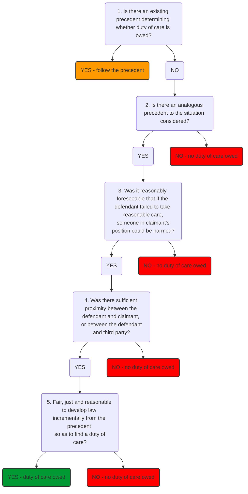

# Duty of care

In general, defendant cannot be liable for carelessness unless law requires them to be careful.

## Neighbour Principle

First test case to establish duty of care was [[Donoghue v Stevenson [1932] AC 562]]. Speech by Lord Atkin developed 'neighbour principle'

> "In English law there must be, and is, some general conception of relations giving rise to a duty of care … The rule that you are to love your neighbour becomes in law, you must not injure your neighbour; and the lawyer's question, Who is my neighbour? receives a restricted reply. You must take reasonable care to avoid acts or omissions which you can reasonably foresee would be likely to injure your neighbour. Who, then, in law is my neighbour? The answer seems to be – persons who are so closely and directly affected by my act that I ought reasonably to have them in contemplation as being so affected when I am directing my mind to the acts or omissions which are called in question"

Note key concepts of [[Foreseeability of harm]] and [[Proximity]].

The neighbour principle was restated and refined in [[Anns v Merton London Borough Council [1978] AC 728]], where Lord Wilberforce asserted that the defendant owes the claimant a duty to take reasonable care (provided that it was reasonably foreseeable that a failure to take reasonable care would cause damage) *unless* there was some policy reason why no duty should be owed.

## End to Neighbour Principle

After an expansion of the reach of duty of care in 70s and 80s, the neighbour principle was superseded by [[Caparo Industries v Dickman [1990] 2 AC 605 (HL)]] - *'retreat from Anns'*. Under Donoghue, it had be the case that it was assumed that there is a duty of care and harm was foreseeable, unless there was good reason to judge otherwise. Under **Caparo, tripartite test** (sometimes known as Caparo criteria) of:

- [[Foreseeability of harm]]
- [[Proximity]], and
- [[Fair, just and reasonable]] to impose such a duty?

> The concepts of proximity and fairness embodied in these additional ingredients are not susceptible of any such precise definition as would be necessary to give them utility as practical tests, but amount in effect to little more than convenient labels to attach to the features of different specific situations which, on a detailed examination of all the circumstances, the law recognises pragmatically as giving rise to a duty of care of a given scope.  
> Lord Bridge

Note not a blanket test – lots of [[Case Law]] has since moved away from Caparo. For a new case, Caparo criteria is used alongside analogy with established authorities to **incrementally develop** the scope of duty of care. But if a precedent exists, always use the precedent (common law woop).

Note that it is accepted that if the incremental approach is taken too seriously, it leads to the unsettling conclusion that there will be no duty of care imposed on entirely novel points of law, just because there is unfortunately no analogous case according to legal history. However, in recent cases the Supreme Court has reasserted the importance of the incremental approach:

[[Robinson v Chief Constable of West Yorkshire Police [2018] UKSC 4]] signalled a departure by the Supreme Court from the *Caparo* test:

> For the reasons very clearly set out by Lord Reed at paras 21-30 it is neither necessary nor appropriate to treat Caparo Industries v Dickman [1990] 2 AC 605 as requiring the application of its familiar three-stage examination afresh to every action brought. Where the law is clear that a particular relationship, or recurrent factual situation, gives rise to a duty of care, there is no occasion to resort to Caparo, at least unless the court is being invited to depart from previous authority.  
> Lord Hughes

So there is an emphasis on first checking analogous cases and thinking about fact-specific considerations rather than immediately appealing to high principle.

But it can often be tricky to establish whether something is an established duty situation, or something new. In [[Darnley v Croydon Health Services NHS Trust [2018] UKSC 50]] the Court of Appeal saw the case as raising a novel duty question about if hospital receptionists owe a duty of care to patients concerning waiting times. But SC saw it as falling into the established category of duty of care owed to those who run a casualty department, for those presenting themselves seeking medical attention.

## Example Precedents

Duty of care is unambiguously established in certain scenarios:

- Driver owes duty of care to other road users ([[Nettleship v Weston [1971] 2 QB 691]])
- Medical professionals owe duty of care to patients ([[Cassidy v Ministry of Health [1951] 2 KB 343]])
- Defendant creating a danger owes a duty not only to those affected but any volunteer rescuers in the situation ([[Baker v T.E. Hopkins & Son Ltd [1959] 3 All ER 225]])
- Rescuers owe a duty not to make the situation worse - construed narrowly ([[Day v High Performance Sports Ltd [2003] EWHC 197 (QB)]])
- Police owe duty of care to public to protect them from reasonably foreseeable physical injury when carrying out arrest ([[Robinson v Chief Constable of West Yorkshire Police [2018] UKSC 4]])
- Creating a situation of danger, whether negligent or not, will prima facie give rise to a duty to remove the danger or warn others of it ([[McKinnon v Burtatowski [1969] V.R. 899]])

## Limitations

Duty of care must be owed in respect to a particular type of harm (e.g., bodily injury, economic loss…). There is no universal duty to take care or not to harm each other — duty of care is in modern contexts usually employed to limit the scope of negligence liability. In many cases ([[Psychiatric harm]], economic loss, acts of a third party, omissions, defendant public body) courts make it more onerous for claimant to establish a duty of care.

Reasons for reluctance to impose duty of care:

- Wish to avoid imposing crushing liability
- Avoid opening floodgates
- Defensive practices

## Flow Chart

