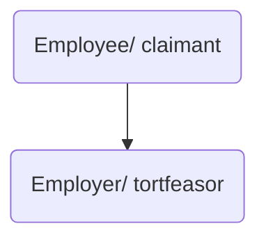

# Employers' primary liability

## Introduction

This is the law of negligence applied to the employer/ employee relationship. Common law has long recognised the need to impose a duty of care on employers to take reasonable care for the safety of their employees.

The level of protection offered to employees is generally higher than for other workers (such as independent contractors). Even though this is a particular application of the law of negligence, some tortious principles have been developed which are unique to this area.

To ensure practical protection, it is compulsory for employers to have insurance to cover such claims. See [Employers' Liability (Compulsory Insurance) Act 1969](https://www.legislation.gov.uk/ukpga/1969/57/contents) and [Employers' Liability (Compulsory Insurance) Regulations 1998](https://www.legislation.gov.uk/uksi/1998/2573/contents/made).

## Personal and Non-delegable

The duty of care imposed on employers is personal and non-delegable ([[McDermid v Nash Dredging [1987] 2 All ER 878]]). So even though the employer can delegate performance of duties, they cannot delegate liability for its breach. Employers are directly liable if those they have entrusted with responsibility fail to exercise reasonable care in respect to an employee's safety.

In [[Wilsons and Clyde Coal Co Ltd v English [1938] AC 57]], the House of Lords held that an employer's duty to take reasonable precaution to ensure an employee's safety at work included obligations to provide:

- Safe and competent employees
- Safe and proper plant and equipment
- Safe place of work/ premises, including safe access and way out
- Safe systems of work, with adequate supervision and instruction

### Safe and Competent Fellow Employees

In [[Hudson v Ridge Manufacturing Company Ltd [1957] 2 QB 348]] claimant succeeded in claim against employer who was in breach for employing someone known to be in the habit of playing practical jokes on fellow employees.

If an incompetent person is employed or required to do a job that they are not capable of doing, then there will be a breach ([[Black v Fife Coal Ltd [1912] AC 149]]).

Where one employee injures another,

- Possible action against employer for breach of this duty
- Possible action against the employee who caused the harm (though probably a waste of time financially)
- Action against employer as vicariously liable.

### Safe/ Proper Plant and Equipment

An employer has a duty to take reasonable care to provide all necessary equipment (including safety equipment), as well as instructions on how to use it and to maintain it in a reasonable condition.

- In [[Qualcast v Haynes [1959] AC 743]] employer discharged its duty by providing protective boots against the danger of splashes of molten metal (though case would probably be decided differently today given statutory provisions relating to protective equipment).
- In [[Davie v New Merton Board Mills Ltd [1959] A.C. 604]] the employer was held to have discharged their responsibility to provide proper tools by purchasing them from a reputable supplier. This had the practical effect of leaving the employee without compensation where the supplier or manufacturer could not be identified/ was bankrupt.

To overcome the effects of *Davie*, common law has been supplemented by the [Employer's Liability (Defective Equipment) Act 1969](https://www.legislation.gov.uk/ukpga/1969/37/contents). s 1(1) establishes that if an employee is injured in the course of employment by a defect in equipment provided by their employer and the employee can prove that the defect was wholly or partly caused by the fault of a third party, then the employer will be liable. So in order to succeed against the employer, the employee must first succeed against a third party, and if successful they will usually have a claim for contribution/ indemnity from the third party.[^1]

[^1]: Note that this does not completely remedy the problems posed by *Davie*. As well as establishing causation (that the defect in equipment caused the accident), the employee needs to prove 'fault' against the third party. That is, they need to prove that on the balance of probabilities the defect was due to the fault of some other person. This is not always easy. Potentially, the [Consumer Protection Act 1987](https://www.legislation.gov.uk/ukpga/1987/43/contents) helps, which defines fault as including 'breach of statutory duty or otherwise act or omission which gives rise to liability in tort'. The 1969 Act may have a new lease of life with the [Enterprise and Regulatory Reform Act 2013](https://www.legislation.gov.uk/ukpga/2013/24/contents/enacted).

'Equipment' is defined in s 1(3) of the 1969 Act as 'any plant and machinery, vehicle, aircraft or clothing'

Cases:

In [[Yorkshire Traction Co Ltd v Walter Searby [2003] EWCA Civ 1856]] held that bus company was not negligent given the balance of different factors of safety and practicality.

### Safe Place of Work

Premises the employee works in must be safe. This includes premises which are not owned/ occupied by the employer.

In [[Wilson v Tyneside Cleaning Co [1958] 2 QB 110]] window cleaning company owed a duty to take reasonable steps ensuring that all locations where window cleaners worked were safe. But what is expected from the employer in relation to third premises is generally less than in relation to employer's own premises.

The court considers multiple factors ([[Cook v Square [1992] ICR 262]]):

- The place of work
- The nature of the building
- The experience of employee
- Nature of the work
- Degree of control exercised by the employer and the employer's knowledge of the premises.

### Safe System of Work

Widest facet of the employer's duty, and the most frequently argued. Includes:

- Physical layout of the job
- Setting of the stage
- Sequence in which work is to be carried out
- Provision of warnings, notices, training, supervision and issues of special instruction

Employer must devise a safe system: in [[General Cleaning Contractors Ltd v Christmas [1953] AC 180]] employer liable for not providing training, or some physical provision for reducing risk.

Employer must take reasonable steps to ensure that employees comply with the safe system: [[Bux v Slough Metals [1974] 1 Lloyd's Rep 155]].

Two contrasting cases about barrier cream and dermatitis:

[[Clifford v Charles Challen and Son Ltd [1951] 1 KB 495]] | [[Woods v Durable Suites Ltd [1953] 1 WLR 857]]
---|---
Employer failed to keep protective substances on the premises | Barrier cream available on the premises
Employer failed to ensure, via foreman, that they were used| Foreman had made known to the claimant that he should use the cream
Employer was negligent | Employer was not negligent.

## Stages of Negligence Sequence

### Breach

The duty on employer is to take reasonable care ([[Latimer v AEC Ltd [1953] AC 643]]). Note, this is an objective test based on the reasonable employer.

An employer should take into account an employee's personal characteristics ([[Paris v Stepney Borough Council [1951] AC 367]]).

### Causation

Necessary to establish both factual and [[Legal causation]]. A common scenario is the provision of safety equipment: if the employer fails to provide safety equipment, causation may not be satisfied if they can show that even if it had been provided, the employee would not have used it ([[McWilliams v Sir William Arrol [1962] 1 WLR 295]]).

But in more dangerous working environments, may be necessary to give specific instruction about safety equipment or even enforce its use, so *novus actus interveniens* quite difficult to establish.

### Remoteness

Most cases involve physical injury. Mental harm like stress recoverable in some cases.

## Defences

### Consent

If the employee consents to risk, the employer could have a good defence. But judges generally sceptical of this in employment context ([[Bowater v Rowley Regis Corporation [1944] KB 476]]). Usually only successfully involved in extreme circumstances where 'there was a genuine full agreement, free from any kind of pressure, to assume the risk of loss' (Lord Pearce in [[ICI Ltd v Shatwell [1965] AC 656]]).

### Contributory Negligence

Partial defence frequently succeeds in an employment context. e.g., in [[Bux v Slough Metals [1974] 1 Lloyd's Rep 155]] claimant 40% to blame for failing to wear safety goggles, and in [[Clifford v Charles Challen and Son Ltd [1951] 1 KB 495]] where claimant was 50% to blame for failing to wear barrier cream.

## Structure

The structure for assessing an Employers' Primary Liability claim is as follows:

- Parties
- Tort
- Loss
- Is the Claimant an employee of the Defendant?
- Duty
- Breach
- Causation
- Remoteness
- Defences
