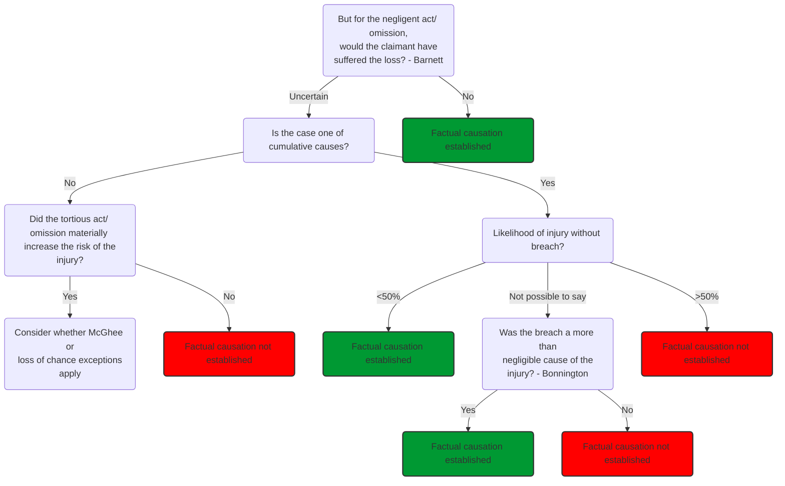

# Factual causation

## The 'but For' Test

> On the balance of probabilities, but for the defendant's breach of duty, would the claimant have suffered their loss at that time and in that way?

('balance of probabilities' means $>50\%$ chance of defendant's breach causing claimants' loss)

### Key Cases

Key case outlining 'but for' test (negligence made no difference): [[Barnett v Chelsea and Kensington Hospital [1969] 1 QB 428]]. More precisely, the test is that but for the negligence, the injury would not have been sustained at that time or in that way ([[Cork v Kirby MacLean Ltd [1952] 2 All ER 402]])

Key case demonstrating impact of burden of proof on the claimant (could not prove link between negligence and loss): [[Wilsher v Essex Area Health Authority [1988] AC 1074]]. Here the blindness could have been caused by any of five equally probably different factors, only one of which was tortious. And evidence suggested that one factor was solely responsible for the loss. Typically thought to be a very harsh test.

In clinical negligence, where the breach is a **failure to advise on risk**, the ‘but for’ test can be satisfied if the claimant can prove that **they would not have had the treatment or would have deferred the treatment** had they been told of the risk: [[Chester v Afshar [2004] UKHL 41]].

## Where 'but For' Test Cannot Be Satisfied

### Material Contribution Test

The court might apply the material contribution test where there is more than one potential cause of the claimant’s loss, and the causes have acted together to cause the loss. The claimant must prove that the breach made a more than negligible contribution to their loss.

Key case: [[Bonnington Castings v Wardlaw [1956] AC 613]] - tortious dust and non-tortious dust operated together cause claimant's respiratory disease. 'But for' failed and court established and applied the material contribution test: on the balance of probabilities, did the defendant's breach make a material (more than negligable) contribution to claimant's disease.

 Material contribution test applied to clinical negligence cases: where medical science cannot establish the probability that 'but for' act of negligence, injury would not have happened, but can establish that this contribution was more than negligible, 'but for' test is modified and claim will succeed. See [[Bailey v Ministry of Defence [2008] EWCA Civ 883]], also [[John v Central Manchester and Manchester Children's University Hospitals NHS Foundation Trust [2016] EWHC 407 (QB)]]

 

### Material Increase in Risk Test

 The court might apply the material increase in risk test to single agent industrial disease cases where there is more than one potential cause of the claimant’s loss. The claimant must prove that the breach made a greater than de minimus contribution to the risk.

 

 [[McGhee v National Coal Board [1973] 1 WLR 1 (HL)]] (one agent one tortfeasor) - dermatitis not a cumulative condition so material contribution test also failed: could have been caused by a single exposure to the brick dust. Held that defendant's breach materially increased the risk. Note claimant must prove that breach made a greater than de minimus contribution to the risk.

 

 Easier to prove even than material contribution test: only need to prove increased chances of suffering risk. So test only applied in specific situations. Currently only applied to *industrial disease, single agency* cases, where there is scientific uncertainty over cause (e.g. mesothelioma cases like [[Fairchild v Glenhaven Funeral Services Ltd [2003] 1 AC 32]] - one agent, several tortfeasors).

 

 Single agency means there is only one agent causing the disease (dust, asbestos) rather than a combination of multiple factors ([[Wilsher v Essex Area Health Authority [1988] AC 1074]]).

 

### Loss of Chance Test

 

#### Personal Injury

 

 In [[Hotson v East Berkshire Health Authority [1987] AC 750]], claimant argued 'loss of chance' of recovery due to defendant's negligence (botched operation), so should be awarded 25% of losses for loss of 25% chance of recovery. Argument was rejected, and similarly in all medical negligence or personal injury cases.

 

#### [[Pure economic loss]]

 

 But courts have allowed it for pure economic loss cases. In [[Allied Maples Group v Simmons & Simmons [1995] 1 WLR 1602 (CA)]] claimant lost chance to negotiate clause in a contract as a result of solicitor's failure to advise. Claimant could prove **real and substantial chance** that seller would have agreed to the clause.

 

## Apportionment

 

 A calculation to apply once factual causation has been established. Where there are multiple tortious factors known to have caused part of the loss, courts apportion liability between defendants in a practical way ([[Fitzgerald v Lane & Patel [1987] QB 781]]).

 

 In mesothelioma cases, under s3 Compensation Act 2006, defendants jointly and severally liable. So any or all of the negligent employers who exposed claimant to asbestos will be liable to claimant for the whole sum of damager, but can recover contributions from each other if necessary.

### Multiple Sufficient Causes

 

 Say claimant suffers damage as a result of the defendant's negligence, and then some time later a second event occurs causing exactly the same damage, or worsens already caused damage. Then there are two or more distinct losses attributable to distinct causes. Is the original tortfeasor responsible for the loss caused by the other?

 

 Cases:

 

 In [[Performance Cars v Abraham [1962] 1 QB 33]] it was held that there was effectively no damage from the second collision, so second defendant not liable.

 

 Where the care needs of a personal injury claimant were quantitatively, but not qualitatively, different from what would have been required but for the negligence of the defendant tortfeasor, the defendant was liable only for the additional needs. If the needs caused by the negligence were qualitatively different from the pre-existing needs, then those needs were caused in their entirety by the negligence ([[Reaney v University Hospital of North Staffordshire NHS Trust [2015] EWCA Civ 1119]]).

 

 In [[Baker v Willoughby [1970] AC 467]] the defendant causing original injury was liable for these original injuries, even after an amputation of the injured leg (two tortious events).

 

 In [[Jobling v Associated Dairies [1982] AC 794]] defendant's liability ceased at the point that further back injury developed (tort followed by a natural event).

## Summary

 Law | Case
 ---|---
 But for test: not satisfied (negligence made no difference) | [[Barnett v Chelsea and Kensington Hospital [1969] 1 QB 428]] (arsenic poisoning)
 But for test: not satisfied (could not prove link between negligence and loss) | [[Wilsher v Essex Area Health Authority [1988] AC 1074]] (lack of oxygen)
 Material contribution test (satisfied - cumulative causes) | [[Bonnington Castings v Wardlaw [1956] AC 613]] (dust), [[Bailey v Ministry of Defence [2008] EWCA Civ 883]] (choking on vomit)
 Increase in risk test (satisfied - one agent, one tortfeasor) | [[McGhee v National Coal Board [1973] 1 WLR 1 (HL)]] (dust, dermatitis)
 Increase in risk test (satisfied - one agent, several tortfeasors) | [[Fairchild v Glenhaven Funeral Services Ltd [2003] 1 AC 32]] (asbestos, mesothelioma)
 Loss of chance test (not satisfied - personal injury) | [[Hotson v East Berkshire Health Authority [1987] AC 750]] (falling from tree, negligent medical care)
 Loss of chance test (satisfied - pure economic loss) | [[Allied Maples Group v Simmons & Simmons [1995] 1 WLR 1602 (CA)]] (solicitor's negligence, loss of chance to negotiate)
 But for test in clinical negligence cases where the breach is a failure to advise of risk (can be satisfied if claimant can prove they would not have had the treatment at that time) | [[Chester v Afshar [2004] UKHL 41]] (spinal operation, small risk of paralysis)
