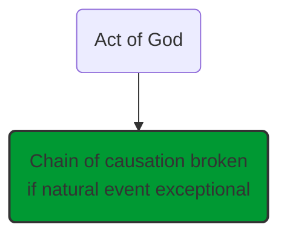
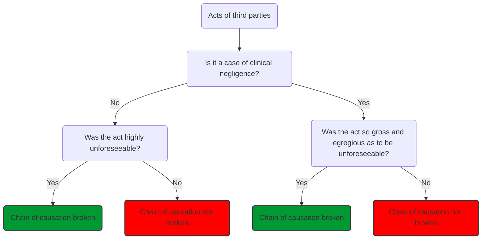
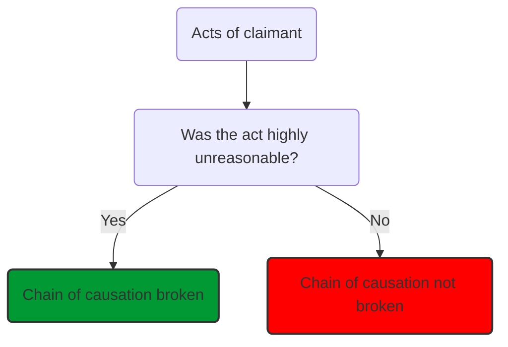

# Legal causation

While [[factual causation]] deals with establishing the link between the [[breach]] and the damage, legal causation involves considering whether there are any grounds upon which the link should be regarded as having been broken.

Certain subsequent events that occur after the breach may break the chain of causation (*novus actus interveniens* - an intervening act).

## Types of Novus Actus Interveniens

### Acts of God/ Natural Events

Exceptional natural events break the chain of causation. In [[Carslogie Steamship Co Ltd v Royal Norwegian Government [1952] AC 292]] a storm broke the chain of causation. But natural events will not break chain of causation if they could have been forseen and defendant should have taken them into account as events likely to happen.

### Acts of Third Parties

Seen as breaking chain of causation if it was **highly unforeseeable** (very unlikely to happen as a result of the defendant's negligence).

In [[Knightley v Johns [1982] 1 WLR 349]] a highly unforeseeable negligable act by police arriving at the scene breaks the chain of causation.

But if third party has acted instinctively 'in the heat of the moment' then there will be no break in the chain of causation ([[Scott v Shepherd (1773) 2 Wm.BC.892]]).

### Medical Negligence Cases

When act of third party is medical treatment, courts reluctant to hold that this breaks the chain of causation. Medical treatment will not break the chain unless it is **so gross and egregious as to be unforeseeable**. In [[Robinson v The Post Office [1974] 2 All ER 737]] original defendant held liable for complications following hospital injection allergy which made injuries worse.

### Acts of the Claimant

Breaks chain of causation if **highly unreasonable**

In [[McKew v Holland & Hanmen & Cubitts (Scotland) Ltd [1969] 3 All ER 1621]] claimant acted very unreasonably, breaking the chain of causation.

In [[Wieland v Cyril Lord Carpets Ltd [1969] 3 All ER 1006]] claimant held to have acted carefully, so defendant liable for her injury.

In [[Spencer v Wincanton Holdings Ltd (Wincanton Logistics Ltd) CA 21 Dec 2009]] it was held that *McKew* unreasonableness was a very high bar, and that the chain of causation could not easily have been broken. The courts prefer instead to apportion blame through contributory negligence.

## Effect of Novus Actus Interveniens

Breaks the chain of causation. Defendant still responsible for any loss before the event but not any loss after it.
