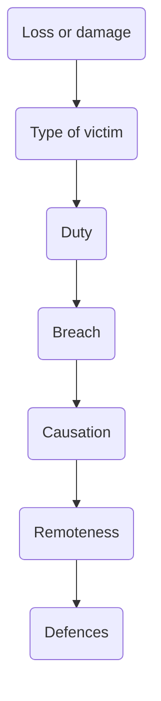

# Negligence

Most significant tort in practice, almost all civil obligation suits are negligence.

## Definition

Defined as

> the breach of a legal duty to take care by the defendant, resulting in loss or damage to the claimant.

## Stages

To establish a negligence claim, need to establish:

1. [[Loss or damage]]
2. [[Duty of care]]
3. [[Breach]]
4. [[Tort Law/Causation]]
5. [[Remoteness]]
6. [[Tort Law/Defences]]

## Analysis

Best way to make sense of overlapping things: at each of duty, breach and remoteness stages we are asking a slightly different question in relation t foreseeability.

- At duty stage, asking whether harm of some broad variety, like personal injury, psychiatric harm, property damage, pure economic loss etc. is a reasonably foreseeable consequently of the defendant's carelessness.
- At breach, asking whether the foreseeable harm was sufficiently grave or likely that the defendant should have done more than they did to avoid it happening. So the inquiry into foreseeability is more detailed and focussed.  
- At remoteness stage, look at the foreseeability of the specific harms that the claimant did suffer. Consider whether the type of physical harm could reasonably have been foreseen ([[Tremain v Pike [1969] 1 WLR 1556]], [[Hughes v Lord Advocate [1963] AC 837]], and compare [[Page v Smith [1996] AC 155]]).
