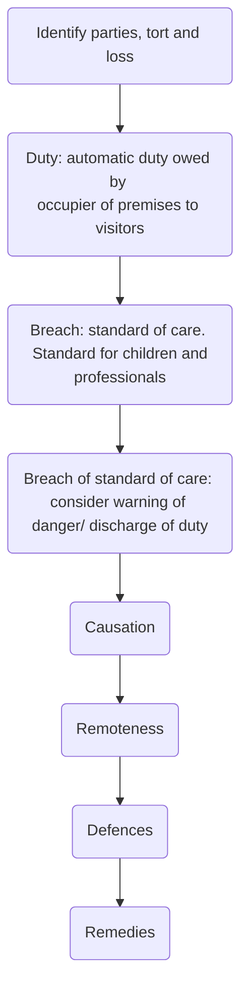

# Occupiers’ Liability Act 1957

## Duty

The duty owed by occupiers to visitors is generally accepted to relate to the 'state of premises' rather than 'an activity' on the premises ([[Tomlinson v Congleton [2003] UKHL 47]]), in which case a general negligence claim would be more appropriate.

Under OLA 1957, a visitor can claim for both personal injury and property damage.

Section | Rule
---|---
[s 2(1) OLA 1957](https://www.legislation.gov.uk/ukpga/Eliz2/5-6/31/section/2) | An occupier of premises owes the common duty of care to all their visitors.
[s 2(2) OLA 1957](https://www.legislation.gov.uk/ukpga/Eliz2/5-6/31/section/2) | The common duty of care is a duty to take such care as is reasonable in all the circumstances to see that the visitor will be reasonably safe in using the premises for the purposes for which they were permitted by the occupier to be there. Note that the duty is to keep visitors reasonably safe, rather than the premises.

## Occupier

OLA 1957 imposes the duty on the **occupier** of the premises.

[s 1(2) OLA 1957](https://www.legislation.gov.uk/ukpga/Eliz2/5-6/31/section/1) states that an occupier is the same as persons who would be an occupier under common law.

> An **occupier** is someone who has a sufficient degree of control over the premises ([[Wheat v Lacon [1966] AC 552]])

In this case, Lord Denning divided ‘occupiers’ into four categories:

1. If the landlord does not live on the property, the tenant is the occupier;  
2. If the landlord retains some part of the premises, e.g., common areas like stairways, they are the occupier of those parts;  
3. If the landlord issues a licence, they remain an occupier (as in **_Wheat_**); and  
4. If the occupier employs an independent contractor, they generally remain responsible.

In [[Bailey v Armes (1999) EGCS 21]] the Court of Appeal clarified sufficient degree of control:

> "…Generally speaking, liability…is based on occupancy or control, not on ownership. The person responsible for the condition of the premises is he who is in actual possession of them for the time being, whether he is the owner or not, for it is he who has the immediate supervision and control and the power of permitting or prohibiting the entry of other persons."

### Multiple Occupiers

To be an occupier, it is not necessary for a person to have entire control over the premises or exclusive occupation. It is sufficient to have some degree of control, which they may share with others. In the case of independent contractors, the owner would still usually be regarded as sufficiently in control of the premises, but additionally, the independent contractor may also be in sufficient control of the place where they are working.

Different occupiers may have responsibility for different parts of the premises or different dangers.

The claimant may be a visitor to one occupier and a trespasser to another ([[Ferguson v Welsh [1987] 1 WLR 1553]]).

### Premises

This does not just include land and buildings; as per [s 1(3)(a) OLA 1957](https://www.legislation.gov.uk/ukpga/Eliz2/5-6/31/section/1) also includes

> “…any fixed or moveable structure, including any vessel, vehicle or aircraft.”

In [[Wheeler v Copas [1981] 3 All ER 405]] the premises included a ladder.

## Visitors

The occupier owes an automatic duty to their visitors, meaning persons lawfully on the property.

[s 1(2) OLA 1957](https://www.legislation.gov.uk/ukpga/Eliz2/5-6/31/section/1):

>“…the persons who are to be treated as … visitors are the same … as the persons who would at common law be treated as … invitees and licensees.”

Under common law, visitors are persons who have express or implied permission to be on the occupier's premises. This includes those with lawful authority and contractual permission to be on the premises.

### Express Permission

Express permission (and implied permission) may be limited by notice, in which case the visitor becomes a trespasser.

Such limitations can be made in 3 ways:

1. Area
	- An occupier may not owe a duty to a visitor if the visitor enters an area to which they are denied permission.
	- Occupiers must be very clear as to the areas where visitors are denied access, and the location of any sign must be appropriate ([[Pearson v Coleman Bros [1948] 2 KB 359]], [[Darby v National Trust [2001] EWCA Civ 189]])
2. Time
	- An occupier can restrict entry by imposing a time limit (like opening hours)
	- But this must be made clear to the visitor ([[Stone v Taffe and Another [1974] 1 WLR 1575]])
3. Purpose
	- If an invitee goes beyond the purpose they were invited on the premises for, they may become a trespasser ([[Tomlinson v Congleton [2003] UKHL 47]]).

### Implied Permission

Permission exists because of an occupier's behaviour. A postman has implied permission to be on a person's property if they have to walk up a garden path to deliver letters.

Cases:

- [[Lowery v Walker [1911] AC 10]]
- [[Edwards v Railways Executive [1952] AC 737]]

### Lawful Authority

Under [s 2(6) OLA 1957](https://www.legislation.gov.uk/ukpga/Eliz2/5-6/31/section/2), some persons, such as police officers with a warrant or persons with a statutory right, like gas board officials, can enter the premises as lawful visitors with or without permission.

### Contractual Permission

[s 5(1) OLA 1957](https://www.legislation.gov.uk/ukpga/Eliz2/5-6/31/section/5): if the person enters the premises under the terms of a contract with the occupier, there is, in the absence of express provision to the contrary, an implied term that the entrant is owed a common duty of care.

## Breach

### Standard of Care

The occupier owes the visitor a duty to take reasonable care to see that the visitor will be reasonably safe in using the premises for the purpose for which they were permitted by the occupier to be there ([s 2(2) OLA 1957](https://www.legislation.gov.uk/ukpga/Eliz2/5-6/31/section/2)).

This standard of care is that of a reasonable occupier, and is an objective test (like in negligence).

A visitor may have personal characteristics which affect the standard of care owed. Where an occupier is aware of a vulnerability of a visitor, they can reasonably be expected to take steps to guard against it ([[Pollock v Cahill [2015] EWHC 2260 (QB)]]).

### Children

Child visitors are owed a higher standard of care. [s 2(3)(a) OLA 1957](https://www.legislation.gov.uk/ukpga/Eliz2/5-6/31/section/2):

>“An occupier must be prepared for children to be less careful than adults”

Children cannot be expected to appreciate dangers that would be obvious to adults, so more will be required of the occupier. This is particular so where a danger is an allurement to a child ([[Taylor v Glasgow City Council [1922] 1 AC 44]]). This principle was confirmed in [[Jolley v Sutton LBC [2000] 1 WLR 1082]].

The usefulness of s 2(3)(a) OLA 1957 has however been somewhat diminished by courts often finding that an occupier is entitled to rely upon the supervisory role of parents in relation to young children ([[Phipps v Rochester Corporation [1955] 1 QB 450]])

### Persons Entering Premises in the Exercise of Their Calling

Persons entering premises in the exercise of their calling are owed a lower standard of care.

[s 2(3)(b) OLA 1957](https://www.legislation.gov.uk/ukpga/Eliz2/5-6/31/section/2): an occupier can reasonably expect a visitor coming onto their premises to exercise their skills to appreciate and guard against any risks ordinarily incidental to their job. This was illustrated in [[Roles v Nathan (Trading as Manchester Assembly Rooms) [1963] 1 WLR 1117]].

### Falling Below the Standard of Care

The test is the same as for a negligence claim: the likelihood of harm, magnitude of harm, social value of the activity which gave rise to the risk and the cost of preventative measures are all taken into account and balanced against each other ([[Tedstone v Bourne Leisure Ltd [2008] EWCA Civ 654]]).

Courts take into account the resources available to the occupier when considering what reasonable steps might have been taken ([[Laverton v Kiapasha [2002] EWCA Civ 1656]]).

## Discharge of Duty

### Discharging Duty Through Warnings

An occupier will satisfy the common duty of care if they warn the visitor of the danger and the warning was enough to enable the visitor to be reasonably safe ([s 2(4)(a) OLA 1957](https://www.legislation.gov.uk/ukpga/Eliz2/5-6/31/section/2)).

Where there is adequate warning of any danger — written, visual or oral — the occupier may have discharged their duty. The warning should make the visitor aware of what the danger is, where it is and how to avoid it.

In [[Roles v Nathan (Trading as Manchester Assembly Rooms) [1963] 1 WLR 1117]] the occupier had warned the sweeps of the danger of fumes, and to make sure they had extinguished the boiler before commencing work.

Very obvious dangers may not require warnings ([[Staples v West Dorset District Council [1995] PIQR P439]]).

A notice may have dual effect. In addition to potentially acting to satisfy the occupier's duty by giving the claimant a warning of the danger, it may also operate as an exclusion notice (see [[Exemption Clauses]]).

### Discharging Duty Through Independent Contractors

The duty owed by an occupier to a visitor is generally non-delegable. Where building, construction, repair or renovation is carried out by an independent contractor, and the claimant suffers loss as a result of the fault of the contractor, the occupier may escape liability if they satisfy the three requirements of s 2(4) OLA 1957.

These are that in all circumstances, the occupier acted reasonably in:

1. Hiring an independent contractor
	- Must be shown to be reasonable to use an independent contractor
	- The more technical the work, the more reasonable this would be
2. Selecting the independent contractor
	- Taking steps to check competency: qualifications, experience, references, local enquiries etc.
	- The duty on a private householder to check competence is lower than that of a local authority
3. Supervising and checking the work was done properly.
	- What is expected of the occupier will depend on the nature of the work in question: constrast [[Haseldine v Daw [1941] 2 KB 343]] with [[Woodward v Mayor of Hastings [1945] KB 174]].

## Causation and Remoteness

OLA 1957 does not specify how causation and remoteness should be tackled. Considering common law: authorities tend to focus their energies mainly on breach.

Once loss has been suffered by the claimant and once the defendant has breached their duty to that claimant, then there is an assumption that causation and remoteness have been satisfied. Courts only discuss these issues where there are glaring issues with either.

If there are glaring issues, consider them using the same legal principles used in negligence claims.

## Defences

The following defences can be relied on in an OLA 1957 claim:

1. Consent
2. Contributory negligence

### Consent/ Volenti

[s 2(5) OLA 1957](https://www.legislation.gov.uk/ukpga/Eliz2/5-6/31/section/2) provides for the defence of volenti, see [[Tort Law/Consent]]. The claimant must be fully aware of the particular risk, and through their conduct willingly accept the risk

Cases:

- [[White v Blackmore [1972] 2 QB 651]] notice of the risk
- [[Titchener v British Railway Board [1983] 1 WLR 1427]] walking onto a live railway line was consenting of the risk.

### Contributory Negligence

[s 2(3) OLA 1957](https://www.legislation.gov.uk/ukpga/Eliz2/5-6/31/section/2): in determining a common duty of care, “the degree of care, and want of care, which would ordinarily be looked for in such a visitor” is taken into account. This is interpreted as providing for the defence of contributory negligence.

Where the claimant is a child, the child will be judged against a reasonable child of the same age ([[Young v Kent County Council [2005] EWHC 1342]]).

## Structure

